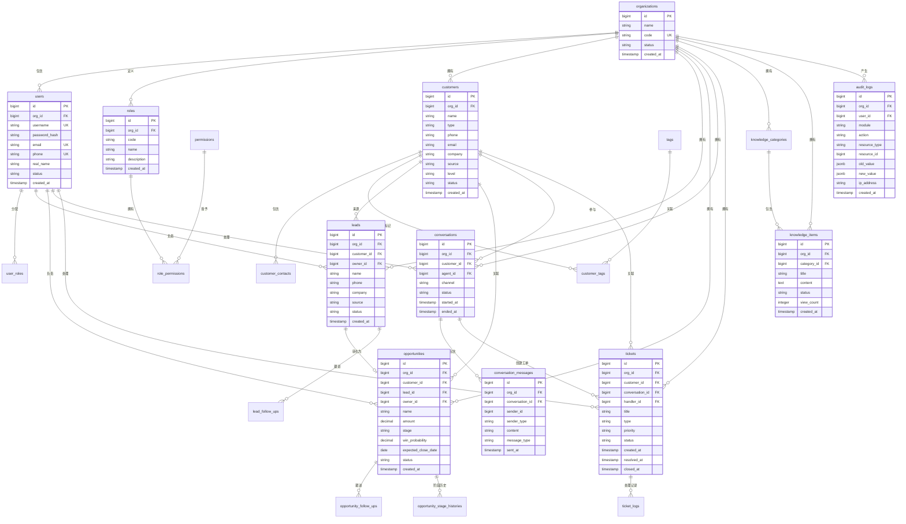
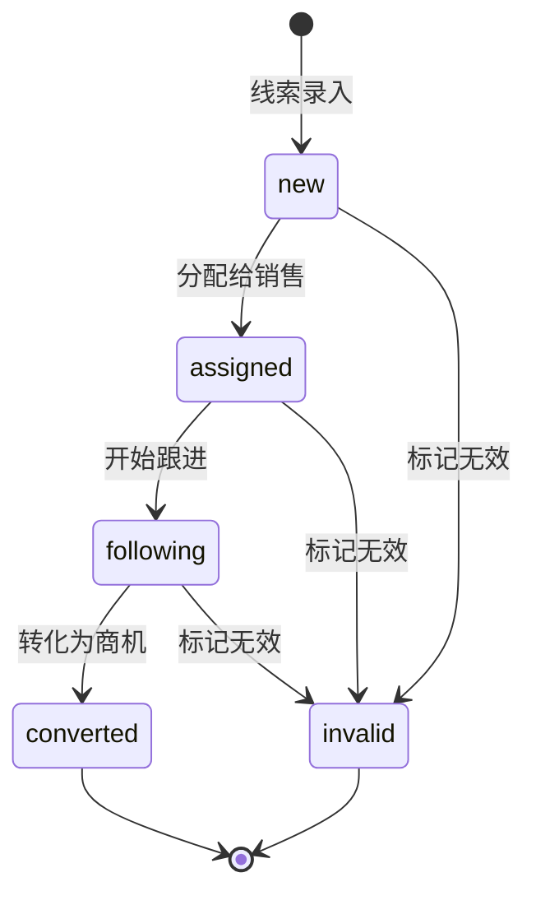
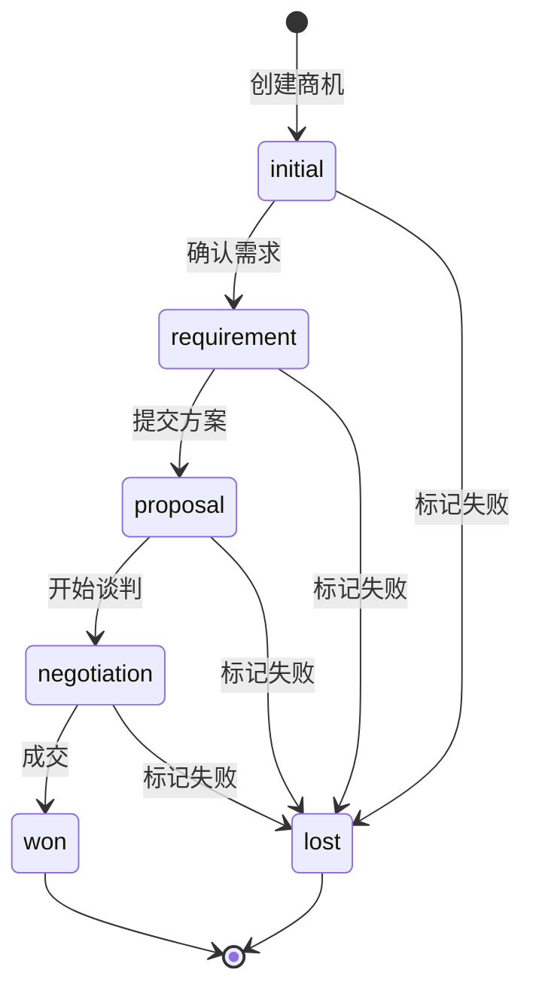
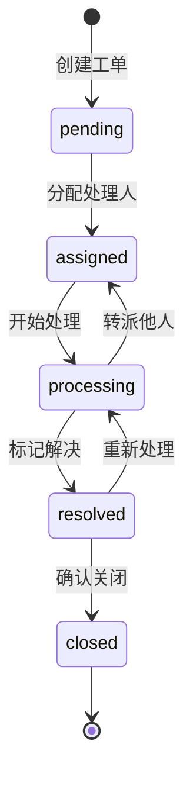
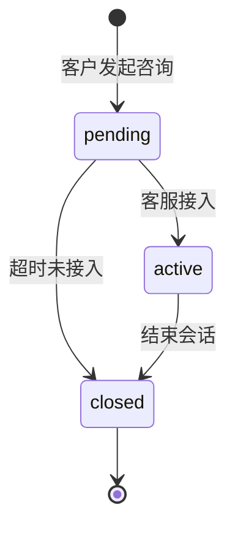

# MOY 数据模型与数据字典（DBD）

---

## 文档元信息

| 属性 | 内容 |
|------|------|
| 文档名称 | MOY 数据模型与数据字典 |
| 文档编号 | MOY_DBD_001 |
| 版本号 | v0.1 |
| 状态 | 草案 |
| 作者 | MOY 文档架构组 |
| 日期 | 2026-04-04 |
| 目标读者 | 后端开发、数据库管理员、接口设计、测试工程师 |
| 输入来源 | [HLD](./09_HLD_系统高层设计.md)、[PRD](./06_PRD_产品需求规格说明书_v0.1.md)、[RTM](./07_RTM_需求跟踪矩阵.md) |

---

## 一、文档目的

本文档作为 MOY 项目首期 MVP 的**数据库设计基线**，用于：

1. 将业务对象转换为可实现的数据库表结构
2. 定义每张表的字段、类型、约束、索引
3. 明确多租户隔离、审计留痕、软删除等设计规范
4. 为后端开发、API 设计、测试用例提供数据层依据
5. 确保数据模型与 PRD/HLD 保持一致

**阅读建议：**
- 后端开发：重点阅读数据表清单、数据字典、状态机设计
- 数据库管理员：重点阅读索引设计、约束规则
- 接口设计：重点阅读字段暴露规则、状态枚举
- 测试工程师：重点阅读状态流转、边界约束

**重要说明：** 本文档范围限定为首期 MVP，不包含后续规划功能的数据模型。

---

## 二、适用范围

| 维度 | 范围说明 |
|------|----------|
| 产品范围 | MOY 首期 MVP：客户管理、线索管理、会话管理、商机管理、工单管理、知识库（基础版）、数据看板（基础版） |
| 数据库类型 | PostgreSQL 15+ |
| 字符集 | UTF-8 |
| 时区处理 | 所有时间字段使用 UTC 存储，前端按用户时区展示 |

---

## 三、上游输入文档

| 文档 | 版本 | 用途 |
|------|------|------|
| [00_AGENTS.md](./00_AGENTS.md) | v0.1 | 文档治理规则 |
| [00_Glossary.md](./00_Glossary.md) | v0.1 | 术语定义 |
| [05_BRD_业务需求说明书.md](./05_BRD_业务需求说明书.md) | v0.1 | 业务需求定义 |
| [06_PRD_产品需求规格说明书_v0.1.md](./06_PRD_产品需求规格说明书_v0.1.md) | v0.1 | 字段定义、业务规则 |
| [07_RTM_需求跟踪矩阵.md](./07_RTM_需求跟踪矩阵.md) | v0.1 | 需求跟踪 |
| [09_HLD_系统高层设计.md](./09_HLD_系统高层设计.md) | v0.1 | 业务对象定义、对象关系 |

---

## 四、数据设计原则

### 4.1 多租户隔离

| 原则 | 说明 |
|------|------|
| 行级隔离 | 所有业务表必须包含 `org_id` 字段，作为租户标识 |
| 查询过滤 | 所有业务查询必须包含 `org_id` 过滤条件 |
| 索引设计 | `org_id` 作为复合索引的首字段 |
| 外键约束 | 外键关联必须包含 `org_id` 校验 |

**实现规范：**

```sql
CREATE TABLE example_table (
    id BIGSERIAL PRIMARY KEY,
    org_id BIGINT NOT NULL,
    -- 业务字段
    created_at TIMESTAMP NOT NULL DEFAULT CURRENT_TIMESTAMP,
    updated_at TIMESTAMP NOT NULL DEFAULT CURRENT_TIMESTAMP,
    created_by BIGINT NOT NULL,
    updated_by BIGINT NOT NULL,
    is_deleted SMALLINT NOT NULL DEFAULT 0
);

CREATE INDEX idx_example_org_id ON example_table(org_id);
```

### 4.2 审计留痕

| 审计字段 | 类型 | 说明 |
|----------|------|------|
| created_at | TIMESTAMP | 创建时间，NOT NULL，默认当前时间 |
| updated_at | TIMESTAMP | 更新时间，NOT NULL，默认当前时间，触发器自动更新 |
| created_by | BIGINT | 创建人ID，NOT NULL |
| updated_by | BIGINT | 更新人ID，NOT NULL |

**触发器示例：**

```sql
CREATE OR REPLACE FUNCTION update_updated_at_column()
RETURNS TRIGGER AS $$
BEGIN
    NEW.updated_at = CURRENT_TIMESTAMP;
    RETURN NEW;
END;
$$ language 'plpgsql';
```

### 4.3 软删除

| 原则 | 说明 |
|------|------|
| 删除方式 | 业务数据采用软删除，不物理删除 |
| 删除标识 | 使用 `is_deleted` 字段，0=未删除，1=已删除 |
| 查询过滤 | 默认查询条件包含 `is_deleted = 0` |
| 唯一约束 | 唯一约束需包含 `is_deleted` 字段，允许删除后重建 |

### 4.4 状态显式化

| 原则 | 说明 |
|------|------|
| 状态字段 | 所有需要状态管理的实体必须有明确的 `status` 或 `stage` 字段 |
| 状态枚举 | 状态值使用 SMALLINT 或 VARCHAR(32)，推荐使用枚举类型 |
| 状态流转 | 状态变更必须符合预定义的状态机规则 |
| 流转记录 | 关键状态变更需记录变更历史 |

### 4.5 可扩展字段原则

| 原则 | 说明 |
|------|------|
| 预留字段 | 不预留无意义字段，按需扩展 |
| 扩展属性 | 使用 JSONB 存储非核心扩展属性 |
| 字段命名 | 使用 snake_case 命名规范 |
| 字段类型 | 选择最合适的类型，避免过度设计 |

### 4.6 避免过早设计

| 原则 | 说明 |
|------|------|
| MVP 范围 | 仅设计首期 MVP 所需的表和字段 |
| 预留接口 | 预留扩展接口，但不预先实现 |
| 分库分表 | 首期不进行分库分表，保持单体架构 |

---

## 五、核心 ER 总览

### 5.1 ER 图



### 5.2 核心对象关系说明

| 关系 | 说明 | 基数 | 删除策略 |
|------|------|------|----------|
| 组织 → 用户 | 一个组织包含多个用户 | 1:N | 级联软删除 |
| 组织 → 客户 | 一个组织拥有多个客户 | 1:N | 级联软删除 |
| 客户 → 线索 | 一个客户可对应多个线索 | 1:N | 置空（保留线索） |
| 线索 → 商机 | 一个线索可转化为一个商机 | 1:1 | 置空（保留商机） |
| 客户 → 商机 | 一个客户可有多个商机 | 1:N | 置空（保留商机） |
| 客户 → 会话 | 一个客户可有多个会话 | 1:N | 置空（保留会话） |
| 会话 → 消息 | 一个会话包含多条消息 | 1:N | 级联删除 |
| 会话 → 工单 | 一个会话可创建多个工单 | 1:N | 置空（保留工单） |
| 客户 → 工单 | 一个客户可有多个工单 | 1:N | 置空（保留工单） |
| 用户 → 角色 | 一个用户可有多个角色 | N:M | 级联删除关联 |

---

## 六、数据表清单总表

### 6.1 租户与权限模块

| 表名 | 中文名 | 作用 | 关键关联 | 优先级 |
|------|--------|------|----------|--------|
| organizations | 组织表 | 存储企业租户信息 | - | P0 |
| users | 用户表 | 存储系统用户信息 | organizations | P0 |
| roles | 角色表 | 存储角色定义 | organizations | P0 |
| permissions | 权限表 | 存储权限定义 | - | P0 |
| user_roles | 用户角色关联表 | 用户与角色多对多关系 | users, roles | P0 |
| role_permissions | 角色权限关联表 | 角色与权限多对多关系 | roles, permissions | P0 |

### 6.2 客户管理模块

| 表名 | 中文名 | 作用 | 关键关联 | 优先级 |
|------|--------|------|----------|--------|
| customers | 客户表 | 存储客户档案信息 | organizations | P0 |
| customer_contacts | 客户联系人表 | 存储客户联系人信息 | customers | P0 |
| customer_groups | 客户分组表 | 存储客户分组定义 | organizations | P0 |
| customer_group_members | 客户分组成员表 | 客户与分组多对多关系 | customers, customer_groups | P0 |
| tags | 标签表 | 存储标签定义 | organizations | P0 |
| customer_tags | 客户标签关联表 | 客户与标签多对多关系 | customers, tags | P0 |

### 6.3 线索管理模块

| 表名 | 中文名 | 作用 | 关键关联 | 优先级 |
|------|--------|------|----------|--------|
| leads | 线索表 | 存储线索信息 | organizations, customers, users | P0 |
| lead_follow_ups | 线索跟进记录表 | 存储线索跟进记录 | leads, users | P0 |
| lead_sources | 线索来源字典表 | 存储线索来源枚举 | organizations | P1 |

### 6.4 会话管理模块

| 表名 | 中文名 | 作用 | 关键关联 | 优先级 |
|------|--------|------|----------|--------|
| conversations | 会话表 | 存储会话信息 | organizations, customers, users | P0 |
| conversation_messages | 会话消息表 | 存储会话消息记录 | organizations, conversations | P0 |
| conversation_ratings | 会话评价表 | 存储会话满意度评价 | organizations, conversations | P1 |

### 6.5 商机管理模块

| 表名 | 中文名 | 作用 | 关键关联 | 优先级 |
|------|--------|------|----------|--------|
| opportunities | 商机表 | 存储商机信息 | organizations, customers, leads, users | P0 |
| opportunity_follow_ups | 商机跟进记录表 | 存储商机跟进记录 | opportunities, users | P0 |
| opportunity_stage_histories | 商机阶段历史表 | 存储商机阶段变更历史 | opportunities, users | P0 |

### 6.6 工单管理模块

| 表名 | 中文名 | 作用 | 关键关联 | 优先级 |
|------|--------|------|----------|--------|
| tickets | 工单表 | 存储工单信息 | organizations, customers, conversations, users | P0 |
| ticket_logs | 工单处理记录表 | 存储工单处理记录 | tickets, users | P0 |
| ticket_types | 工单类型字典表 | 存储工单类型枚举 | organizations | P1 |

### 6.7 知识库模块

| 表名 | 中文名 | 作用 | 关键关联 | 优先级 |
|------|--------|------|----------|--------|
| knowledge_categories | 知识分类表 | 存储知识分类 | organizations | P1 |
| knowledge_items | 知识条目表 | 存储知识内容 | organizations, knowledge_categories | P1 |

### 6.8 系统管理模块

| 表名 | 中文名 | 作用 | 关键关联 | 优先级 |
|------|--------|------|----------|--------|
| audit_logs | 审计日志表 | 存储操作审计日志 | organizations, users | P0 |
| operation_logs | 操作日志表 | 存储用户操作日志 | organizations, users | P0 |
| attachments | 附件表 | 存储文件附件信息 | organizations | P1 |

### 6.9 数据统计

| 统计项 | 数量 |
|--------|------|
| 总表数 | 25 |
| P0 表数 | 20 |
| P1 表数 | 5 |
| 业务表数 | 22 |
| 关联表数 | 3 |

---

## 七、数据字典

### 7.1 租户与权限模块

#### 7.1.1 organizations（组织表）

| 字段名 | 中文说明 | 类型 | 必填 | 默认值 | 枚举值/示例 | 索引 | 备注 |
|--------|----------|------|------|--------|-------------|------|------|
| id | 组织ID | BIGSERIAL | 是 | 自增 | - | PK | 主键 |
| name | 组织名称 | VARCHAR(128) | 是 | - | 桐鸣科技 | - | |
| code | 组织编码 | VARCHAR(32) | 是 | - | TONGMING001 | UK | 全局唯一 |
| status | 状态 | VARCHAR(16) | 是 | active | active, inactive, suspended | IDX | |
| contact_name | 联系人 | VARCHAR(64) | 否 | - | 张三 | - | |
| contact_phone | 联系电话 | VARCHAR(32) | 否 | - | 13800138000 | - | |
| contact_email | 联系邮箱 | VARCHAR(128) | 否 | - | admin@company.com | - | |
| max_users | 最大用户数 | INTEGER | 否 | 10 | 100 | - | 0表示不限制 |
| expire_at | 过期时间 | TIMESTAMP | 否 | - | 2027-12-31 | - | NULL表示永不过期 |
| created_at | 创建时间 | TIMESTAMP | 是 | CURRENT_TIMESTAMP | - | - | |
| updated_at | 更新时间 | TIMESTAMP | 是 | CURRENT_TIMESTAMP | - | - | 触发器更新 |
| created_by | 创建人 | BIGINT | 否 | - | - | - | 系统创建为NULL |
| updated_by | 更新人 | BIGINT | 否 | - | - | - | |
| is_deleted | 删除标识 | SMALLINT | 是 | 0 | 0, 1 | IDX | 0=未删除，1=已删除 |

**约束：**
- PRIMARY KEY: id
- UNIQUE KEY: uk_organizations_code (code, is_deleted)

---

#### 7.1.2 users（用户表）

| 字段名 | 中文说明 | 类型 | 必填 | 默认值 | 枚举值/示例 | 索引 | 备注 |
|--------|----------|------|------|--------|-------------|------|------|
| id | 用户ID | BIGSERIAL | 是 | 自增 | - | PK | 主键 |
| org_id | 组织ID | BIGINT | 是 | - | - | FK, IDX | 外键关联organizations |
| username | 用户名 | VARCHAR(64) | 是 | - | zhangsan | UK | 登录名 |
| password_hash | 密码哈希 | VARCHAR(256) | 是 | - | - | - | bcrypt加密 |
| real_name | 真实姓名 | VARCHAR(64) | 是 | - | 张三 | - | |
| email | 邮箱 | VARCHAR(128) | 否 | - | zhangsan@company.com | UK | |
| phone | 手机号 | VARCHAR(32) | 否 | - | 13800138000 | UK | |
| avatar | 头像URL | VARCHAR(512) | 否 | - | https://... | - | |
| status | 状态 | VARCHAR(16) | 是 | active | active, inactive, locked | IDX | |
| last_login_at | 最后登录时间 | TIMESTAMP | 否 | - | - | - | |
| last_login_ip | 最后登录IP | VARCHAR(64) | 否 | - | 192.168.1.1 | - | |
| created_at | 创建时间 | TIMESTAMP | 是 | CURRENT_TIMESTAMP | - | - | |
| updated_at | 更新时间 | TIMESTAMP | 是 | CURRENT_TIMESTAMP | - | - | |
| created_by | 创建人 | BIGINT | 是 | - | - | FK | |
| updated_by | 更新人 | BIGINT | 是 | - | - | FK | |
| is_deleted | 删除标识 | SMALLINT | 是 | 0 | 0, 1 | IDX | |

**约束：**
- PRIMARY KEY: id
- UNIQUE KEY: uk_users_username (username, is_deleted)
- UNIQUE KEY: uk_users_email (org_id, email, is_deleted)
- UNIQUE KEY: uk_users_phone (org_id, phone, is_deleted)
- FOREIGN KEY: fk_users_org (org_id) REFERENCES organizations(id)

---

#### 7.1.3 roles（角色表）

| 字段名 | 中文说明 | 类型 | 必填 | 默认值 | 枚举值/示例 | 索引 | 备注 |
|--------|----------|------|------|--------|-------------|------|------|
| id | 角色ID | BIGSERIAL | 是 | 自增 | - | PK | 主键 |
| org_id | 组织ID | BIGINT | 是 | - | - | FK, IDX | |
| code | 角色编码 | VARCHAR(32) | 是 | - | admin, sales_manager | UK | |
| name | 角色名称 | VARCHAR(64) | 是 | - | 管理员, 销售经理 | - | |
| description | 角色描述 | VARCHAR(256) | 否 | - | - | - | |
| is_system | 系统角色 | SMALLINT | 是 | 0 | 0, 1 | - | 系统角色不可删除 |
| created_at | 创建时间 | TIMESTAMP | 是 | CURRENT_TIMESTAMP | - | - | |
| updated_at | 更新时间 | TIMESTAMP | 是 | CURRENT_TIMESTAMP | - | - | |
| created_by | 创建人 | BIGINT | 是 | - | - | FK | |
| updated_by | 更新人 | BIGINT | 是 | - | - | FK | |
| is_deleted | 删除标识 | SMALLINT | 是 | 0 | 0, 1 | IDX | |

**约束：**
- PRIMARY KEY: id
- UNIQUE KEY: uk_roles_code (org_id, code, is_deleted)
- FOREIGN KEY: fk_roles_org (org_id) REFERENCES organizations(id)

**预置角色：**

| code | name | is_system | 说明 |
|------|------|-----------|------|
| admin | 管理员 | 1 | 企业管理员 |
| sales_manager | 销售经理 | 1 | 销售团队管理者 |
| sales_rep | 销售人员 | 1 | 一线销售 |
| service_manager | 客服经理 | 1 | 客服团队管理者 |
| service_agent | 客服专员 | 1 | 一线客服 |

---

#### 7.1.4 permissions（权限表）

| 字段名 | 中文说明 | 类型 | 必填 | 默认值 | 枚举值/示例 | 索引 | 备注 |
|--------|----------|------|------|--------|-------------|------|------|
| id | 权限ID | BIGSERIAL | 是 | 自增 | - | PK | 主键 |
| code | 权限编码 | VARCHAR(64) | 是 | - | customer:create | UK | |
| name | 权限名称 | VARCHAR(64) | 是 | - | 创建客户 | - | |
| module | 所属模块 | VARCHAR(32) | 是 | - | customer, lead, opportunity | IDX | |
| resource | 资源类型 | VARCHAR(32) | 是 | - | customer, lead | - | |
| action | 操作类型 | VARCHAR(32) | 是 | - | create, read, update, delete | - | |
| description | 权限描述 | VARCHAR(256) | 否 | - | - | - | |
| created_at | 创建时间 | TIMESTAMP | 是 | CURRENT_TIMESTAMP | - | - | |

**约束：**
- PRIMARY KEY: id
- UNIQUE KEY: uk_permissions_code (code)

---

#### 7.1.5 user_roles（用户角色关联表）

| 字段名 | 中文说明 | 类型 | 必填 | 默认值 | 枚举值/示例 | 索引 | 备注 |
|--------|----------|------|------|--------|-------------|------|------|
| id | ID | BIGSERIAL | 是 | 自增 | - | PK | 主键 |
| org_id | 组织ID | BIGINT | 是 | - | - | FK, IDX | |
| user_id | 用户ID | BIGINT | 是 | - | - | FK, IDX | |
| role_id | 角色ID | BIGINT | 是 | - | - | FK, IDX | |
| created_at | 创建时间 | TIMESTAMP | 是 | CURRENT_TIMESTAMP | - | - | |
| created_by | 创建人 | BIGINT | 是 | - | - | FK | |

**约束：**
- PRIMARY KEY: id
- UNIQUE KEY: uk_user_roles (org_id, user_id, role_id)
- FOREIGN KEY: fk_user_roles_org (org_id) REFERENCES organizations(id)
- FOREIGN KEY: fk_user_roles_user (user_id) REFERENCES users(id)
- FOREIGN KEY: fk_user_roles_role (role_id) REFERENCES roles(id)

---

#### 7.1.6 role_permissions（角色权限关联表）

| 字段名 | 中文说明 | 类型 | 必填 | 默认值 | 枚举值/示例 | 索引 | 备注 |
|--------|----------|------|------|--------|-------------|------|------|
| id | ID | BIGSERIAL | 是 | 自增 | - | PK | 主键 |
| org_id | 组织ID | BIGINT | 是 | - | - | FK, IDX | |
| role_id | 角色ID | BIGINT | 是 | - | - | FK, IDX | |
| permission_id | 权限ID | BIGINT | 是 | - | - | FK, IDX | |
| created_at | 创建时间 | TIMESTAMP | 是 | CURRENT_TIMESTAMP | - | - | |

**约束：**
- PRIMARY KEY: id
- UNIQUE KEY: uk_role_permissions (org_id, role_id, permission_id)
- FOREIGN KEY: fk_role_permissions_org (org_id) REFERENCES organizations(id)
- FOREIGN KEY: fk_role_permissions_role (role_id) REFERENCES roles(id)
- FOREIGN KEY: fk_role_permissions_permission (permission_id) REFERENCES permissions(id)

---

### 7.2 客户管理模块

#### 7.2.1 customers（客户表）

| 字段名 | 中文说明 | 类型 | 必填 | 默认值 | 枚举值/示例 | 索引 | 备注 |
|--------|----------|------|------|--------|-------------|------|------|
| id | 客户ID | BIGSERIAL | 是 | 自增 | - | PK | 主键 |
| org_id | 组织ID | BIGINT | 是 | - | - | FK, IDX | |
| name | 客户名称 | VARCHAR(128) | 是 | - | 张三 / 桐鸣科技 | IDX | 个人姓名或公司名 |
| type | 客户类型 | VARCHAR(16) | 是 | individual | individual, enterprise | IDX | 个人/企业 |
| phone | 手机号 | VARCHAR(32) | 否 | - | 13800138000 | IDX | |
| email | 邮箱 | VARCHAR(128) | 否 | - | customer@example.com | - | |
| company | 所属公司 | VARCHAR(128) | 否 | - | 桐鸣科技 | IDX | |
| position | 职位 | VARCHAR(64) | 否 | - | 销售总监 | - | |
| address | 地址 | VARCHAR(256) | 否 | - | 北京市朝阳区... | - | |
| source | 客户来源 | VARCHAR(32) | 否 | - | website, referral, exhibition | IDX | |
| level | 客户等级 | VARCHAR(16) | 否 | C | A, B, C, D | IDX | |
| status | 状态 | VARCHAR(16) | 是 | active | active, inactive, archived | IDX | |
| owner_id | 负责人ID | BIGINT | 否 | - | - | FK, IDX | |
| remark | 备注 | TEXT | 否 | - | - | - | |
| extra_data | 扩展数据 | JSONB | 否 | - | {"industry": "互联网"} | - | |
| created_at | 创建时间 | TIMESTAMP | 是 | CURRENT_TIMESTAMP | - | IDX | |
| updated_at | 更新时间 | TIMESTAMP | 是 | CURRENT_TIMESTAMP | - | - | |
| created_by | 创建人 | BIGINT | 是 | - | - | FK | |
| updated_by | 更新人 | BIGINT | 是 | - | - | FK | |
| is_deleted | 删除标识 | SMALLINT | 是 | 0 | 0, 1 | IDX | |

**约束：**
- PRIMARY KEY: id
- FOREIGN KEY: fk_customers_org (org_id) REFERENCES organizations(id)
- FOREIGN KEY: fk_customers_owner (owner_id) REFERENCES users(id)

---

#### 7.2.2 customer_contacts（客户联系人表）

| 字段名 | 中文说明 | 类型 | 必填 | 默认值 | 枚举值/示例 | 索引 | 备注 |
|--------|----------|------|------|--------|-------------|------|------|
| id | 联系人ID | BIGSERIAL | 是 | 自增 | - | PK | 主键 |
| org_id | 组织ID | BIGINT | 是 | - | - | FK, IDX | |
| customer_id | 客户ID | BIGINT | 是 | - | - | FK, IDX | |
| name | 联系人姓名 | VARCHAR(64) | 是 | - | 李四 | - | |
| phone | 手机号 | VARCHAR(32) | 否 | - | 13900139000 | - | |
| email | 邮箱 | VARCHAR(128) | 否 | - | lisi@company.com | - | |
| position | 职位 | VARCHAR(64) | 否 | - | 采购经理 | - | |
| is_primary | 主要联系人 | SMALLINT | 是 | 0 | 0, 1 | - | |
| remark | 备注 | VARCHAR(256) | 否 | - | - | - | |
| created_at | 创建时间 | TIMESTAMP | 是 | CURRENT_TIMESTAMP | - | - | |
| updated_at | 更新时间 | TIMESTAMP | 是 | CURRENT_TIMESTAMP | - | - | |
| created_by | 创建人 | BIGINT | 是 | - | - | FK | |
| updated_by | 更新人 | BIGINT | 是 | - | - | FK | |
| is_deleted | 删除标识 | SMALLINT | 是 | 0 | 0, 1 | IDX | |

**约束：**
- PRIMARY KEY: id
- FOREIGN KEY: fk_customer_contacts_customer (customer_id) REFERENCES customers(id)

---

#### 7.2.3 customer_groups（客户分组表）

| 字段名 | 中文说明 | 类型 | 必填 | 默认值 | 枚举值/示例 | 索引 | 备注 |
|--------|----------|------|------|--------|-------------|------|------|
| id | 分组ID | BIGSERIAL | 是 | 自增 | - | PK | 主键 |
| org_id | 组织ID | BIGINT | 是 | - | - | FK, IDX | |
| name | 分组名称 | VARCHAR(64) | 是 | - | VIP客户 | - | |
| description | 分组描述 | VARCHAR(256) | 否 | - | - | - | |
| created_at | 创建时间 | TIMESTAMP | 是 | CURRENT_TIMESTAMP | - | - | |
| updated_at | 更新时间 | TIMESTAMP | 是 | CURRENT_TIMESTAMP | - | - | |
| created_by | 创建人 | BIGINT | 是 | - | - | FK | |
| updated_by | 更新人 | BIGINT | 是 | - | - | FK | |
| is_deleted | 删除标识 | SMALLINT | 是 | 0 | 0, 1 | IDX | |

**约束：**
- PRIMARY KEY: id
- FOREIGN KEY: fk_customer_groups_org (org_id) REFERENCES organizations(id)

---

#### 7.2.4 customer_group_members（客户分组成员表）

| 字段名 | 中文说明 | 类型 | 必填 | 默认值 | 枚举值/示例 | 索引 | 备注 |
|--------|----------|------|------|--------|-------------|------|------|
| id | ID | BIGSERIAL | 是 | 自增 | - | PK | 主键 |
| org_id | 组织ID | BIGINT | 是 | - | - | FK, IDX | |
| group_id | 分组ID | BIGINT | 是 | - | - | FK, IDX | |
| customer_id | 客户ID | BIGINT | 是 | - | - | FK, IDX | |
| created_at | 创建时间 | TIMESTAMP | 是 | CURRENT_TIMESTAMP | - | - | |
| created_by | 创建人 | BIGINT | 是 | - | - | FK | |

**约束：**
- PRIMARY KEY: id
- UNIQUE KEY: uk_customer_group_members (org_id, group_id, customer_id)
- FOREIGN KEY: fk_cgm_group (group_id) REFERENCES customer_groups(id)
- FOREIGN KEY: fk_cgm_customer (customer_id) REFERENCES customers(id)

---

#### 7.2.5 tags（标签表）

| 字段名 | 中文说明 | 类型 | 必填 | 默认值 | 枚举值/示例 | 索引 | 备注 |
|--------|----------|------|------|--------|-------------|------|------|
| id | 标签ID | BIGSERIAL | 是 | 自增 | - | PK | 主键 |
| org_id | 组织ID | BIGINT | 是 | - | - | FK, IDX | |
| name | 标签名称 | VARCHAR(32) | 是 | - | 高意向, VIP | - | |
| color | 标签颜色 | VARCHAR(16) | 否 | #1890ff | #ff0000 | - | |
| tag_type | 标签类型 | VARCHAR(16) | 是 | customer | customer, lead, opportunity | IDX | |
| created_at | 创建时间 | TIMESTAMP | 是 | CURRENT_TIMESTAMP | - | - | |
| updated_at | 更新时间 | TIMESTAMP | 是 | CURRENT_TIMESTAMP | - | - | |
| created_by | 创建人 | BIGINT | 是 | - | - | FK | |
| updated_by | 更新人 | BIGINT | 是 | - | - | FK | |
| is_deleted | 删除标识 | SMALLINT | 是 | 0 | 0, 1 | IDX | |

**约束：**
- PRIMARY KEY: id
- UNIQUE KEY: uk_tags_name (org_id, name, tag_type, is_deleted)
- FOREIGN KEY: fk_tags_org (org_id) REFERENCES organizations(id)

---

#### 7.2.6 customer_tags（客户标签关联表）

| 字段名 | 中文说明 | 类型 | 必填 | 默认值 | 枚举值/示例 | 索引 | 备注 |
|--------|----------|------|------|--------|-------------|------|------|
| id | ID | BIGSERIAL | 是 | 自增 | - | PK | 主键 |
| org_id | 组织ID | BIGINT | 是 | - | - | FK, IDX | |
| customer_id | 客户ID | BIGINT | 是 | - | - | FK, IDX | |
| tag_id | 标签ID | BIGINT | 是 | - | - | FK, IDX | |
| created_at | 创建时间 | TIMESTAMP | 是 | CURRENT_TIMESTAMP | - | - | |
| created_by | 创建人 | BIGINT | 是 | - | - | FK | |

**约束：**
- PRIMARY KEY: id
- UNIQUE KEY: uk_customer_tags (org_id, customer_id, tag_id)
- FOREIGN KEY: fk_customer_tags_customer (customer_id) REFERENCES customers(id)
- FOREIGN KEY: fk_customer_tags_tag (tag_id) REFERENCES tags(id)

---

### 7.3 线索管理模块

#### 7.3.1 leads（线索表）

| 字段名 | 中文说明 | 类型 | 必填 | 默认值 | 枚举值/示例 | 索引 | 备注 |
|--------|----------|------|------|--------|-------------|------|------|
| id | 线索ID | BIGSERIAL | 是 | 自增 | - | PK | 主键 |
| org_id | 组织ID | BIGINT | 是 | - | - | FK, IDX | |
| customer_id | 客户ID | BIGINT | 否 | - | - | FK, IDX | 转化后关联 |
| owner_id | 负责人ID | BIGINT | 否 | - | - | FK, IDX | |
| name | 联系人姓名 | VARCHAR(64) | 是 | - | 王五 | - | |
| phone | 手机号 | VARCHAR(32) | 是 | - | 13700137000 | IDX | |
| email | 邮箱 | VARCHAR(128) | 否 | - | wangwu@company.com | - | |
| company | 公司 | VARCHAR(128) | 否 | - | 某某公司 | IDX | |
| source | 线索来源 | VARCHAR(32) | 否 | - | website, referral, ads | IDX | |
| status | 状态 | VARCHAR(16) | 是 | new | new, following, converted, invalid | IDX | |
| converted_at | 转化时间 | TIMESTAMP | 否 | - | - | - | |
| converted_opportunity_id | 转化的商机ID | BIGINT | 否 | - | - | FK | |
| invalid_reason | 无效原因 | VARCHAR(256) | 否 | - | 无意向, 联系不上 | - | |
| remark | 备注 | TEXT | 否 | - | - | - | |
| extra_data | 扩展数据 | JSONB | 否 | - | - | - | |
| created_at | 创建时间 | TIMESTAMP | 是 | CURRENT_TIMESTAMP | - | IDX | |
| updated_at | 更新时间 | TIMESTAMP | 是 | CURRENT_TIMESTAMP | - | - | |
| created_by | 创建人 | BIGINT | 是 | - | - | FK | |
| updated_by | 更新人 | BIGINT | 是 | - | - | FK | |
| is_deleted | 删除标识 | SMALLINT | 是 | 0 | 0, 1 | IDX | |

**约束：**
- PRIMARY KEY: id
- FOREIGN KEY: fk_leads_org (org_id) REFERENCES organizations(id)
- FOREIGN KEY: fk_leads_customer (customer_id) REFERENCES customers(id)
- FOREIGN KEY: fk_leads_owner (owner_id) REFERENCES users(id)
- FOREIGN KEY: fk_leads_opportunity (converted_opportunity_id) REFERENCES opportunities(id)

---

#### 7.3.2 lead_follow_ups（线索跟进记录表）

| 字段名 | 中文说明 | 类型 | 必填 | 默认值 | 枚举值/示例 | 索引 | 备注 |
|--------|----------|------|------|--------|-------------|------|------|
| id | 记录ID | BIGSERIAL | 是 | 自增 | - | PK | 主键 |
| org_id | 组织ID | BIGINT | 是 | - | - | FK, IDX | |
| lead_id | 线索ID | BIGINT | 是 | - | - | FK, IDX | |
| user_id | 跟进人ID | BIGINT | 是 | - | - | FK, IDX | |
| content | 跟进内容 | TEXT | 是 | - | 客户表示有意向... | - | |
| follow_up_type | 跟进方式 | VARCHAR(16) | 否 | - | phone, email, visit | - | |
| next_follow_up_at | 下次跟进时间 | TIMESTAMP | 否 | - | - | IDX | |
| created_at | 创建时间 | TIMESTAMP | 是 | CURRENT_TIMESTAMP | - | IDX | |
| updated_at | 更新时间 | TIMESTAMP | 是 | CURRENT_TIMESTAMP | - | - | |
| created_by | 创建人 | BIGINT | 是 | - | - | FK | |
| updated_by | 更新人 | BIGINT | 是 | - | - | FK | |
| is_deleted | 删除标识 | SMALLINT | 是 | 0 | 0, 1 | IDX | |

**约束：**
- PRIMARY KEY: id
- FOREIGN KEY: fk_lead_follow_ups_lead (lead_id) REFERENCES leads(id)
- FOREIGN KEY: fk_lead_follow_ups_user (user_id) REFERENCES users(id)

---

### 7.4 会话管理模块

#### 7.4.1 conversations（会话表）

| 字段名 | 中文说明 | 类型 | 必填 | 默认值 | 枚举值/示例 | 索引 | 备注 |
|--------|----------|------|------|--------|-------------|------|------|
| id | 会话ID | BIGSERIAL | 是 | 自增 | - | PK | 主键 |
| org_id | 组织ID | BIGINT | 是 | - | - | FK, IDX | |
| customer_id | 客户ID | BIGINT | 否 | - | - | FK, IDX | |
| agent_id | 客服ID | BIGINT | 否 | - | - | FK, IDX | |
| channel | 渠道 | VARCHAR(16) | 是 | - | web, wechat, wecom | IDX | |
| external_id | 外部会话ID | VARCHAR(64) | 否 | - | 微信open_id等 | UK | |
| status | 状态 | VARCHAR(16) | 是 | pending | pending, active, closed | IDX | |
| title | 会话标题 | VARCHAR(128) | 否 | - | 咨询产品价格 | - | |
| first_message_at | 首条消息时间 | TIMESTAMP | 否 | - | - | - | |
| last_message_at | 最后消息时间 | TIMESTAMP | 否 | - | - | IDX | |
| ended_at | 结束时间 | TIMESTAMP | 否 | - | - | - | |
| end_reason | 结束原因 | VARCHAR(32) | 否 | - | resolved, timeout, agent_close | - | |
| satisfaction | 满意度评分 | SMALLINT | 否 | - | 1-5 | - | |
| satisfaction_comment | 满意度评价 | VARCHAR(256) | 否 | - | - | - | |
| created_at | 创建时间 | TIMESTAMP | 是 | CURRENT_TIMESTAMP | - | IDX | |
| updated_at | 更新时间 | TIMESTAMP | 是 | CURRENT_TIMESTAMP | - | - | |
| created_by | 创建人 | BIGINT | 否 | - | - | FK | 系统创建为NULL |
| updated_by | 更新人 | BIGINT | 否 | - | - | FK | |
| is_deleted | 删除标识 | SMALLINT | 是 | 0 | 0, 1 | IDX | |

**约束：**
- PRIMARY KEY: id
- FOREIGN KEY: fk_conversations_customer (customer_id) REFERENCES customers(id)
- FOREIGN KEY: fk_conversations_agent (agent_id) REFERENCES users(id)

---

#### 7.4.2 conversation_messages（会话消息表）

| 字段名 | 中文说明 | 类型 | 必填 | 默认值 | 枚举值/示例 | 索引 | 备注 |
|--------|----------|------|------|--------|-------------|------|------|
| id | 消息ID | BIGSERIAL | 是 | 自增 | - | PK | 主键 |
| org_id | 组织ID | BIGINT | 是 | - | - | FK, IDX | |
| conversation_id | 会话ID | BIGINT | 是 | - | - | FK, IDX | |
| sender_type | 发送者类型 | VARCHAR(16) | 是 | - | customer, agent, system | IDX | |
| sender_id | 发送者ID | BIGINT | 否 | - | - | IDX | customer_id或user_id |
| content | 消息内容 | TEXT | 是 | - | 您好，请问有什么可以帮助您？ | - | |
| message_type | 消息类型 | VARCHAR(16) | 是 | text | text, image, file, card | - | |
| attachment_url | 附件URL | VARCHAR(512) | 否 | - | - | - | |
| is_ai_generated | AI生成标识 | SMALLINT | 是 | 0 | 0, 1 | - | 是否AI生成 |
| ai_confidence | AI置信度 | DECIMAL(5,4) | 否 | - | 0.8523 | - | |
| sent_at | 发送时间 | TIMESTAMP | 是 | CURRENT_TIMESTAMP | - | IDX | |
| created_at | 创建时间 | TIMESTAMP | 是 | CURRENT_TIMESTAMP | - | - | |

**约束：**
- PRIMARY KEY: id
- FOREIGN KEY: fk_conversation_messages_conversation (conversation_id) REFERENCES conversations(id)

---

#### 7.4.3 conversation_ratings（会话评价表）

| 字段名 | 中文说明 | 类型 | 必填 | 默认值 | 枚举值/示例 | 索引 | 备注 |
|--------|----------|------|------|--------|-------------|------|------|
| id | 评价ID | BIGSERIAL | 是 | 自增 | - | PK | 主键 |
| org_id | 组织ID | BIGINT | 是 | - | - | FK, IDX | |
| conversation_id | 会话ID | BIGINT | 是 | - | - | FK, UK | |
| customer_id | 客户ID | BIGINT | 是 | - | - | FK, IDX | |
| rating | 评分 | SMALLINT | 是 | - | 1-5 | IDX | |
| comment | 评价内容 | VARCHAR(256) | 否 | - | 服务很好 | - | |
| created_at | 创建时间 | TIMESTAMP | 是 | CURRENT_TIMESTAMP | - | - | |

**约束：**
- PRIMARY KEY: id
- UNIQUE KEY: uk_conversation_ratings_conversation (conversation_id)
- FOREIGN KEY: fk_conversation_ratings_conversation (conversation_id) REFERENCES conversations(id)

---

### 7.5 商机管理模块

#### 7.5.1 opportunities（商机表）

| 字段名 | 中文说明 | 类型 | 必填 | 默认值 | 枚举值/示例 | 索引 | 备注 |
|--------|----------|------|------|--------|-------------|------|------|
| id | 商机ID | BIGSERIAL | 是 | 自增 | - | PK | 主键 |
| org_id | 组织ID | BIGINT | 是 | - | - | FK, IDX | |
| customer_id | 客户ID | BIGINT | 是 | - | - | FK, IDX | |
| lead_id | 线索ID | BIGINT | 否 | - | - | FK, IDX | 来源线索 |
| owner_id | 负责人ID | BIGINT | 是 | - | - | FK, IDX | |
| name | 商机名称 | VARCHAR(128) | 是 | - | 桐鸣科技CRM采购 | IDX | |
| amount | 商机金额 | DECIMAL(15,2) | 否 | 0 | 100000.00 | - | |
| stage | 商机阶段 | VARCHAR(16) | 是 | initial | initial, requirement, proposal, negotiation | IDX | |
| win_probability | 赢率 | DECIMAL(5,2) | 否 | - | 30.00 | - | 百分比 |
| expected_close_date | 预计成交日期 | DATE | 否 | - | - | IDX | |
| status | 状态 | VARCHAR(16) | 是 | open | open, won, lost | IDX | |
| lost_reason | 失败原因 | VARCHAR(256) | 否 | - | 价格过高, 竞品胜出 | - | |
| won_at | 成交时间 | TIMESTAMP | 否 | - | - | - | |
| lost_at | 失败时间 | TIMESTAMP | 否 | - | - | - | |
| remark | 备注 | TEXT | 否 | - | - | - | |
| extra_data | 扩展数据 | JSONB | 否 | - | - | - | |
| created_at | 创建时间 | TIMESTAMP | 是 | CURRENT_TIMESTAMP | - | IDX | |
| updated_at | 更新时间 | TIMESTAMP | 是 | CURRENT_TIMESTAMP | - | - | |
| created_by | 创建人 | BIGINT | 是 | - | - | FK | |
| updated_by | 更新人 | BIGINT | 是 | - | - | FK | |
| is_deleted | 删除标识 | SMALLINT | 是 | 0 | 0, 1 | IDX | |

**约束：**
- PRIMARY KEY: id
- FOREIGN KEY: fk_opportunities_customer (customer_id) REFERENCES customers(id)
- FOREIGN KEY: fk_opportunities_lead (lead_id) REFERENCES leads(id)
- FOREIGN KEY: fk_opportunities_owner (owner_id) REFERENCES users(id)

---

#### 7.5.2 opportunity_follow_ups（商机跟进记录表）

| 字段名 | 中文说明 | 类型 | 必填 | 默认值 | 枚举值/示例 | 索引 | 备注 |
|--------|----------|------|------|--------|-------------|------|------|
| id | 记录ID | BIGSERIAL | 是 | 自增 | - | PK | 主键 |
| org_id | 组织ID | BIGINT | 是 | - | - | FK, IDX | |
| opportunity_id | 商机ID | BIGINT | 是 | - | - | FK, IDX | |
| user_id | 跟进人ID | BIGINT | 是 | - | - | FK, IDX | |
| content | 跟进内容 | TEXT | 是 | - | 与客户沟通了报价方案 | - | |
| follow_up_type | 跟进方式 | VARCHAR(16) | 否 | - | phone, email, visit, meeting | - | |
| next_follow_up_at | 下次跟进时间 | TIMESTAMP | 否 | - | - | IDX | |
| created_at | 创建时间 | TIMESTAMP | 是 | CURRENT_TIMESTAMP | - | IDX | |
| updated_at | 更新时间 | TIMESTAMP | 是 | CURRENT_TIMESTAMP | - | - | |
| created_by | 创建人 | BIGINT | 是 | - | - | FK | |
| updated_by | 更新人 | BIGINT | 是 | - | - | FK | |
| is_deleted | 删除标识 | SMALLINT | 是 | 0 | 0, 1 | IDX | |

**约束：**
- PRIMARY KEY: id
- FOREIGN KEY: fk_opportunity_follow_ups_opportunity (opportunity_id) REFERENCES opportunities(id)
- FOREIGN KEY: fk_opportunity_follow_ups_user (user_id) REFERENCES users(id)

---

#### 7.5.3 opportunity_stage_histories（商机阶段历史表）

| 字段名 | 中文说明 | 类型 | 必填 | 默认值 | 枚举值/示例 | 索引 | 备注 |
|--------|----------|------|------|--------|-------------|------|------|
| id | 记录ID | BIGSERIAL | 是 | 自增 | - | PK | 主键 |
| org_id | 组织ID | BIGINT | 是 | - | - | FK, IDX | |
| opportunity_id | 商机ID | BIGINT | 是 | - | - | FK, IDX | |
| from_stage | 原阶段 | VARCHAR(16) | 否 | - | initial | - | NULL表示初始创建 |
| to_stage | 目标阶段 | VARCHAR(16) | 是 | - | requirement | - | |
| reason | 变更原因 | VARCHAR(256) | 否 | - | 客户确认需求 | - | |
| user_id | 操作人ID | BIGINT | 是 | - | - | FK, IDX | |
| created_at | 创建时间 | TIMESTAMP | 是 | CURRENT_TIMESTAMP | - | IDX | |

**约束：**
- PRIMARY KEY: id
- FOREIGN KEY: fk_osh_opportunity (opportunity_id) REFERENCES opportunities(id)
- FOREIGN KEY: fk_osh_user (user_id) REFERENCES users(id)

---

### 7.6 工单管理模块

#### 7.6.1 tickets（工单表）

| 字段名 | 中文说明 | 类型 | 必填 | 默认值 | 枚举值/示例 | 索引 | 备注 |
|--------|----------|------|------|--------|-------------|------|------|
| id | 工单ID | BIGSERIAL | 是 | 自增 | - | PK | 主键 |
| org_id | 组织ID | BIGINT | 是 | - | - | FK, IDX | |
| customer_id | 客户ID | BIGINT | 是 | - | - | FK, IDX | |
| conversation_id | 会话ID | BIGINT | 否 | - | - | FK, IDX | 来源会话 |
| handler_id | 处理人ID | BIGINT | 否 | - | - | FK, IDX | |
| title | 工单标题 | VARCHAR(128) | 是 | - | 产品使用问题咨询 | IDX | |
| type | 工单类型 | VARCHAR(16) | 是 | - | consult, complaint, after_sale, other | IDX | |
| priority | 优先级 | VARCHAR(16) | 是 | normal | urgent, high, normal, low | IDX | |
| status | 状态 | VARCHAR(16) | 是 | pending | pending, processing, resolved, closed | IDX | |
| description | 问题描述 | TEXT | 是 | - | - | - | |
| solution | 解决方案 | TEXT | 否 | - | - | - | |
| sla_due_at | SLA截止时间 | TIMESTAMP | 否 | - | - | IDX | |
| resolved_at | 解决时间 | TIMESTAMP | 否 | - | - | - | |
| closed_at | 关闭时间 | TIMESTAMP | 否 | - | - | - | |
| satisfaction | 满意度评分 | SMALLINT | 否 | - | 1-5 | - | |
| satisfaction_comment | 满意度评价 | VARCHAR(256) | 否 | - | - | - | |
| created_at | 创建时间 | TIMESTAMP | 是 | CURRENT_TIMESTAMP | - | IDX | |
| updated_at | 更新时间 | TIMESTAMP | 是 | CURRENT_TIMESTAMP | - | - | |
| created_by | 创建人 | BIGINT | 是 | - | - | FK | |
| updated_by | 更新人 | BIGINT | 是 | - | - | FK | |
| is_deleted | 删除标识 | SMALLINT | 是 | 0 | 0, 1 | IDX | |

**约束：**
- PRIMARY KEY: id
- FOREIGN KEY: fk_tickets_customer (customer_id) REFERENCES customers(id)
- FOREIGN KEY: fk_tickets_conversation (conversation_id) REFERENCES conversations(id)
- FOREIGN KEY: fk_tickets_handler (handler_id) REFERENCES users(id)

---

#### 7.6.2 ticket_logs（工单处理记录表）

| 字段名 | 中文说明 | 类型 | 必填 | 默认值 | 枚举值/示例 | 索引 | 备注 |
|--------|----------|------|------|--------|-------------|------|------|
| id | 记录ID | BIGSERIAL | 是 | 自增 | - | PK | 主键 |
| org_id | 组织ID | BIGINT | 是 | - | - | FK, IDX | |
| ticket_id | 工单ID | BIGINT | 是 | - | - | FK, IDX | |
| user_id | 操作人ID | BIGINT | 是 | - | - | FK, IDX | |
| action | 操作类型 | VARCHAR(32) | 是 | - | create, assign, transfer, resolve, close | IDX | |
| from_status | 原状态 | VARCHAR(16) | 否 | - | - | - | |
| to_status | 目标状态 | VARCHAR(16) | 否 | - | - | - | |
| from_handler_id | 原处理人ID | BIGINT | 否 | - | - | - | |
| to_handler_id | 目标处理人ID | BIGINT | 否 | - | - | - | |
| content | 操作内容 | TEXT | 否 | - | - | - | |
| created_at | 创建时间 | TIMESTAMP | 是 | CURRENT_TIMESTAMP | - | IDX | |

**约束：**
- PRIMARY KEY: id
- FOREIGN KEY: fk_ticket_logs_ticket (ticket_id) REFERENCES tickets(id)
- FOREIGN KEY: fk_ticket_logs_user (user_id) REFERENCES users(id)

---

### 7.7 知识库模块

#### 7.7.1 knowledge_categories（知识分类表）

| 字段名 | 中文说明 | 类型 | 必填 | 默认值 | 枚举值/示例 | 索引 | 备注 |
|--------|----------|------|------|--------|-------------|------|------|
| id | 分类ID | BIGSERIAL | 是 | 自增 | - | PK | 主键 |
| org_id | 组织ID | BIGINT | 是 | - | - | FK, IDX | |
| parent_id | 父分类ID | BIGINT | 否 | - | - | FK, IDX | |
| name | 分类名称 | VARCHAR(64) | 是 | - | 产品FAQ | - | |
| sort_order | 排序 | INTEGER | 是 | 0 | - | - | |
| created_at | 创建时间 | TIMESTAMP | 是 | CURRENT_TIMESTAMP | - | - | |
| updated_at | 更新时间 | TIMESTAMP | 是 | CURRENT_TIMESTAMP | - | - | |
| created_by | 创建人 | BIGINT | 是 | - | - | FK | |
| updated_by | 更新人 | BIGINT | 是 | - | - | FK | |
| is_deleted | 删除标识 | SMALLINT | 是 | 0 | 0, 1 | IDX | |

**约束：**
- PRIMARY KEY: id
- FOREIGN KEY: fk_knowledge_categories_parent (parent_id) REFERENCES knowledge_categories(id)

---

#### 7.7.2 knowledge_items（知识条目表）

| 字段名 | 中文说明 | 类型 | 必填 | 默认值 | 枚举值/示例 | 索引 | 备注 |
|--------|----------|------|------|--------|-------------|------|------|
| id | 知识ID | BIGSERIAL | 是 | 自增 | - | PK | 主键 |
| org_id | 组织ID | BIGINT | 是 | - | - | FK, IDX | |
| category_id | 分类ID | BIGINT | 否 | - | - | FK, IDX | |
| title | 标题 | VARCHAR(256) | 是 | - | 如何重置密码？ | IDX | |
| content | 内容 | TEXT | 是 | - | - | - | 富文本 |
| keywords | 关键词 | VARCHAR(256) | 否 | - | 密码, 重置 | - | 逗号分隔 |
| status | 状态 | VARCHAR(16) | 是 | draft | draft, published, archived | IDX | |
| view_count | 查看次数 | INTEGER | 是 | 0 | - | - | |
| helpful_count | 有帮助次数 | INTEGER | 是 | 0 | - | - | |
| created_at | 创建时间 | TIMESTAMP | 是 | CURRENT_TIMESTAMP | - | IDX | |
| updated_at | 更新时间 | TIMESTAMP | 是 | CURRENT_TIMESTAMP | - | - | |
| created_by | 创建人 | BIGINT | 是 | - | - | FK | |
| updated_by | 更新人 | BIGINT | 是 | - | - | FK | |
| is_deleted | 删除标识 | SMALLINT | 是 | 0 | 0, 1 | IDX | |

**约束：**
- PRIMARY KEY: id
- FOREIGN KEY: fk_knowledge_items_category (category_id) REFERENCES knowledge_categories(id)

---

### 7.8 系统管理模块

#### 7.8.1 audit_logs（审计日志表）

| 字段名 | 中文说明 | 类型 | 必填 | 默认值 | 枚举值/示例 | 索引 | 备注 |
|--------|----------|------|------|--------|-------------|------|------|
| id | 日志ID | BIGSERIAL | 是 | 自增 | - | PK | 主键 |
| org_id | 组织ID | BIGINT | 是 | - | - | FK, IDX | |
| user_id | 操作用户ID | BIGINT | 否 | - | - | FK, IDX | |
| module | 模块 | VARCHAR(32) | 是 | - | customer, lead, opportunity | IDX | |
| action | 操作类型 | VARCHAR(32) | 是 | - | create, update, delete, export | IDX | |
| resource_type | 资源类型 | VARCHAR(32) | 是 | - | customer, lead | IDX | |
| resource_id | 资源ID | BIGINT | 否 | - | - | IDX | |
| resource_name | 资源名称 | VARCHAR(128) | 否 | - | - | - | |
| old_value | 旧值 | JSONB | 否 | - | - | - | |
| new_value | 新值 | JSONB | 否 | - | - | - | |
| ip_address | IP地址 | VARCHAR(64) | 否 | - | 192.168.1.1 | - | |
| user_agent | 用户代理 | VARCHAR(256) | 否 | - | Mozilla/5.0... | - | |
| request_id | 请求ID | VARCHAR(64) | 否 | - | - | - | 链路追踪 |
| created_at | 创建时间 | TIMESTAMP | 是 | CURRENT_TIMESTAMP | - | IDX | |

**约束：**
- PRIMARY KEY: id
- FOREIGN KEY: fk_audit_logs_user (user_id) REFERENCES users(id)

**特殊说明：**
- 本表不设 is_deleted 字段，审计日志不可删除
- 本表仅支持 INSERT 操作，不支持 UPDATE 和 DELETE

---

#### 7.8.2 operation_logs（操作日志表）

| 字段名 | 中文说明 | 类型 | 必填 | 默认值 | 枚举值/示例 | 索引 | 备注 |
|--------|----------|------|------|--------|-------------|------|------|
| id | 日志ID | BIGSERIAL | 是 | 自增 | - | PK | 主键 |
| org_id | 组织ID | BIGINT | 是 | - | - | FK, IDX | |
| user_id | 操作用户ID | BIGINT | 否 | - | - | FK, IDX | |
| action | 操作类型 | VARCHAR(32) | 是 | - | login, logout, view, export | IDX | |
| description | 操作描述 | VARCHAR(256) | 是 | - | 用户登录系统 | - | |
| ip_address | IP地址 | VARCHAR(64) | 否 | - | - | - | |
| user_agent | 用户代理 | VARCHAR(256) | 否 | - | - | - | |
| request_url | 请求URL | VARCHAR(256) | 否 | - | /api/v1/customers | - | |
| request_method | 请求方法 | VARCHAR(16) | 否 | - | GET, POST, PUT, DELETE | - | |
| request_params | 请求参数 | JSONB | 否 | - | - | - | |
| response_code | 响应码 | INTEGER | 否 | - | 200, 400, 500 | - | |
| duration | 耗时(ms) | INTEGER | 否 | - | 123 | - | |
| created_at | 创建时间 | TIMESTAMP | 是 | CURRENT_TIMESTAMP | - | IDX | |

**约束：**
- PRIMARY KEY: id

---

#### 7.8.3 attachments（附件表）

| 字段名 | 中文说明 | 类型 | 必填 | 默认值 | 枚举值/示例 | 索引 | 备注 |
|--------|----------|------|------|--------|-------------|------|------|
| id | 附件ID | BIGSERIAL | 是 | 自增 | - | PK | 主键 |
| org_id | 组织ID | BIGINT | 是 | - | - | FK, IDX | |
| file_name | 文件名 | VARCHAR(256) | 是 | - | document.pdf | - | |
| file_path | 文件路径 | VARCHAR(512) | 是 | - | /uploads/2026/04/xxx.pdf | - | |
| file_size | 文件大小(字节) | BIGINT | 是 | - | 1024000 | - | |
| file_type | 文件类型 | VARCHAR(64) | 是 | - | application/pdf | - | |
| mime_type | MIME类型 | VARCHAR(64) | 是 | - | application/pdf | - | |
| resource_type | 关联资源类型 | VARCHAR(32) | 否 | - | customer, ticket | IDX | |
| resource_id | 关联资源ID | BIGINT | 否 | - | - | IDX | |
| created_at | 创建时间 | TIMESTAMP | 是 | CURRENT_TIMESTAMP | - | - | |
| created_by | 创建人 | BIGINT | 是 | - | - | FK | |
| is_deleted | 删除标识 | SMALLINT | 是 | 0 | 0, 1 | IDX | |

**约束：**
- PRIMARY KEY: id
- FOREIGN KEY: fk_attachments_user (created_by) REFERENCES users(id)

---

## 八、状态机设计

### 8.1 线索状态流转

#### 8.1.1 状态枚举

| 状态值 | 中文名 | 说明 |
|--------|--------|------|
| new | 新线索 | 刚录入，未分配 |
| assigned | 已分配 | 已分配给销售人员 |
| following | 跟进中 | 销售人员正在跟进 |
| converted | 已转化 | 已转化为商机 |
| invalid | 已失效 | 无效线索 |

#### 8.1.2 状态流转图



#### 8.1.3 流转规则

| 当前状态 | 目标状态 | 触发条件 | 禁止条件 |
|----------|----------|----------|----------|
| new | assigned | 分配线索给销售人员 | - |
| new | invalid | 标记为无效 | - |
| assigned | following | 添加首次跟进记录 | - |
| assigned | invalid | 标记为无效 | - |
| following | converted | 转化为商机 | 必须关联客户 |
| following | invalid | 标记为无效，填写原因 | - |
| converted | - | 终态，不可变更 | - |
| invalid | - | 终态，不可变更 | - |

---

### 8.2 商机阶段流转

#### 8.2.1 阶段枚举

| 阶段值 | 中文名 | 默认赢率 | 说明 |
|--------|--------|----------|------|
| initial | 初步接触 | 10% | 刚创建，初步了解 |
| requirement | 需求确认 | 30% | 客户需求已确认 |
| proposal | 方案报价 | 50% | 已提交方案和报价 |
| negotiation | 商务谈判 | 70% | 进入商务谈判阶段 |
| won | 成交 | 100% | 商机成交 |
| lost | 失败 | 0% | 商机失败 |

#### 8.2.2 阶段流转图



#### 8.2.3 流转规则

| 当前阶段 | 目标阶段 | 触发条件 | 禁止条件 |
|----------|----------|----------|----------|
| initial | requirement | 确认客户需求 | - |
| initial | lost | 标记失败，填写原因 | - |
| requirement | proposal | 提交方案报价 | - |
| requirement | lost | 标记失败，填写原因 | - |
| proposal | negotiation | 进入商务谈判 | - |
| proposal | lost | 标记失败，填写原因 | - |
| negotiation | won | 标记成交 | - |
| negotiation | lost | 标记失败，填写原因 | - |
| won | - | 终态，不可变更 | - |
| lost | - | 终态，不可变更 | - |

---

### 8.3 工单状态流转

#### 8.3.1 状态枚举

| 状态值 | 中文名 | 说明 |
|--------|--------|------|
| pending | 待处理 | 新建工单，待分配 |
| assigned | 已分配 | 已分配处理人 |
| processing | 处理中 | 处理人正在处理 |
| resolved | 已解决 | 问题已解决，待确认 |
| closed | 已关闭 | 工单关闭 |

#### 8.3.2 状态流转图



#### 8.3.3 流转规则

| 当前状态 | 目标状态 | 触发条件 | 禁止条件 |
|----------|----------|----------|----------|
| pending | assigned | 分配处理人 | - |
| assigned | processing | 开始处理 | - |
| assigned | assigned | 转派给其他人 | - |
| processing | resolved | 标记解决，填写解决方案 | - |
| processing | assigned | 转派给其他人 | - |
| resolved | closed | 确认关闭 | - |
| resolved | processing | 重新处理 | - |
| closed | - | 终态，不可变更 | - |

---

### 8.4 会话状态流转

#### 8.4.1 状态枚举

| 状态值 | 中文名 | 说明 |
|--------|--------|------|
| pending | 待接入 | 客户发起，等待客服接入 |
| active | 进行中 | 客服正在接待 |
| closed | 已结束 | 会话结束 |

#### 8.4.2 状态流转图



#### 8.4.3 流转规则

| 当前状态 | 目标状态 | 触发条件 | 禁止条件 |
|----------|----------|----------|----------|
| pending | active | 客服接入 | - |
| pending | closed | 超时未接入（可配置） | - |
| active | closed | 客服关闭或客户离开 | - |
| closed | - | 终态，不可变更 | - |

---

## 九、索引与查询设计建议

### 9.1 高频查询字段索引

| 表名 | 索引字段 | 索引类型 | 说明 |
|------|----------|----------|------|
| customers | org_id, status, is_deleted | 复合索引 | 客户列表查询 |
| customers | org_id, owner_id, is_deleted | 复合索引 | 我的客户查询 |
| customers | org_id, name, is_deleted | 复合索引 | 客户名称搜索 |
| leads | org_id, status, is_deleted | 复合索引 | 线索列表查询 |
| leads | org_id, owner_id, is_deleted | 复合索引 | 我的线索查询 |
| leads | org_id, phone, is_deleted | 复合索引 | 手机号查询 |
| opportunities | org_id, status, is_deleted | 复合索引 | 商机列表查询 |
| opportunities | org_id, owner_id, is_deleted | 复合索引 | 我的商机查询 |
| opportunities | org_id, stage, is_deleted | 复合索引 | 按阶段查询 |
| tickets | org_id, status, is_deleted | 复合索引 | 工单列表查询 |
| tickets | org_id, handler_id, is_deleted | 复合索引 | 我的工单查询 |
| tickets | org_id, priority, is_deleted | 复合索引 | 按优先级查询 |
| conversations | org_id, status, is_deleted | 复合索引 | 会话列表查询 |
| conversations | org_id, agent_id, is_deleted | 复合索引 | 我的会话查询 |
| conversation_messages | conversation_id, sent_at | 复合索引 | 消息记录查询 |
| knowledge_items | org_id, status, is_deleted | 复合索引 | 知识列表查询 |
| audit_logs | org_id, created_at | 复合索引 | 审计日志查询 |
| audit_logs | org_id, user_id, created_at | 复合索引 | 用户操作日志 |

### 9.2 全文检索建议

| 场景 | 实现方式 | 说明 |
|------|----------|------|
| 知识库检索 | Elasticsearch | 知识标题、内容全文检索 |
| 客户搜索 | PostgreSQL 全文索引 | 客户名称、公司模糊搜索 |
| 工单搜索 | PostgreSQL 全文索引 | 工单标题模糊搜索 |

### 9.3 查询优化建议

| 优化项 | 建议 |
|--------|------|
| 分页查询 | 使用 LIMIT + OFFSET，避免深度分页 |
| 列表排序 | 在索引中包含排序字段 |
| 统计查询 | 使用物化视图或定时任务预计算 |
| 关联查询 | 避免 N+1 问题，使用 JOIN 或批量查询 |
| 大表查询 | 添加时间范围条件，缩小查询范围 |

---

## 十、数据一致性与约束规则

### 10.1 删除客户时的关联处理

| 关联对象 | 处理策略 | 说明 |
|----------|----------|------|
| customer_contacts | 级联软删除 | 联系人随客户一起软删除 |
| customer_tags | 级联删除 | 删除标签关联关系 |
| customer_group_members | 级联删除 | 删除分组成员关系 |
| leads | 保留，置空 customer_id | 线索保留，但解除客户关联 |
| opportunities | 保留，置空 customer_id | 商机保留，但解除客户关联 |
| conversations | 保留，置空 customer_id | 会话保留，但解除客户关联 |
| tickets | 保留，置空 customer_id | 工单保留，但解除客户关联 |

### 10.2 线索转客户的关系保留

| 场景 | 处理策略 |
|------|----------|
| 线索转化时客户不存在 | 创建新客户，关联到线索 |
| 线索转化时客户已存在 | 关联已有客户，不创建新客户 |
| 线索转化后 | 记录 converted_opportunity_id，状态变为 converted |

### 10.3 会话与工单的关联规则

| 场景 | 处理策略 |
|------|----------|
| 会话创建工单 | 工单记录 conversation_id |
| 会话结束 | 保留会话记录，不影响工单 |
| 工单关闭 | 不影响会话记录 |

### 10.4 标签与对象的关联方式

| 规则 | 说明 |
|------|------|
| 多对多关系 | 通过 customer_tags 等关联表实现 |
| 标签删除 | 级联删除关联关系，不影响业务对象 |
| 标签类型隔离 | 客户标签、线索标签等按 tag_type 区分 |

### 10.5 审计日志不可物理删除原则

| 原则 | 说明 |
|------|------|
| 仅 INSERT | 审计日志表仅支持插入操作 |
| 禁止 UPDATE | 不允许修改审计日志内容 |
| 禁止 DELETE | 不允许删除审计日志 |
| 数据归档 | 可定期归档到冷存储，但保留数据 |

---

## 十一、与 API / 测试的衔接说明

### 11.1 表与模块接口对应关系

| 表名 | 支撑模块 | 支撑接口 |
|------|----------|----------|
| customers | 客户管理 | /api/v1/customers/* |
| customer_contacts | 客户管理 | /api/v1/customers/{id}/contacts |
| customer_groups | 客户管理 | /api/v1/customer-groups/* |
| tags, customer_tags | 客户管理 | /api/v1/customers/{id}/tags |
| leads | 线索管理 | /api/v1/leads/* |
| lead_follow_ups | 线索管理 | /api/v1/leads/{id}/follow-ups |
| conversations | 会话管理 | /api/v1/conversations/* |
| conversation_messages | 会话管理 | /api/v1/conversations/{id}/messages |
| opportunities | 商机管理 | /api/v1/opportunities/* |
| opportunity_follow_ups | 商机管理 | /api/v1/opportunities/{id}/follow-ups |
| tickets | 工单管理 | /api/v1/tickets/* |
| ticket_logs | 工单管理 | 工单处理记录 |
| knowledge_items | 知识库 | /api/v1/knowledge/* |
| audit_logs | 系统管理 | 审计日志查询 |

### 11.2 字段暴露规则

#### 11.2.1 需暴露给前端的字段

| 表 | 暴露字段 | 说明 |
|----|----------|------|
| customers | 除 is_deleted 外全部 | 业务展示需要 |
| leads | 除 is_deleted 外全部 | 业务展示需要 |
| opportunities | 除 is_deleted 外全部 | 业务展示需要 |
| tickets | 除 is_deleted 外全部 | 业务展示需要 |
| conversations | 除 is_deleted 外全部 | 业务展示需要 |
| users | id, username, real_name, email, phone, avatar, status | 用户基本信息 |
| audit_logs | 全部 | 审计查询需要 |

#### 11.2.2 仅内部使用的字段

| 表 | 内部字段 | 说明 |
|----|----------|------|
| users | password_hash | 密码哈希，不暴露 |
| 所有表 | is_deleted | 软删除标识，不暴露 |
| conversation_messages | ai_confidence | AI置信度，内部参考 |

#### 11.2.3 需要脱敏的字段

| 表 | 字段 | 脱敏规则 | 适用角色 |
|----|------|----------|----------|
| users | phone | 中间4位显示为**** | 非管理员 |
| users | email | @前保留前3位，其余用**** | 非管理员 |
| customers | phone | 中间4位显示为**** | 根据权限配置 |
| leads | phone | 中间4位显示为**** | 根据权限配置 |

### 11.3 测试数据准备建议

| 测试场景 | 数据准备 |
|----------|----------|
| 客户管理测试 | 准备不同类型、状态的客户数据 |
| 线索流转测试 | 准备各状态的线索数据 |
| 商机阶段测试 | 准备各阶段的商机数据 |
| 工单处理测试 | 准备各状态、优先级的工单数据 |
| 会话测试 | 准备会话和消息数据 |
| 权限测试 | 准备不同角色的用户数据 |

---

## 十二、验收标准

### 12.1 数据模型验收标准

| 验收项 | 验收标准 | 验收方式 |
|--------|----------|----------|
| 表结构完整 | 所有 P0 表已创建 | DDL 脚本执行成功 |
| 字段完整 | 所有必需字段已定义 | 数据字典对照检查 |
| 约束正确 | 主键、外键、唯一约束正确 | 约束测试 |
| 索引合理 | 高频查询字段已建索引 | 查询性能测试 |

### 12.2 状态机验收标准

| 验收项 | 验收标准 | 验收方式 |
|--------|----------|----------|
| 状态枚举完整 | 所有状态已定义 | 代码检查 |
| 流转规则正确 | 状态流转符合业务规则 | 状态流转测试 |
| 禁止条件生效 | 非法流转被阻止 | 边界测试 |

### 12.3 一致性验收标准

| 验收项 | 验收标准 | 验收方式 |
|--------|----------|----------|
| 外键约束 | 关联数据一致性 | 外键约束测试 |
| 删除规则 | 删除关联处理正确 | 删除测试 |
| 审计日志 | 关键操作记录完整 | 审计日志检查 |

---

## 十三、待确认事项

| 编号 | 事项 | 状态 | 责任人 | 预计确认日期 |
|------|------|------|--------|--------------|
| TBD-DBD-001 | 客户手机号是否需要加密存储 | 待确认 | 技术负责人 | [TBD] |
| TBD-DBD-002 | 会话消息是否需要分表 | 待确认 | 技术负责人 | [TBD] |
| TBD-DBD-003 | 审计日志保留时长 | 待确认 | 产品负责人 | [TBD] |
| TBD-DBD-004 | 是否需要支持数据库读写分离 | 待确认 | 技术负责人 | [TBD] |
| TBD-DBD-005 | 知识库是否使用 Elasticsearch | 待确认 | 技术负责人 | [TBD] |

---

## 十四、文档一致性提醒

### 14.1 与 PRD 字段定义冲突检查

| 检查项 | PRD 定义 | DBD 定义 | 检查结果 |
|--------|----------|----------|----------|
| 客户名称 | 必填 | 必填 | ✅ 一致 |
| 客户类型 | 个人/企业 | individual/enterprise | ✅ 一致 |
| 客户等级 | A/B/C/D | A/B/C/D | ✅ 一致 |
| 线索手机号 | 必填 | 必填 | ✅ 一致 |
| 线索状态 | 未跟进/跟进中/已转化/已失效 | new/assigned/following/converted/invalid | ⚠️ 扩展 |
| 商机阶段 | 初步接触→需求确认→方案报价→商务谈判→成交/失败 | initial/requirement/proposal/negotiation/won/lost | ✅ 一致 |
| 工单类型 | 咨询/投诉/售后/其他 | consult/complaint/after_sale/other | ✅ 一致 |
| 工单优先级 | 紧急/高/中/低 | urgent/high/normal/low | ✅ 一致 |
| 工单状态 | 待处理/处理中/已解决/已关闭 | pending/assigned/processing/resolved/closed | ⚠️ 扩展 |

### 14.2 扩展说明

| 扩展项 | PRD 定义 | DBD 扩展 | 扩展原因 |
|--------|----------|----------|----------|
| 线索状态 | 未跟进/跟进中/已转化/已失效 | 增加 new（新线索）、assigned（已分配） | 细化状态，支持分配流程 |
| 工单状态 | 待处理/处理中/已解决/已关闭 | 增加 assigned（已分配） | 细化状态，支持分配流程 |

### 14.3 与 HLD 一致性检查

| 检查项 | 检查结果 | 说明 |
|--------|----------|------|
| 业务对象覆盖 | ✅ 一致 | 所有 HLD 定义的业务对象均已建表 |
| 对象关系 | ✅ 一致 | 外键关系与 HLD 定义一致 |
| 多租户隔离 | ✅ 一致 | 所有业务表包含 org_id |
| 审计字段 | ✅ 一致 | 所有业务表包含审计字段 |

---

## 十五、版本与变更记录

| 版本 | 日期 | 作者 | 变更摘要 | 状态 |
|------|------|------|----------|------|
| v0.1 | 2026-04-04 | MOY 文档架构组 | 初稿 | 草案 |

---

## 十六、依赖文档

| 文档 | 版本 | 用途 |
|------|------|------|
| [00_AGENTS.md](./00_AGENTS.md) | v0.1 | 文档治理规则 |
| [00_Glossary.md](./00_Glossary.md) | v0.1 | 术语定义 |
| [05_BRD_业务需求说明书.md](./05_BRD_业务需求说明书.md) | v0.1 | 业务需求定义 |
| [06_PRD_产品需求规格说明书_v0.1.md](./06_PRD_产品需求规格说明书_v0.1.md) | v0.1 | 字段定义、业务规则 |
| [07_RTM_需求跟踪矩阵.md](./07_RTM_需求跟踪矩阵.md) | v0.1 | 需求跟踪 |
| [09_HLD_系统高层设计.md](./09_HLD_系统高层设计.md) | v0.1 | 业务对象定义、对象关系 |

---

## 建议人工确认的问题

1. 数据表设计是否满足首期 MVP 需求？
2. 状态机流转规则是否符合业务需求？
3. 字段类型和长度是否合理？
4. 索引设计是否满足性能需求？
5. 软删除策略是否满足数据恢复需求？
6. 是否需要补充更多扩展字段？
