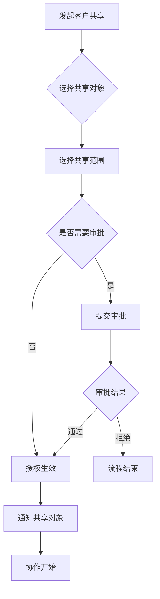
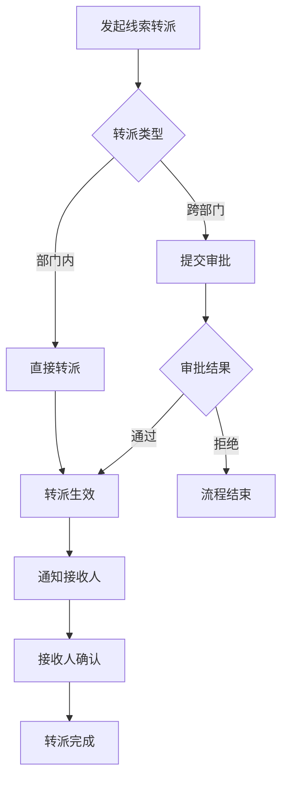
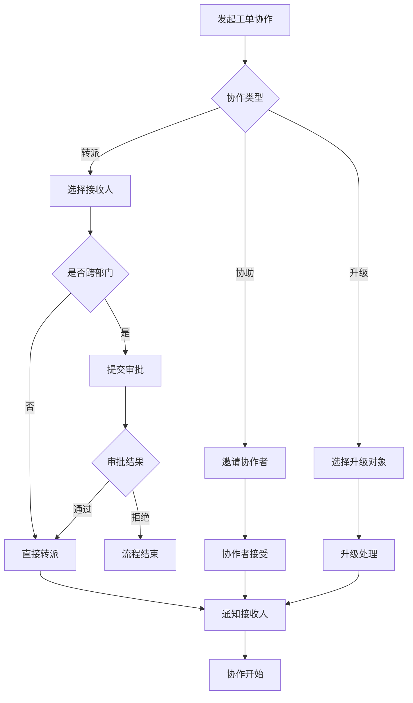

# MOY 终局版角色体系与组织协作模型

---

## 文档元信息

| 属性 | 内容 |
|------|------|
| 文档名称 | MOY 终局版角色体系与组织协作模型 |
| 文档编号 | MOY_FINAL_ROLE_001 |
| 版本号 | v1.0 |
| 状态 | 已确认 |
| 作者 | MOY 文档架构组 |
| 日期 | 2026-04-05 |
| 目标读者 | 系统架构师、产品经理、安全工程师、业务团队 |
| 输入来源 | [P0 权限模型设计](../P0/17_权限模型设计.md)、[终局版产品愿景](./01_终局版产品愿景与阶段演进地图.md) |

---

## 一、文档目的

本文档定义 MOY 终局版的角色体系与组织协作模型，作为企业级 AI 原生客户管理系统的组织架构基线，用于：

1. 定义平台级与租户级的完整角色体系
2. 明确各角色的职责边界与权限范围
3. 规范多组织协作模型与跨部门协作规则
4. 支撑企业级多租户架构的安全与合规要求
5. 为权限管理功能演进提供设计依据

**阅读建议：**
- 管理层：重点阅读第一至四章
- 产品团队：重点阅读第三至六章
- 技术团队：重点阅读第四至七章
- 全文阅读时间：约 20 分钟

---

## 二、适用范围

### 2.1 适用业务范围

| 维度 | 范围定义 |
|------|----------|
| 业务链路 | 获客 → 沟通 → 谈单 → 成交 → 售后 → 复购（全链路） |
| 目标客户 | 销售型公司、客服团队（中小企业至大型企业） |
| 组织规模 | 支持 1 人至 10 万+ 人的企业组织 |
| 部署模式 | SaaS 公有云、私有化部署、混合云部署 |

### 2.2 适用团队范围

| 团队 | 适用内容 |
|------|----------|
| 平台运营团队 | 平台级角色管理、租户管理、平台监控 |
| 企业管理层 | 租户级角色配置、组织架构设计、权限分配 |
| IT 管理员 | 系统配置、用户管理、安全审计 |
| 业务团队 | 角色权限使用、跨部门协作、数据共享 |

---

## 三、术语定义

### 3.1 核心术语

| 术语 | 定义 |
|------|------|
| 平台级角色 | 在 SaaS 平台层面定义的角色，具有跨租户管理能力 |
| 租户级角色 | 在租户（企业）内部定义的角色，仅作用于租户内数据 |
| 角色继承 | 子角色继承父角色的权限，并可在此基础上扩展或限制 |
| 数据范围 | 角色可访问的数据边界，如全部、本部门、仅本人等 |
| 组织单元 | 企业内部的组织结构单元，如部门、团队、事业部等 |
| 协作模型 | 定义跨组织单元协作的规则与机制 |

### 3.2 权限术语

| 术语 | 定义 |
|------|------|
| 功能权限 | 对系统功能模块的访问与操作权限 |
| 数据权限 | 对业务数据的访问范围权限 |
| 字段权限 | 对特定数据字段的访问权限（可见/隐藏/脱敏） |
| 操作权限 | 对特定业务操作的执行权限（创建/编辑/删除/审批等） |
| 临时权限 | 有时效性的临时授权，到期自动失效 |

### 3.3 组织术语

| 术语 | 定义 |
|------|------|
| 矩阵式组织 | 职能线与业务线交叉的组织结构 |
| 事业部式组织 | 按产品线或业务线划分的独立经营单元 |
| 区域式组织 | 按地理区域划分的组织结构 |
| 虚拟团队 | 为特定项目或任务临时组建的跨部门团队 |

---

## 四、平台级角色体系

### 4.1 平台级角色总览

```
┌─────────────────────────────────────────────────────────────────────────┐
│                        平台级角色体系架构                                  │
├─────────────────────────────────────────────────────────────────────────┤
│                                                                         │
│                        ┌─────────────────────┐                          │
│                        │   平台超级管理员     │                          │
│                        │  platform_super_admin │                         │
│                        └──────────┬──────────┘                          │
│                                   │                                     │
│           ┌───────────────────────┼───────────────────────┐             │
│           │                       │                       │             │
│           ▼                       ▼                       ▼             │
│  ┌────────────────┐    ┌────────────────┐    ┌────────────────┐        │
│  │ 平台运营管理员  │    │ 平台财务管理员  │    │ 平台技术管理员  │        │
│  │platform_ops_admin│   │platform_fin_admin│  │platform_tech_admin│      │
│  └────────────────┘    └────────────────┘    └────────────────┘        │
│           │                       │                       │             │
│           └───────────────────────┼───────────────────────┘             │
│                                   │                                     │
│                                   ▼                                     │
│                        ┌─────────────────────┐                          │
│                        │   平台审计查看者     │                          │
│                        │  platform_auditor   │                          │
│                        └─────────────────────┘                          │
│                                                                         │
└─────────────────────────────────────────────────────────────────────────┘
```

### 4.2 平台超级管理员

#### 4.2.1 角色定义

| 属性 | 内容 |
|------|------|
| 角色编码 | platform_super_admin |
| 角色名称 | 平台超级管理员 |
| 角色层级 | 平台级（最高权限） |
| 适用场景 | SaaS 平台运维、平台级配置管理 |
| 人数限制 | 1-3 人 |

#### 4.2.2 职责范围

| 职责领域 | 具体职责 |
|----------|----------|
| 租户管理 | 租户创建、租户配置、租户状态管理、租户数据隔离验证 |
| 平台配置 | 平台级参数配置、功能开关管理、版本发布管理 |
| 用户管理 | 平台管理员账号管理、跨租户用户查询（审计需要） |
| 权限管理 | 平台级角色定义、权限模板管理 |
| 系统监控 | 平台运行状态监控、异常告警处理 |
| 安全管理 | 安全策略配置、安全事件响应 |

#### 4.2.3 权限矩阵

| 权限类别 | 权限项 | 权限级别 |
|----------|--------|----------|
| 租户管理 | 租户创建/编辑/删除/停用 | 全部 |
| 租户管理 | 租户数据查看 | 全部（审计需要） |
| 用户管理 | 平台管理员管理 | 全部 |
| 用户管理 | 跨租户用户查询 | 只读 |
| 系统配置 | 平台参数配置 | 全部 |
| 系统配置 | 功能开关管理 | 全部 |
| 审计日志 | 平台操作日志 | 全部 |
| 审计日志 | 跨租户审计日志 | 全部 |

#### 4.2.4 数据范围

| 数据类型 | 访问范围 |
|----------|----------|
| 租户数据 | 全平台所有租户 |
| 用户数据 | 全平台所有用户 |
| 配置数据 | 平台级配置 |
| 审计数据 | 全平台审计日志 |

### 4.3 平台运营管理员

#### 4.3.1 角色定义

| 属性 | 内容 |
|------|------|
| 角色编码 | platform_ops_admin |
| 角色名称 | 平台运营管理员 |
| 角色层级 | 平台级 |
| 适用场景 | 租户运营支持、客户服务、运营数据分析 |
| 人数限制 | 按需配置 |

#### 4.3.2 职责范围

| 职责领域 | 具体职责 |
|----------|----------|
| 租户运营 | 租户开通、租户配置、租户续费、租户升级 |
| 客户支持 | 租户问题处理、技术支持协调 |
| 运营分析 | 平台运营数据统计、租户活跃度分析 |
| 公告管理 | 平台公告发布、通知管理 |
| 帮助文档 | 帮助中心维护、FAQ 管理 |

#### 4.3.3 权限矩阵

| 权限类别 | 权限项 | 权限级别 |
|----------|--------|----------|
| 租户管理 | 租户创建/编辑 | 全部 |
| 租户管理 | 租户删除 | 无（需超级管理员） |
| 租户管理 | 租户数据查看 | 只读 |
| 运营数据 | 运营统计查看 | 全部 |
| 公告管理 | 平台公告管理 | 全部 |
| 帮助中心 | 文档管理 | 全部 |
| 审计日志 | 操作日志查看 | 只读 |

#### 4.3.4 数据范围

| 数据类型 | 访问范围 |
|----------|----------|
| 租户数据 | 全平台租户基本信息 |
| 运营数据 | 平台运营统计数据 |
| 业务数据 | 不直接访问租户业务数据 |

### 4.4 平台财务管理员

#### 4.4.1 角色定义

| 属性 | 内容 |
|------|------|
| 角色编码 | platform_fin_admin |
| 角色名称 | 平台财务管理员 |
| 角色层级 | 平台级 |
| 适用场景 | 计费管理、发票管理、财务对账 |
| 人数限制 | 按需配置 |

#### 4.4.2 职责范围

| 职责领域 | 具体职责 |
|----------|----------|
| 计费管理 | 计费规则配置、套餐定价管理 |
| 账单管理 | 租户账单生成、账单查询、欠费处理 |
| 发票管理 | 发票开具、发票查询 |
| 支付管理 | 支付渠道配置、支付记录查询 |
| 财务报表 | 收入统计、财务报表生成 |

#### 4.4.3 权限矩阵

| 权限类别 | 权限项 | 权限级别 |
|----------|--------|----------|
| 计费管理 | 计费规则配置 | 全部 |
| 套餐管理 | 套餐定价管理 | 全部 |
| 账单管理 | 租户账单管理 | 全部 |
| 发票管理 | 发票开具/查询 | 全部 |
| 支付管理 | 支付记录查询 | 只读 |
| 财务报表 | 报表生成/查看 | 全部 |
| 审计日志 | 财务操作日志 | 只读 |

#### 4.4.4 数据范围

| 数据类型 | 访问范围 |
|----------|----------|
| 计费数据 | 全平台计费配置 |
| 账单数据 | 全平台租户账单 |
| 支付数据 | 全平台支付记录 |
| 业务数据 | 不直接访问租户业务数据 |

### 4.5 平台技术管理员

#### 4.5.1 角色定义

| 属性 | 内容 |
|------|------|
| 角色编码 | platform_tech_admin |
| 角色名称 | 平台技术管理员 |
| 角色层级 | 平台级 |
| 适用场景 | 系统运维、技术支持、故障处理 |
| 人数限制 | 按需配置 |

#### 4.5.2 职责范围

| 职责领域 | 具体职责 |
|----------|----------|
| 系统运维 | 系统部署、版本升级、性能优化 |
| 监控管理 | 系统监控配置、告警规则配置 |
| 故障处理 | 故障排查、故障修复、故障报告 |
| 技术支持 | 租户技术问题支持、API 问题解答 |
| 安全管理 | 安全漏洞修复、安全策略执行 |

#### 4.5.3 权限矩阵

| 权限类别 | 权限项 | 权限级别 |
|----------|--------|----------|
| 系统配置 | 系统参数配置 | 全部 |
| 监控管理 | 监控配置/查看 | 全部 |
| 告警管理 | 告警规则配置 | 全部 |
| 日志管理 | 系统日志查看 | 全部 |
| API 管理 | API 配置/监控 | 全部 |
| 故障处理 | 故障排查工具 | 全部 |
| 审计日志 | 系统操作日志 | 只读 |

#### 4.5.4 数据范围

| 数据类型 | 访问范围 |
|----------|----------|
| 系统配置 | 全平台系统配置 |
| 监控数据 | 全平台监控数据 |
| 日志数据 | 全平台系统日志 |
| 业务数据 | 不直接访问租户业务数据 |

### 4.6 平台审计查看者

#### 4.6.1 角色定义

| 属性 | 内容 |
|------|------|
| 角色编码 | platform_auditor |
| 角色名称 | 平台审计查看者 |
| 角色层级 | 平台级 |
| 适用场景 | 合规审计、安全审计、操作审计 |
| 人数限制 | 按需配置 |

#### 4.6.2 职责范围

| 职责领域 | 具体职责 |
|----------|----------|
| 合规审计 | 平台合规性检查、租户合规审计 |
| 安全审计 | 安全事件审计、权限变更审计 |
| 操作审计 | 平台操作日志审计、租户操作日志审计 |
| 报告生成 | 审计报告生成、合规报告生成 |

#### 4.6.3 权限矩阵

| 权限类别 | 权限项 | 权限级别 |
|----------|--------|----------|
| 审计日志 | 平台操作日志 | 只读 |
| 审计日志 | 租户操作日志 | 只读 |
| 审计日志 | 登录日志 | 只读 |
| 审计日志 | 权限变更日志 | 只读 |
| 审计报告 | 报告生成/查看 | 只读 |
| 租户信息 | 租户基本信息 | 只读 |
| 用户信息 | 用户基本信息 | 只读 |

#### 4.6.4 数据范围

| 数据类型 | 访问范围 |
|----------|----------|
| 审计数据 | 全平台审计日志 |
| 租户数据 | 租户基本信息（只读） |
| 用户数据 | 用户基本信息（只读） |
| 业务数据 | 不访问租户业务数据 |

### 4.7 平台级角色权限汇总

| 功能模块 | 超级管理员 | 运营管理员 | 财务管理员 | 技术管理员 | 审计查看者 |
|----------|------------|------------|------------|------------|------------|
| 租户管理 | CRUD | CRU | R | R | R |
| 用户管理（平台级） | CRUD | R | - | R | R |
| 计费管理 | CRUD | R | CRUD | R | R |
| 系统配置 | CRUD | R | - | CRUD | R |
| 监控管理 | CRUD | R | - | CRUD | R |
| 审计日志 | CRUD | R | R | R | R |
| 公告管理 | CRUD | CRUD | - | - | R |
| 帮助中心 | CRUD | CRUD | - | - | R |

---

## 五、租户级角色体系

### 5.1 租户级角色总览

```
┌─────────────────────────────────────────────────────────────────────────┐
│                        租户级角色体系架构                                  │
├─────────────────────────────────────────────────────────────────────────┤
│                                                                         │
│                        ┌─────────────────────┐                          │
│                        │     租户管理员       │                          │
│                        │     org_admin       │                          │
│                        └──────────┬──────────┘                          │
│                                   │                                     │
│     ┌──────────────┬──────────────┼──────────────┬──────────────┐       │
│     │              │              │              │              │       │
│     ▼              ▼              ▼              ▼              ▼       │
│ ┌────────┐   ┌────────┐    ┌────────┐    ┌────────┐    ┌────────┐     │
│ │销售总监 │   │客服总监 │    │客户成功 │    │AI运营  │    │审计查看│     │
│ │sales_  │   │service_│    │经理    │    │管理员  │    │者      │     │
│ │director│   │director│    │csm     │    │ai_ops  │    │auditor │     │
│ └────┬───┘   └────┬───┘    └────────┘    └────────┘    └────────┘     │
│      │            │                                                      │
│      ▼            ▼                                                      │
│ ┌────────┐   ┌────────┐                                                 │
│ │销售经理 │   │客服经理 │                                                 │
│ │sales_  │   │service_│                                                 │
│ │manager │   │manager │                                                 │
│ └────┬───┘   └────┬───┘                                                 │
│      │            │                                                      │
│      ▼            ▼                                                      │
│ ┌────────┐   ┌────────┐                                                 │
│ │销售代表 │   │客服专员 │                                                 │
│ │sales_  │   │service_│                                                 │
│ │rep     │   │agent   │                                                 │
│ └────────┘   └────────┘                                                 │
│                                                                         │
└─────────────────────────────────────────────────────────────────────────┘
```

### 5.2 租户管理员

#### 5.2.1 角色定义

| 属性 | 内容 |
|------|------|
| 角色编码 | org_admin |
| 角色名称 | 租户管理员 |
| 角色层级 | 租户级（最高权限） |
| 适用场景 | 企业系统管理、用户管理、权限配置 |
| 人数限制 | 建议 1-5 人 |

#### 5.2.2 职责范围

| 职责领域 | 具体职责 |
|----------|----------|
| 组织管理 | 部门创建、部门配置、组织架构调整 |
| 用户管理 | 用户创建、用户配置、用户状态管理 |
| 角色管理 | 角色配置、权限分配、角色成员管理 |
| 系统配置 | 租户级参数配置、业务规则配置 |
| 数据管理 | 数据导入导出、数据备份恢复 |
| 安全管理 | 安全策略配置、登录策略配置 |

#### 5.2.3 权限矩阵

| 权限类别 | 权限项 | 权限级别 |
|----------|--------|----------|
| 组织管理 | 部门 CRUD | 全部 |
| 用户管理 | 用户 CRUD | 全部 |
| 角色管理 | 角色 CRUD | 全部 |
| 客户管理 | 客户 CRUD | 全部 |
| 线索管理 | 线索 CRUD | 全部 |
| 商机管理 | 商机 CRUD | 全部 |
| 会话管理 | 会话 R | 全部 |
| 工单管理 | 工单 CRUD | 全部 |
| 知识库 | 知识 CRUD | 全部 |
| 数据看板 | 看板 CRUD | 全部 |
| 系统配置 | 配置 CRUD | 全部 |
| 审计日志 | 日志 R | 全部 |

#### 5.2.4 数据范围

| 数据类型 | 访问范围 |
|----------|----------|
| 业务数据 | 租户内全部数据 |
| 用户数据 | 租户内全部用户 |
| 配置数据 | 租户级配置 |
| 审计数据 | 租户内审计日志 |

### 5.3 销售总监

#### 5.3.1 角色定义

| 属性 | 内容 |
|------|------|
| 角色编码 | sales_director |
| 角色名称 | 销售总监 |
| 角色层级 | 租户级（管理层） |
| 适用场景 | 销售团队管理、销售策略制定、业绩分析 |
| 人数限制 | 按组织架构配置 |

#### 5.3.2 职责范围

| 职责领域 | 具体职责 |
|----------|----------|
| 团队管理 | 销售团队组建、销售人员管理、团队绩效评估 |
| 客户管理 | 重点客户管理、客户资源分配、客户策略制定 |
| 线索管理 | 线索分配策略、线索转化分析、线索质量评估 |
| 商机管理 | 重点商机跟进、商机预测分析、赢单策略制定 |
| 业绩管理 | 销售目标设定、业绩追踪、业绩分析报告 |
| 流程优化 | 销售流程优化、销售工具优化、销售培训 |

#### 5.3.3 权限矩阵

| 权限类别 | 权限项 | 权限级别 |
|----------|--------|----------|
| 客户管理 | 客户 CRUD | 全部 |
| 线索管理 | 线索 CRUD | 全部 |
| 商机管理 | 商机 CRUD | 全部 |
| 会话管理 | 会话 R | 全部 |
| 工单管理 | 工单 R | 全部 |
| 任务管理 | 任务 CRUD | 全部 |
| 数据看板 | 看板 R/配置 | 全部 |
| 团队管理 | 团队成员 R | 本部门及下级 |
| 报表分析 | 报表 R | 全部 |

#### 5.3.4 数据范围

| 数据类型 | 访问范围 |
|----------|----------|
| 客户数据 | 租户内全部客户 |
| 线索数据 | 租户内全部线索 |
| 商机数据 | 租户内全部商机 |
| 团队数据 | 本部门及下级部门 |

### 5.4 销售经理

#### 5.4.1 角色定义

| 属性 | 内容 |
|------|------|
| 角色编码 | sales_manager |
| 角色名称 | 销售经理 |
| 角色层级 | 租户级（中层管理） |
| 适用场景 | 销售团队日常管理、客户资源管理 |
| 人数限制 | 按组织架构配置 |

#### 5.4.2 职责范围

| 职责领域 | 具体职责 |
|----------|----------|
| 团队管理 | 团队成员管理、团队任务分配、团队绩效跟进 |
| 客户管理 | 团队客户管理、客户分配、客户跟进监督 |
| 线索管理 | 团队线索分配、线索跟进监督、线索转化跟进 |
| 商机管理 | 团队商机跟进、商机阶段推进、商机风险识别 |
| 任务管理 | 团队任务分配、任务进度跟进、任务协调 |

#### 5.4.3 权限矩阵

| 权限类别 | 权限项 | 权限级别 |
|----------|--------|----------|
| 客户管理 | 客户 CRU | 本部门及下级 |
| 客户管理 | 客户 D | 需审批 |
| 线索管理 | 线索 CRU | 本部门及下级 |
| 线索管理 | 线索 D | 需审批 |
| 商机管理 | 商机 CRU | 本部门及下级 |
| 商机管理 | 商机 D | 需审批 |
| 会话管理 | 会话 R | 本部门及下级 |
| 工单管理 | 工单 R | 本部门及下级 |
| 任务管理 | 任务 CRUD | 本部门及下级 |
| 数据看板 | 看板 R | 本部门及下级 |

#### 5.4.4 数据范围

| 数据类型 | 访问范围 |
|----------|----------|
| 客户数据 | 本部门及下级部门客户 |
| 线索数据 | 本部门及下级部门线索 |
| 商机数据 | 本部门及下级部门商机 |
| 团队数据 | 本部门及下级部门 |

### 5.5 销售代表

#### 5.5.1 角色定义

| 属性 | 内容 |
|------|------|
| 角色编码 | sales_rep |
| 角色名称 | 销售代表 |
| 角色层级 | 租户级（执行层） |
| 适用场景 | 一线销售工作、客户跟进、商机推进 |
| 人数限制 | 无限制 |

#### 5.5.2 职责范围

| 职责领域 | 具体职责 |
|----------|----------|
| 客户跟进 | 客户联系、客户需求了解、客户关系维护 |
| 线索处理 | 线索跟进、线索转化、线索状态更新 |
| 商机推进 | 商机创建、商机跟进、商机阶段推进 |
| 任务执行 | 任务完成、任务反馈、任务协作 |
| 数据录入 | 客户信息录入、跟进记录录入 |

#### 5.5.3 权限矩阵

| 权限类别 | 权限项 | 权限级别 |
|----------|--------|----------|
| 客户管理 | 客户 CRU | 仅本人 |
| 客户管理 | 客户 D | 无 |
| 线索管理 | 线索 CRU | 仅本人 |
| 线索管理 | 线索 D | 无 |
| 商机管理 | 商机 CRU | 仅本人 |
| 商机管理 | 商机 D | 无 |
| 会话管理 | 会话 R | 仅本人相关 |
| 工单管理 | 工单 R | 仅本人相关 |
| 任务管理 | 任务 CRU | 仅本人 |
| 数据看板 | 看板 R | 仅本人 |

#### 5.5.4 数据范围

| 数据类型 | 访问范围 |
|----------|----------|
| 客户数据 | 本人负责的客户 |
| 线索数据 | 本人负责的线索 |
| 商机数据 | 本人负责的商机 |
| 任务数据 | 本人相关的任务 |

### 5.6 客服总监

#### 5.6.1 角色定义

| 属性 | 内容 |
|------|------|
| 角色编码 | service_director |
| 角色名称 | 客服总监 |
| 角色层级 | 租户级（管理层） |
| 适用场景 | 客服团队管理、服务质量管控、客户满意度管理 |
| 人数限制 | 按组织架构配置 |

#### 5.6.2 职责范围

| 职责领域 | 具体职责 |
|----------|----------|
| 团队管理 | 客服团队组建、客服人员管理、团队绩效评估 |
| 会话管理 | 会话监控、会话质量评估、会话策略制定 |
| 工单管理 | 工单流程管理、工单质量评估、工单策略制定 |
| 知识管理 | 知识库建设、知识质量评估、知识更新策略 |
| 服务质量 | 服务标准制定、服务质量监控、客户满意度分析 |
| AI 管理 | AI 配置优化、AI 效果评估、AI 策略调整 |

#### 5.6.3 权限矩阵

| 权限类别 | 权限项 | 权限级别 |
|----------|--------|----------|
| 客户管理 | 客户 R | 全部 |
| 会话管理 | 会话 CRU | 全部 |
| 会话管理 | 会话监控 | 全部 |
| 工单管理 | 工单 CRUD | 全部 |
| 知识库 | 知识 CRUD | 全部 |
| AI 配置 | AI 配置 CRUD | 全部 |
| 质检管理 | 质检 CRUD | 全部 |
| 数据看板 | 看板 R/配置 | 全部 |
| 团队管理 | 团队成员 R | 本部门及下级 |

#### 5.6.4 数据范围

| 数据类型 | 访问范围 |
|----------|----------|
| 会话数据 | 租户内全部会话 |
| 工单数据 | 租户内全部工单 |
| 知识数据 | 租户内全部知识 |
| 团队数据 | 本部门及下级部门 |

### 5.7 客服经理

#### 5.7.1 角色定义

| 属性 | 内容 |
|------|------|
| 角色编码 | service_manager |
| 角色名称 | 客服经理 |
| 角色层级 | 租户级（中层管理） |
| 适用场景 | 客服团队日常管理、会话监控、工单处理 |
| 人数限制 | 按组织架构配置 |

#### 5.7.2 职责范围

| 职责领域 | 具体职责 |
|----------|----------|
| 团队管理 | 团队成员管理、排班管理、绩效跟进 |
| 会话管理 | 会话监控、会话转接、会话质量检查 |
| 工单管理 | 工单分配、工单跟进、工单升级处理 |
| 知识管理 | 知识审核、知识更新、知识培训 |
| 质量管理 | 服务质量检查、问题反馈、改进建议 |

#### 5.7.3 权限矩阵

| 权限类别 | 权限项 | 权限级别 |
|----------|--------|----------|
| 客户管理 | 客户 R | 本部门及下级 |
| 会话管理 | 会话 CRU | 本部门及下级 |
| 会话管理 | 会话监控 | 本部门及下级 |
| 工单管理 | 工单 CRU | 本部门及下级 |
| 工单管理 | 工单 D | 需审批 |
| 知识库 | 知识 CRU | 全部 |
| 质检管理 | 质检 R/U | 本部门及下级 |
| 数据看板 | 看板 R | 本部门及下级 |

#### 5.7.4 数据范围

| 数据类型 | 访问范围 |
|----------|----------|
| 会话数据 | 本部门及下级部门会话 |
| 工单数据 | 本部门及下级部门工单 |
| 知识数据 | 租户内全部知识 |
| 团队数据 | 本部门及下级部门 |

### 5.8 客服专员

#### 5.8.1 角色定义

| 属性 | 内容 |
|------|------|
| 角色编码 | service_agent |
| 角色名称 | 客服专员 |
| 角色层级 | 租户级（执行层） |
| 适用场景 | 一线客服工作、会话处理、工单处理 |
| 人数限制 | 无限制 |

#### 5.8.2 职责范围

| 职责领域 | 具体职责 |
|----------|----------|
| 会话处理 | 会话接待、消息回复、会话转接、会话关闭 |
| 工单处理 | 工单创建、工单跟进、工单解决、工单关闭 |
| 知识使用 | 知识检索、知识应用、知识反馈 |
| AI 协作 | 智能回复使用、AI 辅助应用 |

#### 5.8.3 权限矩阵

| 权限类别 | 权限项 | 权限级别 |
|----------|--------|----------|
| 客户管理 | 客户 R | 仅本人相关 |
| 会话管理 | 会话 RU | 仅本人 |
| 会话管理 | 会话转接 | 仅本人 |
| 工单管理 | 工单 CRU | 仅本人 |
| 工单管理 | 工单 D | 无 |
| 知识库 | 知识 R | 全部 |
| AI 功能 | 智能回复 | 仅本人会话 |
| 数据看板 | 看板 R | 仅本人 |

#### 5.8.4 数据范围

| 数据类型 | 访问范围 |
|----------|----------|
| 会话数据 | 本人负责的会话 |
| 工单数据 | 本人负责的工单 |
| 知识数据 | 租户内全部知识（只读） |
| 客户数据 | 与本人会话/工单相关的客户 |

### 5.9 客户成功经理

#### 5.9.1 角色定义

| 属性 | 内容 |
|------|------|
| 角色编码 | csm |
| 角色名称 | 客户成功经理 |
| 角色层级 | 租户级（专业岗位） |
| 适用场景 | 客户健康度管理、续费管理、增购推荐 |
| 人数限制 | 按需配置 |

#### 5.9.2 职责范围

| 职责领域 | 具体职责 |
|----------|----------|
| 健康度管理 | 客户健康度评估、风险预警、干预措施 |
| 续费管理 | 续费提醒、续费跟进、续费谈判 |
| 增购推荐 | 增购机会识别、增购方案制定、增购跟进 |
| 客户关怀 | 定期回访、客户满意度调查、客户反馈处理 |
| 流失预防 | 流失风险识别、流失预防措施、流失挽回 |

#### 5.9.3 权限矩阵

| 权限类别 | 权限项 | 权限级别 |
|----------|--------|----------|
| 客户管理 | 客户 CRU | 分配的客户 |
| 健康度管理 | 健康度 R/U | 分配的客户 |
| 续费管理 | 续费 R/U | 分配的客户 |
| 增购管理 | 增购机会 CRUD | 分配的客户 |
| 工单管理 | 工单 R | 分配的客户相关 |
| 数据看板 | 看板 R | 分配的客户 |
| 报表分析 | 报表 R | 分配的客户 |

#### 5.9.4 数据范围

| 数据类型 | 访问范围 |
|----------|----------|
| 客户数据 | 分配负责的客户 |
| 健康度数据 | 分配负责的客户 |
| 续费数据 | 分配负责的客户 |
| 工单数据 | 分配客户相关的工单 |

### 5.10 AI 运营管理员

#### 5.10.1 角色定义

| 属性 | 内容 |
|------|------|
| 角色编码 | ai_ops |
| 角色名称 | AI 运营管理员 |
| 角色层级 | 租户级（专业岗位） |
| 适用场景 | AI 规则配置、AI 效果优化、自动化规则管理 |
| 人数限制 | 按需配置 |

#### 5.10.2 职责范围

| 职责领域 | 具体职责 |
|----------|----------|
| 智能回复 | 回复模板配置、回复规则优化、回复效果评估 |
| 话术辅助 | 话术库管理、话术规则配置、话术效果评估 |
| 线索评分 | 评分规则配置、评分模型优化、评分效果评估 |
| 商机预测 | 预测规则配置、预测模型优化、预测效果评估 |
| 自动化规则 | 自动化规则配置、规则效果监控、规则优化 |
| 知识库 | 知识库维护、知识质量评估、知识更新 |

#### 5.10.3 权限矩阵

| 权限类别 | 权限项 | 权限级别 |
|----------|--------|----------|
| 智能回复 | 配置 CRUD | 全部 |
| 话术辅助 | 配置 CRUD | 全部 |
| 线索评分 | 配置 CRUD | 全部 |
| 商机预测 | 配置 CRUD | 全部 |
| 自动化规则 | 规则 CRUD | 全部 |
| 知识库 | 知识 CRUD | 全部 |
| AI 效果 | 效果报表 R | 全部 |
| 业务数据 | 数据 R | 全部（只读） |

#### 5.10.4 数据范围

| 数据类型 | 访问范围 |
|----------|----------|
| AI 配置 | 租户内全部 AI 配置 |
| 知识数据 | 租户内全部知识 |
| 业务数据 | 租户内全部业务数据（只读） |
| 效果数据 | 租户内 AI 效果数据 |

### 5.11 审计查看者

#### 5.11.1 角色定义

| 属性 | 内容 |
|------|------|
| 角色编码 | auditor |
| 角色名称 | 审计查看者 |
| 角色层级 | 租户级（专业岗位） |
| 适用场景 | 合规审计、操作审计、安全审计 |
| 人数限制 | 按需配置 |

#### 5.11.2 职责范围

| 职责领域 | 具体职责 |
|----------|----------|
| 操作审计 | 用户操作日志审计、异常操作识别 |
| 权限审计 | 权限变更审计、权限合规检查 |
| 数据审计 | 数据访问审计、数据导出审计 |
| 合规审计 | 合规性检查、合规报告生成 |

#### 5.11.3 权限矩阵

| 权限类别 | 权限项 | 权限级别 |
|----------|--------|----------|
| 审计日志 | 操作日志 R | 全部 |
| 审计日志 | 登录日志 R | 全部 |
| 审计日志 | 权限变更日志 R | 全部 |
| 审计报告 | 报告生成 R | 全部 |
| 用户信息 | 用户基本信息 R | 全部 |
| 业务数据 | 业务数据 R | 无（仅审计日志） |

#### 5.11.4 数据范围

| 数据类型 | 访问范围 |
|----------|----------|
| 审计数据 | 租户内全部审计日志 |
| 用户数据 | 租户内用户基本信息（只读） |
| 业务数据 | 不直接访问业务数据 |

### 5.12 租户级角色权限汇总

| 功能模块 | 租户管理员 | 销售总监 | 销售经理 | 销售代表 | 客服总监 | 客服经理 | 客服专员 | 客户成功经理 | AI运营管理员 | 审计查看者 |
|----------|------------|----------|----------|----------|----------|----------|----------|--------------|--------------|------------|
| 组织管理 | CRUD | R | - | - | - | - | - | - | - | R |
| 用户管理 | CRUD | R | R | - | R | R | - | - | - | R |
| 角色管理 | CRUD | - | - | - | - | - | - | - | - | R |
| 客户管理 | CRUD | CRUD | CRU | CRU | R | R | R | CRU | R | - |
| 线索管理 | CRUD | CRUD | CRU | CRU | R | R | - | R | R | - |
| 商机管理 | CRUD | CRUD | CRU | CRU | R | R | - | R | R | - |
| 会话管理 | R | R | R | - | CRUD | CRU | RU | - | R | - |
| 会话监控 | - | - | - | - | CRUD | CRU | - | - | R | - |
| 工单管理 | CRUD | R | R | - | CRUD | CRU | CRU | R | R | - |
| 知识库 | CRUD | R | R | R | CRUD | CRU | R | R | CRUD | - |
| AI 配置 | CRUD | R | - | - | CRUD | R | - | - | CRUD | - |
| 自动化规则 | CRUD | R | - | - | R | - | - | - | CRUD | - |
| 数据看板 | CRUD | CRUD | R | R | CRUD | R | R | R | R | - |
| 审计日志 | R | - | - | - | - | - | - | - | - | R |

---

## 六、多组织协作模型

### 6.1 协作模型总览

```
┌─────────────────────────────────────────────────────────────────────────┐
│                        多组织协作模型架构                                  │
├─────────────────────────────────────────────────────────────────────────┤
│                                                                         │
│   ┌─────────────────────────────────────────────────────────────────┐   │
│   │                      组织协作模型选择                             │   │
│   │                                                                   │   │
│   │   ┌─────────────┐    ┌─────────────┐    ┌─────────────┐         │   │
│   │   │  矩阵式组织  │    │ 事业部式组织 │    │  区域式组织  │         │   │
│   │   │  Matrix     │    │  BU-Based   │    │  Regional   │         │   │
│   │   └─────────────┘    └─────────────┘    └─────────────┘         │   │
│   │                                                                   │   │
│   └─────────────────────────────────────────────────────────────────┘   │
│                                                                         │
│   ┌─────────────────────────────────────────────────────────────────┐   │
│   │                      协作支撑机制                                 │   │
│   │                                                                   │   │
│   │   ┌─────────┐  ┌─────────┐  ┌─────────┐  ┌─────────┐           │   │
│   │   │数据共享 │  │任务协作 │  │审批流转 │  │虚拟团队 │           │   │
│   │   └─────────┘  └─────────┘  └─────────┘  └─────────┘           │   │
│   │                                                                   │   │
│   └─────────────────────────────────────────────────────────────────┘   │
│                                                                         │
└─────────────────────────────────────────────────────────────────────────┘
```

### 6.2 矩阵式组织模型

#### 6.2.1 模型定义

| 属性 | 内容 |
|------|------|
| 模型名称 | 矩阵式组织模型 |
| 适用场景 | 跨职能协作、项目管理型组织 |
| 组织特点 | 职能线与业务线交叉，双重汇报关系 |
| 典型企业 | 咨询公司、软件公司、项目型组织 |

#### 6.2.2 组织结构

```
┌─────────────────────────────────────────────────────────────────────────┐
│                        矩阵式组织结构示例                                  │
├─────────────────────────────────────────────────────────────────────────┤
│                                                                         │
│                         ┌─────────────┐                                 │
│                         │   总经理    │                                 │
│                         └──────┬──────┘                                 │
│                                │                                        │
│         ┌──────────────────────┼──────────────────────┐                 │
│         │                      │                      │                 │
│         ▼                      ▼                      ▼                 │
│   ┌───────────┐          ┌───────────┐          ┌───────────┐          │
│   │ 销售总监  │          │ 客服总监  │          │ 产品总监  │          │
│   └─────┬─────┘          └─────┬─────┘          └─────┬─────┘          │
│         │                      │                      │                 │
│         │    职能线（纵向）     │                      │                 │
│         │                      │                      │                 │
│         └──────────────────────┼──────────────────────┘                 │
│                                │                                        │
│                                ▼                                        │
│   ┌─────────────────────────────────────────────────────────────────┐   │
│   │                     业务线（横向）                                │   │
│   │                                                                   │   │
│   │   ┌─────────────┐  ┌─────────────┐  ┌─────────────┐             │   │
│   │   │  项目组 A   │  │  项目组 B   │  │  项目组 C   │             │   │
│   │   │             │  │             │  │             │             │   │
│   │   │ 销售+客服   │  │ 销售+客服   │  │ 销售+客服   │             │   │
│   │   │ +产品      │  │ +产品      │  │ +产品      │             │   │
│   │   └─────────────┘  └─────────────┘  └─────────────┘             │   │
│   │                                                                   │   │
│   └─────────────────────────────────────────────────────────────────┘   │
│                                                                         │
└─────────────────────────────────────────────────────────────────────────┘
```

#### 6.2.3 协作规则

| 规则类型 | 规则内容 |
|----------|----------|
| 双重归属 | 用户同时归属职能部门和项目组 |
| 主次关系 | 设置主属部门和兼属部门 |
| 权限叠加 | 权限取主属部门与兼属部门的并集 |
| 数据范围 | 可访问主属部门 + 兼属部门的数据 |
| 审批流程 | 根据业务类型选择审批路径 |

#### 6.2.4 数据模型

| 字段 | 类型 | 说明 |
|------|------|------|
| user_id | BIGINT | 用户ID |
| primary_department_id | BIGINT | 主属部门ID |
| secondary_departments | JSONB | 兼属部门列表 |
| project_teams | JSONB | 所属项目组列表 |
| effective_permissions | JSONB | 生效权限（叠加后） |

### 6.3 事业部式组织模型

#### 6.3.1 模型定义

| 属性 | 内容 |
|------|------|
| 模型名称 | 事业部式组织模型 |
| 适用场景 | 多产品线、多业务线企业 |
| 组织特点 | 按产品/业务线划分，独立经营单元 |
| 典型企业 | 大型集团、多元化企业 |

#### 6.3.2 组织结构

```
┌─────────────────────────────────────────────────────────────────────────┐
│                        事业部式组织结构示例                                │
├─────────────────────────────────────────────────────────────────────────┤
│                                                                         │
│                         ┌─────────────┐                                 │
│                         │   集团总部   │                                 │
│                         └──────┬──────┘                                 │
│                                │                                        │
│         ┌──────────────────────┼──────────────────────┐                 │
│         │                      │                      │                 │
│         ▼                      ▼                      ▼                 │
│   ┌───────────┐          ┌───────────┐          ┌───────────┐          │
│   │ 教育事业部 │          │ 企业服务BU │          │ 金融科技BU │          │
│   └─────┬─────┘          └─────┬─────┘          └─────┬─────┘          │
│         │                      │                      │                 │
│    ┌────┴────┐            ┌────┴────┐            ┌────┴────┐           │
│    │         │            │         │            │         │           │
│    ▼         ▼            ▼         ▼            ▼         ▼           │
│ ┌─────┐  ┌─────┐      ┌─────┐  ┌─────┐      ┌─────┐  ┌─────┐          │
│ │销售部│  │客服部│      │销售部│  │客服部│      │销售部│  │客服部│          │
│ └─────┘  └─────┘      └─────┘  └─────┘      └─────┘  └─────┘          │
│                                                                         │
│   ─────────────────────────────────────────────────────────────────    │
│   数据隔离：各事业部数据相互隔离，总部可查看汇总数据                        │
│                                                                         │
└─────────────────────────────────────────────────────────────────────────┘
```

#### 6.3.3 协作规则

| 规则类型 | 规则内容 |
|----------|----------|
| 数据隔离 | 各事业部数据默认隔离 |
| 独立管理 | 各事业部独立管理用户和权限 |
| 总部监管 | 总部可查看各事业部汇总数据 |
| 跨BU协作 | 需要跨事业部数据授权 |
| 统一标准 | 遵循集团统一的数据标准 |

#### 6.3.4 数据模型

| 字段 | 类型 | 说明 |
|------|------|------|
| bu_id | BIGINT | 事业部ID |
| bu_name | VARCHAR(128) | 事业部名称 |
| bu_code | VARCHAR(32) | 事业部编码 |
| parent_org_id | BIGINT | 所属租户ID |
| is_independent | SMALLINT | 是否独立核算 |
| data_isolation_level | VARCHAR(16) | 数据隔离级别 |

### 6.4 区域式组织模型

#### 6.4.1 模型定义

| 属性 | 内容 |
|------|------|
| 模型名称 | 区域式组织模型 |
| 适用场景 | 地理分布型企业、连锁企业 |
| 组织特点 | 按地理区域划分，区域独立运营 |
| 典型企业 | 连锁零售、区域代理、全国性企业 |

#### 6.4.2 组织结构

```
┌─────────────────────────────────────────────────────────────────────────┐
│                        区域式组织结构示例                                  │
├─────────────────────────────────────────────────────────────────────────┤
│                                                                         │
│                         ┌─────────────┐                                 │
│                         │   全国总部   │                                 │
│                         └──────┬──────┘                                 │
│                                │                                        │
│         ┌──────────────────────┼──────────────────────┐                 │
│         │                      │                      │                 │
│         ▼                      ▼                      ▼                 │
│   ┌───────────┐          ┌───────────┐          ┌───────────┐          │
│   │  华北区   │          │  华东区   │          │  华南区   │          │
│   └─────┬─────┘          └─────┬─────┘          └─────┬─────┘          │
│         │                      │                      │                 │
│    ┌────┴────┐            ┌────┴────┐            ┌────┴────┐           │
│    │         │            │         │            │         │           │
│    ▼         ▼            ▼         ▼            ▼         ▼           │
│ ┌─────┐  ┌─────┐      ┌─────┐  ┌─────┐      ┌─────┐  ┌─────┐          │
│ │北京分│  │天津分│      │上海分│  │杭州分│      │广州分│  │深圳分│          │
│ │公司 │  │公司 │      │公司 │  │公司 │      │公司 │  │公司 │          │
│ └─────┘  └─────┘      └─────┘  └─────┘      └─────┘  └─────┘          │
│                                                                         │
│   ─────────────────────────────────────────────────────────────────    │
│   区域管理：各区域独立运营，总部统一策略和标准                              │
│                                                                         │
└─────────────────────────────────────────────────────────────────────────┘
```

#### 6.4.3 协作规则

| 规则类型 | 规则内容 |
|----------|----------|
| 区域自治 | 各区域独立管理日常运营 |
| 数据隔离 | 各区域数据默认隔离 |
| 总部管控 | 总部制定统一策略和标准 |
| 跨区协作 | 客户跨区转移需要审批 |
| 数据汇总 | 各区域数据汇总到总部 |

#### 6.4.4 数据模型

| 字段 | 类型 | 说明 |
|------|------|------|
| region_id | BIGINT | 区域ID |
| region_name | VARCHAR(128) | 区域名称 |
| region_code | VARCHAR(32) | 区域编码 |
| parent_region_id | BIGINT | 上级区域ID |
| region_level | INTEGER | 区域层级 |
| manager_id | BIGINT | 区域负责人ID |

### 6.5 协作模型对比

| 维度 | 矩阵式组织 | 事业部式组织 | 区域式组织 |
|------|------------|--------------|------------|
| 适用规模 | 中型企业 | 大型集团 | 全国性企业 |
| 组织复杂度 | 高 | 中 | 中 |
| 数据隔离度 | 低（按需） | 高 | 高 |
| 管理灵活度 | 高 | 中 | 中 |
| 协作效率 | 高 | 中 | 中 |
| 实施难度 | 高 | 中 | 中 |

---

## 七、跨部门协作规则

### 7.1 协作场景定义

#### 7.1.1 客户共享协作

| 场景 | 说明 | 触发条件 | 协作方式 |
|------|------|----------|----------|
| 销售转客服 | 客户成交后转客服维护 | 商机成交 | 客户数据共享 |
| 客服转销售 | 客户有增购意向 | 客户表达意向 | 线索创建+客户共享 |
| 跨部门跟进 | 多部门协作服务客户 | 复杂客户需求 | 客户团队协作 |

#### 7.1.2 线索转派协作

| 场景 | 说明 | 触发条件 | 协作方式 |
|------|------|----------|----------|
| 线索分配 | 线索分配给销售跟进 | 新线索进入 | 线索分配规则 |
| 线索转派 | 线索转给其他销售 | 销售无法跟进 | 线索转派审批 |
| 线索退回 | 线索退回线索池 | 无效线索 | 线索退回流程 |

#### 7.1.3 商机协作

| 场景 | 说明 | 触发条件 | 协作方式 |
|------|------|----------|----------|
| 商机协助 | 邀请他人协助跟进 | 复杂商机 | 商机团队成员 |
| 商机转移 | 商机转给他人负责 | 人员变动 | 商机转移审批 |
| 商机协作 | 多人协作推进商机 | 大客户商机 | 商机团队协作 |

#### 7.1.4 工单协作

| 场景 | 说明 | 触发条件 | 协作方式 |
|------|------|----------|----------|
| 工单转派 | 工单转给其他客服 | 专业分工 | 工单转派流程 |
| 工单升级 | 工单升级到上级处理 | 超时/复杂问题 | 工单升级规则 |
| 工单协作 | 多人协作处理工单 | 复杂问题 | 工单协作成员 |

#### 7.1.5 会话协作

| 场景 | 说明 | 触发条件 | 协作方式 |
|------|------|----------|----------|
| 会话转接 | 会话转给其他客服 | 专业分工 | 会话转接功能 |
| 会话协助 | 邀请他人协助回复 | 复杂问题 | 会话协助功能 |
| 会话监控 | 主管监控会话质量 | 质量管理 | 会话监控功能 |

### 7.2 数据授权机制

#### 7.2.1 授权类型

| 授权类型 | 说明 | 有效期 | 适用场景 |
|----------|------|--------|----------|
| 临时授权 | 一次性数据访问授权 | 24小时 | 临时协作 |
| 周期授权 | 指定时间段访问授权 | 按配置 | 项目协作 |
| 永久授权 | 长期数据共享授权 | 持续有效 | 固定协作 |
| 条件授权 | 满足条件时自动授权 | 条件触发 | 自动化协作 |

#### 7.2.2 授权范围

| 授权范围 | 说明 | 数据可见性 |
|----------|------|------------|
| 单条数据 | 授权访问单条记录 | 仅授权记录 |
| 数据集 | 授权访问数据集合 | 授权集合内数据 |
| 业务对象 | 授权访问某类业务对象 | 授权类型全部数据 |
| 部门数据 | 授权访问部门数据 | 授权部门全部数据 |

#### 7.2.3 授权审批

| 授权类型 | 审批要求 | 审批人 |
|----------|----------|--------|
| 临时授权 | 数据所有者同意 | 数据所有者 |
| 周期授权 | 双方主管同意 | 双方部门主管 |
| 永久授权 | 管理员审批 | 租户管理员 |
| 条件授权 | 预设规则自动审批 | 系统自动 |

### 7.3 协作流程规范

#### 7.3.1 客户共享流程



#### 7.3.2 线索转派流程



#### 7.3.3 工单协作流程



### 7.4 协作权限矩阵

| 协作场景 | 发起人权限要求 | 接收人权限要求 | 审批要求 |
|----------|----------------|----------------|----------|
| 客户共享 | customer:share | customer:read | 数据所有者同意 |
| 线索转派（部门内） | lead:assign | lead:read | 无需审批 |
| 线索转派（跨部门） | lead:assign | lead:read | 双方主管审批 |
| 商机协作 | opportunity:collaborate | opportunity:read | 商机负责人同意 |
| 工单转派（部门内） | ticket:assign | ticket:read | 无需审批 |
| 工单转派（跨部门） | ticket:assign | ticket:read | 双方主管审批 |
| 会话转接 | conversation:transfer | conversation:reply | 无需审批 |
| 会话协助 | conversation:assist | conversation:reply | 无需审批 |

---

## 八、角色权限矩阵

### 8.1 功能权限矩阵

#### 8.1.1 客户管理权限

| 操作 | 租户管理员 | 销售总监 | 销售经理 | 销售代表 | 客服总监 | 客服经理 | 客服专员 | 客户成功经理 |
|------|------------|----------|----------|----------|----------|----------|----------|--------------|
| 创建客户 | ✓ | ✓ | ✓ | ✓ | - | - | - | ✓ |
| 查看客户 | 全部 | 全部 | 本部门 | 本人 | 全部 | 本部门 | 相关 | 分配客户 |
| 编辑客户 | ✓ | ✓ | ✓ | ✓ | - | - | - | ✓ |
| 删除客户 | ✓ | ✓ | 审批 | - | - | - | - | - |
| 分配客户 | ✓ | ✓ | ✓ | - | - | - | - | - |
| 转移客户 | ✓ | ✓ | 审批 | - | - | - | - | - |
| 共享客户 | ✓ | ✓ | ✓ | ✓ | - | - | - | ✓ |
| 导出客户 | ✓ | ✓ | 审批 | - | ✓ | 审批 | - | - |

#### 8.1.2 线索管理权限

| 操作 | 租户管理员 | 销售总监 | 销售经理 | 销售代表 | AI运营管理员 |
|------|------------|----------|----------|----------|--------------|
| 创建线索 | ✓ | ✓ | ✓ | ✓ | - |
| 查看线索 | 全部 | 全部 | 本部门 | 本人 | 全部 |
| 编辑线索 | ✓ | ✓ | ✓ | ✓ | - |
| 删除线索 | ✓ | ✓ | 审批 | - | - |
| 分配线索 | ✓ | ✓ | ✓ | - | - |
| 转化线索 | ✓ | ✓ | ✓ | ✓ | - |
| 导入线索 | ✓ | ✓ | ✓ | - | - |
| 导出线索 | ✓ | ✓ | 审批 | - | - |
| 线索评分 | ✓ | ✓ | ✓ | ✓ | 配置 |

#### 8.1.3 商机管理权限

| 操作 | 租户管理员 | 销售总监 | 销售经理 | 销售代表 | AI运营管理员 |
|------|------------|----------|----------|----------|--------------|
| 创建商机 | ✓ | ✓ | ✓ | ✓ | - |
| 查看商机 | 全部 | 全部 | 本部门 | 本人 | 全部 |
| 编辑商机 | ✓ | ✓ | ✓ | ✓ | - |
| 删除商机 | ✓ | ✓ | 审批 | - | - |
| 阶段变更 | ✓ | ✓ | ✓ | ✓ | - |
| 关闭商机 | ✓ | ✓ | ✓ | ✓ | - |
| 商机预测 | ✓ | ✓ | ✓ | ✓ | 配置 |

#### 8.1.4 会话管理权限

| 操作 | 租户管理员 | 客服总监 | 客服经理 | 客服专员 | AI运营管理员 |
|------|------------|----------|----------|----------|--------------|
| 查看会话 | 全部 | 全部 | 本部门 | 本人 | 全部 |
| 回复消息 | - | ✓ | ✓ | ✓ | - |
| 转接会话 | - | ✓ | ✓ | ✓ | - |
| 关闭会话 | - | ✓ | ✓ | ✓ | - |
| 会话监控 | - | ✓ | ✓ | - | ✓ |
| 智能回复 | - | ✓ | ✓ | ✓ | 配置 |
| 话术辅助 | - | ✓ | ✓ | ✓ | 配置 |

#### 8.1.5 工单管理权限

| 操作 | 租户管理员 | 客服总监 | 客服经理 | 客服专员 | 客户成功经理 |
|------|------------|----------|----------|----------|--------------|
| 创建工单 | ✓ | ✓ | ✓ | ✓ | ✓ |
| 查看工单 | 全部 | 全部 | 本部门 | 本人 | 相关 |
| 编辑工单 | ✓ | ✓ | ✓ | ✓ | - |
| 删除工单 | ✓ | ✓ | 审批 | - | - |
| 分配工单 | ✓ | ✓ | ✓ | - | - |
| 解决工单 | ✓ | ✓ | ✓ | ✓ | - |
| 关闭工单 | ✓ | ✓ | ✓ | ✓ | - |

#### 8.1.6 知识库权限

| 操作 | 租户管理员 | 客服总监 | 客服经理 | 客服专员 | AI运营管理员 |
|------|------------|----------|----------|----------|--------------|
| 创建知识 | ✓ | ✓ | ✓ | - | ✓ |
| 查看知识 | 全部 | 全部 | 全部 | 全部 | 全部 |
| 编辑知识 | ✓ | ✓ | ✓ | - | ✓ |
| 删除知识 | ✓ | ✓ | 审批 | - | ✓ |
| 审核知识 | ✓ | ✓ | ✓ | - | ✓ |
| AI问答配置 | ✓ | ✓ | - | - | ✓ |

#### 8.1.7 系统管理权限

| 操作 | 租户管理员 | AI运营管理员 | 审计查看者 |
|------|------------|--------------|------------|
| 组织管理 | ✓ | - | 只读 |
| 用户管理 | ✓ | - | 只读 |
| 角色管理 | ✓ | - | 只读 |
| 系统配置 | ✓ | 只读 | - |
| AI配置 | ✓ | ✓ | - |
| 自动化规则 | ✓ | ✓ | - |
| 审计日志 | 只读 | - | 只读 |

### 8.2 数据范围权限矩阵

| 角色 | 客户数据 | 线索数据 | 商机数据 | 会话数据 | 工单数据 | 知识数据 |
|------|----------|----------|----------|----------|----------|----------|
| 租户管理员 | 全部 | 全部 | 全部 | 全部 | 全部 | 全部 |
| 销售总监 | 全部 | 全部 | 全部 | - | - | 全部只读 |
| 销售经理 | 本部门 | 本部门 | 本部门 | - | - | 全部只读 |
| 销售代表 | 本人 | 本人 | 本人 | - | - | 全部只读 |
| 客服总监 | 全部只读 | - | - | 全部 | 全部 | 全部 |
| 客服经理 | 本部门只读 | - | - | 本部门 | 本部门 | 全部 |
| 客服专员 | 相关只读 | - | - | 本人 | 本人 | 全部只读 |
| 客户成功经理 | 分配客户 | - | - | - | 相关 | 全部只读 |
| AI运营管理员 | 全部只读 | 全部只读 | 全部只读 | 全部只读 | 全部只读 | 全部 |
| 审计查看者 | - | - | - | - | - | - |

### 8.3 字段权限矩阵

#### 8.3.1 客户敏感字段权限

| 字段 | 租户管理员 | 销售总监 | 销售经理 | 销售代表 | 客服专员 |
|------|------------|----------|----------|----------|----------|
| 客户名称 | 可见/可编辑 | 可见/可编辑 | 可见/可编辑 | 可见/可编辑 | 可见 |
| 联系电话 | 可见/可编辑 | 可见/可编辑 | 可见/可编辑 | 可见/可编辑 | 脱敏 |
| 邮箱 | 可见/可编辑 | 可见/可编辑 | 可见/可编辑 | 可见/可编辑 | 脱敏 |
| 客户等级 | 可见/可编辑 | 可见/可编辑 | 可见 | 可见 | 可见 |
| 成交金额 | 可见/可编辑 | 可见/可编辑 | 可见 | 隐藏 | 隐藏 |
| 利润率 | 可见/可编辑 | 可见 | 隐藏 | 隐藏 | 隐藏 |

#### 8.3.2 线索敏感字段权限

| 字段 | 租户管理员 | 销售总监 | 销售经理 | 销售代表 |
|------|------------|----------|----------|----------|
| 线索来源 | 可见/可编辑 | 可见/可编辑 | 可见/可编辑 | 可见/可编辑 |
| 线索评分 | 可见/可编辑 | 可见/可编辑 | 可见 | 可见 |
| 预计成交额 | 可见/可编辑 | 可见/可编辑 | 可见 | 隐藏 |
| 转化概率 | 可见/可编辑 | 可见/可编辑 | 可见 | 隐藏 |

---

## 九、对 P0/P1 的影响

### 9.1 对 P0 阶段的影响

#### 9.1.1 架构影响

| 影响维度 | 具体影响 | 应对策略 |
|----------|----------|----------|
| 角色体系 | P0 需建立完整的角色体系基础 | 实现核心角色，预留扩展接口 |
| 权限模型 | 需支持细粒度权限控制 | 实现功能权限+数据范围权限 |
| 组织架构 | 需支持多级部门结构 | 实现最多5级部门，预留扩展 |
| 协作机制 | 需支持基础协作功能 | 实现客户共享、线索转派 |

#### 9.1.2 功能影响

| 功能模块 | P0 实现范围 | 终局版预留 |
|----------|-------------|------------|
| 角色管理 | 系统角色 + 自定义角色基础 | 预留角色继承接口 |
| 权限管理 | 功能权限 + 数据范围权限 | 预留字段权限接口 |
| 组织管理 | 部门管理基础功能 | 预留事业部/区域扩展 |
| 协作管理 | 客户共享、线索转派 | 预留跨部门审批流程 |

#### 9.1.3 数据模型影响

| 数据表 | P0 字段 | 终局版扩展字段预留 |
|--------|---------|-------------------|
| roles | 基础角色字段 | role_type, inherit_from, bu_id |
| permissions | 基础权限字段 | permission_type, condition_expr |
| departments | 基础部门字段 | dept_type, region_id, bu_id |
| user_departments | 用户部门关联 | is_primary, effective_permissions |

### 9.2 对 P1 阶段的影响

#### 9.2.1 功能依赖

| P1 功能 | P0 依赖 | 依赖说明 |
|---------|---------|----------|
| 矩阵式组织 | 部门管理、用户部门关联 | 需要支持用户多部门归属 |
| 事业部管理 | 组织管理基础 | 需要支持事业部类型组织 |
| 区域管理 | 组织管理基础 | 需要支持区域类型组织 |
| 跨部门审批 | 审批流程基础 | 需要支持跨部门审批流程 |
| 字段权限 | 权限管理基础 | 需要支持字段级权限控制 |

#### 9.2.2 数据依赖

| P1 数据需求 | P0 数据准备 |
|-------------|-------------|
| 用户多部门归属 | 用户部门关联表支持多记录 |
| 事业部数据 | 部门表预留 bu_id 字段 |
| 区域数据 | 部门表预留 region_id 字段 |
| 字段权限配置 | 权限表预留字段权限类型 |

#### 9.2.3 技术依赖

| P1 技术需求 | P0 技术准备 |
|-------------|-------------|
| 权限叠加计算 | 权限缓存支持合并计算 |
| 组织架构查询 | 部门层级查询优化 |
| 跨部门数据访问 | 数据范围过滤支持多部门 |
| 审批流程引擎 | 工作流引擎基础 |

### 9.3 演进建议

#### 9.3.1 P0 阶段实现建议

| 模块 | 建议实现 | 说明 |
|------|----------|------|
| 角色管理 | 系统角色 + 基础自定义角色 | 满足 P0 核心需求 |
| 权限管理 | 功能权限 + 数据范围权限 | 满足 P0 权限控制需求 |
| 组织管理 | 部门管理（最多5级） | 满足 P0 组织架构需求 |
| 协作管理 | 客户共享、线索转派 | 满足 P0 协作需求 |

#### 9.3.2 P1 阶段扩展建议

| 模块 | 建议扩展 | 说明 |
|------|----------|------|
| 角色管理 | 角色继承、权限模板 | 支持更灵活的角色配置 |
| 权限管理 | 字段权限、条件权限 | 支持更细粒度的权限控制 |
| 组织管理 | 矩阵式组织、事业部、区域 | 支持多种组织模式 |
| 协作管理 | 跨部门审批、虚拟团队 | 支持更复杂的协作场景 |

---

## 十、版本与变更记录

| 版本 | 日期 | 作者 | 变更摘要 | 状态 |
|------|------|------|----------|------|
| v1.0 | 2026-04-05 | MOY 文档架构组 | 初稿 | 已确认 |

---

## 十一、依赖文档

| 文档 | 版本 | 用途 |
|------|------|------|
| [P0 权限模型设计](../P0/17_权限模型设计.md) | v1.0 | 权限模型基础 |
| [终局版产品愿景](./01_终局版产品愿景与阶段演进地图.md) | v1.0 | 产品愿景与阶段规划 |
| [P0 PRD](../P0/06_PRD_产品需求规格说明书_v0.1.md) | v2.0 | 业务需求 |
| [P0 HLD](../P0/09_HLD_系统高层设计.md) | v1.0 | 架构设计 |

---

## 十二、待确认事项

| 编号 | 事项 | 状态 | 责任人 | 预计确认日期 |
|------|------|------|--------|--------------|
| TBD-ROLE-001 | 平台级角色人数限制确认 | 待确认 | 平台运营负责人 | [TBD] |
| TBD-ROLE-002 | 矩阵式组织是否在 P1 实现 | 待确认 | 产品负责人 | [TBD] |
| TBD-ROLE-003 | 字段权限是否在 P0 实现 | 待确认 | 产品负责人 | [TBD] |
| TBD-ROLE-004 | 跨部门审批流程复杂度确认 | 待确认 | 产品负责人 | [TBD] |
| TBD-ROLE-005 | 虚拟团队功能优先级确认 | 待确认 | 产品负责人 | [TBD] |

---

## 建议人工确认的问题

1. 平台级角色体系是否完整？是否需要增减角色？
2. 租户级角色体系是否满足业务需求？
3. 多组织协作模型是否覆盖主要场景？
4. 跨部门协作规则是否合理？
5. 角色权限矩阵是否完整？
6. 对 P0/P1 的影响分析是否准确？
