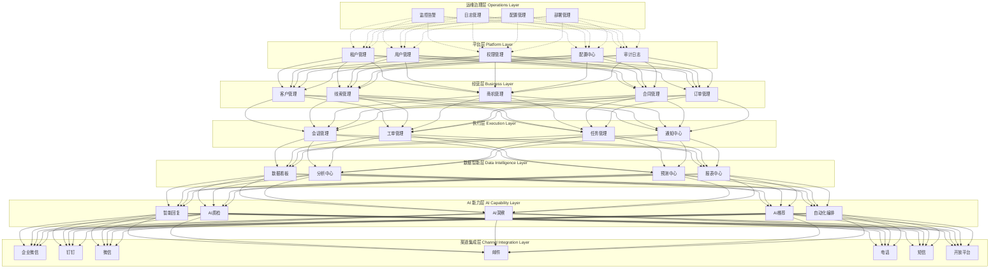

# MOY 终局版系统信息架构与模块树

---

## 文档元信息

| 属性     | 内容                                                                    |
| -------- | ----------------------------------------------------------------------- |
| 文档名称 | MOY 终局版系统信息架构与模块树                                          |
| 文档编号 | MOY_FINAL_005                                                           |
| 版本号   | v1.0                                                                    |
| 状态     | 已确认                                                                  |
| 作者     | MOY 文档架构组                                                          |
| 日期     | 2026-04-05                                                              |
| 目标读者 | 产品负责人、技术负责人、架构师、前后端开发、测试工程师                  |
| 输入来源 | [01_产品愿景](./01_终局版产品愿景与阶段演进地图.md)、[02_业务域地图](./02_终局版业务域地图与能力版图.md)、[04_端到端业务链路](./04_终局版端到端业务链路蓝图.md) |

---

## 一、文档目的

本文档作为 MOY 终局版的**系统信息架构与模块树基线**，用于：

1. 定义终局版系统的七层架构与层级边界
2. 定义每层的模块清单与模块职责
3. 定义模块间的依赖关系与协作边界
4. 定义完整的菜单树与页面树
5. 为技术架构设计、数据库设计、API 设计提供输入
6. 明确与 P0/P1 首期基线的差异与演进路径

**阅读建议：**

- 产品负责人：重点阅读架构分层、模块清单、菜单树、页面树
- 技术负责人：重点阅读架构分层、模块树、依赖关系
- 前端开发：重点阅读菜单树、页面树、模块边界
- 后端开发：重点阅读模块树、依赖关系、模块职责
- 测试工程师：重点阅读模块边界、功能覆盖

---

## 二、适用范围

| 维度     | 范围说明                                       |
| -------- | ---------------------------------------------- |
| 产品范围 | MOY 终局版全量业务                             |
| 终端范围 | Web 端、移动端 APP、小程序、桌面端             |
| 部署范围 | 云端 SaaS 部署、私有化部署                     |
| 用户范围 | 销售型公司、客服团队、客户成功团队、管理层     |

---

## 三、术语定义

### 3.1 架构术语

| 术语       | 英文                   | 定义                                           |
| ---------- | ---------------------- | ---------------------------------------------- |
| 七层架构   | Seven-Layer Architecture | 终局版系统的分层架构模型，从平台层到运维治理层 |
| 平台层     | Platform Layer         | 提供租户、用户、权限、配置等基础能力           |
| 经营层     | Business Layer         | 提供客户、线索、商机、合同、订单等经营能力     |
| 执行层     | Execution Layer        | 提供会话、工单、任务、通知等执行能力           |
| 数据智能层 | Data Intelligence Layer | 提供数据分析、预测、报表等智能能力             |
| AI 能力层  | AI Capability Layer    | 提供 AI 辅助、自动化编排等 AI 能力             |
| 渠道集成层 | Channel Integration Layer | 提供多渠道接入、第三方集成等渠道能力           |
| 运维治理层 | Operations Layer       | 提供监控、日志、配置、部署等运维能力           |

### 3.2 模块术语

| 术语     | 英文            | 定义                                       |
| -------- | --------------- | ------------------------------------------ |
| 模块     | Module          | 系统功能的最小独立单元，具有明确的职责边界 |
| 模块树   | Module Tree     | 模块的层级结构，定义模块间的父子关系       |
| 依赖关系 | Dependency      | 模块间的调用或数据关联关系                 |
| 菜单树   | Menu Tree       | 系统导航菜单的层级结构                     |
| 页面树   | Page Tree       | 系统所有页面的层级结构                     |

### 3.3 业务术语

| 术语     | 英文        | 定义                                       |
| -------- | ----------- | ------------------------------------------ |
| 租户     | Tenant      | SaaS 模式下的企业客户，数据完全隔离        |
| 组织     | Organization | 租户内部的组织架构单元                     |
| 角色     | Role        | 用户权限的集合，定义用户的操作范围         |
| 数据权限 | Data Scope  | 用户可访问的数据范围，如全部/部门/个人     |

---

## 四、七层架构定义

### 4.1 架构总览



### 4.2 各层职责与边界

#### 4.2.1 平台层（Platform Layer）

| 维度     | 说明                                                   |
| -------- | ------------------------------------------------------ |
| **定位** | 系统基础能力层，为所有业务层提供基础支撑               |
| **职责** | 租户管理、用户管理、权限管理、配置管理、审计日志       |
| **边界** | 不包含业务逻辑，仅提供基础能力                         |
| **依赖** | 无上游依赖，被所有下游层依赖                           |

#### 4.2.2 经营层（Business Layer）

| 维度     | 说明                                                   |
| -------- | ------------------------------------------------------ |
| **定位** | 核心业务经营层，管理客户全生命周期经营                 |
| **职责** | 客户管理、线索管理、商机管理、合同管理、订单管理       |
| **边界** | 不包含执行动作，仅管理经营对象与状态                   |
| **依赖** | 依赖平台层（用户、权限、配置）                         |

#### 4.2.3 执行层（Execution Layer）

| 维度     | 说明                                                   |
| -------- | ------------------------------------------------------ |
| **定位** | 业务执行层，处理客户触点交互与服务交付                 |
| **职责** | 会话管理、工单管理、任务管理、通知中心                 |
| **边界** | 不包含经营决策，仅执行业务动作                         |
| **依赖** | 依赖平台层、经营层（客户、商机）                       |

#### 4.2.4 数据智能层（Data Intelligence Layer）

| 维度     | 说明                                                   |
| -------- | ------------------------------------------------------ |
| **定位** | 数据价值层，提供数据分析、预测、报表能力               |
| **职责** | 数据看板、分析中心、预测中心、报表中心                 |
| **边界** | 不直接操作业务数据，仅读取与聚合分析                   |
| **依赖** | 依赖平台层、经营层、执行层（数据源）                   |

#### 4.2.5 AI 能力层（AI Capability Layer）

| 维度     | 说明                                                   |
| -------- | ------------------------------------------------------ |
| **定位** | AI 赋能层，提供 AI 辅助与自动化能力                    |
| **职责** | 智能回复、AI质检、AI洞察、AI推荐、自动化编排           |
| **边界** | AI 输出需人工确认，不直接执行高风险业务动作             |
| **依赖** | 依赖平台层、经营层、执行层、数据智能层                 |

#### 4.2.6 渠道集成层（Channel Integration Layer）

| 维度     | 说明                                                   |
| -------- | ------------------------------------------------------ |
| **定位** | 渠道接入层，提供多渠道统一接入能力                     |
| **职责** | 企业微信、钉钉、微信、邮件、电话、短信、开放平台       |
| **边界** | 不包含业务逻辑，仅负责消息路由与格式转换               |
| **依赖** | 依赖平台层、执行层（会话）                             |

#### 4.2.7 运维治理层（Operations Layer）

| 维度     | 说明                                                   |
| -------- | ------------------------------------------------------ |
| **定位** | 运维保障层，提供系统监控、运维管理能力                 |
| **职责** | 监控告警、日志管理、配置管理、部署管理                 |
| **边界** | 不参与业务流程，仅提供运维支撑                         |
| **依赖** | 无上游依赖，横切所有层                                 |

### 4.3 层级依赖矩阵

| 层级         | 平台层 | 经营层 | 执行层 | 数据智能层 | AI能力层 | 渠道集成层 | 运维治理层 |
| ------------ | ------ | ------ | ------ | ---------- | -------- | ---------- | ---------- |
| 平台层       | -      | ✅     | ✅     | ✅         | ✅       | ✅         | ❌         |
| 经营层       | ❌      | -      | ✅     | ✅         | ✅       | ❌         | ❌         |
| 执行层       | ❌      | ✅     | -      | ✅         | ✅       | ✅         | ❌         |
| 数据智能层   | ❌      | ✅     | ✅     | -          | ✅       | ❌         | ❌         |
| AI能力层     | ❌      | ✅     | ✅     | ✅         | -        | ❌         | ❌         |
| 渠道集成层   | ❌      | ❌      | ✅     | ❌          | ❌        | -          | ❌         |
| 运维治理层   | ✅     | ✅     | ✅     | ✅         | ✅       | ✅         | -          |

**说明：** ✅ 表示依赖，❌ 表示不依赖

---

## 五、模块清单

### 5.1 平台层模块

| 模块编号 | 模块名称   | 模块职责                                     | 优先级 | 阶段   |
| -------- | ---------- | -------------------------------------------- | ------ | ------ |
| PLT-001  | 租户管理   | 租户注册、租户配置、租户状态管理             | P0     | 首期   |
| PLT-002  | 用户管理   | 用户注册、用户信息、用户状态管理             | P0     | 首期   |
| PLT-003  | 权限管理   | 角色管理、权限配置、数据权限                 | P0     | 首期   |
| PLT-004  | 配置中心   | 系统配置、业务配置、租户配置                 | P0     | 首期   |
| PLT-005  | 审计日志   | 操作日志、审计日志、数据变更记录             | P0     | 首期   |
| PLT-006  | 组织架构   | 部门管理、岗位管理、人员编制                 | P1     | 二期   |
| PLT-007  | 认证中心   | 单点登录、多因素认证、第三方登录             | P1     | 二期   |
| PLT-008  | 安全中心   | 安全策略、风险控制、安全审计                 | P2     | 三期   |

### 5.2 经营层模块

| 模块编号 | 模块名称   | 模块职责                                     | 优先级 | 阶段   |
| -------- | ---------- | -------------------------------------------- | ------ | ------ |
| BIZ-001  | 客户管理   | 客户档案、客户画像、客户分组、客户标签       | P0     | 首期   |
| BIZ-002  | 线索管理   | 线索录入、线索分配、线索跟进、线索转化       | P0     | 首期   |
| BIZ-003  | 商机管理   | 商机创建、阶段管理、跟进记录、商机预测       | P0     | 首期   |
| BIZ-004  | 合同管理   | 合同创建、合同审批、合同归档、合同提醒       | P1     | 二期   |
| BIZ-005  | 订单管理   | 订单创建、订单审批、订单执行、订单跟踪       | P1     | 二期   |
| BIZ-006  | 产品管理   | 产品目录、产品定价、产品库存                 | P1     | 二期   |
| BIZ-007  | 报价管理   | 报价单创建、报价审批、报价跟踪               | P1     | 二期   |
| BIZ-008  | 回款管理   | 回款登记、回款核销、回款提醒                 | P2     | 三期   |
| BIZ-009  | 发票管理   | 发票开具、发票管理、发票查询                 | P2     | 三期   |
| BIZ-010  | 客户成功   | 客户健康度、续费提醒、增购推荐、流失预警     | P2     | 三期   |

### 5.3 执行层模块

| 模块编号 | 模块名称   | 模块职责                                     | 优先级 | 阶段   |
| -------- | ---------- | -------------------------------------------- | ------ | ------ |
| EXE-001  | 会话管理   | 多渠道接入、消息收发、会话分配、会话转接     | P0     | 首期   |
| EXE-002  | 工单管理   | 工单创建、工单分配、工单流转、工单关闭       | P0     | 首期   |
| EXE-003  | 任务管理   | 任务创建、任务分配、任务跟踪、任务完成       | P1     | 二期   |
| EXE-004  | 通知中心   | 站内消息、消息推送、消息订阅                 | P1     | 二期   |
| EXE-005  | 日程管理   | 日程创建、日程提醒、日程共享                 | P2     | 三期   |
| EXE-006  | 审批中心   | 审批流程、审批记录、审批统计                 | P2     | 三期   |

### 5.4 数据智能层模块

| 模块编号 | 模块名称   | 模块职责                                     | 优先级 | 阶段   |
| -------- | ---------- | -------------------------------------------- | ------ | ------ |
| DAT-001  | 数据看板   | 核心指标展示、趋势图表、实时监控             | P1     | 首期   |
| DAT-002  | 分析中心   | 多维分析、漏斗分析、归因分析                 | P1     | 二期   |
| DAT-003  | 预测中心   | 销售预测、流失预测、需求预测                 | P2     | 三期   |
| DAT-004  | 报表中心   | 自定义报表、报表订阅、报表导出               | P2     | 三期   |
| DAT-005  | 数据治理   | 数据质量、数据标准、数据资产                 | P2     | 三期   |

### 5.5 AI 能力层模块

| 模块编号 | 模块名称   | 模块职责                                     | 优先级 | 阶段   |
| -------- | ---------- | -------------------------------------------- | ------ | ------ |
| AI-001   | 智能回复   | 基于知识库推荐回复内容                       | P0     | 首期   |
| AI-002   | AI质检     | 会话质量检测、合规性检查                     | P1     | 二期   |
| AI-003   | AI洞察     | 客户意图识别、情感分析、话题提取             | P1     | 二期   |
| AI-004   | AI推荐     | 客户推荐、产品推荐、话术推荐                 | P1     | 二期   |
| AI-005   | 自动化编排 | 工作流自动化、智能路由、智能分配             | P2     | 三期   |
| AI-006   | 知识问答   | 基于知识库的智能问答                         | P1     | 首期   |
| AI-007   | 智能助手   | 个人助理、智能提醒、智能建议                 | P2     | 三期   |

### 5.6 渠道集成层模块

| 模块编号 | 模块名称   | 模块职责                                     | 优先级 | 阶段   |
| -------- | ---------- | -------------------------------------------- | ------ | ------ |
| CHN-001  | 企业微信   | 企微消息接入、企微客户同步、企微应用集成     | P0     | 首期   |
| CHN-002  | 钉钉       | 钉钉消息接入、钉钉客户同步、钉钉应用集成     | P1     | 二期   |
| CHN-003  | 微信       | 微信公众号、微信小程序、微信客服             | P1     | 二期   |
| CHN-004  | 邮件       | 邮件收发、邮件模板、邮件跟踪                 | P1     | 二期   |
| CHN-005  | 电话       | 电话接入、通话录音、电话弹屏                 | P1     | 二期   |
| CHN-006  | 短信       | 短信发送、短信模板、短信记录                 | P0     | 首期   |
| CHN-007  | 开放平台   | 开放API、Webhook、第三方集成                 | P2     | 三期   |
| CHN-008  | 视频会议   | 视频接入、屏幕共享、会议记录                 | P3     | 远期   |

### 5.7 运维治理层模块

| 模块编号 | 模块名称   | 模块职责                                     | 优先级 | 阶段   |
| -------- | ---------- | -------------------------------------------- | ------ | ------ |
| OPS-001  | 监控告警   | 系统监控、业务监控、告警通知                 | P0     | 首期   |
| OPS-002  | 日志管理   | 日志收集、日志查询、日志分析                 | P0     | 首期   |
| OPS-003  | 配置管理   | 配置版本、配置推送、配置回滚                 | P1     | 二期   |
| OPS-004  | 部署管理   | 部署流水线、灰度发布、回滚管理               | P1     | 二期   |
| OPS-005  | 容量管理   | 容量规划、弹性伸缩、资源优化                 | P2     | 三期   |
| OPS-006  | 安全运维   | 漏洞扫描、安全加固、应急响应                 | P2     | 三期   |

---

## 六、模块树

### 6.1 模块树总览

```
MOY 系统
├── 平台层 (Platform Layer)
│   ├── PLT-001 租户管理
│   │   ├── PLT-001-01 租户注册
│   │   ├── PLT-001-02 租户配置
│   │   └── PLT-001-03 租户状态管理
│   ├── PLT-002 用户管理
│   │   ├── PLT-002-01 用户注册
│   │   ├── PLT-002-02 用户信息
│   │   └── PLT-002-03 用户状态管理
│   ├── PLT-003 权限管理
│   │   ├── PLT-003-01 角色管理
│   │   ├── PLT-003-02 权限配置
│   │   └── PLT-003-03 数据权限
│   ├── PLT-004 配置中心
│   │   ├── PLT-004-01 系统配置
│   │   ├── PLT-004-02 业务配置
│   │   └── PLT-004-03 租户配置
│   ├── PLT-005 审计日志
│   │   ├── PLT-005-01 操作日志
│   │   ├── PLT-005-02 审计日志
│   │   └── PLT-005-03 数据变更记录
│   ├── PLT-006 组织架构 [P1]
│   │   ├── PLT-006-01 部门管理
│   │   ├── PLT-006-02 岗位管理
│   │   └── PLT-006-03 人员编制
│   ├── PLT-007 认证中心 [P1]
│   │   ├── PLT-007-01 单点登录
│   │   ├── PLT-007-02 多因素认证
│   │   └── PLT-007-03 第三方登录
│   └── PLT-008 安全中心 [P2]
│       ├── PLT-008-01 安全策略
│       ├── PLT-008-02 风险控制
│       └── PLT-008-03 安全审计
│
├── 经营层 (Business Layer)
│   ├── BIZ-001 客户管理
│   │   ├── BIZ-001-01 客户档案
│   │   ├── BIZ-001-02 客户画像
│   │   ├── BIZ-001-03 客户分组
│   │   └── BIZ-001-04 客户标签
│   ├── BIZ-002 线索管理
│   │   ├── BIZ-002-01 线索录入
│   │   ├── BIZ-002-02 线索分配
│   │   ├── BIZ-002-03 线索跟进
│   │   └── BIZ-002-04 线索转化
│   ├── BIZ-003 商机管理
│   │   ├── BIZ-003-01 商机创建
│   │   ├── BIZ-003-02 阶段管理
│   │   ├── BIZ-003-03 跟进记录
│   │   └── BIZ-003-04 商机预测
│   ├── BIZ-004 合同管理 [P1]
│   │   ├── BIZ-004-01 合同创建
│   │   ├── BIZ-004-02 合同审批
│   │   ├── BIZ-004-03 合同归档
│   │   └── BIZ-004-04 合同提醒
│   ├── BIZ-005 订单管理 [P1]
│   │   ├── BIZ-005-01 订单创建
│   │   ├── BIZ-005-02 订单审批
│   │   ├── BIZ-005-03 订单执行
│   │   └── BIZ-005-04 订单跟踪
│   ├── BIZ-006 产品管理 [P1]
│   │   ├── BIZ-006-01 产品目录
│   │   ├── BIZ-006-02 产品定价
│   │   └── BIZ-006-03 产品库存
│   ├── BIZ-007 报价管理 [P1]
│   │   ├── BIZ-007-01 报价单创建
│   │   ├── BIZ-007-02 报价审批
│   │   └── BIZ-007-03 报价跟踪
│   ├── BIZ-008 回款管理 [P2]
│   │   ├── BIZ-008-01 回款登记
│   │   ├── BIZ-008-02 回款核销
│   │   └── BIZ-008-03 回款提醒
│   ├── BIZ-009 发票管理 [P2]
│   │   ├── BIZ-009-01 发票开具
│   │   ├── BIZ-009-02 发票管理
│   │   └── BIZ-009-03 发票查询
│   └── BIZ-010 客户成功 [P2]
│       ├── BIZ-010-01 客户健康度
│       ├── BIZ-010-02 续费提醒
│       ├── BIZ-010-03 增购推荐
│       └── BIZ-010-04 流失预警
│
├── 执行层 (Execution Layer)
│   ├── EXE-001 会话管理
│   │   ├── EXE-001-01 多渠道接入
│   │   ├── EXE-001-02 消息收发
│   │   ├── EXE-001-03 会话分配
│   │   └── EXE-001-04 会话转接
│   ├── EXE-002 工单管理
│   │   ├── EXE-002-01 工单创建
│   │   ├── EXE-002-02 工单分配
│   │   ├── EXE-002-03 工单流转
│   │   └── EXE-002-04 工单关闭
│   ├── EXE-003 任务管理 [P1]
│   │   ├── EXE-003-01 任务创建
│   │   ├── EXE-003-02 任务分配
│   │   ├── EXE-003-03 任务跟踪
│   │   └── EXE-003-04 任务完成
│   ├── EXE-004 通知中心 [P1]
│   │   ├── EXE-004-01 站内消息
│   │   ├── EXE-004-02 消息推送
│   │   └── EXE-004-03 消息订阅
│   ├── EXE-005 日程管理 [P2]
│   │   ├── EXE-005-01 日程创建
│   │   ├── EXE-005-02 日程提醒
│   │   └── EXE-005-03 日程共享
│   └── EXE-006 审批中心 [P2]
│       ├── EXE-006-01 审批流程
│       ├── EXE-006-02 审批记录
│       └── EXE-006-03 审批统计
│
├── 数据智能层 (Data Intelligence Layer)
│   ├── DAT-001 数据看板
│   │   ├── DAT-001-01 核心指标展示
│   │   ├── DAT-001-02 趋势图表
│   │   └── DAT-001-03 实时监控
│   ├── DAT-002 分析中心 [P1]
│   │   ├── DAT-002-01 多维分析
│   │   ├── DAT-002-02 漏斗分析
│   │   └── DAT-002-03 归因分析
│   ├── DAT-003 预测中心 [P2]
│   │   ├── DAT-003-01 销售预测
│   │   ├── DAT-003-02 流失预测
│   │   └── DAT-003-03 需求预测
│   ├── DAT-004 报表中心 [P2]
│   │   ├── DAT-004-01 自定义报表
│   │   ├── DAT-004-02 报表订阅
│   │   └── DAT-004-03 报表导出
│   └── DAT-005 数据治理 [P2]
│       ├── DAT-005-01 数据质量
│       ├── DAT-005-02 数据标准
│       └── DAT-005-03 数据资产
│
├── AI 能力层 (AI Capability Layer)
│   ├── AI-001 智能回复
│   │   ├── AI-001-01 意图识别
│   │   ├── AI-001-02 知识召回
│   │   └── AI-001-03 答案生成
│   ├── AI-002 AI质检 [P1]
│   │   ├── AI-002-01 会话质量检测
│   │   └── AI-002-02 合规性检查
│   ├── AI-003 AI洞察 [P1]
│   │   ├── AI-003-01 客户意图识别
│   │   ├── AI-003-02 情感分析
│   │   └── AI-003-03 话题提取
│   ├── AI-004 AI推荐 [P1]
│   │   ├── AI-004-01 客户推荐
│   │   ├── AI-004-02 产品推荐
│   │   └── AI-004-03 话术推荐
│   ├── AI-005 自动化编排 [P2]
│   │   ├── AI-005-01 工作流自动化
│   │   ├── AI-005-02 智能路由
│   │   └── AI-005-03 智能分配
│   ├── AI-006 知识问答
│   │   ├── AI-006-01 问题理解
│   │   ├── AI-006-02 知识检索
│   │   └── AI-006-03 答案生成
│   └── AI-007 智能助手 [P2]
│       ├── AI-007-01 个人助理
│       ├── AI-007-02 智能提醒
│       └── AI-007-03 智能建议
│
├── 渠道集成层 (Channel Integration Layer)
│   ├── CHN-001 企业微信
│   │   ├── CHN-001-01 企微消息接入
│   │   ├── CHN-001-02 企微客户同步
│   │   └── CHN-001-03 企微应用集成
│   ├── CHN-002 钉钉 [P1]
│   │   ├── CHN-002-01 钉钉消息接入
│   │   ├── CHN-002-02 钉钉客户同步
│   │   └── CHN-002-03 钉钉应用集成
│   ├── CHN-003 微信 [P1]
│   │   ├── CHN-003-01 微信公众号
│   │   ├── CHN-003-02 微信小程序
│   │   └── CHN-003-03 微信客服
│   ├── CHN-004 邮件 [P1]
│   │   ├── CHN-004-01 邮件收发
│   │   ├── CHN-004-02 邮件模板
│   │   └── CHN-004-03 邮件跟踪
│   ├── CHN-005 电话 [P1]
│   │   ├── CHN-005-01 电话接入
│   │   ├── CHN-005-02 通话录音
│   │   └── CHN-005-03 电话弹屏
│   ├── CHN-006 短信
│   │   ├── CHN-006-01 短信发送
│   │   ├── CHN-006-02 短信模板
│   │   └── CHN-006-03 短信记录
│   ├── CHN-007 开放平台 [P2]
│   │   ├── CHN-007-01 开放API
│   │   ├── CHN-007-02 Webhook
│   │   └── CHN-007-03 第三方集成
│   └── CHN-008 视频会议 [P3]
│       ├── CHN-008-01 视频接入
│       ├── CHN-008-02 屏幕共享
│       └── CHN-008-03 会议记录
│
└── 运维治理层 (Operations Layer)
    ├── OPS-001 监控告警
    │   ├── OPS-001-01 系统监控
    │   ├── OPS-001-02 业务监控
    │   └── OPS-001-03 告警通知
    ├── OPS-002 日志管理
    │   ├── OPS-002-01 日志收集
    │   ├── OPS-002-02 日志查询
    │   └── OPS-002-03 日志分析
    ├── OPS-003 配置管理 [P1]
    │   ├── OPS-003-01 配置版本
    │   ├── OPS-003-02 配置推送
    │   └── OPS-003-03 配置回滚
    ├── OPS-004 部署管理 [P1]
    │   ├── OPS-004-01 部署流水线
    │   ├── OPS-004-02 灰度发布
    │   └── OPS-004-03 回滚管理
    ├── OPS-005 容量管理 [P2]
    │   ├── OPS-005-01 容量规划
    │   ├── OPS-005-02 弹性伸缩
    │   └── OPS-005-03 资源优化
    └── OPS-006 安全运维 [P2]
        ├── OPS-006-01 漏洞扫描
        ├── OPS-006-02 安全加固
        └── OPS-006-03 应急响应
```

### 6.2 模块依赖关系

#### 6.2.1 平台层模块依赖

| 模块编号 | 模块名称   | 依赖模块                     | 被依赖模块                                   |
| -------- | ---------- | ---------------------------- | -------------------------------------------- |
| PLT-001  | 租户管理   | 无                           | PLT-002, PLT-003, PLT-004, PLT-005           |
| PLT-002  | 用户管理   | PLT-001                      | PLT-003, PLT-005, BIZ-001, BIZ-002, BIZ-003  |
| PLT-003  | 权限管理   | PLT-001, PLT-002             | 全部业务模块                                 |
| PLT-004  | 配置中心   | PLT-001                      | 全部业务模块                                 |
| PLT-005  | 审计日志   | PLT-001, PLT-002             | 全部业务模块                                 |
| PLT-006  | 组织架构   | PLT-001, PLT-002             | PLT-003                                      |
| PLT-007  | 认证中心   | PLT-001, PLT-002             | 全部业务模块                                 |
| PLT-008  | 安全中心   | PLT-001, PLT-002, PLT-005    | PLT-007                                      |

#### 6.2.2 经营层模块依赖

| 模块编号 | 模块名称   | 依赖模块                                     | 被依赖模块                               |
| -------- | ---------- | -------------------------------------------- | ---------------------------------------- |
| BIZ-001  | 客户管理   | PLT-002, PLT-003, PLT-004, PLT-005           | BIZ-002, BIZ-003, EXE-001, EXE-002       |
| BIZ-002  | 线索管理   | PLT-002, PLT-003, BIZ-001                    | BIZ-003                                  |
| BIZ-003  | 商机管理   | PLT-002, PLT-003, BIZ-001, BIZ-002           | BIZ-004, BIZ-005                         |
| BIZ-004  | 合同管理   | PLT-002, PLT-003, BIZ-001, BIZ-003           | BIZ-005, BIZ-008                         |
| BIZ-005  | 订单管理   | PLT-002, PLT-003, BIZ-001, BIZ-003, BIZ-004  | BIZ-008, BIZ-009                         |
| BIZ-006  | 产品管理   | PLT-002, PLT-003                             | BIZ-005, BIZ-007                         |
| BIZ-007  | 报价管理   | PLT-002, PLT-003, BIZ-001, BIZ-006           | BIZ-004                                  |
| BIZ-008  | 回款管理   | PLT-002, PLT-003, BIZ-004, BIZ-005           | BIZ-010                                  |
| BIZ-009  | 发票管理   | PLT-002, PLT-003, BIZ-004, BIZ-005           | 无                                       |
| BIZ-010  | 客户成功   | PLT-002, PLT-003, BIZ-001, BIZ-005, BIZ-008  | 无                                       |

#### 6.2.3 执行层模块依赖

| 模块编号 | 模块名称   | 依赖模块                                     | 被依赖模块           |
| -------- | ---------- | -------------------------------------------- | -------------------- |
| EXE-001  | 会话管理   | PLT-002, PLT-003, BIZ-001, AI-001, CHN-001   | EXE-002, DAT-001     |
| EXE-002  | 工单管理   | PLT-002, PLT-003, BIZ-001, EXE-001           | DAT-001              |
| EXE-003  | 任务管理   | PLT-002, PLT-003, BIZ-001, BIZ-002, BIZ-003  | DAT-001              |
| EXE-004  | 通知中心   | PLT-002, PLT-003                             | 全部业务模块         |
| EXE-005  | 日程管理   | PLT-002, PLT-003, EXE-003                    | 无                   |
| EXE-006  | 审批中心   | PLT-002, PLT-003                             | BIZ-004, BIZ-005     |

#### 6.2.4 数据智能层模块依赖

| 模块编号 | 模块名称   | 依赖模块                                               | 被依赖模块     |
| -------- | ---------- | ------------------------------------------------------ | -------------- |
| DAT-001  | 数据看板   | PLT-002, PLT-003, BIZ-001, BIZ-002, BIZ-003, EXE-001   | DAT-002, AI-003|
| DAT-002  | 分析中心   | PLT-002, PLT-003, DAT-001                              | DAT-003        |
| DAT-003  | 预测中心   | PLT-002, PLT-003, DAT-001, DAT-002, AI-003             | AI-004         |
| DAT-004  | 报表中心   | PLT-002, PLT-003, DAT-001, DAT-002                     | 无             |
| DAT-005  | 数据治理   | PLT-002, PLT-003, DAT-001                              | DAT-001~004    |

#### 6.2.5 AI 能力层模块依赖

| 模块编号 | 模块名称   | 依赖模块                                       | 被依赖模块               |
| -------- | ---------- | ---------------------------------------------- | ------------------------ |
| AI-001   | 智能回复   | PLT-004, EXE-001, AI-006                       | EXE-001                  |
| AI-002   | AI质检     | PLT-004, EXE-001, DAT-001                      | DAT-001                  |
| AI-003   | AI洞察     | PLT-004, EXE-001, DAT-001                      | DAT-003, AI-004          |
| AI-004   | AI推荐     | PLT-004, BIZ-001, DAT-001, AI-003              | BIZ-001, BIZ-002, BIZ-003|
| AI-005   | 自动化编排 | PLT-004, BIZ-001, EXE-001, EXE-002, AI-001     | EXE-001, EXE-002         |
| AI-006   | 知识问答   | PLT-004                                        | AI-001, AI-002           |
| AI-007   | 智能助手   | PLT-004, AI-001, AI-003, AI-004                | 无                       |

#### 6.2.6 渠道集成层模块依赖

| 模块编号 | 模块名称   | 依赖模块                   | 被依赖模块   |
| -------- | ---------- | -------------------------- | ------------ |
| CHN-001  | 企业微信   | PLT-004, EXE-001           | EXE-001      |
| CHN-002  | 钉钉       | PLT-004, EXE-001           | EXE-001      |
| CHN-003  | 微信       | PLT-004, EXE-001           | EXE-001      |
| CHN-004  | 邮件       | PLT-004, EXE-001, EXE-004  | EXE-001      |
| CHN-005  | 电话       | PLT-004, EXE-001           | EXE-001      |
| CHN-006  | 短信       | PLT-004, EXE-004           | EXE-004      |
| CHN-007  | 开放平台   | PLT-004, PLT-003           | 全部业务模块 |
| CHN-008  | 视频会议   | PLT-004, EXE-001           | EXE-001      |

#### 6.2.7 运维治理层模块依赖

| 模块编号 | 模块名称   | 依赖模块       | 被依赖模块   |
| -------- | ---------- | -------------- | ------------ |
| OPS-001  | 监控告警   | 无             | 全部模块     |
| OPS-002  | 日志管理   | 无             | 全部模块     |
| OPS-003  | 配置管理   | OPS-002        | PLT-004      |
| OPS-004  | 部署管理   | OPS-003        | 无           |
| OPS-005  | 容量管理   | OPS-001        | 无           |
| OPS-006  | 安全运维   | OPS-001, OPS-002 | PLT-008    |

---

## 七、菜单树

### 7.1 菜单树总览

```
MOY 系统
├── 工作台
│   ├── 首页
│   ├── 我的待办
│   ├── 我的日程
│   ├── 我的任务
│   └── 消息中心
│
├── 客户中心
│   ├── 客户管理
│   │   ├── 客户列表
│   │   ├── 客户详情
│   │   ├── 客户分组
│   │   └── 客户标签
│   ├── 线索管理
│   │   ├── 线索列表
│   │   ├── 线索详情
│   │   ├── 线索分配
│   │   └── 线索转化
│   ├── 商机管理
│   │   ├── 商机列表
│   │   ├── 商机详情
│   │   ├── 商机阶段
│   │   └── 商机预测
│   ├── 合同管理 [P1]
│   │   ├── 合同列表
│   │   ├── 合同详情
│   │   ├── 合同审批
│   │   └── 合同归档
│   ├── 订单管理 [P1]
│   │   ├── 订单列表
│   │   ├── 订单详情
│   │   └── 订单跟踪
│   └── 客户成功 [P2]
│       ├── 客户健康度
│       ├── 续费提醒
│       └── 流失预警
│
├── 服务中心
│   ├── 会话管理
│   │   ├── 会话列表
│   │   ├── 会话详情
│   │   ├── 会话监控
│   │   └── 会话统计
│   ├── 工单管理
│   │   ├── 工单列表
│   │   ├── 工单详情
│   │   ├── 工单流转
│   │   └── 工单统计
│   └── 知识库
│       ├── 知识列表
│       ├── 知识详情
│       ├── 知识分类
│       └── AI问答
│
├── 数据中心
│   ├── 数据看板
│   │   ├── 销售看板
│   │   ├── 客服看板
│   │   └── 全览看板
│   ├── 分析中心 [P1]
│   │   ├── 销售分析
│   │   ├── 客服分析
│   │   └── 客户分析
│   ├── 预测中心 [P2]
│   │   ├── 销售预测
│   │   ├── 流失预测
│   │   └── 需求预测
│   └── 报表中心 [P2]
│       ├── 报表列表
│       ├── 报表设计
│       └── 报表订阅
│
├── AI 助手
│   ├── 智能回复
│   ├── AI质检 [P1]
│   ├── AI洞察 [P1]
│   ├── AI推荐 [P1]
│   └── 自动化编排 [P2]
│
├── 渠道管理
│   ├── 企业微信
│   │   ├── 渠道配置
│   │   ├── 客户同步
│   │   └── 应用管理
│   ├── 钉钉 [P1]
│   │   ├── 渠道配置
│   │   └── 客户同步
│   ├── 微信 [P1]
│   │   ├── 公众号配置
│   │   ├── 小程序配置
│   │   └── 微信客服
│   ├── 邮件 [P1]
│   │   ├── 邮箱配置
│   │   └── 邮件模板
│   ├── 电话 [P1]
│   │   ├── 电话配置
│   │   └── 通话记录
│   ├── 短信
│   │   ├── 短信配置
│   │   ├── 短信模板
│   │   └── 发送记录
│   └── 开放平台 [P2]
│       ├── API管理
│       ├── Webhook
│       └── 第三方集成
│
├── 产品中心 [P1]
│   ├── 产品管理
│   │   ├── 产品列表
│   │   ├── 产品详情
│   │   └── 产品定价
│   └── 报价管理
│       ├── 报价列表
│       ├── 报价详情
│       └── 报价审批
│
├── 财务中心 [P2]
│   ├── 回款管理
│   │   ├── 回款列表
│   │   ├── 回款核销
│   │   └── 回款统计
│   └── 发票管理
│       ├── 发票列表
│       └── 发票开具
│
└── 系统设置
    ├── 组织管理
    │   ├── 部门管理
    │   ├── 岗位管理
    │   └── 人员管理
    ├── 权限管理
    │   ├── 角色管理
    │   ├── 权限配置
    │   └── 数据权限
    ├── 配置中心
    │   ├── 系统配置
    │   ├── 业务配置
    │   └── 租户配置
    ├── 审计日志
    │   ├── 操作日志
    │   ├── 审计日志
    │   └── 数据变更
    └── 运维管理
        ├── 系统监控
        ├── 日志管理
        └── 部署管理
```

### 7.2 菜单权限矩阵

| 菜单         | 管理员 | 销售经理 | 销售人员 | 客服经理 | 客服专员 | 财务人员 |
| ------------ | ------ | -------- | -------- | -------- | -------- | -------- |
| 工作台       | ✅     | ✅       | ✅       | ✅       | ✅       | ✅       |
| 客户中心     | ✅     | ✅       | ✅       | ❌       | ❌       | ✅       |
| 服务中心     | ✅     | ❌       | ❌       | ✅       | ✅       | ❌       |
| 数据中心     | ✅     | ✅       | ✅       | ✅       | ✅       | ✅       |
| AI 助手      | ✅     | ✅       | ✅       | ✅       | ✅       | ❌       |
| 渠道管理     | ✅     | ❌       | ❌       | ✅       | ❌       | ❌       |
| 产品中心     | ✅     | ✅       | ❌       | ❌       | ❌       | ❌       |
| 财务中心     | ✅     | ❌       | ❌       | ❌       | ❌       | ✅       |
| 系统设置     | ✅     | ❌       | ❌       | ❌       | ❌       | ❌       |

---

## 八、页面树

### 8.1 平台层页面

| 页面编号   | 页面名称         | 所属模块   | 页面类型 | 优先级 | 阶段   |
| ---------- | ---------------- | ---------- | -------- | ------ | ------ |
| PLT-P001   | 租户注册页       | 租户管理   | 表单页   | P0     | 首期   |
| PLT-P002   | 租户配置页       | 租户管理   | 配置页   | P0     | 首期   |
| PLT-P003   | 租户列表页       | 租户管理   | 列表页   | P0     | 首期   |
| PLT-P004   | 用户登录页       | 用户管理   | 表单页   | P0     | 首期   |
| PLT-P005   | 用户列表页       | 用户管理   | 列表页   | P0     | 首期   |
| PLT-P006   | 用户详情页       | 用户管理   | 详情页   | P0     | 首期   |
| PLT-P007   | 用户创建页       | 用户管理   | 表单页   | P0     | 首期   |
| PLT-P008   | 角色列表页       | 权限管理   | 列表页   | P0     | 首期   |
| PLT-P009   | 角色详情页       | 权限管理   | 详情页   | P0     | 首期   |
| PLT-P010   | 权限配置页       | 权限管理   | 配置页   | P0     | 首期   |
| PLT-P011   | 数据权限配置页   | 权限管理   | 配置页   | P0     | 首期   |
| PLT-P012   | 系统配置页       | 配置中心   | 配置页   | P0     | 首期   |
| PLT-P013   | 业务配置页       | 配置中心   | 配置页   | P0     | 首期   |
| PLT-P014   | 租户配置页       | 配置中心   | 配置页   | P0     | 首期   |
| PLT-P015   | 操作日志页       | 审计日志   | 列表页   | P0     | 首期   |
| PLT-P016   | 审计日志页       | 审计日志   | 列表页   | P0     | 首期   |
| PLT-P017   | 数据变更记录页   | 审计日志   | 列表页   | P0     | 首期   |
| PLT-P018   | 部门管理页       | 组织架构   | 列表页   | P1     | 二期   |
| PLT-P019   | 岗位管理页       | 组织架构   | 列表页   | P1     | 二期   |
| PLT-P020   | 单点登录配置页   | 认证中心   | 配置页   | P1     | 二期   |
| PLT-P021   | 安全策略配置页   | 安全中心   | 配置页   | P2     | 三期   |

### 8.2 经营层页面

| 页面编号   | 页面名称         | 所属模块   | 页面类型 | 优先级 | 阶段   |
| ---------- | ---------------- | ---------- | -------- | ------ | ------ |
| BIZ-P001   | 客户列表页       | 客户管理   | 列表页   | P0     | 首期   |
| BIZ-P002   | 客户详情页       | 客户管理   | 详情页   | P0     | 首期   |
| BIZ-P003   | 客户创建页       | 客户管理   | 表单页   | P0     | 首期   |
| BIZ-P004   | 客户编辑页       | 客户管理   | 表单页   | P0     | 首期   |
| BIZ-P005   | 客户分组页       | 客户管理   | 列表页   | P0     | 首期   |
| BIZ-P006   | 客户标签页       | 客户管理   | 列表页   | P0     | 首期   |
| BIZ-P007   | 客户画像页       | 客户管理   | 详情页   | P1     | 二期   |
| BIZ-P008   | 线索列表页       | 线索管理   | 列表页   | P0     | 首期   |
| BIZ-P009   | 线索详情页       | 线索管理   | 详情页   | P0     | 首期   |
| BIZ-P010   | 线索创建页       | 线索管理   | 表单页   | P0     | 首期   |
| BIZ-P011   | 线索导入页       | 线索管理   | 表单页   | P0     | 首期   |
| BIZ-P012   | 线索分配页       | 线索管理   | 表单页   | P0     | 首期   |
| BIZ-P013   | 线索转化页       | 线索管理   | 表单页   | P0     | 首期   |
| BIZ-P014   | 商机列表页       | 商机管理   | 列表页   | P0     | 首期   |
| BIZ-P015   | 商机详情页       | 商机管理   | 详情页   | P0     | 首期   |
| BIZ-P016   | 商机创建页       | 商机管理   | 表单页   | P0     | 首期   |
| BIZ-P017   | 商机阶段页       | 商机管理   | 看板页   | P0     | 首期   |
| BIZ-P018   | 商机预测页       | 商机管理   | 分析页   | P1     | 二期   |
| BIZ-P019   | 合同列表页       | 合同管理   | 列表页   | P1     | 二期   |
| BIZ-P020   | 合同详情页       | 合同管理   | 详情页   | P1     | 二期   |
| BIZ-P021   | 合同创建页       | 合同管理   | 表单页   | P1     | 二期   |
| BIZ-P022   | 合同审批页       | 合同管理   | 审批页   | P1     | 二期   |
| BIZ-P023   | 订单列表页       | 订单管理   | 列表页   | P1     | 二期   |
| BIZ-P024   | 订单详情页       | 订单管理   | 详情页   | P1     | 二期   |
| BIZ-P025   | 订单创建页       | 订单管理   | 表单页   | P1     | 二期   |
| BIZ-P026   | 产品列表页       | 产品管理   | 列表页   | P1     | 二期   |
| BIZ-P027   | 产品详情页       | 产品管理   | 详情页   | P1     | 二期   |
| BIZ-P028   | 报价列表页       | 报价管理   | 列表页   | P1     | 二期   |
| BIZ-P029   | 报价创建页       | 报价管理   | 表单页   | P1     | 二期   |
| BIZ-P030   | 回款列表页       | 回款管理   | 列表页   | P2     | 三期   |
| BIZ-P031   | 发票列表页       | 发票管理   | 列表页   | P2     | 三期   |
| BIZ-P032   | 客户健康度页     | 客户成功   | 分析页   | P2     | 三期   |
| BIZ-P033   | 续费提醒页       | 客户成功   | 列表页   | P2     | 三期   |
| BIZ-P034   | 流失预警页       | 客户成功   | 列表页   | P2     | 三期   |

### 8.3 执行层页面

| 页面编号   | 页面名称         | 所属模块   | 页面类型 | 优先级 | 阶段   |
| ---------- | ---------------- | ---------- | -------- | ------ | ------ |
| EXE-P001   | 会话列表页       | 会话管理   | 列表页   | P0     | 首期   |
| EXE-P002   | 会话详情页       | 会话管理   | 详情页   | P0     | 首期   |
| EXE-P003   | 会话监控页       | 会话管理   | 监控页   | P1     | 二期   |
| EXE-P004   | 会话统计页       | 会话管理   | 分析页   | P1     | 二期   |
| EXE-P005   | 工单列表页       | 工单管理   | 列表页   | P0     | 首期   |
| EXE-P006   | 工单详情页       | 工单管理   | 详情页   | P0     | 首期   |
| EXE-P007   | 工单创建页       | 工单管理   | 表单页   | P0     | 首期   |
| EXE-P008   | 工单流转页       | 工单管理   | 流程页   | P0     | 首期   |
| EXE-P009   | 工单统计页       | 工单管理   | 分析页   | P1     | 二期   |
| EXE-P010   | 任务列表页       | 任务管理   | 列表页   | P1     | 二期   |
| EXE-P011   | 任务详情页       | 任务管理   | 详情页   | P1     | 二期   |
| EXE-P012   | 任务创建页       | 任务管理   | 表单页   | P1     | 二期   |
| EXE-P013   | 通知中心页       | 通知中心   | 列表页   | P1     | 二期   |
| EXE-P014   | 日程管理页       | 日程管理   | 日历页   | P2     | 三期   |
| EXE-P015   | 审批中心页       | 审批中心   | 列表页   | P2     | 三期   |
| EXE-P016   | 知识库列表页     | 知识库     | 列表页   | P1     | 首期   |
| EXE-P017   | 知识库详情页     | 知识库     | 详情页   | P1     | 首期   |
| EXE-P018   | 知识库创建页     | 知识库     | 表单页   | P1     | 首期   |
| EXE-P019   | AI问答页         | 知识库     | 交互页   | P1     | 首期   |

### 8.4 数据智能层页面

| 页面编号   | 页面名称         | 所属模块   | 页面类型 | 优先级 | 阶段   |
| ---------- | ---------------- | ---------- | -------- | ------ | ------ |
| DAT-P001   | 销售看板页       | 数据看板   | 看板页   | P1     | 首期   |
| DAT-P002   | 客服看板页       | 数据看板   | 看板页   | P1     | 首期   |
| DAT-P003   | 全览看板页       | 数据看板   | 看板页   | P1     | 首期   |
| DAT-P004   | 销售分析页       | 分析中心   | 分析页   | P1     | 二期   |
| DAT-P005   | 客服分析页       | 分析中心   | 分析页   | P1     | 二期   |
| DAT-P006   | 客户分析页       | 分析中心   | 分析页   | P1     | 二期   |
| DAT-P007   | 漏斗分析页       | 分析中心   | 分析页   | P1     | 二期   |
| DAT-P008   | 销售预测页       | 预测中心   | 分析页   | P2     | 三期   |
| DAT-P009   | 流失预测页       | 预测中心   | 分析页   | P2     | 三期   |
| DAT-P010   | 需求预测页       | 预测中心   | 分析页   | P2     | 三期   |
| DAT-P011   | 报表列表页       | 报表中心   | 列表页   | P2     | 三期   |
| DAT-P012   | 报表设计页       | 报表中心   | 设计页   | P2     | 三期   |
| DAT-P013   | 报表查看页       | 报表中心   | 详情页   | P2     | 三期   |

### 8.5 AI 能力层页面

| 页面编号   | 页面名称         | 所属模块   | 页面类型 | 优先级 | 阶段   |
| ---------- | ---------------- | ---------- | -------- | ------ | ------ |
| AI-P001    | 智能回复配置页   | 智能回复   | 配置页   | P0     | 首期   |
| AI-P002    | AI质检配置页     | AI质检     | 配置页   | P1     | 二期   |
| AI-P003    | AI质检结果页     | AI质检     | 列表页   | P1     | 二期   |
| AI-P004    | AI洞察页         | AI洞察     | 分析页   | P1     | 二期   |
| AI-P005    | AI推荐配置页     | AI推荐     | 配置页   | P1     | 二期   |
| AI-P006    | 自动化编排页     | 自动化编排 | 设计页   | P2     | 三期   |
| AI-P007    | 智能助手页       | 智能助手   | 交互页   | P2     | 三期   |

### 8.6 渠道集成层页面

| 页面编号   | 页面名称         | 所属模块   | 页面类型 | 优先级 | 阶段   |
| ---------- | ---------------- | ---------- | -------- | ------ | ------ |
| CHN-P001   | 企微配置页       | 企业微信   | 配置页   | P0     | 首期   |
| CHN-P002   | 企微客户同步页   | 企业微信   | 列表页   | P0     | 首期   |
| CHN-P003   | 钉钉配置页       | 钉钉       | 配置页   | P1     | 二期   |
| CHN-P004   | 微信公众号配置页 | 微信       | 配置页   | P1     | 二期   |
| CHN-P005   | 微信小程序配置页 | 微信       | 配置页   | P1     | 二期   |
| CHN-P006   | 邮件配置页       | 邮件       | 配置页   | P1     | 二期   |
| CHN-P007   | 邮件模板页       | 邮件       | 列表页   | P1     | 二期   |
| CHN-P008   | 电话配置页       | 电话       | 配置页   | P1     | 二期   |
| CHN-P009   | 通话记录页       | 电话       | 列表页   | P1     | 二期   |
| CHN-P010   | 短信配置页       | 短信       | 配置页   | P0     | 首期   |
| CHN-P011   | 短信模板页       | 短信       | 列表页   | P0     | 首期   |
| CHN-P012   | 短信发送记录页   | 短信       | 列表页   | P0     | 首期   |
| CHN-P013   | 开放API管理页    | 开放平台   | 列表页   | P2     | 三期   |
| CHN-P014   | Webhook配置页    | 开放平台   | 配置页   | P2     | 三期   |
| CHN-P015   | 视频会议配置页   | 视频会议   | 配置页   | P3     | 远期   |

### 8.7 运维治理层页面

| 页面编号   | 页面名称         | 所属模块   | 页面类型 | 优先级 | 阶段   |
| ---------- | ---------------- | ---------- | -------- | ------ | ------ |
| OPS-P001   | 系统监控页       | 监控告警   | 监控页   | P0     | 首期   |
| OPS-P002   | 业务监控页       | 监控告警   | 监控页   | P0     | 首期   |
| OPS-P003   | 告警配置页       | 监控告警   | 配置页   | P0     | 首期   |
| OPS-P004   | 日志查询页       | 日志管理   | 列表页   | P0     | 首期   |
| OPS-P005   | 日志分析页       | 日志管理   | 分析页   | P1     | 二期   |
| OPS-P006   | 配置版本页       | 配置管理   | 列表页   | P1     | 二期   |
| OPS-P007   | 部署流水线页     | 部署管理   | 流程页   | P1     | 二期   |
| OPS-P008   | 灰度发布页       | 部署管理   | 配置页   | P1     | 二期   |
| OPS-P009   | 容量监控页       | 容量管理   | 监控页   | P2     | 三期   |
| OPS-P010   | 安全审计页       | 安全运维   | 列表页   | P2     | 三期   |

### 8.8 页面统计

| 层级         | P0 页面数 | P1 页面数 | P2 页面数 | P3 页面数 | 合计 |
| ------------ | --------- | --------- | --------- | --------- | ---- |
| 平台层       | 17        | 3         | 1         | 0         | 21   |
| 经营层       | 18        | 11        | 5         | 0         | 34   |
| 执行层       | 9         | 8         | 2         | 0         | 19   |
| 数据智能层   | 3         | 5         | 5         | 0         | 13   |
| AI 能力层    | 1         | 4         | 2         | 0         | 7    |
| 渠道集成层   | 4         | 8         | 2         | 1         | 15   |
| 运维治理层   | 3         | 5         | 2         | 0         | 10   |
| **合计**     | **55**    | **44**    | **19**    | **1**     | **119** |

---

## 九、对 P0/P1 的影响

### 9.1 架构演进对比

| 维度         | P0 首期基线                     | FINAL 终局基线                   | 演进路径                     |
| ------------ | ------------------------------- | -------------------------------- | ---------------------------- |
| 架构分层     | 5 层（展示、应用、AI、数据、基础）| 7 层（平台、经营、执行、数据智能、AI、渠道、运维）| 扩展为 7 层架构              |
| 模块数量     | 9 个核心模块                    | 43 个模块                        | 按阶段增量扩展               |
| 页面数量     | 约 40 个页面                    | 119 个页面                       | 按阶段增量开发               |
| 渠道支持     | Web 端                          | Web、移动端、小程序、桌面端      | 多端渐进支持                 |
| 部署模式     | 云端 SaaS                       | 云端 SaaS + 私有化部署           | 二期支持私有化               |

### 9.2 模块演进路径

#### 9.2.1 首期（P0）模块

| 模块编号 | 模块名称   | FINAL 状态 | 说明                           |
| -------- | ---------- | ---------- | ------------------------------ |
| MOD-001  | 客户管理   | BIZ-001    | 保持一致，扩展客户画像         |
| MOD-002  | 线索管理   | BIZ-002    | 保持一致，扩展自动分配规则     |
| MOD-003  | 会话管理   | EXE-001    | 保持一致，扩展多渠道接入       |
| MOD-004  | 商机管理   | BIZ-003    | 保持一致，扩展商机预测         |
| MOD-005  | 工单管理   | EXE-002    | 保持一致，扩展 SLA 管理        |
| MOD-006  | 知识库     | AI-006     | 调整至 AI 能力层               |
| MOD-007  | 用户与权限 | PLT-002/003| 保持一致，扩展组织架构         |
| MOD-008  | 日志与审计 | PLT-005    | 保持一致，扩展审计维度         |
| MOD-009  | 数据看板   | DAT-001    | 保持一致，扩展分析能力         |

#### 9.2.2 二期（P1）新增模块

| 模块编号 | 模块名称   | 所属层级   | 说明                           |
| -------- | ---------- | ---------- | ------------------------------ |
| PLT-006  | 组织架构   | 平台层     | 部门、岗位、人员编制管理       |
| PLT-007  | 认证中心   | 平台层     | 单点登录、多因素认证           |
| BIZ-004  | 合同管理   | 经营层     | 合同创建、审批、归档           |
| BIZ-005  | 订单管理   | 经营层     | 订单创建、审批、执行           |
| BIZ-006  | 产品管理   | 经营层     | 产品目录、定价、库存           |
| BIZ-007  | 报价管理   | 经营层     | 报价单创建、审批、跟踪         |
| EXE-003  | 任务管理   | 执行层     | 任务创建、分配、跟踪           |
| EXE-004  | 通知中心   | 执行层     | 站内消息、推送、订阅           |
| DAT-002  | 分析中心   | 数据智能层 | 多维分析、漏斗分析             |
| AI-002   | AI质检     | AI 能力层  | 会话质量检测、合规检查         |
| AI-003   | AI洞察     | AI 能力层  | 意图识别、情感分析             |
| AI-004   | AI推荐     | AI 能力层  | 客户推荐、产品推荐             |
| CHN-002  | 钉钉       | 渠道集成层 | 钉钉消息接入、客户同步         |
| CHN-003  | 微信       | 渠道集成层 | 公众号、小程序接入             |
| CHN-004  | 邮件       | 渠道集成层 | 邮件收发、模板管理             |
| CHN-005  | 电话       | 渠道集成层 | 电话接入、通话录音             |
| OPS-003  | 配置管理   | 运维治理层 | 配置版本、推送、回滚           |
| OPS-004  | 部署管理   | 运维治理层 | 部署流水线、灰度发布           |

#### 9.2.3 三期（P2）新增模块

| 模块编号 | 模块名称   | 所属层级   | 说明                           |
| -------- | ---------- | ---------- | ------------------------------ |
| PLT-008  | 安全中心   | 平台层     | 安全策略、风险控制             |
| BIZ-008  | 回款管理   | 经营层     | 回款登记、核销、提醒           |
| BIZ-009  | 发票管理   | 经营层     | 发票开具、管理、查询           |
| BIZ-010  | 客户成功   | 经营层     | 健康度、续费、流失预警         |
| EXE-005  | 日程管理   | 执行层     | 日程创建、提醒、共享           |
| EXE-006  | 审批中心   | 执行层     | 审批流程、记录、统计           |
| DAT-003  | 预测中心   | 数据智能层 | 销售预测、流失预测             |
| DAT-004  | 报表中心   | 数据智能层 | 自定义报表、订阅、导出         |
| DAT-005  | 数据治理   | 数据智能层 | 数据质量、标准、资产           |
| AI-005   | 自动化编排 | AI 能力层  | 工作流自动化、智能路由         |
| AI-007   | 智能助手   | AI 能力层  | 个人助理、智能建议             |
| CHN-007  | 开放平台   | 渠道集成层 | 开放 API、Webhook              |
| OPS-005  | 容量管理   | 运维治理层 | 容量规划、弹性伸缩             |
| OPS-006  | 安全运维   | 运维治理层 | 漏洞扫描、安全加固             |

### 9.3 数据模型演进

| 数据域     | P0 实体数 | FINAL 实体数 | 新增实体                                   |
| ---------- | --------- | ------------ | ------------------------------------------ |
| 平台域     | 5         | 12           | 部门、岗位、认证配置、安全策略等           |
| 客户域     | 3         | 8            | 合同、订单、产品、报价、回款、发票等       |
| 服务域     | 4         | 7            | 任务、通知、日程、审批等                   |
| 数据域     | 2         | 6            | 分析模型、预测模型、报表模板等             |
| AI 域      | 2         | 8            | 质检规则、洞察记录、推荐配置、编排流程等   |
| 渠道域     | 1         | 8            | 渠道配置、消息记录、通话记录等             |
| 运维域     | 2         | 6            | 监控配置、告警规则、部署记录等             |

### 9.4 接口演进

| 接口类型   | P0 接口数 | FINAL 接口数 | 演进说明                     |
| ---------- | --------- | ------------ | ---------------------------- |
| REST API   | 约 80     | 约 300       | 按模块增量扩展               |
| WebSocket  | 2         | 8            | 扩展多渠道实时通信           |
| Webhook    | 0         | 15           | 二期新增事件推送             |
| 开放 API   | 0         | 50           | 三期新增第三方集成接口       |

### 9.5 兼容性保障

| 保障项     | 说明                                                   |
| ---------- | ------------------------------------------------------ |
| 向后兼容   | P0 接口保持不变，FINAL 新增接口不影响已有功能          |
| 数据迁移   | P0 数据结构保持不变，FINAL 新增字段采用增量方式        |
| 渐进演进   | 模块按阶段增量开发，不影响已有模块运行                 |
| 版本管理   | API 版本化，支持多版本并行运行                         |

---

## 十、版本与变更记录

| 版本 | 日期       | 作者           | 变更摘要                               | 状态   |
| ---- | ---------- | -------------- | -------------------------------------- | ------ |
| v1.0 | 2026-04-05 | MOY 文档架构组 | 初稿：定义七层架构、模块树、菜单树、页面树 | 已确认 |

---

## 十一、依赖文档

| 文档                                                          | 版本 | 用途             |
| ------------------------------------------------------------- | ---- | ---------------- |
| [01_终局版产品愿景与阶段演进地图](./01_终局版产品愿景与阶段演进地图.md) | v1.0 | 产品愿景与演进路径 |
| [02_终局版业务域地图与能力版图](./02_终局版业务域地图与能力版图.md)     | v1.0 | 业务域与能力定义 |
| [03_终局版角色体系与组织协作模型](./03_终局版角色体系与组织协作模型.md) | v1.0 | 角色与权限定义   |
| [04_终局版端到端业务链路蓝图](./04_终局版端到端业务链路蓝图.md)         | v1.0 | 业务链路定义     |
| [09_HLD_系统高层设计](../P0/09_HLD_系统高层设计.md)                     | v1.1 | P0 架构参考      |
| [34_模块级详细设计](../P0/34_模块级详细设计.md)                         | v1.0 | P0 模块参考      |

---

## 十二、待确认事项

| 编号        | 事项                           | 状态      | 决策结果 | 决策日期   |
| ----------- | ------------------------------ | --------- | -------- | ---------- |
| TBD-005-001 | 视频会议模块是否纳入终局版     | ✅ 已解决 | 纳入 P3  | 2026-04-05 |
| TBD-005-002 | 私有化部署是否纳入终局版       | ✅ 已解决 | 纳入 P2  | 2026-04-05 |
| TBD-005-003 | 多语言支持是否纳入终局版       | ✅ 已解决 | 纳入 P2  | 2026-04-05 |
| TBD-005-004 | 移动端 APP 是否纳入终局版      | ✅ 已解决 | 纳入 P1  | 2026-04-05 |
| TBD-005-005 | 小程序是否纳入终局版           | ✅ 已解决 | 纳入 P1  | 2026-04-05 |

---

## 十三、附录

### 附录 A：模块编号规则

| 前缀 | 层级         | 示例         |
| ---- | ------------ | ------------ |
| PLT  | 平台层       | PLT-001      |
| BIZ  | 经营层       | BIZ-001      |
| EXE  | 执行层       | EXE-001      |
| DAT  | 数据智能层   | DAT-001      |
| AI   | AI 能力层    | AI-001       |
| CHN  | 渠道集成层   | CHN-001      |
| OPS  | 运维治理层   | OPS-001      |

### 附录 B：页面编号规则

| 前缀   | 层级         | 示例         |
| ------ | ------------ | ------------ |
| PLT-P  | 平台层页面   | PLT-P001     |
| BIZ-P  | 经营层页面   | BIZ-P001     |
| EXE-P  | 执行层页面   | EXE-P001     |
| DAT-P  | 数据智能层页面 | DAT-P001   |
| AI-P   | AI 能力层页面 | AI-P001     |
| CHN-P  | 渠道集成层页面 | CHN-P001   |
| OPS-P  | 运维治理层页面 | OPS-P001   |

### 附录 C：优先级定义

| 优先级 | 定义         | 说明                           |
| ------ | ------------ | ------------------------------ |
| P0     | 首期必须     | 首期 MVP 必须交付的功能        |
| P1     | 二期规划     | 二期迭代交付的功能             |
| P2     | 三期规划     | 三期迭代交付的功能             |
| P3     | 远期规划     | 远期规划，暂无明确交付时间     |
