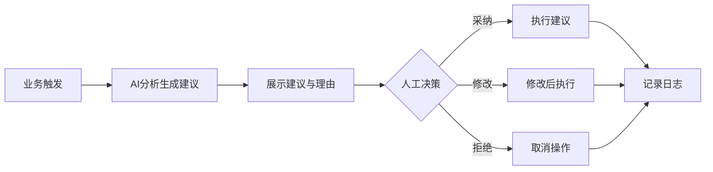
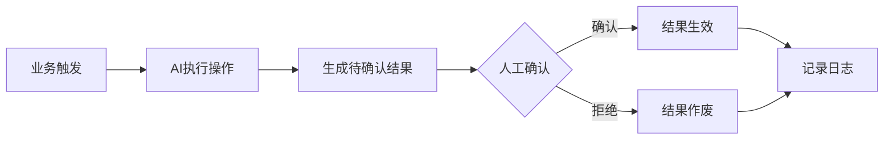
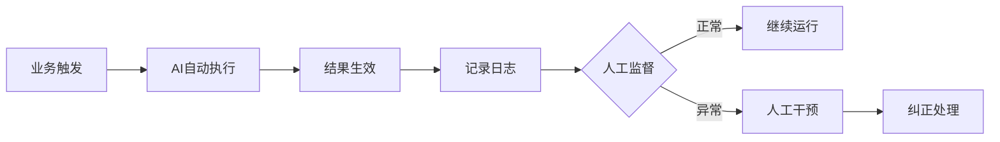
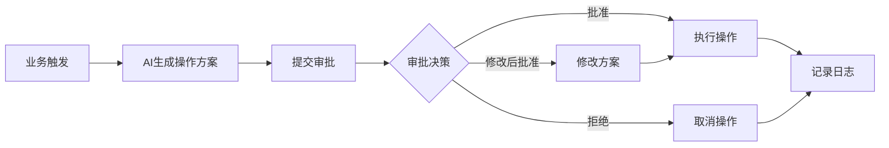
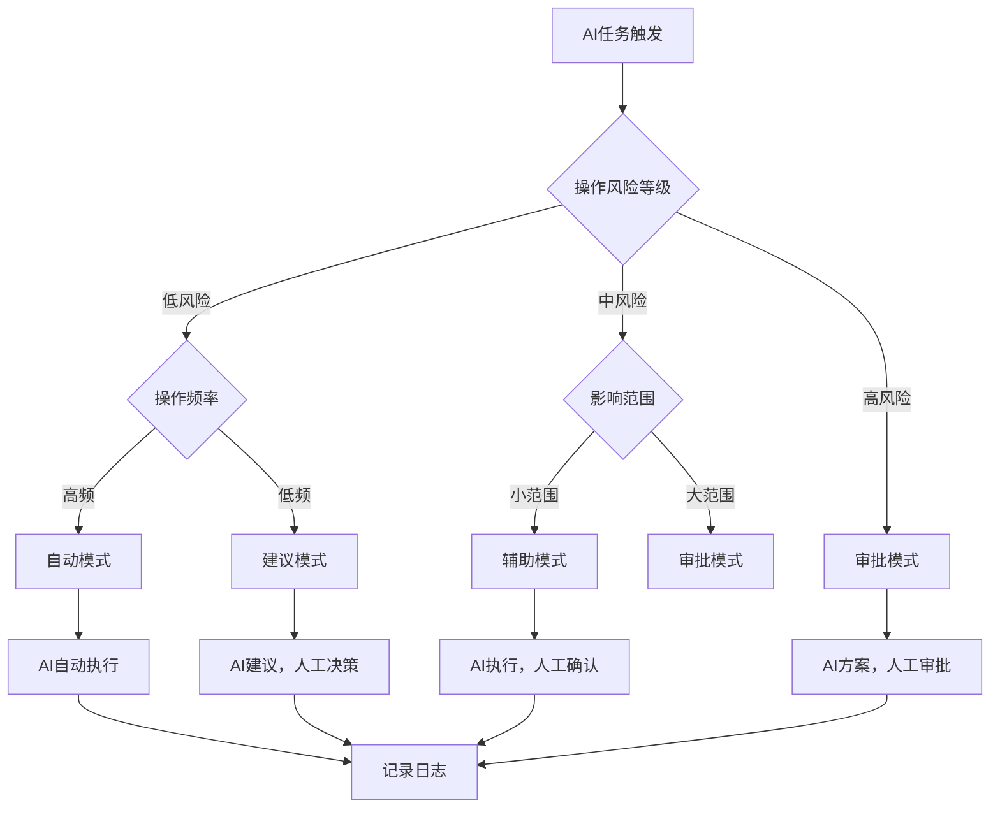
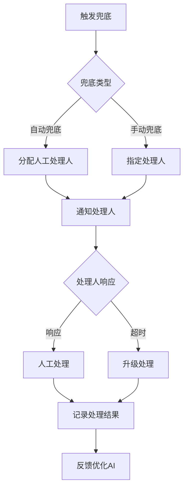
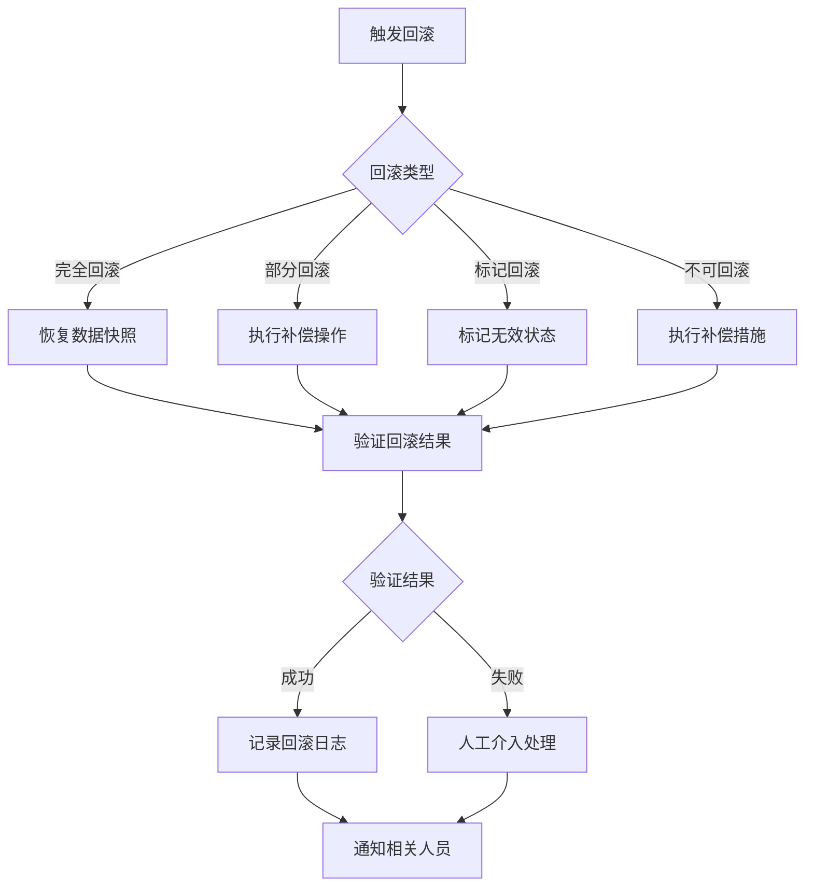
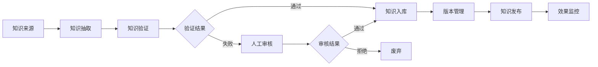
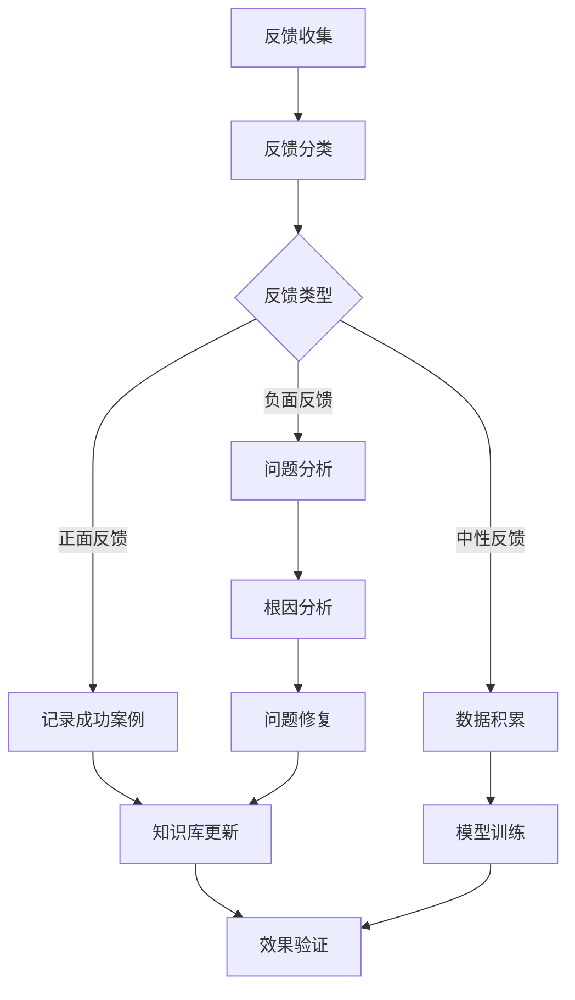
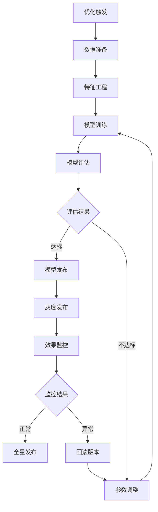

# MOY 终局版AI Agent体系与执行治理

---

## 文档元信息

| 属性 | 内容 |
|------|------|
| 文档名称 | MOY 终局版AI Agent体系与执行治理 |
| 文档编号 | MOY_FINAL_009 |
| 版本号 | v1.0 |
| 状态 | 已确认 |
| 作者 | MOY 文档架构组 |
| 日期 | 2026-04-05 |
| 目标读者 | 系统架构师、AI工程师、产品经理、合规人员 |
| 输入来源 | [P0_20_AI治理与执行规范](../P0/20_AI治理与执行规范.md)、[终局版业务域地图](./02_终局版业务域地图与能力版图.md) |

---

## 一、文档目标

本文档定义 MOY 终局版 AI Agent 体系与执行治理规范，作为企业级 AI 原生客户管理系统的 AI 能力架构蓝图，用于：

1. 定义完整的 AI Agent 体系架构与能力边界
2. 规范各 Agent 的职责边界与协作关系
3. 建立人机协作的标准模式与决策机制
4. 确保 AI 执行的可控性、可追溯性与可解释性
5. 建立 AI 风险分级与治理机制
6. 定义 AI 持续学习与优化的闭环机制

---

## 二、适用范围

### 2.1 适用范围

| 范围维度 | 说明 |
|----------|------|
| 业务范围 | MOY 终局版全量业务，包括销售域、服务域、营销域、运营域 |
| 功能范围 | 所有涉及 AI 能力的功能模块与业务场景 |
| 技术范围 | AI Agent 设计、开发、部署、运维全生命周期 |
| 组织范围 | 产品团队、技术团队、AI团队、合规团队、运维团队 |

### 2.2 版本演进

| 阶段 | 覆盖范围 | Agent 数量 | 说明 |
|------|----------|------------|------|
| P0 首期 | 核心 AI 能力 | 3 个 | 会话Agent、工单Agent、质检Agent |
| P1 扩展 | 增强AI能力 | 5 个 | 新增跟单Agent、洞察Agent |
| 终局版 | 全量AI能力 | 7 个 | 完整 Agent 体系 |

---

## 三、术语定义

### 3.1 核心术语

| 术语 | 英文 | 定义 |
|------|------|------|
| AI Agent | AI Agent | 具备特定业务能力的 AI 执行单元，可自主感知、决策、执行 |
| Agent体系 | Agent System | 由多个 Agent 组成的协作网络，共同完成复杂业务目标 |
| 执行治理 | Execution Governance | AI Agent 执行过程的监控、控制与审计机制 |
| 人机协作 | Human-AI Collaboration | 人类与 AI Agent 协同完成任务的协作模式 |
| 职责边界 | Responsibility Boundary | Agent 能力范围与决策权限的明确界定 |
| 风险分级 | Risk Classification | 根据 AI 操作影响程度划分的风险等级 |
| 可解释性 | Explainability | AI 决策过程的可理解、可追溯特性 |
| 回滚机制 | Rollback Mechanism | 撤销 AI 执行结果、恢复到执行前状态的能力 |

### 3.2 Agent 类型术语

| 术语 | 英文 | 定义 |
|------|------|------|
| 会话Agent | Conversation Agent | 处理会话交互的 AI Agent，负责智能回复、话术推荐 |
| 跟单Agent | Follow-up Agent | 处理商机跟进的 AI Agent，负责销售建议、客户洞察 |
| 工单Agent | Ticket Agent | 处理工单流转的 AI Agent，负责分类、派单、解决方案 |
| 质检Agent | QA Agent | 处理质量检查的 AI Agent，负责会话质检、合规检查 |
| 洞察Agent | Insight Agent | 处理数据分析的 AI Agent，负责趋势分析、异常预警 |
| 推荐Agent | Recommendation Agent | 处理内容推荐的 AI Agent，负责产品、话术、最佳实践推荐 |
| 编排Agent | Orchestration Agent | 处理流程编排的 AI Agent，负责任务编排、流程自动化 |

### 3.3 执行模式术语

| 术语 | 英文 | 定义 |
|------|------|------|
| 建议模式 | Suggestion Mode | AI 提供建议，人工决策并执行的协作模式 |
| 辅助模式 | Assistance Mode | AI 辅助执行，人工确认后生效的协作模式 |
| 自动模式 | Automation Mode | AI 自动执行，人工监督的协作模式 |
| 审批模式 | Approval Mode | AI 执行高风险操作，需人工审批的协作模式 |

---

## 四、AI Agent 体系架构

### 4.1 Agent 体系总览图

```
┌─────────────────────────────────────────────────────────────────────────────────────┐
│                              MOY AI Agent 体系架构                                    │
├─────────────────────────────────────────────────────────────────────────────────────┤
│                                                                                     │
│   ┌─────────────────────────────────────────────────────────────────────────────┐   │
│   │                           编排层 (Orchestration Layer)                        │   │
│   │                              任务编排与流程自动化                              │   │
│   │                                                                             │   │
│   │                    ┌─────────────────────────────┐                          │   │
│   │                    │      自动化编排Agent         │                          │   │
│   │                    │  · 流程自动化                │                          │   │
│   │                    │  · 任务编排                  │                          │   │
│   │                    │  · Agent 协调调度            │                          │   │
│   │                    └──────────────┬──────────────┘                          │   │
│   │                                   │                                         │   │
│   └───────────────────────────────────┼─────────────────────────────────────────┘   │
│                                       │ 调度协调                                     │
│                                       ▼                                             │
│   ┌─────────────────────────────────────────────────────────────────────────────┐   │
│   │                           能力层 (Capability Layer)                           │   │
│   │                              核心业务 Agent 集群                              │   │
│   │                                                                             │   │
│   │   ┌───────────────┐  ┌───────────────┐  ┌───────────────┐                  │   │
│   │   │   会话Agent    │  │   跟单Agent    │  │   工单Agent    │                  │   │
│   │   │ ─────────────  │  │ ─────────────  │  │ ─────────────  │                  │   │
│   │   │ · 智能回复     │  │ · 商机跟进提醒 │  │ · 自动分类     │                  │   │
│   │   │ · 话术推荐     │  │ · 客户洞察     │  │ · 智能派单     │                  │   │
│   │   │ · 情感分析     │  │ · 销售建议     │  │ · 解决方案推荐 │                  │   │
│   │   └───────┬───────┘  └───────┬───────┘  └───────┬───────┘                  │   │
│   │           │                  │                  │                           │   │
│   │   ┌───────┴───────┐  ┌───────┴───────┐  ┌───────┴───────┐                  │   │
│   │   │   质检Agent    │  │   洞察Agent    │  │   推荐Agent    │                  │   │
│   │   │ ─────────────  │  │ ─────────────  │  │ ─────────────  │                  │   │
│   │   │ · 会话质检     │  │ · 数据洞察     │  │ · 产品推荐     │                  │   │
│   │   │ · 合规检查     │  │ · 趋势分析     │  │ · 话术推荐     │                  │   │
│   │   │ · 评分报告     │  │ · 异常预警     │  │ · 最佳实践推荐 │                  │   │
│   │   └───────────────┘  └───────────────┘  └───────────────┘                  │   │
│   │                                                                             │   │
│   └─────────────────────────────────────────────────────────────────────────────┘   │
│                                       │                                             │
│                                       ▼                                             │
│   ┌─────────────────────────────────────────────────────────────────────────────┐   │
│   │                           治理层 (Governance Layer)                          │   │
│   │                              执行治理与风险控制                              │   │
│   │                                                                             │   │
│   │   ┌─────────────┐  ┌─────────────┐  ┌─────────────┐  ┌─────────────┐      │   │
│   │   │ 风险分级控制 │  │ 人机协作决策 │  │ 执行审计追踪 │  │ 回滚恢复机制 │      │   │
│   │   └─────────────┘  └─────────────┘  └─────────────┘  └─────────────┘      │   │
│   │                                                                             │   │
│   └─────────────────────────────────────────────────────────────────────────────┘   │
│                                       │                                             │
│                                       ▼                                             │
│   ┌─────────────────────────────────────────────────────────────────────────────┐   │
│   │                           基础层 (Foundation Layer)                          │   │
│   │                              知识库与模型服务                                │   │
│   │                                                                             │   │
│   │   ┌─────────────┐  ┌─────────────┐  ┌─────────────┐  ┌─────────────┐      │   │
│   │   │  知识库管理  │  │  模型服务池  │  │  提示词引擎  │  │  反馈闭环   │      │   │
│   │   └─────────────┘  └─────────────┘  └─────────────┘  └─────────────┘      │   │
│   │                                                                             │   │
│   └─────────────────────────────────────────────────────────────────────────────┘   │
│                                                                                     │
└─────────────────────────────────────────────────────────────────────────────────────┘
```

### 4.2 Agent 体系图（业务视角）

```
┌─────────────────────────────────────────────────────────────────────────────────────┐
│                           AI Agent 业务域映射图                                       │
├─────────────────────────────────────────────────────────────────────────────────────┤
│                                                                                     │
│     销售域                        服务域                        运营域              │
│   ┌─────────────┐              ┌─────────────┐              ┌─────────────┐        │
│   │             │              │             │              │             │        │
│   │  ┌───────┐  │              │  ┌───────┐  │              │  ┌───────┐  │        │
│   │  │跟单   │  │              │  │会话   │  │              │  │洞察   │  │        │
│   │  │Agent  │  │              │  │Agent  │  │              │  │Agent  │  │        │
│   │  └───┬───┘  │              │  └───┬───┘  │              │  └───┬───┘  │        │
│   │      │      │              │      │      │              │      │      │        │
│   │  ┌───┴───┐  │              │  ┌───┴───┐  │              │  ┌───┴───┐  │        │
│   │  │推荐   │  │              │  │工单   │  │              │  │质检   │  │        │
│   │  │Agent  │  │              │  │Agent  │  │              │  │Agent  │  │        │
│   │  └───────┘  │              │  └───────┘  │              │  └───────┘  │        │
│   │             │              │             │              │             │        │
│   └─────────────┘              └─────────────┘              └─────────────┘        │
│                                                                                     │
│   ┌─────────────────────────────────────────────────────────────────────────────┐   │
│   │                              自动化编排Agent                                  │   │
│   │                         跨域流程编排与任务调度                                │   │
│   └─────────────────────────────────────────────────────────────────────────────┘   │
│                                                                                     │
└─────────────────────────────────────────────────────────────────────────────────────┘
```

### 4.3 Agent 能力矩阵

| Agent | 核心能力 | 输入 | 输出 | 业务域 | 风险等级 |
|-------|----------|------|------|--------|----------|
| 会话Agent | 智能回复、话术推荐、情感分析 | 会话消息、上下文 | 回复建议、情感标签 | 服务域 | 低/中 |
| 跟单Agent | 商机跟进提醒、客户洞察、销售建议 | 商机数据、客户数据 | 跟进建议、洞察报告 | 销售域 | 中 |
| 工单Agent | 自动分类、智能派单、解决方案推荐 | 工单内容、历史数据 | 分类标签、派单建议、解决方案 | 服务域 | 中/高 |
| 质检Agent | 会话质检、合规检查、评分报告 | 会话记录、质检规则 | 质检结果、违规标记、评分 | 运营域 | 低 |
| 洞察Agent | 数据洞察、趋势分析、异常预警 | 业务数据、指标数据 | 洞察报告、趋势预测、预警信息 | 运营域 | 低 |
| 推荐Agent | 产品推荐、话术推荐、最佳实践推荐 | 用户画像、场景数据 | 推荐列表、推荐理由 | 销售域/服务域 | 低 |
| 编排Agent | 流程自动化、任务编排、Agent协调 | 流程定义、触发事件 | 执行结果、状态报告 | 跨域 | 高 |

---

## 四点五、终局Agent体系定义（11个）

### 4.5.1 终局Agent全景图

```
┌─────────────────────────────────────────────────────────────────────────────┐
│                        终局版 AI Agent 体系（11个）                           │
└─────────────────────────────────────────────────────────────────────────────┘

┌─────────────────────────────────────────────────────────────────────────────┐
│                              获客域 Agent                                    │
│  ┌─────────────────┐                    ┌─────────────────┐                 │
│  │   获客Agent     │                    │  线索清洗Agent   │                 │
│  │ (Acquisition)   │                    │  (LeadClean)    │                 │
│  └─────────────────┘                    └─────────────────┘                 │
└─────────────────────────────────────────────────────────────────────────────┘

┌─────────────────────────────────────────────────────────────────────────────┐
│                              沟通域 Agent                                    │
│  ┌─────────────────┐                    ┌─────────────────┐                 │
│  │  会话接待Agent   │                    │  知识辅助Agent   │                 │
│  │ (Conversation)  │                    │  (Knowledge)    │                 │
│  └─────────────────┘                    └─────────────────┘                 │
└─────────────────────────────────────────────────────────────────────────────┘

┌─────────────────────────────────────────────────────────────────────────────┐
│                              销售域 Agent                                    │
│  ┌─────────────────┐                    ┌─────────────────┐                 │
│  │  销售跟进Agent   │                    │  商机推进Agent   │                 │
│  │  (SalesFollow)  │                    │ (Opportunity)   │                 │
│  └─────────────────┘                    └─────────────────┘                 │
└─────────────────────────────────────────────────────────────────────────────┘

┌─────────────────────────────────────────────────────────────────────────────┐
│                              服务域 Agent                                    │
│  ┌─────────────────┐                    ┌─────────────────┐                 │
│  │  工单处理Agent   │                    │   质检Agent     │                 │
│  │   (Ticket)      │                    │  (Quality)      │                 │
│  └─────────────────┘                    └─────────────────┘                 │
└─────────────────────────────────────────────────────────────────────────────┘

┌─────────────────────────────────────────────────────────────────────────────┐
│                              运营域 Agent                                    │
│  ┌─────────────────┐                    ┌─────────────────┐                 │
│  │  洞察分析Agent   │                    │  运营编排Agent   │                 │
│  │   (Insight)     │                    │  (Orchestrate)  │                 │
│  └─────────────────┘                    └─────────────────┘                 │
│                                                                              │
│                      ┌─────────────────┐                                    │
│                      │ 管理驾驶舱Agent  │                                    │
│                      │   (Dashboard)   │                                    │
│                      └─────────────────┘                                    │
└─────────────────────────────────────────────────────────────────────────────┘
```

### 4.5.2 获客Agent（Acquisition Agent）

| 属性 | 定义 |
|------|------|
| **Agent编码** | AGENT_ACQUISITION |
| **所属域** | 获客域 |
| **核心职责** | 线索获取、渠道监控、转化分析 |

**输入定义**：

| 输入类型 | 数据来源 | 数据格式 |
|----------|----------|----------|
| 渠道数据 | 各渠道API | JSON |
| 表单数据 | 官网表单 | JSON |
| 广告数据 | 广告平台API | JSON |

**输出定义**：

| 输出类型 | 数据格式 | 接收方 |
|----------|----------|--------|
| 新线索 | Lead对象 | 线索清洗Agent |
| 渠道报告 | Report对象 | 洞察分析Agent |
| 转化分析 | Analysis对象 | 管理驾驶舱Agent |

**可访问对象**：

| 对象 | 访问权限 | 说明 |
|------|----------|------|
| Lead | 读/创建 | 可读取和创建线索 |
| Channel | 读 | 可读取渠道配置 |
| Campaign | 读 | 可读取营销活动 |

**可调用动作**：

| 动作 | 风险等级 | 执行模式 |
|------|----------|----------|
| 创建线索 | 低 | 自动模式 |
| 更新渠道状态 | 低 | 自动模式 |
| 生成渠道报告 | 低 | 自动模式 |

**禁止动作**：

| 动作 | 禁止原因 |
|------|----------|
| 删除线索 | 数据安全 |
| 修改线索归属 | 权限边界 |
| 分配线索 | 需人工决策 |

**回滚机制**：

| 场景 | 回滚策略 |
|------|----------|
| 线索创建错误 | 软删除标记，保留审计记录 |
| 渠道状态更新错误 | 记录历史状态，支持恢复 |

**审计要求**：

| 审计项 | 保留期限 |
|--------|----------|
| 线索创建记录 | 3年 |
| 渠道同步记录 | 1年 |

### 4.5.3 线索清洗Agent（Lead Clean Agent）

| 属性 | 定义 |
|------|------|
| **Agent编码** | AGENT_LEAD_CLEAN |
| **所属域** | 获客域 |
| **核心职责** | 线索去重、数据补全、质量评分 |

**输入定义**：

| 输入类型 | 数据来源 | 数据格式 |
|----------|----------|----------|
| 原始线索 | 获客Agent | Lead对象 |
| 清洗规则 | 配置中心 | Rule对象 |

**输出定义**：

| 输出类型 | 数据格式 | 接收方 |
|----------|----------|--------|
| 清洗后线索 | Lead对象 | 销售跟进Agent |
| 重复报告 | Report对象 | 洞察分析Agent |
| 质量评分 | Score对象 | 管理驾驶舱Agent |

**可访问对象**：

| 对象 | 访问权限 | 说明 |
|------|----------|------|
| Lead | 读/更新 | 可读取和更新线索 |
| Contact | 读 | 可读取联系人用于去重 |

**可调用动作**：

| 动作 | 风险等级 | 执行模式 |
|------|----------|----------|
| 标记重复 | 低 | 自动模式 |
| 补全数据 | 低 | 自动模式 |
| 计算质量分 | 低 | 自动模式 |
| 合并线索 | 中 | 审批模式 |

**必须人工确认的动作**：

| 动作 | 审批人 | 原因 |
|------|--------|------|
| 合并线索 | 销售经理 | 避免数据丢失 |
| 标记无效 | 销售代表 | 需人工判断 |

**禁止动作**：

| 动作 | 禁止原因 |
|------|----------|
| 删除线索 | 数据安全 |
| 修改线索归属 | 权限边界 |

**回滚机制**：

| 场景 | 回滚策略 |
|------|----------|
| 合并错误 | 保留原始线索快照，支持拆分恢复 |
| 标记错误 | 记录历史状态，支持恢复 |

### 4.5.4 会话接待Agent（Conversation Agent）

| 属性 | 定义 |
|------|------|
| **Agent编码** | AGENT_CONVERSATION |
| **所属域** | 沟通域 |
| **核心职责** | 智能回复、会话路由、情感分析 |

**输入定义**：

| 输入类型 | 数据来源 | 数据格式 |
|----------|----------|----------|
| 客户消息 | WebSocket | Message对象 |
| 会话上下文 | 数据库 | Context对象 |
| 知识库 | 知识辅助Agent | Knowledge对象 |

**输出定义**：

| 输出类型 | 数据格式 | 接收方 |
|----------|----------|--------|
| 回复建议 | Reply对象 | 坐席/客户 |
| 情感标签 | Tag对象 | 质检Agent |
| 路由建议 | Route对象 | 调度系统 |

**可访问对象**：

| 对象 | 访问权限 | 说明 |
|------|----------|------|
| Conversation | 读/更新 | 可读取和更新会话 |
| Message | 读/创建 | 可读取和创建消息 |
| Knowledge | 读 | 可读取知识库 |
| Customer | 读 | 可读取客户基本信息 |

**可调用动作**：

| 动作 | 风险等级 | 执行模式 |
|------|----------|----------|
| 生成回复建议 | 低 | 建议模式 |
| 情感分析 | 低 | 自动模式 |
| 路由建议 | 低 | 建议模式 |
| 发送自动回复 | 中 | 辅助模式 |

**必须人工确认的动作**：

| 动作 | 审批人 | 原因 |
|------|--------|------|
| 发送敏感内容 | 坐席 | 内容安全 |
| 转接会话 | 坐席 | 服务连续性 |

**禁止动作**：

| 动作 | 禁止原因 |
|------|----------|
| 删除会话 | 数据安全 |
| 修改会话归属 | 权限边界 |
| 承诺优惠 | 业务风险 |

**回滚机制**：

| 场景 | 回滚策略 |
|------|----------|
| 自动回复错误 | 支持撤回，保留审计记录 |
| 路由错误 | 支持重新路由 |

### 4.5.5 销售跟进Agent（Sales Follow Agent）

| 属性 | 定义 |
|------|------|
| **Agent编码** | AGENT_SALES_FOLLOW |
| **所属域** | 销售域 |
| **核心职责** | 跟进提醒、客户洞察、销售建议 |

**输入定义**：

| 输入类型 | 数据来源 | 数据格式 |
|----------|----------|----------|
| 线索数据 | 线索清洗Agent | Lead对象 |
| 跟进规则 | 配置中心 | Rule对象 |
| 历史数据 | 数据库 | History对象 |

**输出定义**：

| 输出类型 | 数据格式 | 接收方 |
|----------|----------|--------|
| 跟进提醒 | Reminder对象 | 销售代表 |
| 客户洞察 | Insight对象 | 商机推进Agent |
| 销售建议 | Advice对象 | 销售代表 |

**可访问对象**：

| 对象 | 访问权限 | 说明 |
|------|----------|------|
| Lead | 读/更新 | 可读取和更新线索 |
| Customer | 读 | 可读取客户信息 |
| FollowRecord | 读/创建 | 可读取和创建跟进记录 |

**可调用动作**：

| 动作 | 风险等级 | 执行模式 |
|------|----------|----------|
| 创建跟进提醒 | 低 | 自动模式 |
| 生成客户洞察 | 低 | 建议模式 |
| 生成销售建议 | 低 | 建议模式 |
| 创建跟进记录 | 低 | 辅助模式 |

**禁止动作**：

| 动作 | 禁止原因 |
|------|----------|
| 修改线索归属 | 权限边界 |
| 删除跟进记录 | 数据安全 |
| 承诺价格优惠 | 业务风险 |

### 4.5.6 商机推进Agent（Opportunity Agent）

| 属性 | 定义 |
|------|------|
| **Agent编码** | AGENT_OPPORTUNITY |
| **所属域** | 销售域 |
| **核心职责** | 商机阶段推进、赢率预测、报价建议 |

**输入定义**：

| 输入类型 | 数据来源 | 数据格式 |
|----------|----------|----------|
| 商机数据 | 数据库 | Opportunity对象 |
| 客户洞察 | 销售跟进Agent | Insight对象 |
| 历史成交 | 数据库 | Deal对象 |

**输出定义**：

| 输出类型 | 数据格式 | 接收方 |
|----------|----------|--------|
| 阶段推进建议 | Advice对象 | 销售代表 |
| 赢率预测 | Prediction对象 | 管理驾驶舱Agent |
| 报价建议 | Quote对象 | 销售代表 |

**可访问对象**：

| 对象 | 访问权限 | 说明 |
|------|----------|------|
| Opportunity | 读/更新 | 可读取和更新商机 |
| Quote | 读/创建 | 可读取和创建报价 |
| Customer | 读 | 可读取客户信息 |

**可调用动作**：

| 动作 | 风险等级 | 执行模式 |
|------|----------|----------|
| 更新商机阶段 | 中 | 辅助模式 |
| 计算赢率 | 低 | 自动模式 |
| 生成报价建议 | 低 | 建议模式 |

**必须人工确认的动作**：

| 动作 | 审批人 | 原因 |
|------|--------|------|
| 修改商机金额 | 销售经理 | 财务风险 |
| 赢单确认 | 销售代表 | 业务决策 |
| 输单确认 | 销售代表 | 业务决策 |

**禁止动作**：

| 动作 | 禁止原因 |
|------|----------|
| 删除商机 | 数据安全 |
| 修改商机归属 | 权限边界 |
| 自动赢单 | 业务风险 |

### 4.5.7 工单处理Agent（Ticket Agent）

| 属性 | 定义 |
|------|------|
| **Agent编码** | AGENT_TICKET |
| **所属域** | 服务域 |
| **核心职责** | 工单分类、智能派单、解决方案推荐 |

**输入定义**：

| 输入类型 | 数据来源 | 数据格式 |
|----------|----------|----------|
| 工单数据 | 数据库 | Ticket对象 |
| 分类规则 | 配置中心 | Rule对象 |
| 知识库 | 知识辅助Agent | Knowledge对象 |

**输出定义**：

| 输出类型 | 数据格式 | 接收方 |
|----------|----------|--------|
| 分类标签 | Tag对象 | 工单系统 |
| 派单建议 | Assign对象 | 调度系统 |
| 解决方案 | Solution对象 | 客服专员 |

**可访问对象**：

| 对象 | 访问权限 | 说明 |
|------|----------|------|
| Ticket | 读/更新 | 可读取和更新工单 |
| Knowledge | 读 | 可读取知识库 |
| Agent | 读 | 可读取坐席信息 |

**可调用动作**：

| 动作 | 风险等级 | 执行模式 |
|------|----------|----------|
| 工单分类 | 低 | 自动模式 |
| 派单建议 | 中 | 辅助模式 |
| 推荐解决方案 | 低 | 建议模式 |

**必须人工确认的动作**：

| 动作 | 审批人 | 原因 |
|------|--------|------|
| 关闭工单 | 客服专员 | 服务质量 |
| 转派工单 | 客服经理 | 服务连续性 |

**禁止动作**：

| 动作 | 禁止原因 |
|------|----------|
| 删除工单 | 数据安全 |
| 修改SLA | 业务规则 |
| 自动关闭工单 | 服务质量 |

### 4.5.8 知识辅助Agent（Knowledge Agent）

| 属性 | 定义 |
|------|------|
| **Agent编码** | AGENT_KNOWLEDGE |
| **所属域** | 沟通域 |
| **核心职责** | 知识检索、知识推荐、知识更新建议 |

**输入定义**：

| 输入类型 | 数据来源 | 数据格式 |
|----------|----------|----------|
| 查询请求 | 其他Agent | Query对象 |
| 知识库 | 数据库 | Knowledge对象 |
| 使用反馈 | 数据库 | Feedback对象 |

**输出定义**：

| 输出类型 | 数据格式 | 接收方 |
|----------|----------|--------|
| 知识检索结果 | Result对象 | 请求Agent |
| 知识推荐 | Recommend对象 | 会话接待Agent |
| 知识更新建议 | Suggestion对象 | 知识管理员 |

**可访问对象**：

| 对象 | 访问权限 | 说明 |
|------|----------|------|
| Knowledge | 读 | 可读取知识库 |
| KnowledgeCategory | 读 | 可读取知识分类 |
| KnowledgeFeedback | 读/创建 | 可读取和创建反馈 |

**可调用动作**：

| 动作 | 风险等级 | 执行模式 |
|------|----------|----------|
| 知识检索 | 低 | 自动模式 |
| 知识推荐 | 低 | 自动模式 |
| 生成更新建议 | 低 | 建议模式 |

**禁止动作**：

| 动作 | 禁止原因 |
|------|----------|
| 创建知识 | 权限边界 |
| 删除知识 | 权限边界 |
| 修改知识内容 | 权限边界 |

### 4.5.9 质检Agent（Quality Agent）

| 属性 | 定义 |
|------|------|
| **Agent编码** | AGENT_QUALITY |
| **所属域** | 服务域 |
| **核心职责** | 会话质检、合规检查、评分报告 |

**输入定义**：

| 输入类型 | 数据来源 | 数据格式 |
|----------|----------|----------|
| 会话数据 | 数据库 | Conversation对象 |
| 质检规则 | 配置中心 | Rule对象 |
| 合规标准 | 配置中心 | Standard对象 |

**输出定义**：

| 输出类型 | 数据格式 | 接收方 |
|----------|----------|--------|
| 质检评分 | Score对象 | 客服经理 |
| 合规报告 | Report对象 | 合规管理员 |
| 问题标记 | Issue对象 | 客服专员 |

**可访问对象**：

| 对象 | 访问权限 | 说明 |
|------|----------|------|
| Conversation | 读 | 可读取会话 |
| Message | 读 | 可读取消息 |
| Ticket | 读 | 可读取工单 |
| QualityRecord | 读/创建 | 可读取和创建质检记录 |

**可调用动作**：

| 动作 | 风险等级 | 执行模式 |
|------|----------|----------|
| 会话质检 | 低 | 自动模式 |
| 合规检查 | 低 | 自动模式 |
| 生成评分报告 | 低 | 自动模式 |

**禁止动作**：

| 动作 | 禁止原因 |
|------|----------|
| 修改质检评分 | 数据安全 |
| 删除质检记录 | 数据安全 |
| 修改会话内容 | 数据安全 |

### 4.5.10 洞察分析Agent（Insight Agent）

| 属性 | 定义 |
|------|------|
| **Agent编码** | AGENT_INSIGHT |
| **所属域** | 运营域 |
| **核心职责** | 数据洞察、趋势分析、异常预警 |

**输入定义**：

| 输入类型 | 数据来源 | 数据格式 |
|----------|----------|----------|
| 业务数据 | 数据库 | BusinessData对象 |
| 指标定义 | 配置中心 | Metric对象 |
| 分析规则 | 配置中心 | Rule对象 |

**输出定义**：

| 输出类型 | 数据格式 | 接收方 |
|----------|----------|--------|
| 洞察报告 | Report对象 | 管理驾驶舱Agent |
| 趋势预测 | Prediction对象 | 管理驾驶舱Agent |
| 异常预警 | Alert对象 | 运营编排Agent |

**可访问对象**：

| 对象 | 访问权限 | 说明 |
|------|----------|------|
| 全部业务对象 | 只读 | 可读取全部业务数据 |
| Metric | 读 | 可读取指标定义 |
| Report | 读/创建 | 可读取和创建报告 |

**可调用动作**：

| 动作 | 风险等级 | 执行模式 |
|------|----------|----------|
| 数据分析 | 低 | 自动模式 |
| 趋势预测 | 低 | 自动模式 |
| 异常检测 | 低 | 自动模式 |
| 生成报告 | 低 | 自动模式 |

**禁止动作**：

| 动作 | 禁止原因 |
|------|----------|
| 写入任何业务数据 | 权限边界 |
| 修改指标定义 | 权限边界 |
| 删除报告 | 数据安全 |

### 4.5.11 运营编排Agent（Orchestrate Agent）

| 属性 | 定义 |
|------|------|
| **Agent编码** | AGENT_ORCHESTRATE |
| **所属域** | 运营域 |
| **核心职责** | 流程自动化、任务编排、Agent协调 |

**输入定义**：

| 输入类型 | 数据来源 | 数据格式 |
|----------|----------|----------|
| 编排规则 | 配置中心 | Rule对象 |
| 触发事件 | 事件总线 | Event对象 |
| Agent状态 | Agent注册中心 | Status对象 |

**输出定义**：

| 输出类型 | 数据格式 | 接收方 |
|----------|----------|--------|
| 任务指令 | Command对象 | 目标Agent |
| 执行结果 | Result对象 | 管理驾驶舱Agent |
| 异常通知 | Notification对象 | 运营管理员 |

**可访问对象**：

| 对象 | 访问权限 | 说明 |
|------|----------|------|
| AutomationRule | 读 | 可读取自动化规则 |
| Task | 读/创建/更新 | 可管理任务 |
| AgentRegistry | 读 | 可读取Agent注册信息 |

**可调用动作**：

| 动作 | 风险等级 | 执行模式 |
|------|----------|----------|
| 触发自动化规则 | 中 | 辅助模式 |
| 调用其他Agent | 中 | 辅助模式 |
| 创建任务 | 低 | 自动模式 |

**必须人工确认的动作**：

| 动作 | 审批人 | 原因 |
|------|--------|------|
| 执行高风险规则 | 运营管理员 | 业务风险 |
| 批量操作 | 运营管理员 | 数据安全 |

**禁止动作**：

| 动作 | 禁止原因 |
|------|----------|
| 删除自动化规则 | 权限边界 |
| 修改其他Agent配置 | 权限边界 |
| 执行未授权操作 | 安全边界 |

### 4.5.12 管理驾驶舱Agent（Dashboard Agent）

| 属性 | 定义 |
|------|------|
| **Agent编码** | AGENT_DASHBOARD |
| **所属域** | 运营域 |
| **核心职责** | 指标汇总、预警汇总、决策支持 |

**输入定义**：

| 输入类型 | 数据来源 | 数据格式 |
|----------|----------|----------|
| 各Agent输出 | 各Agent | Output对象 |
| 业务指标 | 数据库 | Metric对象 |
| 预警信息 | 洞察分析Agent | Alert对象 |

**输出定义**：

| 输出类型 | 数据格式 | 接收方 |
|----------|----------|--------|
| 驾驶舱数据 | Dashboard对象 | 管理员 |
| 决策建议 | Advice对象 | 管理员 |
| 预警汇总 | AlertSummary对象 | 管理员 |

**可访问对象**：

| 对象 | 访问权限 | 说明 |
|------|----------|------|
| 全部业务对象 | 只读 | 可读取全部业务数据 |
| Dashboard | 读/创建 | 可管理驾驶舱配置 |
| Alert | 读 | 可读取预警信息 |

**可调用动作**：

| 动作 | 风险等级 | 执行模式 |
|------|----------|----------|
| 数据汇总 | 低 | 自动模式 |
| 指标计算 | 低 | 自动模式 |
| 预警汇总 | 低 | 自动模式 |
| 生成决策建议 | 低 | 建议模式 |

**禁止动作**：

| 动作 | 禁止原因 |
|------|----------|
| 写入任何业务数据 | 权限边界 |
| 执行业务操作 | 权限边界 |
| 发送通知 | 权限边界 |

---

## 五、各 Agent 职责边界

### 5.1 会话Agent 职责边界

#### 5.1.1 能力定义

| 能力项 | 说明 | 输入 | 输出 | 执行模式 |
|--------|------|------|------|----------|
| 智能回复 | 根据客户消息生成回复建议 | 客户消息、会话上下文 | 回复建议列表 | 建议模式 |
| 话术推荐 | 根据场景推荐最佳话术 | 场景标签、客户画像 | 话术推荐列表 | 建议模式 |
| 情感分析 | 分析客户情感倾向 | 客户消息 | 情感标签、情感分数 | 自动模式 |

#### 5.1.2 职责边界

| 边界类型 | 允许范围 | 禁止范围 |
|----------|----------|----------|
| 数据访问 | 当前会话、客户基本信息、产品知识库 | 其他客户隐私数据、财务敏感数据 |
| 决策权限 | 生成建议、提供参考 | 自动发送消息、修改客户数据 |
| 执行范围 | 文本生成、情感判断 | 执行业务操作、触发业务流程 |

#### 5.1.3 协作关系

```
┌───────────────┐     情感标签      ┌───────────────┐
│   会话Agent   │ ─────────────────▶ │   跟单Agent   │
└───────┬───────┘                    └───────────────┘
        │
        │ 会话数据
        ▼
┌───────────────┐
│   质检Agent   │
└───────────────┘
```

### 5.2 跟单Agent 职责边界

#### 5.2.1 能力定义

| 能力项 | 说明 | 输入 | 输出 | 执行模式 |
|--------|------|------|------|----------|
| 商机跟进提醒 | 根据商机状态生成跟进提醒 | 商机数据、跟进规则 | 提醒内容、建议时间 | 辅助模式 |
| 客户洞察 | 分析客户行为生成洞察报告 | 客户数据、行为数据 | 洞察报告、客户画像 | 建议模式 |
| 销售建议 | 根据商机情况提供销售建议 | 商机数据、历史成交数据 | 销售策略建议 | 建议模式 |

#### 5.2.2 职责边界

| 边界类型 | 允许范围 | 禁止范围 |
|----------|----------|----------|
| 数据访问 | 商机数据、客户数据、历史成交数据 | 其他销售商机、竞品敏感数据 |
| 决策权限 | 生成建议、提供洞察 | 修改商机状态、分配客户 |
| 执行范围 | 数据分析、报告生成 | 执行销售操作、承诺优惠 |

#### 5.2.3 协作关系

```
┌───────────────┐     客户洞察      ┌───────────────┐
│   跟单Agent   │ ─────────────────▶ │   推荐Agent   │
└───────┬───────┘                    └───────────────┘
        │
        │ 商机数据
        ▼
┌───────────────┐
│   洞察Agent   │
└───────────────┘
```

### 5.3 工单Agent 职责边界

#### 5.3.1 能力定义

| 能力项 | 说明 | 输入 | 输出 | 执行模式 |
|--------|------|------|------|----------|
| 自动分类 | 根据工单内容自动分类 | 工单内容、分类规则 | 分类标签、置信度 | 自动模式/审批模式 |
| 智能派单 | 根据工单类型和人员能力派单 | 工单数据、人员数据 | 派单建议、理由 | 审批模式 |
| 解决方案推荐 | 推荐历史相似工单的解决方案 | 工单内容、知识库 | 解决方案列表 | 建议模式 |

#### 5.3.2 职责边界

| 边界类型 | 允许范围 | 禁止范围 |
|----------|----------|----------|
| 数据访问 | 工单数据、知识库、人员技能数据 | 客户隐私数据、财务数据 |
| 决策权限 | 分类建议、派单建议 | 强制派单、关闭工单 |
| 执行范围 | 分类打标、推荐分配 | 执行派单、修改工单状态 |

#### 5.3.3 协作关系

```
┌───────────────┐     工单数据      ┌───────────────┐
│   工单Agent   │ ─────────────────▶ │   质检Agent   │
└───────┬───────┘                    └───────────────┘
        │
        │ 解决方案
        ▼
┌───────────────┐
│   推荐Agent   │
└───────────────┘
```

### 5.4 质检Agent 职责边界

#### 5.4.1 能力定义

| 能力项 | 说明 | 输入 | 输出 | 执行模式 |
|--------|------|------|------|----------|
| 会话质检 | 检查会话质量与合规性 | 会话记录、质检规则 | 质检结果、问题标记 | 自动模式 |
| 合规检查 | 检查是否违反合规要求 | 会话内容、合规规则 | 违规标记、风险等级 | 自动模式 |
| 评分报告 | 生成质检评分报告 | 质检结果、评分标准 | 评分报告、改进建议 | 自动模式 |

#### 5.4.2 职责边界

| 边界类型 | 允许范围 | 禁止范围 |
|----------|----------|----------|
| 数据访问 | 会话记录、质检规则、评分标准 | 客户隐私数据、员工薪资数据 |
| 决策权限 | 质检评分、问题标记 | 执行处罚、修改员工绩效 |
| 执行范围 | 质检分析、报告生成 | 执行管理操作、触发处罚流程 |

#### 5.4.3 协作关系

```
┌───────────────┐     质检报告      ┌───────────────┐
│   质检Agent   │ ─────────────────▶ │   洞察Agent   │
└───────┬───────┘                    └───────────────┘
        │
        │ 合规问题
        ▼
┌───────────────┐
│   编排Agent   │
└───────────────┘
```

### 5.5 洞察Agent 职责边界

#### 5.5.1 能力定义

| 能力项 | 说明 | 输入 | 输出 | 执行模式 |
|--------|------|------|------|----------|
| 数据洞察 | 分析业务数据生成洞察 | 业务数据、分析维度 | 洞察报告、关键发现 | 自动模式 |
| 趋势分析 | 预测业务趋势 | 历史数据、时间序列 | 趋势预测、置信区间 | 建议模式 |
| 异常预警 | 检测异常并发出预警 | 实时数据、预警规则 | 预警信息、异常原因 | 辅助模式 |

#### 5.5.2 职责边界

| 边界类型 | 允许范围 | 禁止范围 |
|----------|----------|----------|
| 数据访问 | 业务统计数据、指标数据 | 原始客户隐私数据、财务明细 |
| 决策权限 | 生成洞察、发出预警 | 执行业务决策、修改业务配置 |
| 执行范围 | 数据分析、报告生成 | 执行业务操作、触发业务流程 |

#### 5.5.3 协作关系

```
┌───────────────┐     异常预警      ┌───────────────┐
│   洞察Agent   │ ─────────────────▶ │   编排Agent   │
└───────┬───────┘                    └───────────────┘
        │
        │ 洞察数据
        ▼
┌───────────────┐
│   推荐Agent   │
└───────────────┘
```

### 5.6 推荐Agent 职责边界

#### 5.6.1 能力定义

| 能力项 | 说明 | 输入 | 输出 | 执行模式 |
|--------|------|------|------|----------|
| 产品推荐 | 根据客户画像推荐产品 | 客户画像、产品数据 | 产品推荐列表、推荐理由 | 建议模式 |
| 话术推荐 | 根据场景推荐最佳话术 | 场景数据、话术库 | 话术推荐列表 | 建议模式 |
| 最佳实践推荐 | 推荐成功案例和最佳实践 | 业务场景、案例库 | 最佳实践列表 | 建议模式 |

#### 5.6.2 职责边界

| 边界类型 | 允许范围 | 禁止范围 |
|----------|----------|----------|
| 数据访问 | 产品数据、话术库、案例库 | 客户隐私数据、商业机密 |
| 决策权限 | 生成推荐列表 | 强制推荐、执行销售操作 |
| 执行范围 | 推荐计算、排序展示 | 执行销售操作、承诺优惠 |

#### 5.6.3 协作关系

```
┌───────────────┐     推荐结果      ┌───────────────┐
│   推荐Agent   │ ─────────────────▶ │   会话Agent   │
└───────┬───────┘                    └───────────────┘
        │
        │ 推荐数据
        ▼
┌───────────────┐
│   跟单Agent   │
└───────────────┘
```

### 5.7 自动化编排Agent 职责边界

#### 5.7.1 能力定义

| 能力项 | 说明 | 输入 | 输出 | 执行模式 |
|--------|------|------|------|----------|
| 流程自动化 | 自动执行预定义的业务流程 | 流程定义、触发事件 | 执行结果、状态报告 | 审批模式 |
| 任务编排 | 编排多个 Agent 协作完成任务 | 任务定义、Agent 能力 | 编排计划、执行结果 | 审批模式 |
| Agent 协调调度 | 协调多个 Agent 的执行顺序 | 任务依赖、Agent 状态 | 调度结果 | 自动模式 |

#### 5.7.2 职责边界

| 边界类型 | 允许范围 | 禁止范围 |
|----------|----------|----------|
| 数据访问 | 流程定义、Agent 状态、任务数据 | 敏感业务数据、客户隐私 |
| 决策权限 | 调度 Agent、编排任务 | 执行高风险操作、修改业务规则 |
| 执行范围 | 流程调度、任务编排 | 执行具体业务操作、访问敏感数据 |

#### 5.7.3 协作关系

```
                    ┌───────────────┐
                    │   编排Agent   │
                    └───────┬───────┘
                            │
        ┌───────────────────┼───────────────────┐
        │                   │                   │
        ▼                   ▼                   ▼
┌───────────────┐   ┌───────────────┐   ┌───────────────┐
│   会话Agent   │   │   工单Agent   │   │   质检Agent   │
└───────────────┘   └───────────────┘   └───────────────┘
```

---

## 六、人机协作模式

### 6.1 协作模式定义

#### 6.1.1 建议模式

| 属性 | 说明 |
|------|------|
| 定义 | AI 提供建议，人工决策并执行 |
| AI 职责 | 分析数据、生成建议、提供理由 |
| 人工职责 | 评估建议、做出决策、执行操作 |
| 适用场景 | 需要人工判断、创意决策的场景 |
| 典型应用 | 智能回复、销售建议、产品推荐 |



#### 6.1.2 辅助模式

| 属性 | 说明 |
|------|------|
| 定义 | AI 辅助执行，人工确认后生效 |
| AI 职责 | 执行操作、生成结果、等待确认 |
| 人工职责 | 审核结果、确认生效或拒绝 |
| 适用场景 | 需要效率提升但需人工把关的场景 |
| 典型应用 | 商机跟进提醒、异常预警 |



#### 6.1.3 自动模式

| 属性 | 说明 |
|------|------|
| 定义 | AI 自动执行，人工事后监督 |
| AI 职责 | 自主决策、自动执行、记录日志 |
| 人工职责 | 事后审核、发现问题、纠正处理 |
| 适用场景 | 低风险、高频率的标准化操作 |
| 典型应用 | 情感分析、会话质检、数据洞察 |



#### 6.1.4 审批模式

| 属性 | 说明 |
|------|------|
| 定义 | AI 执行高风险操作，需人工审批 |
| AI 职责 | 生成操作方案、提交审批、等待执行 |
| 人工职责 | 审批决策、批准或拒绝、监督执行 |
| 适用场景 | 高风险、影响范围大的操作 |
| 典型应用 | 智能派单、流程自动化 |



### 6.2 协作模式选择矩阵

| Agent | 低风险操作 | 中风险操作 | 高风险操作 |
|-------|------------|------------|------------|
| 会话Agent | 自动模式（情感分析） | 建议模式（智能回复） | 审批模式（自动发送） |
| 跟单Agent | 自动模式（客户洞察） | 辅助模式（跟进提醒） | 建议模式（销售建议） |
| 工单Agent | 自动模式（自动分类） | 建议模式（解决方案） | 审批模式（智能派单） |
| 质检Agent | 自动模式（质检评分） | 辅助模式（合规检查） | - |
| 洞察Agent | 自动模式（数据洞察） | 辅助模式（异常预警） | - |
| 推荐Agent | 自动模式（推荐计算） | 建议模式（推荐展示） | - |
| 编排Agent | 自动模式（任务调度） | 辅助模式（任务编排） | 审批模式（流程自动化） |

### 6.3 人机协作决策树



---

## 七、AI 自动执行与人工兜底机制

### 7.1 自动执行触发条件

| 触发类型 | 说明 | 示例 |
|----------|------|------|
| 事件触发 | 业务事件发生时自动执行 | 新消息到达触发情感分析 |
| 时间触发 | 定时任务自动执行 | 每日质检报告生成 |
| 阈值触发 | 指标达到阈值时自动执行 | 异常指标触发预警 |
| 规则触发 | 满足业务规则时自动执行 | 工单满足条件自动分类 |

### 7.2 自动执行边界

| 边界类型 | 说明 | 控制措施 |
|----------|------|----------|
| 数据边界 | 限制可访问的数据范围 | 数据权限控制、数据脱敏 |
| 操作边界 | 限制可执行的操作类型 | 操作白名单、操作审计 |
| 时间边界 | 限制执行时间窗口 | 超时控制、重试限制 |
| 频率边界 | 限制执行频率 | 频率限制、配额控制 |

### 7.3 人工兜底机制

#### 7.3.1 兜底触发条件

| 触发条件 | 说明 | 兜底方式 |
|----------|------|----------|
| AI 执行失败 | AI 任务执行失败 | 自动转人工处理 |
| 置信度过低 | AI 输出置信度低于阈值 | 提示人工介入 |
| 异常检测 | 检测到异常 AI 行为 | 自动暂停并通知 |
| 用户请求 | 用户主动请求人工 | 立即转人工 |
| 敏感内容 | 检测到敏感内容 | 阻断并通知人工 |
| 超时未处理 | AI 处理超时 | 自动转人工 |

#### 7.3.2 兜底流程



#### 7.3.3 兜底配置

| 配置项 | 说明 | 默认值 |
|--------|------|--------|
| 置信度阈值 | 低于此值触发兜底 | 0.6 |
| 响应超时 | 兜底后人工响应超时 | 5 分钟 |
| 通知方式 | 兜底通知方式 | 站内消息 + 邮件 |
| 分配策略 | 处理人分配策略 | 轮询分配 |
| 升级策略 | 超时升级策略 | 上级主管 |

### 7.4 兜底记录

| 字段 | 类型 | 说明 |
|------|------|------|
| takeover_id | BIGSERIAL | 兜底记录 ID |
| org_id | BIGINT | 租户 ID |
| task_id | BIGINT | 原 AI 任务 ID |
| agent_type | VARCHAR(32) | Agent 类型 |
| trigger_reason | VARCHAR(32) | 触发原因 |
| trigger_time | TIMESTAMP | 触发时间 |
| assigned_to | BIGINT | 分配给谁 |
| handle_time | TIMESTAMP | 处理时间 |
| handle_result | VARCHAR(16) | 处理结果 |
| feedback | TEXT | 反馈信息 |
| created_at | TIMESTAMP | 创建时间 |

---

## 八、AI 决策审计规则

### 8.1 审计范围

| 审计维度 | 说明 | 审计内容 |
|----------|------|----------|
| 输入审计 | 记录 AI 输入数据 | 输入数据、上下文、参数 |
| 输出审计 | 记录 AI 输出结果 | 输出结果、置信度、时间戳 |
| 决策审计 | 记录 AI 决策过程 | 决策依据、推理路径、影响因素 |
| 执行审计 | 记录 AI 执行过程 | 执行操作、执行结果、影响范围 |
| 人工审计 | 记录人工干预过程 | 干预类型、干预内容、干预结果 |

### 8.2 审计数据结构

```json
{
  "audit_id": "audit_001",
  "org_id": 1,
  "agent_type": "conversation_agent",
  "task_type": "smart_reply",
  "execution_mode": "suggestion",
  "risk_level": "medium",
  "input_audit": {
    "data_source": "conversation",
    "input_data": {
      "conversation_id": 123,
      "customer_message": "我想了解产品价格",
      "context": {
        "customer_history": [...],
        "product_info": {...}
      }
    },
    "parameters": {
      "temperature": 0.7,
      "max_tokens": 500
    }
  },
  "output_audit": {
    "output_data": {
      "suggestions": [
        {
          "content": "您好，感谢您的咨询...",
          "confidence": 0.92
        }
      ]
    },
    "model_info": {
      "provider": "openai",
      "model_name": "gpt-4",
      "model_version": "2024-01-01"
    },
    "tokens_used": {
      "input": 150,
      "output": 80,
      "total": 230
    }
  },
  "decision_audit": {
    "decision_basis": [
      "客户询问产品价格",
      "客户为新客户",
      "产品A正在促销"
    ],
    "reasoning_path": [
      "识别客户意图 -> 价格咨询",
      "匹配产品知识 -> 产品A",
      "生成回复建议 -> 包含促销信息"
    ],
    "confidence_factors": {
      "intent_clarity": 0.95,
      "context_relevance": 0.88,
      "knowledge_match": 0.92
    }
  },
  "execution_audit": {
    "execution_status": "completed",
    "execution_time": "2026-04-05T10:00:00Z",
    "duration_ms": 2000,
    "affected_objects": [
      {
        "type": "conversation",
        "id": 123
      }
    ]
  },
  "human_audit": {
    "human_interaction": true,
    "interaction_type": "confirmation",
    "confirmed_by": 1,
    "confirmed_at": "2026-04-05T10:00:05Z",
    "action": "approved",
    "modifications": null
  },
  "created_at": "2026-04-05T10:00:00Z"
}
```

### 8.3 审计查询维度

| 查询维度 | 说明 | 用途 |
|----------|------|------|
| 按 Agent 类型 | 查询特定 Agent 的审计记录 | Agent 性能分析 |
| 按任务类型 | 查询特定任务类型的审计记录 | 任务质量分析 |
| 按时间范围 | 查询时间范围内的审计记录 | 时序分析、趋势分析 |
| 按风险等级 | 查询特定风险等级的审计记录 | 风险分析 |
| 按执行模式 | 查询特定执行模式的审计记录 | 协作模式分析 |
| 按用户 | 查询用户相关的审计记录 | 用户行为分析 |
| 按关联对象 | 查询关联业务对象的审计记录 | 业务追溯 |

### 8.4 审计保留策略

| 数据类型 | 保留期限 | 存储方式 |
|----------|----------|----------|
| 高风险操作审计 | 3 年 | 冷存储 + 备份 |
| 中风险操作审计 | 1 年 | 冷存储 |
| 低风险操作审计 | 6 个月 | 冷存储 |
| 审计摘要数据 | 永久 | 数据仓库 |

---

## 九、AI 风险分级

### 9.1 风险等级定义

| 风险等级 | 编码 | 定义 | 影响范围 | 示例操作 |
|----------|------|------|----------|----------|
| 低风险 | LOW | 对业务影响小，可逆操作 | 单个记录、无外部影响 | 情感分析、数据洞察、推荐计算 |
| 中风险 | MEDIUM | 对业务有一定影响，部分可逆 | 多个记录、内部影响 | 智能回复、自动分类、质检评分 |
| 高风险 | HIGH | 对业务影响大，难以逆转 | 批量数据、外部影响 | 智能派单、自动发送、流程自动化 |

### 9.2 风险评估矩阵

| 评估维度 | 低风险 (1分) | 中风险 (2分) | 高风险 (3分) |
|----------|--------------|--------------|--------------|
| 数据影响 | 仅读取数据 | 修改单条数据 | 批量修改数据 |
| 业务影响 | 无业务影响 | 影响单个业务流程 | 影响多个业务流程 |
| 可逆性 | 完全可逆 | 部分可逆 | 不可逆 |
| 影响范围 | 仅内部可见 | 租户内可见 | 外部可见 |
| 合规风险 | 无合规风险 | 轻微合规风险 | 重大合规风险 |

### 9.3 风险分级规则

```
风险等级 = MAX(数据影响, 业务影响, 可逆性, 影响范围, 合规风险)

风险等级判定：
- 总分 1-5：低风险
- 总分 6-10：中风险
- 总分 11-15：高风险
```

### 9.4 各 Agent 操作风险分级

| Agent | 低风险操作 | 中风险操作 | 高风险操作 |
|-------|------------|------------|------------|
| 会话Agent | 情感分析 | 智能回复、话术推荐 | 自动发送消息 |
| 跟单Agent | 客户洞察 | 商机跟进提醒、销售建议 | 自动分配客户 |
| 工单Agent | 自动分类 | 解决方案推荐 | 智能派单、自动关闭 |
| 质检Agent | 质检评分 | 合规检查 | - |
| 洞察Agent | 数据洞察 | 趋势分析、异常预警 | - |
| 推荐Agent | 推荐计算 | 推荐展示 | - |
| 编排Agent | 任务调度 | 任务编排 | 流程自动化 |

### 9.5 风险控制措施

| 风险等级 | 执行模式 | 确认要求 | 审计要求 | 回滚能力 |
|----------|----------|----------|----------|----------|
| 低风险 | 自动模式 | 无需确认 | 基础审计 | 可回滚 |
| 中风险 | 辅助/建议模式 | 人工确认 | 详细审计 | 可回滚 |
| 高风险 | 审批模式 | 审批确认 | 完整审计 | 有限回滚 |

---

## 十、AI 可解释性要求

### 10.1 可解释性层级

| 层级 | 说明 | 适用场景 | 实现方式 |
|------|------|----------|----------|
| 结果解释 | 解释 AI 输出结果 | 所有 AI 输出 | 输出说明、置信度 |
| 过程解释 | 解释 AI 决策过程 | 中高风险操作 | 决策路径、影响因素 |
| 因果解释 | 解释 AI 决策原因 | 高风险操作 | 因果分析、证据链 |

### 10.2 可解释性要求矩阵

| Agent | 结果解释 | 过程解释 | 因果解释 |
|-------|----------|----------|----------|
| 会话Agent | ✓ 回复建议说明 | ✓ 推荐理由 | ✓ 关键因素分析 |
| 跟单Agent | ✓ 洞察结论 | ✓ 分析过程 | ✓ 数据来源追溯 |
| 工单Agent | ✓ 分类结果 | ✓ 分类依据 | ✓ 相似案例对比 |
| 质检Agent | ✓ 评分结果 | ✓ 评分细则 | ✓ 问题证据 |
| 洞察Agent | ✓ 洞察发现 | ✓ 分析方法 | ✓ 数据来源 |
| 推荐Agent | ✓ 推荐结果 | ✓ 推荐理由 | ✓ 用户画像匹配 |
| 编排Agent | ✓ 执行结果 | ✓ 执行步骤 | ✓ 决策依据 |

### 10.3 可解释性实现方式

#### 10.3.1 结果解释模板

```json
{
  "result_explanation": {
    "output_summary": "回复建议：推荐产品A的价格信息",
    "confidence": 0.92,
    "confidence_level": "高",
    "key_points": [
      "客户询问产品价格",
      "产品A正在促销中",
      "客户为新客户，首次咨询"
    ]
  }
}
```

#### 10.3.2 过程解释模板

```json
{
  "process_explanation": {
    "decision_path": [
      {
        "step": 1,
        "action": "意图识别",
        "result": "价格咨询",
        "confidence": 0.95
      },
      {
        "step": 2,
        "action": "产品匹配",
        "result": "产品A",
        "confidence": 0.88
      },
      {
        "step": 3,
        "action": "话术生成",
        "result": "包含促销信息的回复",
        "confidence": 0.92
      }
    ],
    "influencing_factors": [
      {
        "factor": "客户历史",
        "weight": 0.3,
        "value": "新客户"
      },
      {
        "factor": "产品状态",
        "weight": 0.5,
        "value": "促销中"
      },
      {
        "factor": "会话上下文",
        "weight": 0.2,
        "value": "首次咨询"
      }
    ]
  }
}
```

#### 10.3.3 因果解释模板

```json
{
  "causal_explanation": {
    "evidence_chain": [
      {
        "evidence_id": "E001",
        "type": "客户消息",
        "content": "我想了解产品价格",
        "relevance": "直接触发价格咨询意图"
      },
      {
        "evidence_id": "E002",
        "type": "产品数据",
        "content": "产品A价格：¥999，促销价：¥799",
        "relevance": "提供价格信息来源"
      },
      {
        "evidence_id": "E003",
        "type": "知识库",
        "content": "新客户首次咨询话术模板",
        "relevance": "指导回复风格"
      }
    ],
    "causal_reasoning": "客户明确询问价格 → 识别为价格咨询意图 → 匹配产品A → 检索价格信息 → 结合促销活动 → 生成包含促销信息的回复建议"
  }
}
```

### 10.4 可解释性展示要求

| 展示场景 | 展示内容 | 展示方式 |
|----------|----------|----------|
| 建议展示 | 结果 + 置信度 + 关键理由 | 卡片式展示 |
| 确认界面 | 结果 + 过程 + 影响因素 | 详情展开 |
| 审批界面 | 完整解释 + 证据链 | 分步骤展示 |
| 审计查询 | 全量解释数据 | 结构化展示 |
| 异常分析 | 决策路径 + 异常原因 | 可视化展示 |

---

## 十一、AI 执行回滚机制

### 11.1 回滚能力分级

| 回滚级别 | 说明 | 适用操作 | 实现方式 |
|----------|------|----------|----------|
| 完全回滚 | 恢复到执行前状态 | 数据修改类操作 | 事务回滚、数据快照 |
| 部分回滚 | 恢复部分影响 | 流程类操作 | 状态回退、补偿操作 |
| 标记回滚 | 标记无效但保留记录 | 通知类操作 | 状态标记、追加说明 |
| 不可回滚 | 无法撤销操作 | 外部影响类操作 | 补偿措施、人工处理 |

### 11.2 回滚触发条件

| 触发条件 | 说明 | 回滚方式 |
|----------|------|----------|
| 人工主动回滚 | 人工发现错误主动回滚 | 手动触发回滚 |
| 异常检测回滚 | 系统检测到异常自动回滚 | 自动触发回滚 |
| 审批拒绝回滚 | 审批不通过回滚预执行 | 自动回滚 |
| 超时回滚 | 执行超时自动回滚 | 自动回滚 |

### 11.3 回滚流程



### 11.4 各 Agent 回滚能力

| Agent | 操作类型 | 回滚级别 | 回滚方式 |
|-------|----------|----------|----------|
| 会话Agent | 智能回复 | 标记回滚 | 标记建议无效 |
| 会话Agent | 自动发送 | 完全回滚 | 撤回消息 |
| 跟单Agent | 商机提醒 | 标记回滚 | 标记提醒无效 |
| 工单Agent | 自动分类 | 完全回滚 | 恢复原分类 |
| 工单Agent | 智能派单 | 部分回滚 | 重新分配 |
| 质检Agent | 质检评分 | 完全回滚 | 恢复原评分 |
| 洞察Agent | 数据洞察 | 标记回滚 | 标记报告无效 |
| 推荐Agent | 推荐结果 | 标记回滚 | 标记推荐无效 |
| 编排Agent | 流程自动化 | 部分回滚 | 状态回退 |

### 11.5 回滚数据结构

```json
{
  "rollback_id": "rollback_001",
  "org_id": 1,
  "task_id": "ai_task_001",
  "agent_type": "ticket_agent",
  "operation_type": "auto_classify",
  "rollback_type": "full",
  "trigger_reason": "manual",
  "triggered_by": 1,
  "triggered_at": "2026-04-05T10:30:00Z",
  "before_state": {
    "ticket_id": 123,
    "category_id": 1,
    "category_name": "产品咨询"
  },
  "after_state": {
    "ticket_id": 123,
    "category_id": 2,
    "category_name": "技术支持"
  },
  "rollback_state": {
    "ticket_id": 123,
    "category_id": 1,
    "category_name": "产品咨询"
  },
  "rollback_status": "success",
  "rollback_time": "2026-04-05T10:30:05Z",
  "created_at": "2026-04-05T10:30:00Z"
}
```

### 11.6 回滚限制

| 限制类型 | 说明 | 处理方式 |
|----------|------|----------|
| 时间限制 | 超过一定时间无法回滚 | 提示人工处理 |
| 依赖限制 | 后续操作已执行无法回滚 | 提示影响范围 |
| 外部限制 | 外部系统已同步无法回滚 | 执行补偿操作 |
| 权限限制 | 无回滚权限 | 提示申请权限 |

---

## 十二、AI 训练/知识/反馈闭环

### 12.1 闭环架构

```
┌─────────────────────────────────────────────────────────────────────────────────────┐
│                           AI 训练/知识/反馈闭环架构                                    │
├─────────────────────────────────────────────────────────────────────────────────────┤
│                                                                                     │
│   ┌─────────────┐                      ┌─────────────┐                             │
│   │   业务数据   │                      │   AI 执行   │                             │
│   └──────┬──────┘                      └──────┬──────┘                             │
│          │                                    │                                     │
│          ▼                                    ▼                                     │
│   ┌─────────────┐                      ┌─────────────┐                             │
│   │  数据标注   │ ───────────────────▶ │  反馈收集   │                             │
│   └──────┬──────┘                      └──────┬──────┘                             │
│          │                                    │                                     │
│          ▼                                    ▼                                     │
│   ┌─────────────┐                      ┌─────────────┐                             │
│   │  知识更新   │ ◀─────────────────── │  质量评估   │                             │
│   └──────┬──────┘                      └──────┬──────┘                             │
│          │                                    │                                     │
│          ▼                                    ▼                                     │
│   ┌─────────────┐                      ┌─────────────┐                             │
│   │  模型优化   │ ◀─────────────────── │  问题分析   │                             │
│   └──────┬──────┘                      └─────────────┘                             │
│          │                                                                          │
│          ▼                                                                          │
│   ┌─────────────┐                                                                  │
│   │  效果验证   │                                                                  │
│   └──────┬──────┘                                                                  │
│          │                                                                          │
│          └──────────────────────────────────────────────────────────────┐           │
│                                                                         │           │
│                                                                         ▼           │
│                                                                 ┌─────────────┐    │
│                                                                 │   业务数据   │    │
│                                                                 └─────────────┘    │
│                                                                                     │
└─────────────────────────────────────────────────────────────────────────────────────┘
```

### 12.2 知识管理闭环

#### 12.2.1 知识来源

| 来源类型 | 说明 | 更新频率 | 质量控制 |
|----------|------|----------|----------|
| 产品知识库 | 产品信息、价格、功能 | 实时更新 | 人工审核 |
| 话术知识库 | 标准话术、最佳实践 | 每周更新 | 效果评估 |
| 案例知识库 | 成功案例、解决方案 | 每日更新 | 质量评分 |
| 规则知识库 | 业务规则、流程规则 | 按需更新 | 合规审核 |

#### 12.2.2 知识更新流程



#### 12.2.3 知识质量评估

| 评估维度 | 指标 | 目标值 |
|----------|------|--------|
| 准确性 | 知识准确率 | ≥ 95% |
| 完整性 | 知识覆盖率 | ≥ 90% |
| 时效性 | 知识更新及时率 | ≥ 98% |
| 可用性 | 知识可用率 | ≥ 99% |

### 12.3 反馈收集闭环

#### 12.3.1 反馈来源

| 反馈来源 | 反馈类型 | 收集方式 | 处理优先级 |
|----------|----------|----------|------------|
| 用户反馈 | 显式反馈 | 点赞/点踩、评价 | 高 |
| 行为数据 | 隐式反馈 | 点击、采纳、修改 | 中 |
| 质检结果 | 系统反馈 | 质检评分、违规标记 | 高 |
| 兜底记录 | 异常反馈 | 人工接管、失败记录 | 高 |
| 审计数据 | 审计反馈 | 审计发现、异常检测 | 中 |

#### 12.3.2 反馈处理流程



#### 12.3.3 反馈数据结构

```json
{
  "feedback_id": "feedback_001",
  "org_id": 1,
  "task_id": "ai_task_001",
  "agent_type": "conversation_agent",
  "feedback_source": "user_explicit",
  "feedback_type": "negative",
  "feedback_content": {
    "rating": 2,
    "comment": "回复不够准确",
    "tags": ["不准确", "不相关"]
  },
  "context": {
    "original_output": "您好，感谢您的咨询...",
    "user_modification": "您好，请问有什么可以帮助您的？",
    "adoption_status": "modified"
  },
  "created_at": "2026-04-05T10:00:00Z",
  "processed": false,
  "processed_at": null
}
```

### 12.4 模型优化闭环

#### 12.4.1 优化触发条件

| 触发条件 | 说明 | 优化方式 |
|----------|------|----------|
| 性能下降 | 效果指标低于阈值 | 模型重训练 |
| 数据积累 | 新数据量达到阈值 | 增量训练 |
| 问题修复 | 发现并修复问题 | 针对性优化 |
| 定期优化 | 定期优化周期 | 全面优化 |

#### 12.4.2 优化流程



#### 12.4.3 优化效果评估

| 评估指标 | 说明 | 目标值 |
|----------|------|--------|
| 准确率 | 输出准确率 | ≥ 90% |
| 召回率 | 相关结果召回率 | ≥ 85% |
| F1 分数 | 准确率和召回率调和平均 | ≥ 87% |
| 用户满意度 | 用户反馈满意度 | ≥ 85% |
| 采纳率 | 用户采纳率 | ≥ 80% |

### 12.5 持续学习机制

#### 12.5.1 在线学习

| 学习类型 | 说明 | 适用场景 |
|----------|------|----------|
| 实时学习 | 实时更新模型参数 | 用户行为反馈 |
| 批量学习 | 批量更新模型 | 定期优化 |
| 增量学习 | 增量更新知识库 | 新知识入库 |

#### 12.5.2 学习控制

| 控制项 | 说明 | 配置 |
|--------|------|------|
| 学习速率 | 模型更新速度 | 可配置 |
| 验证频率 | 效果验证频率 | 每日 |
| 回滚阈值 | 触发回滚的指标阈值 | 可配置 |
| 人工审核 | 是否需要人工审核学习结果 | 高风险场景必审 |

---

## 十三、对 P0/P1 的影响

### 13.1 与 P0 的关系

| 维度 | P0 定义 | 终局版扩展 | 影响说明 |
|------|---------|------------|----------|
| Agent 数量 | 3 个（会话、工单、质检） | 7 个（完整体系） | 新增跟单、洞察、推荐、编排 Agent |
| 执行模式 | 4 种模式 | 4 种模式（细化规则） | 模式定义一致，规则更细化 |
| 风险分级 | 3 级 | 3 级（细化评估矩阵） | 分级一致，评估更系统 |
| 审计规则 | 基础审计 | 完整审计体系 | 扩展审计维度和深度 |
| 回滚机制 | 基础回滚 | 完整回滚体系 | 扩展回滚能力和流程 |

### 13.2 P0 兼容性

| 兼容项 | 兼容策略 | 说明 |
|--------|----------|------|
| 数据模型 | 向后兼容 | 终局版扩展字段，不影响 P0 数据 |
| API 接口 | 向后兼容 | 终局版扩展接口，P0 接口保持可用 |
| 执行模式 | 完全兼容 | 终局版执行模式覆盖 P0 定义 |
| 审计日志 | 向后兼容 | 终局版审计格式扩展，兼容 P0 格式 |

### 13.3 P1 扩展影响

| P1 功能 | 终局版影响 | 说明 |
|---------|------------|------|
| 跟单Agent | 完整定义 | P1 引入，终局版完善职责边界 |
| 洞察Agent | 完整定义 | P1 引入，终局版完善能力矩阵 |
| 高级质检 | 能力扩展 | 终局版扩展质检维度和规则 |
| 智能推荐 | 能力扩展 | 终局版扩展推荐场景和算法 |

### 13.4 迁移路径

```
P0 首期 ──────────────────▶ P1 扩展 ──────────────────▶ 终局版
   │                           │                           │
   │  3 个 Agent               │  5 个 Agent               │  7 个 Agent
   │  基础执行治理              │  增强执行治理              │  完整执行治理
   │  基础审计                  │  扩展审计                  │  完整审计体系
   │                           │                           │
   └───────────────────────────┴───────────────────────────┘
                    数据迁移 + 功能扩展 + 体系完善
```

### 13.5 差异对照表

| 对比项 | P0 | P1 | 终局版 |
|--------|----|----|--------|
| Agent 数量 | 3 | 5 | 7 |
| 会话Agent | ✓ 基础能力 | ✓ 增强能力 | ✓ 完整能力 |
| 跟单Agent | - | ✓ 基础能力 | ✓ 完整能力 |
| 工单Agent | ✓ 基础能力 | ✓ 增强能力 | ✓ 完整能力 |
| 质检Agent | ✓ 基础能力 | ✓ 增强能力 | ✓ 完整能力 |
| 洞察Agent | - | ✓ 基础能力 | ✓ 完整能力 |
| 推荐Agent | - | - | ✓ 完整能力 |
| 编排Agent | - | - | ✓ 完整能力 |
| 执行模式 | 4 种 | 4 种 | 4 种（细化规则） |
| 风险分级 | 3 级 | 3 级 | 3 级（细化评估） |
| 可解释性 | 基础 | 增强 | 完整体系 |
| 回滚机制 | 基础 | 增强 | 完整体系 |
| 反馈闭环 | 基础 | 增强 | 完整闭环 |

---

## 十四、数据表设计

### 14.1 ai_agents（Agent 定义表）

| 字段名 | 类型 | 说明 |
|--------|------|------|
| id | BIGSERIAL | Agent ID |
| org_id | BIGINT | 租户 ID |
| agent_code | VARCHAR(32) | Agent 编码 |
| agent_name | VARCHAR(64) | Agent 名称 |
| agent_type | VARCHAR(32) | Agent 类型 |
| description | TEXT | 描述 |
| capabilities | JSONB | 能力定义 |
| risk_level | VARCHAR(16) | 默认风险等级 |
| execution_mode | VARCHAR(16) | 默认执行模式 |
| status | VARCHAR(16) | 状态 |
| created_at | TIMESTAMP | 创建时间 |
| updated_at | TIMESTAMP | 更新时间 |

### 14.2 ai_agent_tasks（Agent 任务表）

| 字段名 | 类型 | 说明 |
|--------|------|------|
| id | BIGSERIAL | 任务 ID |
| org_id | BIGINT | 租户 ID |
| agent_id | BIGINT | Agent ID |
| task_type | VARCHAR(32) | 任务类型 |
| execution_mode | VARCHAR(16) | 执行模式 |
| risk_level | VARCHAR(16) | 风险等级 |
| input_data | JSONB | 输入数据 |
| output_data | JSONB | 输出数据 |
| explanation | JSONB | 可解释性数据 |
| model_info | JSONB | 模型信息 |
| confidence | DECIMAL(5,4) | 置信度 |
| tokens_used | JSONB | Token 使用 |
| cost_amount | DECIMAL(10,4) | 成本金额 |
| duration_ms | INTEGER | 执行耗时 |
| status | VARCHAR(16) | 状态 |
| error_message | VARCHAR(512) | 错误信息 |
| human_interaction | JSONB | 人工交互信息 |
| rollback_info | JSONB | 回滚信息 |
| created_at | TIMESTAMP | 创建时间 |
| completed_at | TIMESTAMP | 完成时间 |

### 14.3 ai_agent_audits（Agent 审计表）

| 字段名 | 类型 | 说明 |
|--------|------|------|
| id | BIGSERIAL | 审计 ID |
| org_id | BIGINT | 租户 ID |
| task_id | BIGINT | 任务 ID |
| agent_type | VARCHAR(32) | Agent 类型 |
| audit_type | VARCHAR(32) | 审计类型 |
| audit_data | JSONB | 审计数据 |
| created_at | TIMESTAMP | 创建时间 |

### 14.4 ai_agent_feedbacks（Agent 反馈表）

| 字段名 | 类型 | 说明 |
|--------|------|------|
| id | BIGSERIAL | 反馈 ID |
| org_id | BIGINT | 租户 ID |
| task_id | BIGINT | 任务 ID |
| agent_type | VARCHAR(32) | Agent 类型 |
| feedback_source | VARCHAR(32) | 反馈来源 |
| feedback_type | VARCHAR(16) | 反馈类型 |
| feedback_content | JSONB | 反馈内容 |
| context | JSONB | 上下文 |
| processed | SMALLINT | 是否处理 |
| processed_at | TIMESTAMP | 处理时间 |
| created_at | TIMESTAMP | 创建时间 |

### 14.5 ai_agent_rollbacks（Agent 回滚表）

| 字段名 | 类型 | 说明 |
|--------|------|------|
| id | BIGSERIAL | 回滚 ID |
| org_id | BIGINT | 租户 ID |
| task_id | BIGINT | 任务 ID |
| agent_type | VARCHAR(32) | Agent 类型 |
| operation_type | VARCHAR(32) | 操作类型 |
| rollback_type | VARCHAR(16) | 回滚类型 |
| trigger_reason | VARCHAR(32) | 触发原因 |
| triggered_by | BIGINT | 触发人 ID |
| triggered_at | TIMESTAMP | 触发时间 |
| before_state | JSONB | 回滚前状态 |
| after_state | JSONB | 回滚后状态 |
| rollback_state | JSONB | 回滚目标状态 |
| rollback_status | VARCHAR(16) | 回滚状态 |
| rollback_time | TIMESTAMP | 回滚时间 |
| created_at | TIMESTAMP | 创建时间 |

### 14.6 ai_agent_takeovers（Agent 兜底表）

| 字段名 | 类型 | 说明 |
|--------|------|------|
| id | BIGSERIAL | 兜底 ID |
| org_id | BIGINT | 租户 ID |
| task_id | BIGINT | 任务 ID |
| agent_type | VARCHAR(32) | Agent 类型 |
| trigger_reason | VARCHAR(32) | 触发原因 |
| trigger_time | TIMESTAMP | 触发时间 |
| assigned_to | BIGINT | 分配给谁 |
| handle_time | TIMESTAMP | 处理时间 |
| handle_result | VARCHAR(16) | 处理结果 |
| feedback | TEXT | 反馈信息 |
| created_at | TIMESTAMP | 创建时间 |

---

## 十五、版本与变更记录

| 版本 | 日期 | 作者 | 变更摘要 | 状态 |
|------|------|------|----------|------|
| v1.0 | 2026-04-05 | MOY 文档架构组 | 初稿：定义终局版 AI Agent 体系与执行治理 | 已确认 |

---

## 十六、依赖文档

| 文档 | 版本 | 用途 |
|------|------|------|
| [20_AI治理与执行规范.md](../P0/20_AI治理与执行规范.md) | v1.0 | P0 AI 治理基线 |
| [02_终局版业务域地图与能力版图.md](./02_终局版业务域地图与能力版图.md) | v1.0 | 业务域定义 |
| [04_终局版端到端业务链路蓝图.md](./04_终局版端到端业务链路蓝图.md) | v1.0 | 业务链路定义 |
| [08_终局版权限模型与AI权限边界.md](./08_终局版权限模型与AI权限边界.md) | v1.0 | 权限边界定义 |

---

## 十七、待确认事项

1. 是否需要支持多 Agent 并行执行与结果融合？
2. Agent 之间的协作调度是否需要独立的调度引擎？
3. AI 决策的法律责任如何界定？
4. 是否需要建立 AI 伦理审查机制？
5. 如何处理 Agent 能力的动态扩展与版本升级？
