# MOY 终局版技术演进架构蓝图

---

## 文档元信息

| 属性     | 内容                      |
| -------- | ------------------------- |
| 文档名称 | MOY 终局版技术演进架构蓝图 |
| 文档编号 | MOY_FINAL_014             |
| 版本号   | v1.0                      |
| 状态     | 已确认                    |
| 作者     | MOY 文档架构组            |
| 日期     | 2026-04-05                |
| 目标读者 | 技术负责人、架构师、CTO、研发团队 |
| 输入来源 | [HLD](../P0/09_HLD_系统高层设计.md)、[技术选型冻结](../P0/36_技术选型冻结.md) |

---

## 一、文档目的

本文档作为 MOY 项目**终局版技术演进架构蓝图**，用于：

1. 定义从 P0 到终局版的技术架构演进路线
2. 明确各阶段技术架构的核心特征与边界
3. 规划数据架构、AI 架构的演进路径
4. 识别技术债务并制定偿还计划
5. 为各阶段技术决策提供指导框架

**阅读建议：**

- CTO/技术负责人：全文阅读，重点关注演进策略与债务管理
- 架构师：重点阅读架构演进路线与关键技术决策
- 研发团队：重点阅读各阶段技术栈与迁移路径
- 运维团队：重点阅读基础设施演进与部署策略

---

## 二、适用范围

| 维度     | 范围说明                                                     |
| -------- | ------------------------------------------------------------ |
| 产品范围 | MOY 终局版全量业务：客户管理、线索管理、会话管理、商机管理、工单管理、知识库、数据看板、AI Agent、多渠道集成等 |
| 阶段范围 | P0（MVP）→ P1 → P2 → P3 → 终局版                            |
| 技术范围 | 技术架构、数据架构、AI 架构、基础设施架构                   |
| 用户范围 | 技术团队、架构团队、运维团队                                 |

---

## 三、术语定义

| 术语             | 定义                                                         |
| ---------------- | ------------------------------------------------------------ |
| P0 阶段          | MVP 最小可行产品阶段，聚焦核心业务功能验证                   |
| P1 阶段          | 功能增强阶段，完善核心功能，引入基础 AI 能力                 |
| P2 阶段          | 规模化阶段，支持更大规模用户与数据，引入微服务架构           |
| P3 阶段          | 智能化阶段，深度 AI 集成，云原生架构                         |
| 终局版           | 最终目标架构，多云部署、湖仓一体、多模态大模型               |
| 技术债务         | 为快速交付而采取的短期技术妥协，需在后续阶段偿还             |
| 单体架构         | 所有功能模块部署在同一应用实例中                             |
| 微服务架构       | 功能模块拆分为独立服务，独立部署与扩展                       |
| 云原生架构       | 基于容器、服务网格、不可变基础设施的架构模式                 |
| 多云架构         | 应用部署在多个云服务商，实现供应商解耦与高可用               |
| 湖仓一体         | 数据湖与数据仓库融合，支持海量数据存储与分析                 |
| 多模态大模型     | 支持文本、图像、语音、视频等多种模态输入输出的大语言模型     |

---

## 四、技术架构演进路线

### 4.1 演进总览

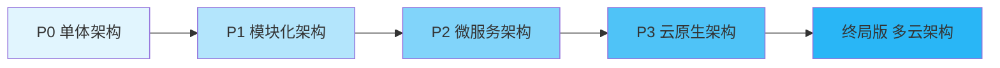

### 4.2 P0 阶段：单体架构，快速迭代

| 维度             | 说明                                                         |
| ---------------- | ------------------------------------------------------------ |
| **架构特征**     | 单体应用，模块化代码组织                                     |
| **核心目标**     | 快速验证产品价值，最小化技术复杂度                           |
| **适用场景**     | 用户规模 < 1000，QPS < 100                                   |
| **部署方式**     | 单机部署或小规模集群                                         |

#### 4.2.1 技术栈

| 层级         | 技术选型                     | 说明               |
| ------------ | ---------------------------- | ------------------ |
| 前端         | Next.js 14 + React           | SSR + CSR 混合     |
| 后端         | NestJS 10 + TypeScript       | 单体应用           |
| 数据库       | PostgreSQL 15                | 单实例             |
| 缓存         | Redis 7                      | 单实例             |
| 消息队列     | Redis Streams                | 轻量级消息队列     |
| 搜索引擎     | Elasticsearch 8              | 单节点             |
| 文件存储     | 阿里云 OSS                   | 对象存储           |
| LLM 服务     | DeepSeek                     | 单一供应商         |

#### 4.2.2 架构图

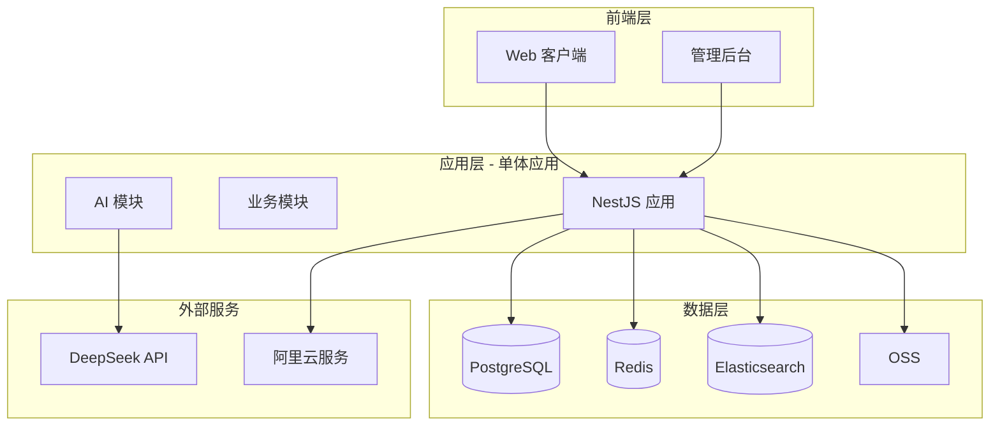

#### 4.2.3 架构约束

| 约束项           | 约束内容                                     |
| ---------------- | -------------------------------------------- |
| 模块边界         | 代码层面模块化，运行时同一进程               |
| 数据库           | 单库，通过 org_id 实现租户隔离               |
| 扩展方式         | 垂直扩展为主，水平扩展为辅                   |
| 部署频率         | 每周 1-2 次发布                              |

---

### 4.3 P1 阶段：模块化，服务拆分准备

| 维度             | 说明                                                         |
| ---------------- | ------------------------------------------------------------ |
| **架构特征**     | 模块化单体，明确服务边界，为拆分做准备                       |
| **核心目标**     | 优化代码结构，引入核心 AI 能力，提升系统可维护性             |
| **适用场景**     | 用户规模 1000-10000，QPS 100-500                             |
| **部署方式**     | 小规模集群，读写分离                                         |

#### 4.3.1 技术栈演进

| 层级         | P0 技术栈          | P1 技术栈              | 变更说明               |
| ------------ | ------------------ | ---------------------- | ---------------------- |
| 后端         | NestJS 单体        | NestJS 模块化单体      | 明确模块边界           |
| 数据库       | PostgreSQL 单实例  | PostgreSQL 主从        | 读写分离               |
| 缓存         | Redis 单实例       | Redis 主从             | 高可用                 |
| 消息队列     | Redis Streams      | Redis Streams          | 保持不变               |
| LLM 服务     | DeepSeek           | DeepSeek + 通义千问    | 多供应商支持           |

#### 4.3.2 架构图

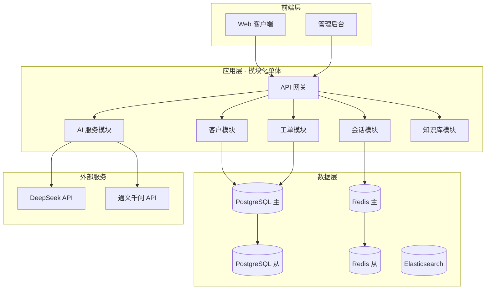

#### 4.3.3 模块边界定义

| 模块名称     | 边界定义                                     | 拆分准备                     |
| ------------ | -------------------------------------------- | ---------------------------- |
| 客户模块     | 客户档案、客户画像、客户分组                 | 独立数据模型，明确接口       |
| 会话模块     | 多渠道接入、消息收发、会话分配               | 独立 WebSocket 服务          |
| 工单模块     | 工单创建、分配、流转、关闭                   | 独立工作流引擎               |
| AI 服务模块  | 智能回复、话术辅助、知识问答                 | 独立 LLM Gateway             |
| 知识库模块   | 知识管理、知识检索、AI 问答                  | 独立检索服务                 |

---

### 4.4 P2 阶段：微服务架构

| 维度             | 说明                                                         |
| ---------------- | ------------------------------------------------------------ |
| **架构特征**     | 微服务架构，服务独立部署与扩展                               |
| **核心目标**     | 支持规模化业务，团队独立开发部署，系统弹性扩展               |
| **适用场景**     | 用户规模 10000-100000，QPS 500-2000                          |
| **部署方式**     | Kubernetes 集群，服务网格                                    |

#### 4.4.1 技术栈演进

| 层级         | P1 技术栈              | P2 技术栈              | 变更说明               |
| ------------ | ---------------------- | ---------------------- | ---------------------- |
| 后端         | NestJS 模块化单体      | NestJS 微服务          | 服务拆分               |
| 数据库       | PostgreSQL 主从        | PostgreSQL 分库分表    | 数据分片               |
| 缓存         | Redis 主从             | Redis Cluster          | 分布式缓存             |
| 消息队列     | Redis Streams          | Kafka                  | 高吞吐消息队列         |
| 服务发现     | 无                     | Consul / Nacos         | 服务注册发现           |
| 服务网格     | 无                     | Istio                  | 服务治理               |
| 容器编排     | 无                     | Kubernetes             | 容器编排               |

#### 4.4.2 架构图

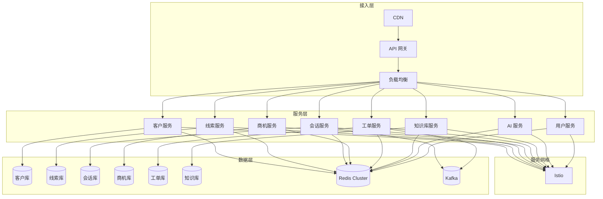

#### 4.4.3 服务拆分策略

| 服务名称     | 职责范围                                     | 数据库         | 独立性   |
| ------------ | -------------------------------------------- | -------------- | -------- |
| 客户服务     | 客户档案、客户画像、客户分组                 | customer_db    | 高       |
| 线索服务     | 线索录入、分配、跟进、转化                   | lead_db        | 高       |
| 会话服务     | 多渠道接入、消息收发、会话分配               | conversation_db| 高       |
| 商机服务     | 商机创建、阶段管理、跟进记录                 | opportunity_db | 高       |
| 工单服务     | 工单创建、分配、流转、关闭                   | ticket_db      | 高       |
| 知识库服务   | 知识管理、知识检索、AI 问答                  | knowledge_db   | 高       |
| AI 服务      | 智能回复、话术辅助、LLM Gateway              | 无状态         | 高       |
| 用户服务     | 用户管理、角色管理、权限控制                 | user_db        | 高       |

---

### 4.5 P3 阶段：云原生架构

| 维度             | 说明                                                         |
| ---------------- | ------------------------------------------------------------ |
| **架构特征**     | 云原生架构，Serverless、事件驱动、可观测性                   |
| **核心目标**     | 深度 AI 集成，自动化运维，极致弹性                           |
| **适用场景**     | 用户规模 100000-1000000，QPS 2000-10000                      |
| **部署方式**     | 多可用区部署，自动扩缩容                                     |

#### 4.5.1 技术栈演进

| 层级         | P2 技术栈              | P3 技术栈              | 变更说明               |
| ------------ | ---------------------- | ---------------------- | ---------------------- |
| 计算         | Kubernetes             | Kubernetes + Serverless| 混合计算模式           |
| 数据库       | PostgreSQL 分库分表    | PostgreSQL + TiDB      | HTAP 混合负载          |
| 缓存         | Redis Cluster          | Redis Cluster + 本地缓存| 多级缓存              |
| 消息队列     | Kafka                  | Kafka + Pulsar         | 多协议支持             |
| 可观测性     | Prometheus + Grafana   | OpenTelemetry + Grafana| 统一可观测性           |
| AI 平台      | LLM API 调用           | AI 平台（训练+推理）   | 自有 AI 能力           |
| 数据平台     | 无                     | 数据中台               | 数据治理与分析         |

#### 4.5.2 架构图

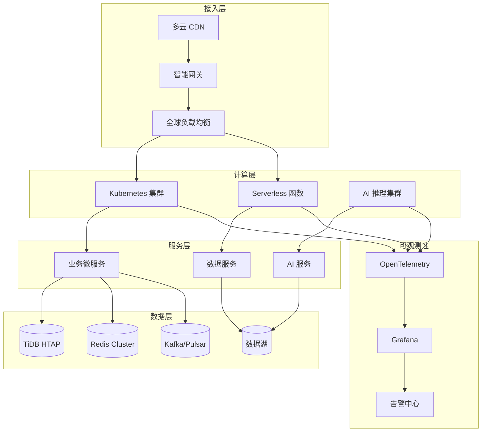

#### 4.5.3 云原生能力

| 能力维度     | 具体能力                                     | 实现方式               |
| ------------ | -------------------------------------------- | ---------------------- |
| 弹性伸缩     | 自动扩缩容、预测性扩容                       | HPA + VPA + CA         |
| 故障恢复     | 自动故障检测、自动恢复                       | 自愈系统               |
| 灰度发布     | 金丝雀发布、蓝绿部署                         | Istio + ArgoCD         |
| 可观测性     | 分布式追踪、指标监控、日志聚合               | OpenTelemetry          |
| 安全         | 零信任网络、密钥管理                         | SPIFFE + Vault         |

---

### 4.6 终局版：多云架构

| 维度             | 说明                                                         |
| ---------------- | ------------------------------------------------------------ |
| **架构特征**     | 多云架构，供应商解耦，全球部署                               |
| **核心目标**     | 极致可用性、数据主权合规、成本优化                           |
| **适用场景**     | 用户规模 > 1000000，QPS > 10000，全球化业务                  |
| **部署方式**     | 多云多区域部署，智能流量调度                                 |

#### 4.6.1 技术栈演进

| 层级         | P3 技术栈              | 终局版技术栈            | 变更说明               |
| ------------ | ---------------------- | ----------------------- | ---------------------- |
| 云服务商     | 单云（阿里云）         | 多云（阿里云+AWS+GCP）  | 供应商解耦             |
| 计算         | Kubernetes + Serverless| 多云 Kubernetes         | 跨云编排               |
| 数据库       | PostgreSQL + TiDB      | 分布式数据库            | 全球分布式             |
| 数据平台     | 数据中台               | 湖仓一体                | 统一数据平台           |
| AI 平台      | AI 平台                | 多模态大模型平台        | 多模态能力             |
| 网络         | 单云网络               | 多云互联网络            | 全球加速               |

#### 4.6.2 架构图

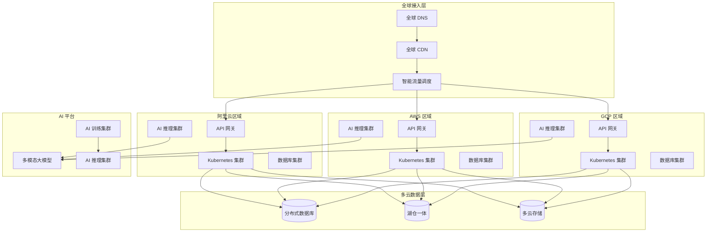

#### 4.6.3 多云策略

| 策略维度     | 策略内容                                     | 实现方式               |
| ------------ | -------------------------------------------- | ---------------------- |
| 供应商解耦   | 避免单一供应商锁定                           | 开源技术栈 + 多云适配  |
| 数据主权     | 数据存储符合当地法规                         | 区域化数据存储         |
| 成本优化     | 根据成本动态调度                             | 智能成本优化           |
| 灾难恢复     | 跨云跨区域容灾                               | 多活架构               |
| 性能优化     | 就近访问，低延迟                             | 全球加速网络           |

---

## 五、数据架构演进路线

### 5.1 演进总览

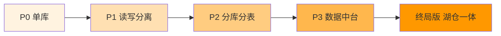

### 5.2 P0 阶段：单库

| 维度             | 说明                                                         |
| ---------------- | ------------------------------------------------------------ |
| **架构特征**     | 单一 PostgreSQL 实例，通过 org_id 实现租户隔离               |
| **核心目标**     | 简化数据管理，快速迭代                                       |
| **数据规模**     | 数据量 < 100GB，QPS < 100                                    |

#### 5.2.1 数据库设计

| 设计项           | 设计方案                                     |
| ---------------- | -------------------------------------------- |
| 实例类型         | 阿里云 RDS PostgreSQL                        |
| 规格             | 4核8G，100GB SSD                             |
| 租户隔离         | 行级隔离，org_id 字段                        |
| 备份策略         | 每日自动备份，保留 30 天                     |

#### 5.2.2 数据模型

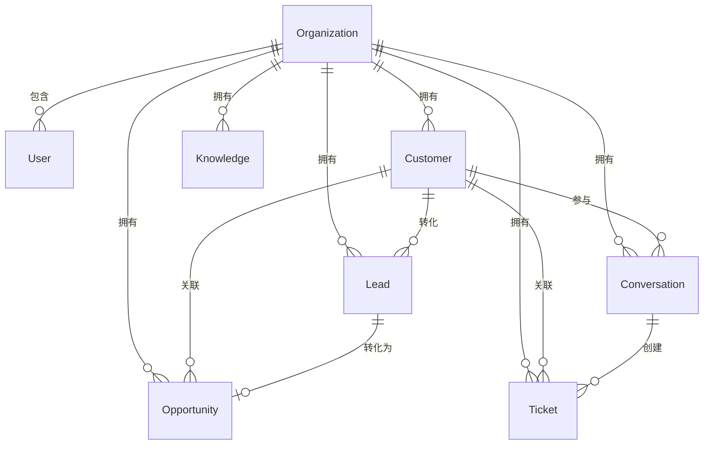

---

### 5.3 P1 阶段：读写分离

| 维度             | 说明                                                         |
| ---------------- | ------------------------------------------------------------ |
| **架构特征**     | 主从复制，读写分离                                           |
| **核心目标**     | 提升读性能，降低主库压力                                     |
| **数据规模**     | 数据量 100GB-500GB，QPS 100-500                              |

#### 5.3.1 数据库架构

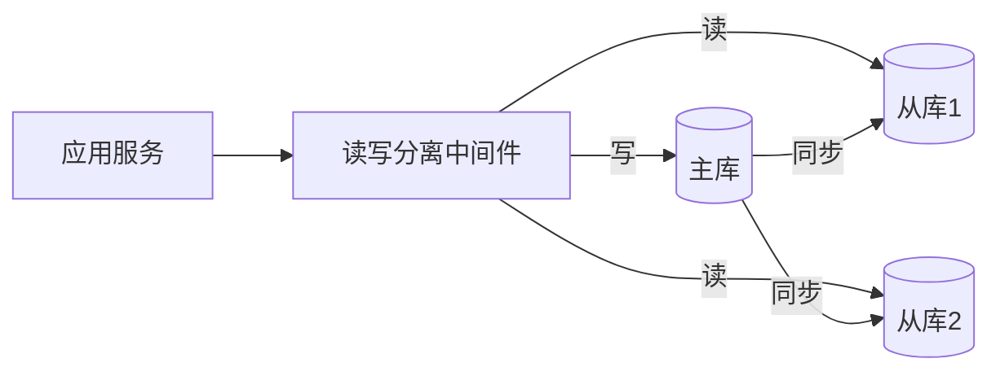

#### 5.3.2 读写分离策略

| 操作类型     | 路由策略                                     | 说明               |
| ------------ | -------------------------------------------- | ------------------ |
| 写操作       | 主库                                         | INSERT/UPDATE/DELETE |
| 实时读       | 主库                                         | 写后读一致性       |
| 普通读       | 从库                                         | 轮询负载均衡       |
| 报表查询     | 从库                                         | 独立只读实例       |

---

### 5.4 P2 阶段：分库分表

| 维度             | 说明                                                         |
| ---------------- | ------------------------------------------------------------ |
| **架构特征**     | 垂直分库 + 水平分表                                          |
| **核心目标**     | 支持大规模数据，提升系统吞吐量                               |
| **数据规模**     | 数据量 500GB-5TB，QPS 500-2000                               |

#### 5.4.1 分库分表策略

| 分库策略     | 说明                                         | 分库依据           |
| ------------ | -------------------------------------------- | ------------------ |
| 垂直分库     | 按业务域拆分                                 | 业务边界           |
| 水平分表     | 按租户/时间拆分                              | org_id / 时间      |

#### 5.4.2 分库分表架构

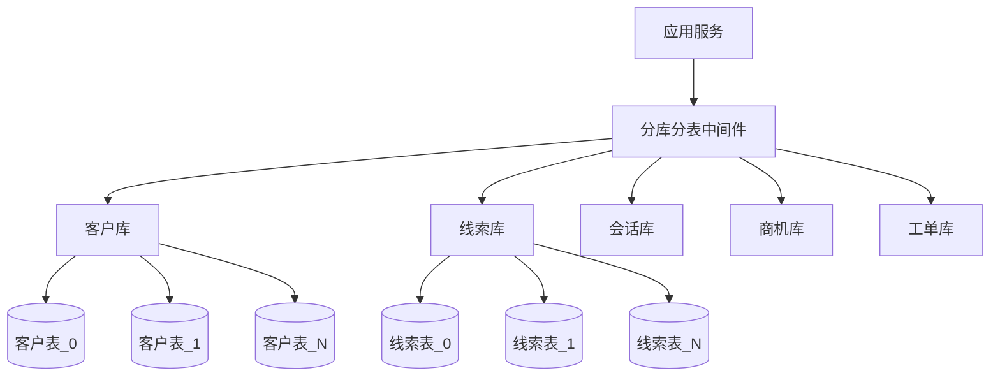

#### 5.4.3 分片规则

| 业务表       | 分片键       | 分片规则               | 分片数量           |
| ------------ | ------------ | ---------------------- | ------------------ |
| customers    | org_id       | org_id % N             | 16                 |
| leads        | org_id       | org_id % N             | 16                 |
| conversations| org_id       | org_id % N             | 32                 |
| tickets      | org_id       | org_id % N             | 16                 |
| messages     | conversation_id | conversation_id % N | 64                 |

---

### 5.5 P3 阶段：数据中台

| 维度             | 说明                                                         |
| ---------------- | ------------------------------------------------------------ |
| **架构特征**     | 数据中台，统一数据治理                                       |
| **核心目标**     | 数据资产化，支持数据分析与决策                               |
| **数据规模**     | 数据量 5TB-50TB，QPS 2000-10000                              |

#### 5.5.1 数据中台架构

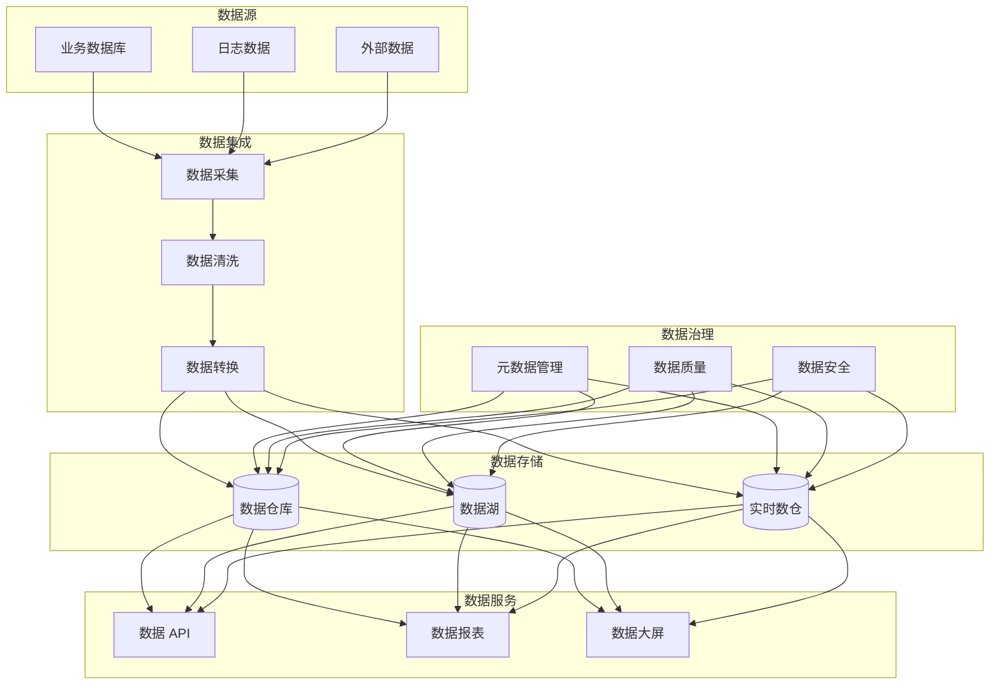

#### 5.5.2 数据分层

| 数据层       | 说明                                         | 存储方式           |
| ------------ | -------------------------------------------- | ------------------ |
| ODS 层       | 原始数据层，保留原始数据                     | 数据湖             |
| DWD 层       | 明细数据层，清洗后的明细数据                 | 数据仓库           |
| DWS 层       | 汇总数据层，按主题汇总                       | 数据仓库           |
| ADS 层       | 应用数据层，面向应用的数据                   | 数据仓库           |

---

### 5.6 终局版：湖仓一体

| 维度             | 说明                                                         |
| ---------------- | ------------------------------------------------------------ |
| **架构特征**     | 湖仓一体，统一数据平台                                       |
| **核心目标**     | 海量数据存储与分析，支持 AI 训练与推理                       |
| **数据规模**     | 数据量 > 50TB，QPS > 10000                                   |

#### 5.6.1 湖仓一体架构

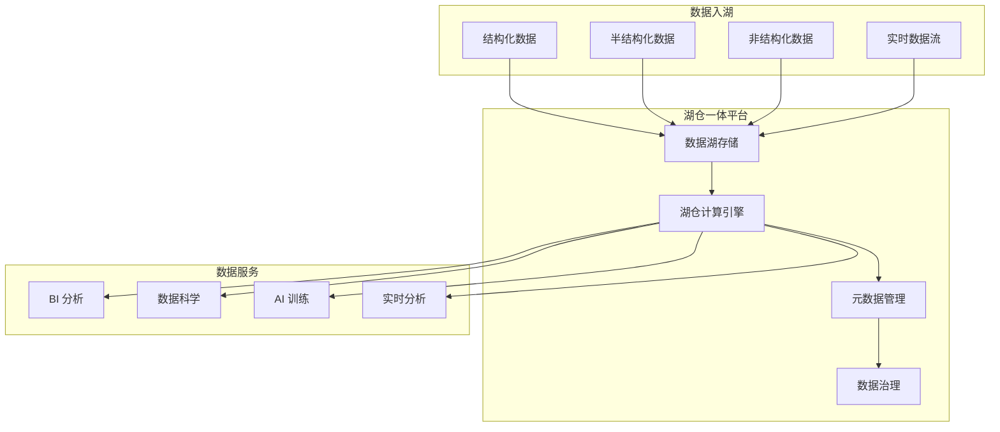

#### 5.6.2 湖仓能力

| 能力维度     | 具体能力                                     | 技术实现           |
| ------------ | -------------------------------------------- | ------------------ |
| 存储能力     | 海量数据存储，多种格式支持                   | 对象存储 + 表格式  |
| 计算能力     | 批处理、流处理、交互式查询                   | Spark + Flink + Trino |
| 治理能力     | 元数据管理、数据质量、数据血缘               | Data Catalog       |
| AI 能力      | 特征存储、模型训练、模型推理                 | MLflow + Feature Store |

---

## 六、AI 架构演进路线

### 6.1 演进总览

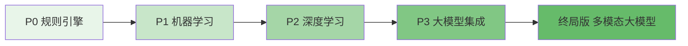

### 6.2 P0 阶段：规则引擎

| 维度             | 说明                                                         |
| ---------------- | ------------------------------------------------------------ |
| **架构特征**     | 基于规则的 AI 辅助，调用外部 LLM API                         |
| **核心目标**     | 快速验证 AI 辅助价值                                         |
| **AI 能力**      | 智能回复推荐、话术辅助、知识问答                             |

#### 6.2.1 AI 架构

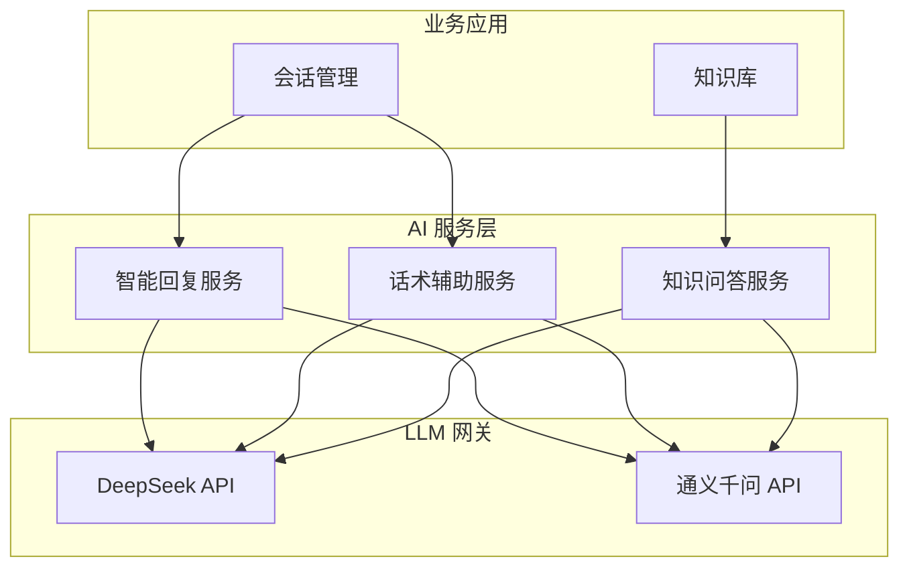

#### 6.2.2 AI 能力范围

| AI 能力      | 实现方式                                     | 边界约束           |
| ------------ | -------------------------------------------- | ------------------ |
| 智能回复     | LLM 生成 + 人工确认                         | 不自动发送         |
| 话术辅助     | 模板匹配 + LLM 优化                         | 不自动执行         |
| 知识问答     | 检索增强生成（RAG）                         | 不修改业务数据     |

---

### 6.3 P1 阶段：机器学习模型

| 维度             | 说明                                                         |
| ---------------- | ------------------------------------------------------------ |
| **架构特征**     | 引入机器学习模型，增强预测能力                               |
| **核心目标**     | 提升业务预测准确性，优化用户体验                             |
| **AI 能力**      | 线索评分、商机预测、客户流失预警                             |

#### 6.3.1 AI 架构

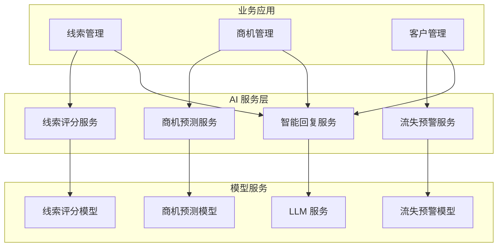

#### 6.3.2 机器学习模型

| 模型名称     | 用途                                         | 算法               |
| ------------ | -------------------------------------------- | ------------------ |
| 线索评分模型 | 预测线索转化概率                             | XGBoost / LightGBM |
| 商机预测模型 | 预测商机成交概率                             | XGBoost / LightGBM |
| 流失预警模型 | 预测客户流失风险                             | 逻辑回归 / XGBoost |

---

### 6.4 P2 阶段：深度学习模型

| 维度             | 说明                                                         |
| ---------------- | ------------------------------------------------------------ |
| **架构特征**     | 深度学习模型，增强语义理解能力                               |
| **核心目标**     | 提升自然语言处理能力，优化智能交互                           |
| **AI 能力**      | 意图识别、情感分析、智能质检、智能推荐                       |

#### 6.4.1 AI 架构

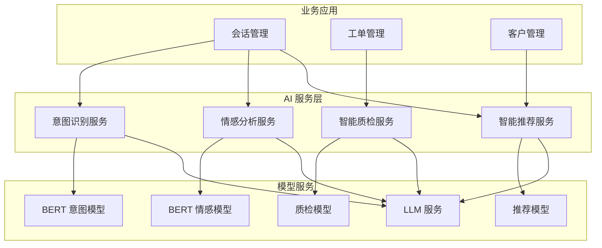

#### 6.4.2 深度学习模型

| 模型名称     | 用途                                         | 算法               |
| ------------ | -------------------------------------------- | ------------------ |
| 意图识别模型 | 识别用户意图                                 | BERT / RoBERTa     |
| 情感分析模型 | 分析用户情感倾向                             | BERT / RoBERTa     |
| 智能质检模型 | 会话质量检测                                 | 深度学习分类模型   |
| 智能推荐模型 | 个性化推荐                                   | 深度学习推荐模型   |

---

### 6.5 P3 阶段：大模型集成

| 维度             | 说明                                                         |
| ---------------- | ------------------------------------------------------------ |
| **架构特征**     | 大模型深度集成，AI Agent 能力                                |
| **核心目标**     | 实现智能化业务流程，AI 辅助决策                              |
| **AI 能力**      | AI Agent、智能工作流、知识图谱、智能报表                     |

#### 6.5.1 AI 架构

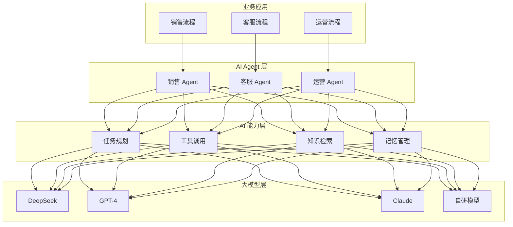

#### 6.5.2 AI Agent 能力

| Agent 类型   | 能力范围                                     | 工具支持           |
| ------------ | -------------------------------------------- | ------------------ |
| 销售 Agent   | 线索跟进、商机推进、客户维护                 | CRM 工具、邮件工具 |
| 客服 Agent   | 问题解答、工单处理、满意度调查               | 知识库、工单系统   |
| 运营 Agent   | 数据分析、报表生成、运营建议                 | BI 工具、数据平台  |

---

### 6.6 终局版：多模态大模型

| 维度             | 说明                                                         |
| ---------------- | ------------------------------------------------------------ |
| **架构特征**     | 多模态大模型，全场景 AI 能力                                 |
| **核心目标**     | 实现多模态智能交互，AI 原生业务                              |
| **AI 能力**      | 多模态理解、多模态生成、自主决策、持续学习                   |

#### 6.6.1 AI 架构

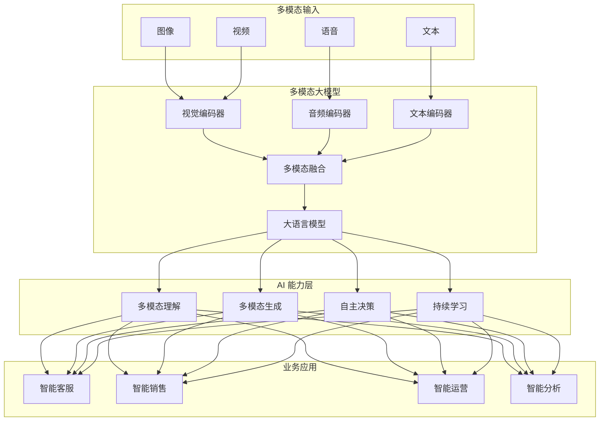

#### 6.6.2 多模态能力

| 能力维度     | 具体能力                                     | 应用场景           |
| ------------ | -------------------------------------------- | ------------------ |
| 视觉理解     | 图像识别、图表理解、文档解析                 | 智能质检、报表分析 |
| 语音理解     | 语音识别、说话人识别、情感识别               | 智能客服、会议记录 |
| 视频理解     | 视频内容理解、关键帧提取                     | 智能监控、培训分析 |
| 多模态生成   | 图文生成、语音合成、视频生成                 | 内容创作、智能营销 |

---

## 七、技术债务清单与偿还计划

### 7.1 技术债务总览

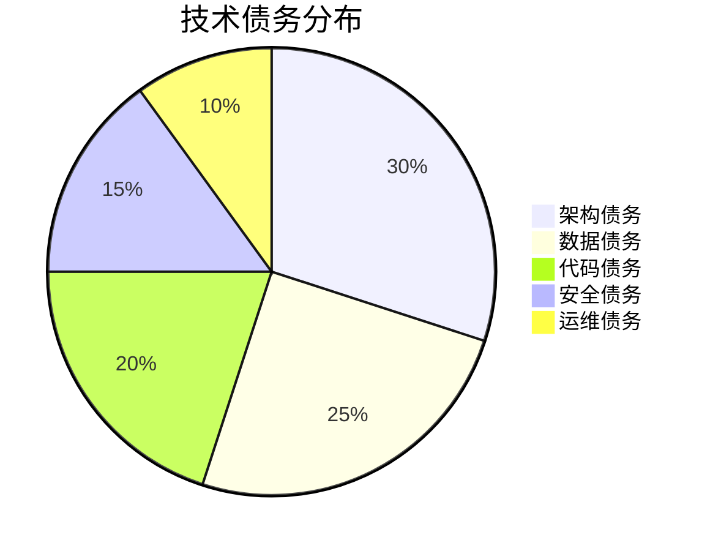

### 7.2 架构债务

| 债务编号     | 债务描述                                     | 产生阶段   | 影响评估           | 偿还阶段   | 偿还方案               |
| ------------ | -------------------------------------------- | ---------- | ------------------ | ---------- | ---------------------- |
| ARCH-001     | 单体架构，模块耦合                           | P0         | 高                 | P1-P2      | 模块化重构 + 服务拆分  |
| ARCH-002     | 无服务发现，硬编码服务地址                   | P0-P1      | 中                 | P2         | 引入服务注册发现       |
| ARCH-003     | 无服务网格，服务治理能力弱                   | P1-P2      | 中                 | P3         | 引入 Istio             |
| ARCH-004     | 单云部署，供应商锁定                         | P0-P3      | 高                 | 终局版     | 多云架构改造           |
| ARCH-005     | 无 Serverless，资源利用率低                  | P0-P2      | 中                 | P3         | 引入 Serverless        |

### 7.3 数据债务

| 债务编号     | 债务描述                                     | 产生阶段   | 影响评估           | 偿还阶段   | 偿还方案               |
| ------------ | -------------------------------------------- | ---------- | ------------------ | ---------- | ---------------------- |
| DATA-001     | 单库，无读写分离                             | P0         | 中                 | P1         | 主从复制 + 读写分离    |
| DATA-002     | 无分库分表，扩展性受限                       | P0-P1      | 高                 | P2         | 分库分表改造           |
| DATA-003     | 无数据中台，数据孤岛                         | P0-P2      | 高                 | P3         | 数据中台建设           |
| DATA-004     | 无数据治理，数据质量难保障                   | P0-P2      | 中                 | P3         | 数据治理体系建设       |
| DATA-005     | 无湖仓一体，AI 数据支持不足                  | P0-P3      | 高                 | 终局版     | 湖仓一体平台建设       |

### 7.4 代码债务

| 债务编号     | 债务描述                                     | 产生阶段   | 影响评估           | 偿还阶段   | 偿还方案               |
| ------------ | -------------------------------------------- | ---------- | ------------------ | ---------- | ---------------------- |
| CODE-001     | 缺乏单元测试，测试覆盖率低                   | P0         | 中                 | P1         | 补充单元测试           |
| CODE-002     | 代码规范不统一，可维护性差                   | P0         | 低                 | P1         | 代码规范 + Lint 工具   |
| CODE-003     | 缺乏 API 文档，接口维护困难                  | P0         | 中                 | P1         | OpenAPI 文档           |
| CODE-004     | 技术栈老旧，依赖版本过低                     | P0-P1      | 中                 | P2         | 技术栈升级             |
| CODE-005     | 缺乏代码审查机制，代码质量难保障             | P0-P1      | 中                 | P2         | Code Review 流程       |

### 7.5 安全债务

| 债务编号     | 债务描述                                     | 产生阶段   | 影响评估           | 偿还阶段   | 偿还方案               |
| ------------ | -------------------------------------------- | ---------- | ------------------ | ---------- | ---------------------- |
| SEC-001      | 无文件上传扫描，安全风险                     | P0         | 高                 | P1         | 病毒扫描服务集成       |
| SEC-002      | 无零信任网络，网络安全边界模糊               | P0-P2      | 中                 | P3         | 零信任网络架构         |
| SEC-003      | 无密钥管理服务，密钥安全风险                 | P0-P1      | 高                 | P2         | Vault 密钥管理         |
| SEC-004      | 无安全审计，安全事件难追溯                   | P0-P1      | 中                 | P2         | 安全审计系统           |
| SEC-005      | 无数据加密，数据安全风险                     | P0-P1      | 高                 | P2         | 数据加密方案           |

### 7.6 运维债务

| 债务编号     | 债务描述                                     | 产生阶段   | 影响评估           | 偿还阶段   | 偿还方案               |
| ------------ | -------------------------------------------- | ---------- | ------------------ | ---------- | ---------------------- |
| OPS-001      | 无自动化部署，部署效率低                     | P0         | 中                 | P1         | CI/CD 流水线           |
| OPS-002      | 无自动化测试，测试效率低                     | P0         | 中                 | P1         | 自动化测试框架         |
| OPS-003      | 无可观测性，问题定位困难                     | P0-P1      | 高                 | P2         | 可观测性体系建设       |
| OPS-004      | 无自动化运维，运维效率低                     | P0-P2      | 中                 | P3         | AIOps 平台             |
| OPS-005      | 无灾备方案，业务连续性风险                   | P0-P2      | 高                 | P3         | 灾备系统建设           |

### 7.7 偿还计划甘特图

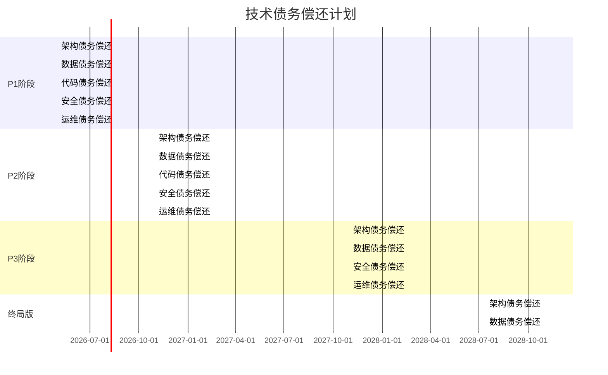

---

## 八、对 P0/P1 的影响

### 8.1 对 P0 阶段的影响

#### 8.1.1 架构决策影响

| 决策项           | P0 决策                   | 演进影响说明                                     |
| ---------------- | ------------------------- | ------------------------------------------------ |
| 单体架构         | 采用单体架构              | 为后续模块化预留接口边界                         |
| 数据库选型       | PostgreSQL                | 支持后续读写分离、分库分表                       |
| 消息队列         | Redis Streams             | 后续可平滑迁移至 Kafka                           |
| 缓存             | Redis                     | 支持后续 Redis Cluster                           |
| API 设计         | RESTful API               | 后续可扩展为 gRPC                                |

#### 8.1.2 代码设计影响

| 设计项           | P0 设计要求               | 演进预留说明                                     |
| ---------------- | ------------------------- | ------------------------------------------------ |
| 模块边界         | 明确模块职责              | 为服务拆分预留边界                               |
| 接口设计         | 接口抽象                  | 为服务间调用预留抽象层                           |
| 数据模型         | 独立数据模型              | 为分库分表预留分片键                             |
| 配置管理         | 外部化配置                | 为多环境部署预留配置能力                         |

#### 8.1.3 基础设施影响

| 基础设施         | P0 配置                   | 演进预留说明                                     |
| ---------------- | ------------------------- | ------------------------------------------------ |
| 容器化           | Docker 容器               | 为 Kubernetes 部署预留                           |
| CI/CD            | 基础流水线                | 为自动化部署预留扩展能力                         |
| 监控             | Prometheus + Grafana      | 为可观测性预留扩展能力                           |
| 日志             | 阿里云 SLS                | 为日志分析预留扩展能力                           |

### 8.2 对 P1 阶段的影响

#### 8.2.1 架构演进影响

| 演进项           | P1 目标                   | 对 P0 的要求                                     |
| ---------------- | ------------------------- | ------------------------------------------------ |
| 模块化重构       | 明确模块边界              | P0 需预留模块接口                                |
| 读写分离         | 主从复制                  | P0 数据模型需支持读写分离                        |
| 多 LLM 支持      | 多供应商                  | P0 LLM Gateway 需支持多供应商                     |
| 文件扫描         | 病毒扫描                  | P0 文件上传需预留扫描接口                        |

#### 8.2.2 数据架构影响

| 演进项           | P1 目标                   | 对 P0 的要求                                     |
| ---------------- | ------------------------- | ------------------------------------------------ |
| 读写分离         | 主从复制                  | P0 SQL 需避免跨库事务                            |
| 数据备份         | 增强备份策略              | P0 需建立备份机制                                |
| 数据归档         | 历史数据归档              | P0 需预留归档字段                                |

#### 8.2.3 AI 架构影响

| 演进项           | P1 目标                   | 对 P0 的要求                                     |
| ---------------- | ------------------------- | ------------------------------------------------ |
| 机器学习模型     | 线索评分、商机预测        | P0 需收集训练数据                                |
| 模型服务         | 模型推理服务              | P0 需预留模型调用接口                            |
| 特征存储         | 特征管理                  | P0 需预留特征数据                                |

### 8.3 风险与缓解措施

#### 8.3.1 架构演进风险

| 风险项           | 风险描述                                     | 缓解措施                                       |
| ---------------- | -------------------------------------------- | ---------------------------------------------- |
| 服务拆分风险     | 服务拆分可能导致数据一致性问题               | 采用分布式事务或最终一致性方案                 |
| 数据迁移风险     | 数据迁移可能导致数据丢失或不一致             | 制定详细迁移方案，充分测试验证                 |
| 技术栈升级风险   | 技术栈升级可能导致兼容性问题                 | 渐进式升级，充分测试验证                       |

#### 8.3.2 业务影响风险

| 风险项           | 风险描述                                     | 缓解措施                                       |
| ---------------- | -------------------------------------------- | ---------------------------------------------- |
| 业务中断风险     | 架构演进可能导致业务中断                     | 采用蓝绿部署、灰度发布策略                     |
| 性能下降风险     | 架构演进可能导致性能下降                     | 性能测试验证，优化瓶颈                         |
| 用户体验风险     | 架构演进可能影响用户体验                     | 用户反馈收集，快速迭代优化                     |

#### 8.3.3 团队风险

| 风险项           | 风险描述                                     | 缓解措施                                       |
| ---------------- | -------------------------------------------- | ---------------------------------------------- |
| 技术能力风险     | 团队技术能力不足以支撑架构演进               | 技术培训、引入专家支持                         |
| 人力资源风险     | 架构演进需要大量人力资源                     | 合理规划人力资源，分阶段实施                   |
| 协作风险         | 架构演进涉及多个团队协作                     | 明确职责分工，建立协作机制                     |

---

## 九、演进决策框架

### 9.1 演进触发条件

| 演进阶段       | 触发条件                                     | 决策依据           |
| ---------------- | -------------------------------------------- | ------------------ |
| P0 → P1         | 用户规模 > 1000 或 QPS > 100                 | 性能监控数据       |
| P1 → P2         | 用户规模 > 10000 或 QPS > 500                | 性能监控数据       |
| P2 → P3         | 用户规模 > 100000 或 QPS > 2000              | 性能监控数据       |
| P3 → 终局版     | 用户规模 > 1000000 或 QPS > 10000            | 性能监控数据       |

### 9.2 演进决策流程

```mermaid
flowchart TD
    A[监控指标采集] --> B{是否达到触发条件}
    B -->|否| A
    B -->|是| C[架构评估]
    C --> D{是否需要演进}
    D -->|否| E[优化当前架构]
    E --> A
    D -->|是| F[制定演进方案]
    F --> G[技术评审]
    G --> H{评审通过}
    H -->|否| F
    H -->|是| I[实施演进]
    I --> J[验证测试]
    J --> K{验证通过}
    K -->|否| I
    K -->|是| L[上线发布]
    L --> A
```

### 9.3 演进原则

| 原则           | 说明                                         |
| ---------------- | -------------------------------------------- |
| 渐进式演进       | 分阶段演进，避免大爆炸式重构                 |
| 业务优先         | 演进不影响业务连续性                         |
| 风险可控         | 充分评估风险，制定应对方案                   |
| 可回滚           | 演进过程支持快速回滚                         |
| 数据安全         | 数据迁移确保数据安全                         |

---

## 十、版本与变更记录

| 版本 | 日期       | 作者           | 变更摘要                     | 状态   |
| ---- | ---------- | -------------- | ---------------------------- | ------ |
| v1.0 | 2026-04-05 | MOY 文档架构组 | 初稿                         | 已确认 |

---

## 十一、依赖文档

| 文档                                                      | 用途             |
| --------------------------------------------------------- | ---------------- |
| [HLD](../P0/09_HLD_系统高层设计.md)                       | 系统架构设计     |
| [技术选型冻结](../P0/36_技术选型冻结.md)                  | 技术选型决策     |
| [终局版产品愿景](./01_终局版产品愿景与阶段演进地图.md)    | 产品演进规划     |
| [终局版AI Agent体系](./09_终局版AI Agent体系与执行治理.md)| AI 架构设计      |

---

## 建议人工确认的问题

1. 技术架构演进路线是否符合业务发展预期？
2. 数据架构演进是否满足数据规模增长需求？
3. AI 架构演进是否与 AI 技术发展趋势匹配？
4. 技术债务偿还计划是否合理可行？
5. 对 P0/P1 的影响评估是否充分？
6. 演进决策框架是否完善？
