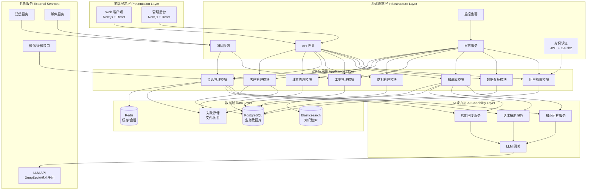
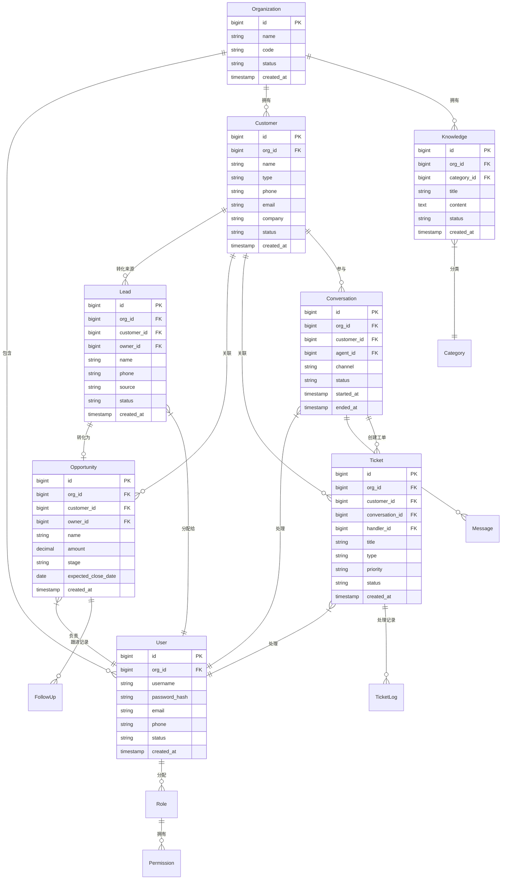
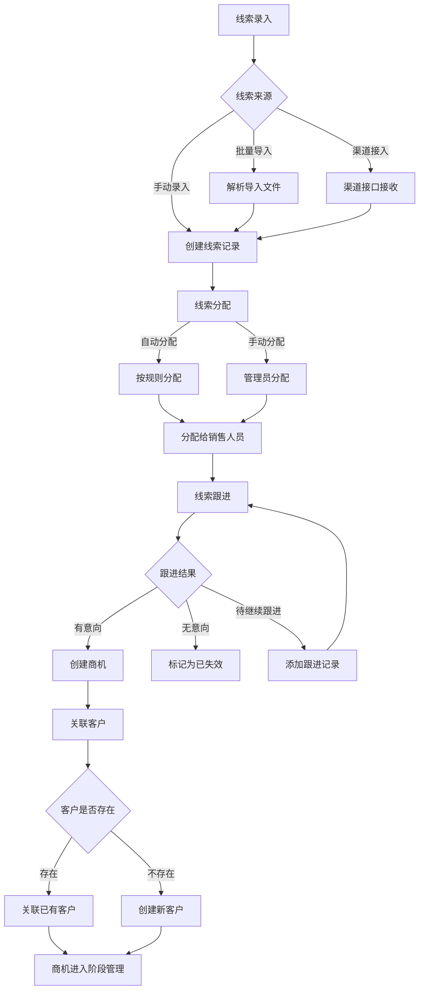
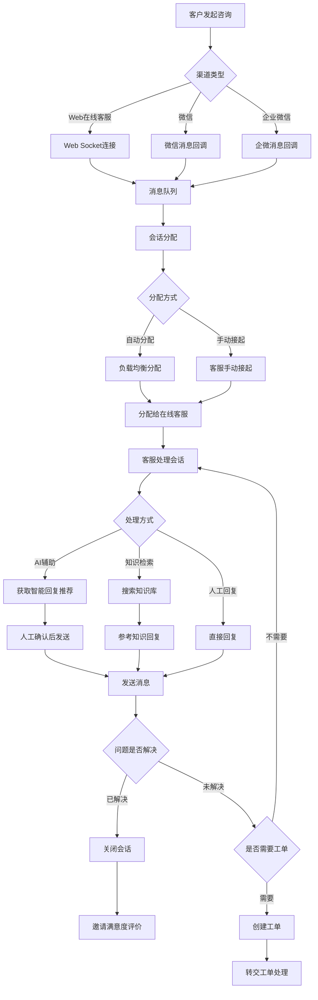
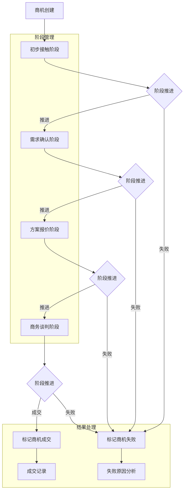
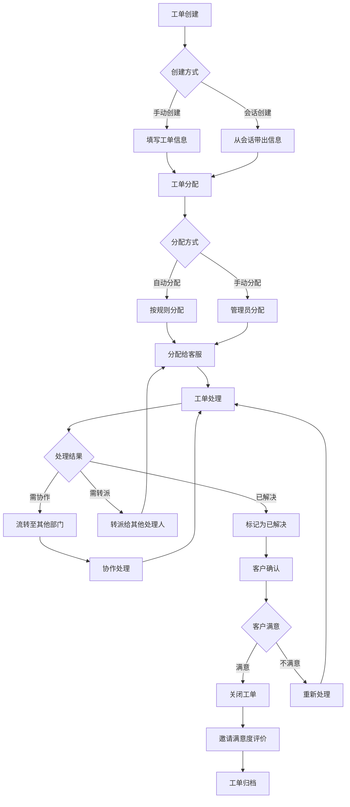
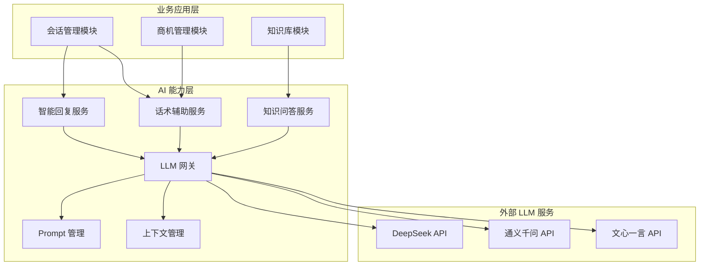

# MOY 系统高层设计（HLD）

---

## 文档元信息

| 属性 | 内容 |
|------|------|
| 文档名称 | MOY 系统高层设计 |
| 文档编号 | MOY_HLD_001 |
| 版本号 | v0.1 |
| 状态 | 草案 |
| 作者 | MOY 文档架构组 |
| 日期 | 2026-04-04 |
| 目标读者 | 技术负责人、架构师、前后端开发、测试工程师 |
| 输入来源 | [BRD](./05_BRD_业务需求说明书.md)、[PRD](./06_PRD_产品需求规格说明书_v0.1.md)、[RTM](./07_RTM_需求跟踪矩阵.md)、[项目章程](./04_项目章程_项目计划.md) |

---

## 一、文档目的

本文档作为 MOY 项目首期 MVP 的**系统概要设计基线**，用于：

1. 将产品需求下沉到系统设计层，形成可指导开发的架构蓝图
2. 定义系统分层架构、模块边界、接口规范
3. 明确 AI 能力在架构中的位置与边界
4. 规范多租户、权限、安全等横切关注点
5. 为详细设计（LLD）、数据库设计（DBD）、API 设计提供输入

**阅读建议：**
- 技术负责人：全文阅读
- 前端开发：重点阅读架构图、模块划分、接口规范
- 后端开发：重点阅读架构图、模块划分、数据层设计
- AI 工程师：重点阅读 AI 能力层设计
- 测试工程师：重点阅读模块边界、验收标准

**重要说明：** 本文档范围限定为首期 MVP，不包含后续规划功能的技术设计。

---

## 二、适用范围

| 维度 | 范围说明 |
|------|----------|
| 产品范围 | MOY 首期 MVP：客户管理、线索管理、会话管理、商机管理、工单管理、知识库（基础版）、数据看板（基础版） |
| 终端范围 | Web 端（SaaS 模式），不支持移动端原生应用 |
| 部署范围 | 云端 SaaS 部署，不支持私有化部署 |
| 用户范围 | 销售型公司、客服团队 |

---

## 三、上游输入文档

| 文档 | 版本 | 用途 |
|------|------|------|
| [00_AGENTS.md](./00_AGENTS.md) | v0.1 | 文档治理规则 |
| [00_Glossary.md](./00_Glossary.md) | v0.1 | 术语定义 |
| [01_Source_Register.md](./01_Source_Register.md) | v0.2 | 技术选型依据 |
| [04_项目章程_项目计划.md](./04_项目章程_项目计划.md) | v0.1 | 项目范围与里程碑 |
| [05_BRD_业务需求说明书.md](./05_BRD_业务需求说明书.md) | v0.1 | 业务需求定义 |
| [06_PRD_产品需求规格说明书_v0.1.md](./06_PRD_产品需求规格说明书_v0.1.md) | v0.1 | 产品需求规格 |
| [07_RTM_需求跟踪矩阵.md](./07_RTM_需求跟踪矩阵.md) | v0.1 | 需求跟踪矩阵 |

---

## 四、系统设计目标与设计原则

### 4.1 设计目标

| 目标维度 | 具体目标 | 可验证标准 |
|----------|----------|------------|
| 功能完整性 | 覆盖 PRD 定义的 P0 功能 | 通过功能测试验收 |
| 性能达标 | 页面加载 < 3s，API 响应 < 500ms | 通过性能测试 |
| 安全合规 | 无高危漏洞，符合数据安全法规 | 通过安全测试 |
| 可扩展性 | 支持后续功能模块扩展 | 架构评审确认 |
| 可维护性 | 代码可读、可测试、可部署 | 代码评审确认 |

### 4.2 设计原则

#### 4.2.1 Web 端优先

| 原则 | 说明 |
|------|------|
| 单一终端 | 首期仅支持 Web 端，不考虑移动端原生应用 |
| 响应式设计 | Web 端支持主流分辨率（1280x720 及以上） |
| 浏览器兼容 | 支持 Chrome、Edge、Safari 主流版本 |

#### 4.2.2 SaaS 模式

| 原则 | 说明 |
|------|------|
| 多租户架构 | 系统从设计之初支持多企业租户隔离 |
| 云端部署 | 采用公有云部署，不支持私有化部署 |
| 订阅计费 | 支持按企业、按用户数订阅（计费系统延后） |

#### 4.2.3 多租户隔离

| 隔离维度 | 隔离策略 |
|----------|----------|
| 数据隔离 | 企业级数据隔离，租户间数据不可见 |
| 权限隔离 | 租户内权限独立，跨租户权限隔离 |
| 配置隔离 | 租户级配置独立（如知识库、话术模板） |

#### 4.2.4 AI 原生但非 AI 黑盒

| 原则 | 说明 |
|------|------|
| AI 可控 | AI 输出可追溯、可审计、可干预 |
| AI 辅助 | AI 作为辅助能力，不直接决定高风险业务动作 |
| 降级方案 | AI 服务不可用时，系统可降级为纯人工模式 |

#### 4.2.5 可追溯、可审计、可灰度演进

| 原则 | 说明 |
|------|------|
| 操作追溯 | 关键业务操作记录操作日志 |
| 数据审计 | 敏感数据变更记录审计日志 |
| 灰度发布 | 支持按租户、按用户灰度发布新功能 |

---

## 五、系统总体架构

### 5.1 总体架构图



### 5.2 各层职责与边界

#### 5.2.1 前端展示层

| 组件 | 职责 | 技术选型 | 边界 |
|------|------|----------|------|
| Web 客户端 | 用户交互界面、数据展示、表单验证 | Next.js + React + TypeScript | 不包含业务逻辑，仅负责展示和交互 |
| 管理后台 | 系统管理、配置管理、监控 | Next.js + React + TypeScript | 仅管理员可访问 |

#### 5.2.2 业务应用层

| 组件 | 职责 | 边界 |
|------|------|------|
| 客户管理模块 | 客户档案、客户画像、客户分组、客户标签 | 不包含销售预测功能 |
| 线索管理模块 | 线索录入、分配、跟进、转化 | 不包含营销自动化 |
| 会话管理模块 | 多渠道接入、消息收发、会话分配、会话转接 | 不包含视频会议 |
| 商机管理模块 | 商机创建、阶段管理、跟进记录、商机预测 | 不包含合同/订单管理 |
| 工单管理模块 | 工单创建、分配、流转、关闭、统计 | 不包含自动化工单处理 |
| 知识库模块 | 知识检索、AI 问答、知识管理 | 不包含知识自动生成 |
| 数据看板模块 | 核心指标展示、趋势图表 | 不包含高级报表 |
| 用户权限模块 | 用户管理、角色管理、权限控制 | 不包含跨租户权限 |

#### 5.2.3 AI 能力层

| 组件 | 职责 | 边界 |
|------|------|------|
| 智能回复服务 | 基于知识库推荐回复内容 | 不自动发送，需人工确认 |
| 话术辅助服务 | 根据场景推荐话术模板 | 不自动执行业务动作 |
| 知识问答服务 | 基于知识库回答问题 | 不直接修改业务数据 |
| LLM 网关 | 统一 LLM 调用、Token 管理、降级控制 | 不存储敏感业务数据 |

#### 5.2.4 数据层

| 组件 | 职责 | 技术选型 |
|------|------|----------|
| PostgreSQL | 业务数据持久化 | PostgreSQL 15+ |
| Redis | 会话缓存、热点数据缓存、分布式锁 | Redis 7+ |
| Elasticsearch | 知识库全文检索 | Elasticsearch 8+ |
| 对象存储 | 文件、附件存储 | 阿里云 OSS / 腾讯云 COS |

#### 5.2.5 基础设施层

| 组件 | 职责 | 技术选型 |
|------|------|----------|
| API 网关 | 请求路由、限流、认证 | Kong / Nginx |
| 消息队列 | 异步消息处理、解耦 | RabbitMQ / Redis Stream |
| 日志服务 | 日志收集、存储、查询 | ELK / 阿里云 SLS |
| 监控告警 | 系统监控、业务监控、告警 | Prometheus + Grafana |
| 身份认证 | JWT Token 管理、OAuth2 集成 | JWT + Redis |

#### 5.2.6 外部服务

| 组件 | 职责 | 备选方案 |
|------|------|----------|
| LLM API | 大模型调用 | DeepSeek / 通义千问 / 文心一言 |
| 短信服务 | 验证码、通知短信 | 阿里云短信 / 腾讯云短信 |
| 邮件服务 | 通知邮件 | 阿里云邮件 / 腾讯云 SES |
| 微信/企微接口 | 微信渠道接入 | 微信开放平台 / 企业微信 API |

---

## 六、核心模块划分

### 6.1 模块总览

| 模块编号 | 模块名称 | 职责 | 优先级 | 状态 |
|----------|----------|------|--------|------|
| MOD-001 | 客户管理 | 客户档案、客户画像、客户分组、客户标签 | P0 | 待开发 |
| MOD-002 | 线索管理 | 线索录入、分配、跟进、转化 | P0 | 待开发 |
| MOD-003 | 会话管理 | 多渠道接入、消息收发、会话分配、会话转接 | P0 | 待开发 |
| MOD-004 | 商机管理 | 商机创建、阶段管理、跟进记录、商机预测 | P0 | 待开发 |
| MOD-005 | 工单管理 | 工单创建、分配、流转、关闭、统计 | P0 | 待开发 |
| MOD-006 | 知识库 | 知识检索、AI 问答、知识管理 | P1 | 待开发 |
| MOD-007 | 用户与权限 | 用户管理、角色管理、权限控制 | P0 | 待开发 |
| MOD-008 | 日志与审计 | 操作日志、审计日志、数据变更记录 | P0 | 待开发 |
| MOD-009 | 数据看板 | 核心指标展示、趋势图表 | P1 | 待开发 |

### 6.2 模块详细说明

#### 6.2.1 客户管理模块（MOD-001）

| 维度 | 说明 |
|------|------|
| **职责** | 管理客户档案、客户画像、客户分组、客户标签 |
| **输入** | 客户基本信息、联系方式、企业信息、标签数据 |
| **输出** | 客户列表、客户详情、客户画像、客户分组列表 |
| **依赖** | 用户权限模块（权限控制）、日志审计模块（操作记录） |
| **优先级** | P0 |
| **关联需求** | REQ-CM-001 ~ REQ-CM-007 |

**核心接口：**

| 接口 | 方法 | 说明 |
|------|------|------|
| /api/v1/customers | GET | 获取客户列表 |
| /api/v1/customers | POST | 创建客户 |
| /api/v1/customers/{id} | GET | 获取客户详情 |
| /api/v1/customers/{id} | PUT | 更新客户信息 |
| /api/v1/customers/{id}/tags | POST | 添加客户标签 |
| /api/v1/customers/{id}/tags/{tagId} | DELETE | 移除客户标签 |
| /api/v1/customer-groups | GET | 获取客户分组列表 |
| /api/v1/customer-groups | POST | 创建客户分组 |

#### 6.2.2 线索管理模块（MOD-002）

| 维度 | 说明 |
|------|------|
| **职责** | 管理线索录入、分配、跟进、转化 |
| **输入** | 线索信息（姓名、电话、公司、来源）、分配规则、跟进记录 |
| **输出** | 线索列表、线索详情、线索统计、转化记录 |
| **依赖** | 客户管理模块（转化关联）、用户权限模块（权限控制）、日志审计模块 |
| **优先级** | P0 |
| **关联需求** | REQ-LM-001 ~ REQ-LM-008 |

**核心接口：**

| 接口 | 方法 | 说明 |
|------|------|------|
| /api/v1/leads | GET | 获取线索列表 |
| /api/v1/leads | POST | 创建线索 |
| /api/v1/leads/import | POST | 批量导入线索 |
| /api/v1/leads/{id} | GET | 获取线索详情 |
| /api/v1/leads/{id}/assign | POST | 分配线索 |
| /api/v1/leads/{id}/follow-ups | POST | 添加跟进记录 |
| /api/v1/leads/{id}/convert | POST | 转化为商机 |
| /api/v1/leads/statistics | GET | 获取线索统计 |

#### 6.2.3 会话管理模块（MOD-003）

| 维度 | 说明 |
|------|------|
| **职责** | 管理多渠道接入、消息收发、会话分配、会话转接 |
| **输入** | 多渠道消息（Web、微信、企微）、分配规则、转接请求 |
| **输出** | 会话列表、会话详情、消息记录、智能回复推荐 |
| **依赖** | 客户管理模块（客户关联）、工单管理模块（工单创建）、AI 能力层、用户权限模块 |
| **优先级** | P0 |
| **关联需求** | REQ-SM-001 ~ REQ-SM-009 |

**核心接口：**

| 接口 | 方法 | 说明 |
|------|------|------|
| /api/v1/conversations | GET | 获取会话列表 |
| /api/v1/conversations/{id} | GET | 获取会话详情 |
| /api/v1/conversations/{id}/messages | GET | 获取消息记录 |
| /api/v1/conversations/{id}/messages | POST | 发送消息 |
| /api/v1/conversations/{id}/assign | POST | 分配会话 |
| /api/v1/conversations/{id}/transfer | POST | 转接会话 |
| /api/v1/conversations/{id}/close | POST | 关闭会话 |
| /api/v1/conversations/{id}/smart-reply | GET | 获取智能回复推荐 |
| /ws/conversations | WebSocket | 实时消息连接 |

#### 6.2.4 商机管理模块（MOD-004）

| 维度 | 说明 |
|------|------|
| **职责** | 管理商机创建、阶段管理、跟进记录、商机预测 |
| **输入** | 商机信息（客户、金额、预期成交日期）、阶段变更、跟进记录 |
| **输出** | 商机列表、商机详情、商机统计、商机预测 |
| **依赖** | 客户管理模块（客户关联）、线索管理模块（转化来源）、用户权限模块 |
| **优先级** | P0 |
| **关联需求** | REQ-OM-001 ~ REQ-OM-008 |

**核心接口：**

| 接口 | 方法 | 说明 |
|------|------|------|
| /api/v1/opportunities | GET | 获取商机列表 |
| /api/v1/opportunities | POST | 创建商机 |
| /api/v1/opportunities/{id} | GET | 获取商机详情 |
| /api/v1/opportunities/{id} | PUT | 更新商机信息 |
| /api/v1/opportunities/{id}/stage | PUT | 变更商机阶段 |
| /api/v1/opportunities/{id}/follow-ups | POST | 添加跟进记录 |
| /api/v1/opportunities/statistics | GET | 获取商机统计 |
| /api/v1/opportunities/{id}/predict | GET | 获取商机预测 |

#### 6.2.5 工单管理模块（MOD-005）

| 维度 | 说明 |
|------|------|
| **职责** | 管理工单创建、分配、流转、关闭、统计 |
| **输入** | 工单信息（标题、类型、优先级、描述）、分配规则、处理记录 |
| **输出** | 工单列表、工单详情、工单统计、处理记录 |
| **依赖** | 客户管理模块（客户关联）、会话管理模块（会话关联）、用户权限模块 |
| **优先级** | P0 |
| **关联需求** | REQ-TM-001 ~ REQ-TM-009 |

**核心接口：**

| 接口 | 方法 | 说明 |
|------|------|------|
| /api/v1/tickets | GET | 获取工单列表 |
| /api/v1/tickets | POST | 创建工单 |
| /api/v1/tickets/{id} | GET | 获取工单详情 |
| /api/v1/tickets/{id} | PUT | 更新工单信息 |
| /api/v1/tickets/{id}/assign | POST | 分配工单 |
| /api/v1/tickets/{id}/transfer | POST | 转派工单 |
| /api/v1/tickets/{id}/resolve | POST | 解决工单 |
| /api/v1/tickets/{id}/close | POST | 关闭工单 |
| /api/v1/tickets/statistics | GET | 获取工单统计 |

#### 6.2.6 知识库模块（MOD-006）

| 维度 | 说明 |
|------|------|
| **职责** | 管理知识检索、AI 问答、知识管理 |
| **输入** | 知识内容、分类信息、检索关键词、用户问题 |
| **输出** | 知识列表、知识详情、检索结果、AI 回答 |
| **依赖** | AI 能力层（知识问答服务）、用户权限模块 |
| **优先级** | P1 |
| **关联需求** | REQ-KB-001 ~ REQ-KB-006 |

**核心接口：**

| 接口 | 方法 | 说明 |
|------|------|------|
| /api/v1/knowledge | GET | 获取知识列表 |
| /api/v1/knowledge | POST | 创建知识 |
| /api/v1/knowledge/{id} | GET | 获取知识详情 |
| /api/v1/knowledge/{id} | PUT | 更新知识内容 |
| /api/v1/knowledge/search | GET | 知识检索 |
| /api/v1/knowledge/qa | POST | AI 问答 |
| /api/v1/knowledge/categories | GET | 获取知识分类 |
| /api/v1/knowledge/categories | POST | 创建知识分类 |

#### 6.2.7 用户与权限模块（MOD-007）

| 维度 | 说明 |
|------|------|
| **职责** | 管理用户管理、角色管理、权限控制 |
| **输入** | 用户信息、角色信息、权限配置 |
| **输出** | 用户列表、角色列表、权限验证结果 |
| **依赖** | 基础设施层（身份认证） |
| **优先级** | P0 |
| **关联需求** | REQ-SYS-001 ~ REQ-SYS-003 |

**核心接口：**

| 接口 | 方法 | 说明 |
|------|------|------|
| /api/v1/auth/login | POST | 用户登录 |
| /api/v1/auth/logout | POST | 用户登出 |
| /api/v1/auth/refresh | POST | 刷新 Token |
| /api/v1/users | GET | 获取用户列表 |
| /api/v1/users | POST | 创建用户 |
| /api/v1/users/{id} | GET | 获取用户详情 |
| /api/v1/users/{id} | PUT | 更新用户信息 |
| /api/v1/roles | GET | 获取角色列表 |
| /api/v1/roles | POST | 创建角色 |
| /api/v1/permissions | GET | 获取权限列表 |

#### 6.2.8 日志与审计模块（MOD-008）

| 维度 | 说明 |
|------|------|
| **职责** | 管理操作日志、审计日志、数据变更记录 |
| **输入** | 操作事件、数据变更事件 |
| **输出** | 日志列表、审计报告 |
| **依赖** | 所有业务模块 |
| **优先级** | P0 |
| **关联需求** | 系统非功能需求 |

**核心功能：**

| 功能 | 说明 |
|------|------|
| 操作日志 | 记录用户登录、数据操作、系统配置变更 |
| 审计日志 | 记录敏感数据访问、权限变更、数据导出 |
| 数据变更记录 | 记录关键业务数据的变更历史 |

#### 6.2.9 数据看板模块（MOD-009）

| 维度 | 说明 |
|------|------|
| **职责** | 管理核心指标展示、趋势图表 |
| **输入** | 业务数据（线索、商机、工单、会话） |
| **输出** | 销售看板、客服看板、全览看板 |
| **依赖** | 所有业务模块（数据聚合）、用户权限模块 |
| **优先级** | P1 |
| **关联需求** | REQ-DB-001 ~ REQ-DB-004 |

**核心接口：**

| 接口 | 方法 | 说明 |
|------|------|------|
| /api/v1/dashboards/sales | GET | 获取销售看板数据 |
| /api/v1/dashboards/service | GET | 获取客服看板数据 |
| /api/v1/dashboards/overview | GET | 获取全览看板数据 |
| /api/v1/dashboards/trends | GET | 获取趋势数据 |

---

## 七、关键业务对象与模块关系

### 7.1 核心业务对象

| 对象 | 英文 | 说明 | 所属模块 |
|------|------|------|----------|
| 客户 | Customer | 客户档案，包含基本信息、联系方式、企业信息 | 客户管理 |
| 线索 | Lead | 潜在客户信息，尚未转化为商机 | 线索管理 |
| 会话 | Conversation | 客户与客服/销售的沟通交互 | 会话管理 |
| 消息 | Message | 会话中的单条消息 | 会话管理 |
| 商机 | Opportunity | 有明确购买意向的销售机会 | 商机管理 |
| 工单 | Ticket | 客户问题或请求的服务记录 | 工单管理 |
| 知识条目 | Knowledge | 知识库中的单条知识 | 知识库 |
| 用户 | User | 系统用户 | 用户权限 |
| 角色 | Role | 用户角色 | 用户权限 |
| 组织 | Organization | 企业租户 | 用户权限 |

### 7.2 对象关系图



### 7.3 对象关系说明

| 关系 | 说明 | 基数 |
|------|------|------|
| 组织 → 用户 | 一个组织包含多个用户 | 1:N |
| 组织 → 客户 | 一个组织拥有多个客户 | 1:N |
| 客户 → 线索 | 一个客户可对应多个线索（不同时期） | 1:N |
| 线索 → 商机 | 一个线索可转化为一个商机 | 1:1 |
| 客户 → 商机 | 一个客户可有多个商机 | 1:N |
| 客户 → 会话 | 一个客户可有多个会话 | 1:N |
| 会话 → 工单 | 一个会话可创建多个工单 | 1:N |
| 客户 → 工单 | 一个客户可有多个工单 | 1:N |
| 用户 → 角色 | 一个用户可有多个角色 | N:M |

---

## 八、核心业务流程（系统视角）

### 8.1 线索进入并转客户流程



### 8.2 会话触发与人工接管流程



### 8.3 商机推进流程



### 8.4 工单闭环流程



---

## 九、AI 能力在架构中的位置

### 9.1 AI 能力架构图



### 9.2 AI 能力详细说明

#### 9.2.1 智能回复服务

| 维度 | 说明 |
|------|------|
| **功能** | 基于客户问题，推荐回复内容 |
| **输入** | 客户消息、会话上下文、客户信息 |
| **输出** | 推荐回复列表（按相关性排序） |
| **调用场景** | 会话管理模块 |
| **优先级** | P0 |

**技术实现：**

| 组件 | 说明 |
|------|------|
| 意图识别 | 识别客户问题意图 |
| 知识召回 | 从知识库召回相关知识 |
| 答案生成 | 基于召回知识生成回复 |
| 排序过滤 | 对候选回复排序过滤 |

#### 9.2.2 话术辅助服务

| 维度 | 说明 |
|------|------|
| **功能** | 根据场景推荐话术模板 |
| **输入** | 场景类型、客户信息、会话上下文 |
| **输出** | 话术模板列表 |
| **调用场景** | 会话管理模块、商机管理模块 |
| **优先级** | P0 |

**技术实现：**

| 组件 | 说明 |
|------|------|
| 场景识别 | 识别当前对话场景 |
| 模板匹配 | 匹配话术模板库 |
| 个性化调整 | 根据客户信息调整话术 |

#### 9.2.3 知识问答服务

| 维度 | 说明 |
|------|------|
| **功能** | 基于知识库回答问题 |
| **输入** | 用户问题、知识库范围 |
| **输出** | AI 生成的答案 |
| **调用场景** | 知识库模块 |
| **优先级** | P1 |

**技术实现：**

| 组件 | 说明 |
|------|------|
| 问题理解 | 理解用户问题意图 |
| 知识检索 | 从知识库检索相关知识 |
| 答案生成 | 基于检索结果生成答案 |
| 来源标注 | 标注答案来源 |

### 9.3 AI 边界约束

#### 9.3.1 AI 不直接决定的高风险业务动作

| 业务动作 | AI 角色 | 人工角色 |
|----------|---------|----------|
| 发送消息给客户 | 推荐回复内容 | 人工确认后发送 |
| 修改客户信息 | 不参与 | 人工操作 |
| 关闭商机 | 不参与 | 人工操作 |
| 关闭工单 | 不参与 | 人工操作 |
| 数据导出 | 不参与 | 人工操作 |
| 权限变更 | 不参与 | 人工操作 |

#### 9.3.2 AI 输出审计

| 审计项 | 说明 |
|--------|------|
| 输入记录 | 记录 AI 服务的输入内容 |
| 输出记录 | 记录 AI 服务的输出内容 |
| 调用统计 | 统计 AI 服务调用次数、Token 消耗 |
| 质量评估 | 评估 AI 回复质量（用户反馈） |

#### 9.3.3 AI 降级方案

| 场景 | 降级策略 |
|------|----------|
| LLM API 不可用 | 显示提示，降级为纯人工服务 |
| LLM 响应超时 | 返回默认提示，建议人工处理 |
| Token 配额耗尽 | 限制调用频率，优先保障核心功能 |

---

## 十、权限与多租户设计原则

### 10.1 多租户架构

#### 10.1.1 租户隔离策略

| 隔离维度 | 隔离策略 | 实现方式 |
|----------|----------|----------|
| 数据隔离 | 行级数据隔离 | 所有业务表增加 org_id 字段 |
| 权限隔离 | 租户内权限独立 | 权限数据关联 org_id |
| 配置隔离 | 租户级配置独立 | 配置表关联 org_id |
| 文件隔离 | 租户文件隔离存储 | 文件路径包含 org_id |

#### 10.1.2 租户数据访问控制

```sql
SELECT * FROM customers 
WHERE org_id = :current_org_id 
AND [其他业务条件];
```

**实现原则：**
- 所有业务查询必须包含 org_id 过滤条件
- 使用数据库视图或中间件自动注入 org_id 条件
- 禁止跨租户数据访问

### 10.2 权限模型设计

#### 10.2.1 RBAC 模型


#### 10.2.2 角色定义

| 角色 | 角色编码 | 权限范围 | 说明 |
|------|----------|----------|------|
| 管理员 | admin | 全部权限 | 企业管理员，管理系统配置 |
| 销售经理 | sales_manager | 销售相关全部权限 + 团队管理 | 销售团队管理者 |
| 销售人员 | sales_rep | 个人客户/线索/商机 + 知识库 | 一线销售 |
| 客服经理 | service_manager | 客服相关全部权限 + 团队管理 | 客服团队管理者 |
| 客服专员 | service_agent | 个人工单 + 知识库 | 一线客服 |

#### 10.2.3 权限矩阵

| 功能模块 | 管理员 | 销售经理 | 销售人员 | 客服经理 | 客服专员 |
|----------|--------|----------|----------|----------|----------|
| 客户管理 | 全部 | 团队 | 个人 | - | - |
| 线索管理 | 全部 | 团队 | 个人 | - | - |
| 会话管理 | 全部 | - | - | 团队 | 个人 |
| 商机管理 | 全部 | 团队 | 个人 | - | - |
| 工单管理 | 全部 | - | - | 团队 | 个人 |
| 知识库 | 全部 | 查看 | 查看 | 管理 | 查看 |
| 数据看板 | 全部 | 销售 | 销售 | 客服 | 客服 |
| 系统设置 | 全部 | - | - | - | - |

### 10.3 数据权限原则

#### 10.3.1 数据权限层级

| 层级 | 说明 | 适用角色 |
|------|------|----------|
| 全部数据 | 可查看租户内所有数据 | 管理员 |
| 团队数据 | 可查看所属团队的数据 | 销售经理、客服经理 |
| 个人数据 | 仅可查看自己的数据 | 销售人员、客服专员 |

#### 10.3.2 数据权限实现

| 实现方式 | 说明 |
|----------|------|
| 查询过滤 | 根据用户角色自动注入数据权限条件 |
| 字段脱敏 | 敏感字段根据权限脱敏显示 |
| 操作审计 | 敏感数据操作记录审计日志 |

---

## 十一、非功能设计

### 11.1 安全设计

#### 11.1.1 认证与授权

| 安全项 | 设计方案 |
|--------|----------|
| 身份认证 | JWT Token + Refresh Token |
| 密码存储 | bcrypt 加密存储 |
| 会话管理 | Redis 存储 Session，支持强制登出 |
| 单点登录 | 预留 SSO 接口，首期不实现 |

#### 11.1.2 数据安全

| 安全项 | 设计方案 |
|--------|----------|
| 传输加密 | HTTPS 全站加密 |
| 存储加密 | 敏感字段 AES 加密存储 |
| 数据脱敏 | 日志中敏感数据脱敏 |
| 数据备份 | 每日自动备份，保留 30 天 |

#### 11.1.3 接口安全

| 安全项 | 设计方案 |
|--------|----------|
| 接口认证 | 所有接口需携带有效 Token |
| 接口限流 | 按用户/IP 限流，防止滥用 |
| 参数校验 | 严格校验输入参数，防止注入攻击 |
| 跨域控制 | 配置 CORS 白名单 |

### 11.2 性能设计

#### 11.2.1 性能指标

| 指标 | 目标值 | 说明 |
|------|--------|------|
| 页面加载时间 | < 3 秒 | 首屏加载时间 |
| API 响应时间 | < 500ms | 95% 分位 |
| 并发用户数 | 100 | 首期规模 |
| 系统可用性 | > 99.5% | 年度可用性 |

#### 11.2.2 性能优化策略

| 优化项 | 策略 |
|--------|------|
| 前端优化 | 代码分割、懒加载、CDN 加速 |
| 接口优化 | 缓存热点数据、数据库索引优化 |
| 数据库优化 | 读写分离（后续）、连接池管理 |
| 缓存策略 | Redis 缓存热点数据，本地缓存配置 |

### 11.3 可用性设计

#### 11.3.1 高可用策略

| 策略 | 说明 |
|------|------|
| 服务冗余 | 核心服务多实例部署 |
| 数据库高可用 | 主从复制，自动故障转移 |
| 缓存高可用 | Redis Sentinel / Cluster |
| 负载均衡 | Nginx 负载均衡 |

#### 11.3.2 容灾策略

| 策略 | 说明 |
|------|------|
| 数据备份 | 每日自动备份，异地存储 |
| 服务降级 | 核心功能优先，非核心功能可降级 |
| 熔断限流 | 防止级联故障 |

### 11.4 扩展性设计

#### 11.4.1 水平扩展

| 扩展点 | 扩展方式 |
|--------|----------|
| 应用服务 | 无状态设计，支持水平扩展 |
| 数据库 | 预留读写分离、分库分表接口 |
| 缓存 | Redis Cluster 支持水平扩展 |
| 消息队列 | 支持集群部署 |

#### 11.4.2 功能扩展

| 扩展点 | 扩展方式 |
|--------|----------|
| 新模块 | 模块化设计，支持新增模块 |
| 新渠道 | 渠道适配器模式，支持新增渠道 |
| 新 AI 能力 | AI 服务插件化，支持新增能力 |

### 11.5 可观测性设计

#### 11.5.1 日志设计

| 日志类型 | 内容 | 存储方式 |
|----------|------|----------|
| 访问日志 | 请求访问记录 | ELK / SLS |
| 业务日志 | 业务操作记录 | ELK / SLS |
| 错误日志 | 异常错误记录 | ELK / SLS |
| 审计日志 | 敏感操作记录 | 数据库 + ELK |

#### 11.5.2 监控设计

| 监控类型 | 监控内容 | 工具 |
|----------|----------|------|
| 系统监控 | CPU、内存、磁盘、网络 | Prometheus + Grafana |
| 应用监控 | 请求量、响应时间、错误率 | Prometheus + Grafana |
| 业务监控 | 核心业务指标 | Prometheus + Grafana |
| 日志监控 | 异常日志告警 | ELK Alert |

#### 11.5.3 告警设计

| 告警类型 | 触发条件 | 通知方式 |
|----------|----------|----------|
| 系统告警 | CPU > 80%、内存 > 85% | 邮件、短信 |
| 应用告警 | 错误率 > 1%、响应时间 > 1s | 邮件、短信 |
| 业务告警 | 核心指标异常 | 邮件 |

---

## 十二、模块与 PRD / RTM 映射表

### 12.1 模块需求映射

| 模块 | 需求ID | 优先级 | 说明 |
|------|--------|--------|------|
| **客户管理** | REQ-CM-001 | P0 | 客户创建 |
| | REQ-CM-002 | P0 | 客户编辑 |
| | REQ-CM-003 | P0 | 客户查询 |
| | REQ-CM-004 | P0 | 客户详情 |
| | REQ-CM-005 | P0 | 客户分组 |
| | REQ-CM-006 | P0 | 客户标签 |
| | REQ-CM-007 | P1 | 团队客户列表 |
| **线索管理** | REQ-LM-001 | P0 | 线索录入 |
| | REQ-LM-002 | P0 | 线索导入 |
| | REQ-LM-003 | P0 | 线索分配 |
| | REQ-LM-004 | P0 | 线索跟进记录 |
| | REQ-LM-005 | P0 | 线索状态管理 |
| | REQ-LM-006 | P0 | 线索转化 |
| | REQ-LM-007 | P0 | 线索统计 |
| | REQ-LM-008 | P1 | 自动分配规则 |
| **会话管理** | REQ-SM-001 | P0 | 渠道接入 |
| | REQ-SM-002 | P0 | 会话列表 |
| | REQ-SM-003 | P0 | 会话详情 |
| | REQ-SM-004 | P0 | 消息发送 |
| | REQ-SM-005 | P0 | 智能回复推荐 |
| | REQ-SM-006 | P0 | 话术辅助 |
| | REQ-SM-007 | P0 | 会话分配 |
| | REQ-SM-008 | P0 | 会话转接 |
| | REQ-SM-009 | P1 | 会话监控 |
| **商机管理** | REQ-OM-001 | P0 | 商机创建 |
| | REQ-OM-002 | P0 | 商机列表 |
| | REQ-OM-003 | P0 | 商机详情 |
| | REQ-OM-004 | P0 | 商机阶段管理 |
| | REQ-OM-005 | P0 | 商机跟进记录 |
| | REQ-OM-006 | P0 | 商机阶段变更 |
| | REQ-OM-007 | P0 | 商机统计 |
| | REQ-OM-008 | P1 | 商机预测 |
| **工单管理** | REQ-TM-001 | P0 | 工单创建 |
| | REQ-TM-002 | P0 | 工单列表 |
| | REQ-TM-003 | P0 | 工单详情 |
| | REQ-TM-004 | P0 | 工单分配 |
| | REQ-TM-005 | P0 | 工单处理 |
| | REQ-TM-006 | P0 | 工单流转 |
| | REQ-TM-007 | P0 | 工单转派 |
| | REQ-TM-008 | P0 | 工单关闭 |
| | REQ-TM-009 | P0 | 工单统计 |
| **知识库** | REQ-KB-001 | P0 | 知识检索 |
| | REQ-KB-002 | P0 | 知识详情 |
| | REQ-KB-003 | P0 | AI 问答 |
| | REQ-KB-004 | P1 | 知识分类 |
| | REQ-KB-005 | P1 | 知识管理 |
| | REQ-KB-006 | P1 | 知识审核 |
| **数据看板** | REQ-DB-001 | P0 | 销售看板 |
| | REQ-DB-002 | P0 | 客服看板 |
| | REQ-DB-003 | P1 | 全览看板 |
| | REQ-DB-004 | P0 | 趋势图表 |
| **系统管理** | REQ-SYS-001 | P0 | 登录功能 |
| | REQ-SYS-002 | P0 | 权限控制 |
| | REQ-SYS-003 | P1 | 用户管理 |

### 12.2 P0 需求覆盖检查

| 模块 | P0 需求数 | 已覆盖 | 状态 |
|------|-----------|--------|------|
| 客户管理 | 6 | 6 | ✅ 完整 |
| 线索管理 | 7 | 7 | ✅ 完整 |
| 会话管理 | 8 | 8 | ✅ 完整 |
| 商机管理 | 7 | 7 | ✅ 完整 |
| 工单管理 | 9 | 9 | ✅ 完整 |
| 知识库 | 0 | 0 | ✅ P1模块 |
| 数据看板 | 0 | 0 | ✅ P1模块 |
| 系统管理 | 2 | 2 | ✅ 完整 |
| **合计** | **39** | **39** | ✅ 完整 |

---

## 十三、技术边界与暂不纳入项

### 13.1 技术边界

| 边界类型 | 说明 |
|----------|------|
| 终端边界 | 仅支持 Web 端，不支持移动端原生应用 |
| 部署边界 | 仅支持云端 SaaS 部署，不支持私有化部署 |
| 数据边界 | 不支持跨境数据传输 |
| 集成边界 | 不提供开放 API |

### 13.2 暂不纳入项

| 功能/模块 | 原因 | 计划纳入阶段 | 影响评估 |
|-----------|------|--------------|----------|
| 移动端 APP | 资源有限，Web 端优先 | P1 | 需预留移动端 API 设计 |
| 合同管理 | 成交环节延后 | P2 | 商机成交后需手动处理合同 |
| 订单管理 | 成交环节延后 | P2 | 无法自动生成订单 |
| 发票管理 | 成交环节延后 | P2 | 需外部系统处理 |
| 回款管理 | 成交环节延后 | P2 | 需外部系统处理 |
| 续费管理 | 复购环节延后 | P2 | 需手动跟踪续费 |
| 流失预警 | 复购环节延后 | P2 | 无法自动预警 |
| 增购推荐 | 复购环节延后 | P2 | 需人工判断 |
| 开放 API | 首期聚焦核心功能 | P1 | 无法与外部系统集成 |
| 高级报表 | 首期聚焦核心指标 | P2 | 报表功能有限 |
| 营销自动化 | 首期聚焦核心链路 | P2 | 营销活动需手动执行 |
| 视频会议 | 非首期核心需求 | P3 | 需外部工具支持 |
| 客户成功模块 | 非首期核心需求 | P3 | 需人工跟进 |
| 私有化部署 | 首期采用 SaaS 模式 | P2 | 需求明确后评估 |
| 多语言支持 | 首期聚焦国内市场 | P2 | 仅支持中文 |

### 13.3 技术选型待确认项

| 技术选型 | 当前方案 | 待确认事项 | 状态 |
|----------|----------|------------|------|
| LLM 服务 | DeepSeek / 通义千问 | 最终选择哪个服务商 | [待确认] |
| 云服务商 | 阿里云 / 腾讯云 | 最终选择哪个云服务商 | [待确认] |
| 消息队列 | RabbitMQ / Redis Stream | 最终选择哪个方案 | [待确认] |
| 日志服务 | ELK / 阿里云 SLS | 最终选择哪个方案 | [待确认] |

---

## 十四、验收标准

### 14.1 架构验收标准

| 验收项 | 验收标准 | 验收方式 |
|--------|----------|----------|
| 架构完整性 | 覆盖 PRD 定义的 P0 功能模块 | 架构评审 |
| 模块边界清晰 | 模块职责明确，接口定义清晰 | 架构评审 |
| 技术选型合理 | 技术选型符合项目需求 | 技术评审 |
| 可扩展性 | 支持后续功能模块扩展 | 架构评审 |

### 14.2 设计文档验收标准

| 验收项 | 验收标准 | 验收方式 |
|--------|----------|----------|
| 文档完整性 | 包含所有必需章节 | 文档评审 |
| 图表清晰 | 架构图、流程图清晰易懂 | 文档评审 |
| 接口定义 | 接口定义完整、规范 | 技术评审 |
| 一致性 | 与 PRD/RTM 保持一致 | 一致性检查 |

---

## 十五、待确认事项

| 编号 | 事项 | 状态 | 责任人 | 预计确认日期 |
|------|------|------|--------|--------------|
| TBD-HLD-001 | LLM 服务商最终选择 | 待确认 | 技术负责人 | [TBD] |
| TBD-HLD-002 | 云服务商最终选择 | 待确认 | 技术负责人 | [TBD] |
| TBD-HLD-003 | 消息队列技术选型 | 待确认 | 技术负责人 | [TBD] |
| TBD-HLD-004 | 日志服务技术选型 | 待确认 | 技术负责人 | [TBD] |
| TBD-HLD-005 | 数据库读写分离是否首期实现 | 待确认 | 技术负责人 | [TBD] |
| TBD-HLD-006 | Elasticsearch 是否首期部署 | 待确认 | 技术负责人 | [TBD] |

---

## 十六、文档一致性提醒

### 16.1 与现有 PRD/RTM 的一致性检查

| 检查项 | 检查结果 | 说明 |
|--------|----------|------|
| P0 功能覆盖 | ✅ 一致 | 所有 P0 功能均已纳入设计 |
| 模块划分 | ✅ 一致 | 模块划分与 PRD 一致 |
| 优先级定义 | ✅ 一致 | 优先级与 RTM 一致 |
| 接口定义 | ✅ 一致 | 接口覆盖 PRD 定义的功能需求 |
| 业务规则 | ✅ 一致 | 业务规则与 PRD 定义一致 |

### 16.2 潜在冲突提醒

| 冲突项 | 说明 | 建议处理方式 |
|--------|------|--------------|
| 状态机定义 | PRD/DBD/API 状态机已统一，需确保代码实现一致 | 开发时严格按文档定义实现 |
| P1 功能边界 | 知识库、数据看板为 P1，首期仅预留接口占位 | 不纳入 P0 验收范围 |
| 用户访谈验证 | 部分业务规则依赖后续用户访谈确认 | 访谈后同步更新相关文档 |

### 16.3 已完成的对齐项

| 对齐项 | 对齐状态 | 说明 |
|--------|----------|------|
| P0/P1 范围 | ✅ 已对齐 | PRD/RTM/HLD/API/DBD 均已统一：客户管理、线索管理、会话管理、商机管理、工单管理为 P0；知识库、数据看板为 P1 |
| 线索状态机 | ✅ 已对齐 | PRD 8.6.1 / DBD 8.1 / API 线索接口状态枚举一致：new, assigned, following, converted, invalid |
| 工单状态机 | ✅ 已对齐 | PRD 8.6.2 / DBD 8.3 / API 工单接口状态枚举一致：pending, assigned, processing, resolved, closed |
| 会话状态机 | ✅ 已对齐 | PRD 8.6.3 / DBD 8.4 状态枚举一致：pending, active, closed |
| 商机阶段流转 | ✅ 已对齐 | PRD 8.6.4 / DBD 8.2 阶段枚举一致：initial, requirement, proposal, negotiation, won, lost |
| 数据表结构 | ✅ 已对齐 | DBD 表结构与 API 接口字段对应 |
| 需求追溯 | ✅ 已对齐 | PRD 需求 ID 与 RTM 追踪矩阵对应 |

### 16.4 待后续验证项

| 待验证项 | 当前状态 | 验证方式 | 影响范围 |
|----------|----------|----------|----------|
| 自动分配规则细节 | 暂定方案 | 用户访谈确认 | 线索管理模块 |
| 智能回复准确率阈值 | 待定义 | AI 模型测试 | 会话管理模块 |
| 工单超时升级规则 | 暂定配置 | 运营反馈调整 | 工单管理模块 |
| 商机阶段默认赢率 | 暂定值 | 销售团队确认 | 商机管理模块 |

### 16.3 后续文档依赖

| 后续文档 | 依赖内容 | 状态 |
|----------|----------|------|
| 数据库设计（DBD） | 业务对象定义、对象关系 | 待编写 |
| API 详细设计 | 接口定义、请求响应格式 | 待编写 |
| 详细设计（LLD） | 模块详细设计 | 待编写 |
| 测试用例 | 验收标准、测试点 | 待编写 |

---

## 十七、版本与变更记录

| 版本 | 日期 | 作者 | 变更摘要 | 状态 |
|------|------|------|----------|------|
| v0.1 | 2026-04-04 | MOY 文档架构组 | 初稿 | 草案 |
| v1.0-rc1 | 2026-04-04 | MOY 文档架构组 | 统一MVP范围定义：知识库、数据看板整体调整为P1 | 候选版 |

---

## 十八、依赖文档

| 文档 | 版本 | 用途 |
|------|------|------|
| [00_AGENTS.md](./00_AGENTS.md) | v0.1 | 文档治理规则 |
| [00_Glossary.md](./00_Glossary.md) | v0.1 | 术语定义 |
| [01_Source_Register.md](./01_Source_Register.md) | v0.2 | 技术选型依据 |
| [04_项目章程_项目计划.md](./04_项目章程_项目计划.md) | v0.1 | 项目范围与里程碑 |
| [05_BRD_业务需求说明书.md](./05_BRD_业务需求说明书.md) | v0.1 | 业务需求定义 |
| [06_PRD_产品需求规格说明书_v0.1.md](./06_PRD_产品需求规格说明书_v0.1.md) | v0.1 | 产品需求规格 |
| [07_RTM_需求跟踪矩阵.md](./07_RTM_需求跟踪矩阵.md) | v0.1 | 需求跟踪矩阵 |

---

## 建议人工确认的问题

1. 系统架构是否满足首期 MVP 需求？
2. AI 能力层设计是否合理？边界是否清晰？
3. 多租户隔离策略是否满足安全要求？
4. 技术选型是否需要调整？
5. 暂不纳入项是否合理？
6. 是否需要补充更多技术细节？
