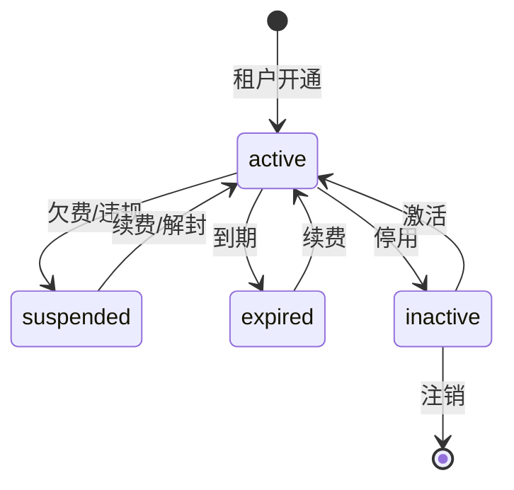

# MOY 权限模型设计

---

## 文档元信息

| 属性 | 内容 |
|------|------|
| 文档名称 | MOY 权限模型设计 |
| 文档编号 | MOY_AUTH_001 |
| 版本号 | v1.0 |
| 状态 | 已确认 |
| 作者 | MOY 文档架构组 |
| 日期 | 2026-04-05 |
| 目标读者 | 系统架构师、后端开发、安全工程师、产品经理 |
| 输入来源 | [PRD](./06_PRD_产品需求规格说明书_v0.1.md)、[HLD](./09_HLD_系统高层设计.md)、[DBD](./10_DBD_数据模型与数据字典.md) |

---

## 一、文档目的

本文档定义 MOY 系统的权限模型，作为企业级 AI 原生客户管理系统的安全基线，用于：

1. 定义多租户架构下的数据隔离策略
2. 明确角色与权限的映射关系
3. 规范菜单、页面、字段、数据范围、操作等权限粒度
4. 支撑安全审计与合规要求
5. 为权限管理功能开发提供设计依据

---

## 二、多租户与组织架构

### 2.1 租户模型

#### 2.1.1 租户定义

| 概念 | 说明 |
|------|------|
| 租户（Tenant） | 一个独立的企业客户，对应一个 organizations 记录 |
| 租户标识 | org_id，所有业务数据必须携带此标识 |
| 租户隔离 | 数据库级别通过 org_id 字段隔离，应用层强制注入过滤条件 |

#### 2.1.2 租户属性

| 属性 | 类型 | 说明 |
|------|------|------|
| org_id | BIGINT | 租户唯一标识 |
| name | VARCHAR(128) | 租户名称 |
| code | VARCHAR(32) | 租户编码（全局唯一） |
| status | VARCHAR(16) | 状态：active/inactive/suspended/expired |
| edition | VARCHAR(16) | 版本：trial/standard/professional/enterprise |
| max_users | INTEGER | 最大用户数限制 |
| max_storage_mb | INTEGER | 最大存储空间限制 |
| expire_at | TIMESTAMP | 服务到期时间 |
| created_at | TIMESTAMP | 创建时间 |

#### 2.1.3 租户状态流转



### 2.2 组织/部门模型

#### 2.2.1 组织架构层级

```
租户（Organization）
├── 部门（Department）- 最多5级
│   ├── 子部门
│   │   └── ...
│   └── 用户（User）
└── 用户（User）- 可直接归属租户
```

#### 2.2.2 部门属性

| 属性 | 类型 | 说明 |
|------|------|------|
| id | BIGINT | 部门唯一标识 |
| org_id | BIGINT | 所属租户 |
| parent_id | BIGINT | 父部门ID（NULL表示顶级） |
| name | VARCHAR(64) | 部门名称 |
| code | VARCHAR(32) | 部门编码（租户内唯一） |
| manager_id | BIGINT | 部门负责人ID |
| sort_order | INTEGER | 排序号 |
| status | VARCHAR(16) | 状态：active/inactive |
| path | VARCHAR(255) | 部门路径（如：/1/2/3） |

#### 2.2.3 部门层级规则

| 规则 | 说明 |
|------|------|
| 最大层级 | 5级（含根部门） |
| 部门成员 | 一个用户只能归属一个主部门 |
| 部门负责人 | 自动获得部门数据范围权限 |
| 部门删除 | 必须先移除或转移部门成员 |

### 2.3 用户归属

#### 2.3.1 用户属性

| 属性 | 类型 | 说明 |
|------|------|------|
| id | BIGINT | 用户唯一标识 |
| org_id | BIGINT | 所属租户 |
| department_id | BIGINT | 主属部门（可为NULL） |
| username | VARCHAR(64) | 用户名（租户内唯一） |
| real_name | VARCHAR(64) | 真实姓名 |
| email | VARCHAR(128) | 邮箱 |
| phone | VARCHAR(20) | 手机号 |
| status | VARCHAR(16) | 状态：active/inactive/locked |
| is_admin | SMALLINT | 是否租户管理员：0/1 |

#### 2.3.2 用户归属规则

| 规则 | 说明 |
|------|------|
| 单租户归属 | 一个用户只能属于一个租户 |
| 主部门归属 | 一个用户只能有一个主属部门 |
| 跨部门协作 | 通过数据授权实现跨部门数据访问 |

### 2.4 数据隔离策略

#### 2.4.1 隔离层级

| 层级 | 实现方式 | 说明 |
|------|----------|------|
| 租户隔离 | org_id 过滤 | 所有查询自动注入 org_id 条件 |
| 部门隔离 | department_id 过滤 | 基于数据范围权限配置 |
| 用户隔离 | owner_id/creator_id 过滤 | 个人数据权限 |

#### 2.4.2 隔离实现

**数据库层：**

```sql
-- 所有业务表必须包含 org_id 字段
CREATE TABLE customers (
    id BIGSERIAL PRIMARY KEY,
    org_id BIGINT NOT NULL,
    -- 其他字段...
);

-- 创建复合索引支持租户隔离查询
CREATE INDEX idx_customers_org ON customers(org_id);
```

**应用层：**

```java
// 所有查询自动注入租户过滤
@TenantFilter
public List<Customer> listCustomers(QueryParams params) {
    return customerMapper.selectList(params);
}
```

**API层：**

```java
// 从JWT解析org_id，禁止客户端传入
@GetMapping("/customers")
public Result<List<Customer>> list(@TenantContext Long orgId) {
    // orgId从Token解析，非客户端传入
}
```

#### 2.4.3 跨租户禁止规则

| 场景 | 规则 | 错误码 |
|------|------|--------|
| 跨租户数据访问 | 禁止，返回403 | ERR_CROSS_TENANT_ACCESS |
| 跨租户用户关联 | 禁止 | ERR_CROSS_TENANT_USER |
| 跨租户数据导出 | 禁止 | ERR_CROSS_TENANT_EXPORT |
| 租户切换 | 需重新登录 | - |

### 2.5 跨部门协作规则

#### 2.5.1 协作场景

| 场景 | 实现方式 | 权限要求 |
|------|----------|----------|
| 客户共享 | 客户数据授权 | customer:share |
| 线索转派 | 线索分配功能 | lead:assign |
| 商机协作 | 商机团队成员 | opportunity:collaborate |
| 工单转派 | 工单分配功能 | ticket:assign |
| 会话转接 | 会话转接功能 | conversation:transfer |

#### 2.5.2 数据授权机制

| 授权类型 | 说明 | 有效期 |
|----------|------|--------|
| 临时授权 | 一次性数据访问授权 | 24小时 |
| 周期授权 | 指定时间段访问授权 | 按配置 |
| 永久授权 | 长期数据共享授权 | 持续有效 |

---

## 三、角色体系

### 3.1 系统角色定义

#### 3.1.1 平台级角色

| 角色编码 | 角色名称 | 说明 | 权限范围 |
|----------|----------|------|----------|
| platform_admin | 平台管理员 | 系统运维人员 | 全平台所有租户 |
| platform_support | 平台支持 | 技术支持人员 | 全平台只读+日志 |

#### 3.1.2 租户级角色

| 角色编码 | 角色名称 | 说明 | 典型场景 |
|----------|----------|------|----------|
| org_admin | 租户管理员 | 企业管理员 | 系统配置、用户管理 |
| sales_manager | 销售主管 | 销售团队负责人 | 团队客户、线索、商机 |
| sales_rep | 销售专员 | 一线销售人员 | 个人客户、线索、商机 |
| service_manager | 客服主管 | 客服团队负责人 | 团队会话、工单 |
| service_agent | 客服专员 | 一线客服人员 | 个人会话、工单 |
| ai_operator | AI运营管理员 | AI规则配置人员 | 自动化规则、AI配置 |
| auditor | 审计查看者 | 合规审计人员 | 只读+审计日志 |
| readonly | 只读用户 | 数据查看人员 | 只读权限 |

### 3.2 角色权限矩阵

#### 3.2.1 功能模块权限

| 模块 | org_admin | sales_manager | sales_rep | service_manager | service_agent | ai_operator | auditor | readonly |
|------|-----------|---------------|-----------|-----------------|---------------|-------------|---------|----------|
| 组织管理 | CRUD | R | - | - | - | - | R | R |
| 用户管理 | CRUD | R | - | R | - | - | R | - |
| 角色管理 | CRUD | - | - | - | - | - | R | - |
| 客户管理 | CRUD | CRU(Department) | CRU(Self) | R | R | R | R | R |
| 线索管理 | CRUD | CRU(Department) | CRU(Self) | R | R | R | R | R |
| 商机管理 | CRUD | CRU(Department) | CRU(Self) | R | R | R | R | R |
| 会话管理 | R | - | - | CRU(Department) | CRU(Self) | R | R | R |
| 工单管理 | CRUD | R | R | CRU(Department) | CRU(Self) | R | R | R |
| 任务管理 | CRUD | CRU(Department) | CRU(Self) | CRU(Department) | CRU(Self) | R | R | R |
| 知识库 | CRUD | R | R | CRU | CRU | CRU | R | R |
| 自动化规则 | CRUD | R | - | R | - | CRUD | R | R |
| AI工作台 | CRUD | R | R | R | R | CRUD | R | R |
| 数据看板 | CRUD | R(Department) | R(Self) | R(Department) | R(Self) | R | R | R |
| 审计日志 | R | - | - | - | - | - | R | - |
| 系统设置 | CRUD | - | - | - | - | R | - | - |

**权限说明：**
- C = Create（创建）
- R = Read（读取）
- U = Update（更新）
- D = Delete（删除）
- (Self) = 仅个人数据
- (Department) = 部门数据范围

#### 3.2.2 数据范围权限

| 角色 | 数据范围 | 说明 |
|------|----------|------|
| org_admin | 全部 | 租户内所有数据 |
| sales_manager | 本部门及下级 | 所属部门及子部门数据 |
| sales_rep | 仅本人 | 个人创建/负责的数据 |
| service_manager | 本部门及下级 | 所属部门及子部门数据 |
| service_agent | 仅本人 | 个人负责的数据 |
| ai_operator | 全部只读 | 所有数据只读 |
| auditor | 全部只读 | 所有数据只读 |
| readonly | 仅本人 | 个人相关数据只读 |

### 3.3 自定义角色扩展

#### 3.3.1 自定义角色属性

| 属性 | 类型 | 说明 |
|------|------|------|
| id | BIGINT | 角色唯一标识 |
| org_id | BIGINT | 所属租户 |
| name | VARCHAR(64) | 角色名称 |
| code | VARCHAR(32) | 角色编码 |
| description | VARCHAR(256) | 角色描述 |
| is_system | SMALLINT | 是否系统角色：0/1 |
| data_scope | VARCHAR(16) | 数据范围：all/department/self |
| status | VARCHAR(16) | 状态：active/inactive |

#### 3.3.2 自定义角色规则

| 规则 | 说明 |
|------|------|
| 命名规范 | 角色编码以 custom_ 开头 |
| 权限继承 | 可基于现有角色复制创建 |
| 权限限制 | 不能超过创建者的权限范围 |
| 系统角色 | 系统角色不可修改删除 |

---

## 四、权限粒度定义

### 4.1 菜单权限

#### 4.1.1 菜单结构

```
根菜单
├── 客户中心
│   ├── 客户列表
│   ├── 客户分组
│   └── 联系人
├── 线索中心
│   ├── 线索列表
│   └── 线索导入
├── 商机管理
│   ├── 商机列表
│   └── 阶段管理
├── 会话中心
│   ├── 会话列表
│   └── 会话监控
├── 工单管理
│   ├── 工单列表
│   └── 工单类型
├── 知识库
│   ├── 知识分类
│   └── 知识条目
├── AI工作台
│   ├── 智能回复
│   ├── 知识问答
│   └── 线索评分
├── 数据看板
│   ├── 销售看板
│   └── 客服看板
├── 系统设置
│   ├── 组织管理
│   ├── 用户管理
│   ├── 角色管理
│   ├── 自动化规则
│   └── 系统配置
└── 审计日志
    ├── 操作日志
    └── 登录日志
```

#### 4.1.2 菜单权限配置

| 字段 | 类型 | 说明 |
|------|------|------|
| menu_id | BIGINT | 菜单ID |
| role_id | BIGINT | 角色ID |
| visible | SMALLINT | 是否可见：0/1 |
| sort_order | INTEGER | 排序号 |

### 4.2 页面权限

#### 4.2.1 页面元素权限

| 元素类型 | 说明 | 示例 |
|----------|------|------|
| 按钮 | 操作按钮 | 新增、编辑、删除、导出 |
| 表单 | 表单区域 | 客户信息表单、商机表单 |
| 列表 | 列表区域 | 客户列表、线索列表 |
| Tab | 页签区域 | 联系人Tab、跟进记录Tab |
| 区块 | 功能区块 | AI推荐区块、统计图表区块 |

#### 4.2.2 页面权限配置

| 字段 | 类型 | 说明 |
|------|------|------|
| page_code | VARCHAR(64) | 页面编码 |
| element_code | VARCHAR(64) | 元素编码 |
| role_id | BIGINT | 角色ID |
| visible | SMALLINT | 是否可见：0/1 |
| enabled | SMALLINT | 是否启用：0/1 |

### 4.3 字段权限

#### 4.3.1 字段权限类型

| 权限类型 | 说明 | 示例字段 |
|----------|------|----------|
| 可见 | 字段可见但不可编辑 | 客户等级、客户来源 |
| 可编辑 | 字段可编辑 | 客户名称、联系电话 |
| 只读 | 字段只读 | 创建时间、创建人 |
| 隐藏 | 字段完全隐藏 | 成本价、利润率 |
| 脱敏 | 字段值脱敏显示 | 手机号、身份证号 |

#### 4.3.2 敏感字段脱敏规则

| 字段类型 | 脱敏规则 | 示例 |
|----------|----------|------|
| 手机号 | 中间4位替换为**** | 138****8000 |
| 邮箱 | @前保留前3位，其余用**** | zha***@company.com |
| 身份证 | 保留前3位和后4位 | 110***********1234 |
| 银行卡 | 保留后4位 | ************1234 |
| 地址 | 保留省市，其余用**** | 北京市朝阳区**** |

#### 4.3.3 字段权限配置

| 字段 | 类型 | 说明 |
|------|------|------|
| entity_type | VARCHAR(32) | 实体类型：customer/lead/opportunity等 |
| field_code | VARCHAR(64) | 字段编码 |
| role_id | BIGINT | 角色ID |
| permission | VARCHAR(16) | 权限：visible/editable/readonly/hidden/masked |

### 4.4 数据范围权限

#### 4.4.1 数据范围类型

| 范围类型 | 说明 | SQL条件示例 |
|----------|------|-------------|
| 全部 | 租户内所有数据 | org_id = ? |
| 本部门及下级 | 所属部门及子部门数据 | department_id IN (?) |
| 本部门 | 仅所属部门数据 | department_id = ? |
| 仅本人 | 个人创建/负责的数据 | owner_id = ? OR created_by = ? |
| 自定义 | 指定部门/用户数据 | (department_id IN (?) OR owner_id IN (?)) |

#### 4.4.2 数据范围配置

| 字段 | 类型 | 说明 |
|------|------|------|
| role_id | BIGINT | 角色ID |
| resource_type | VARCHAR(32) | 资源类型：customer/lead/opportunity等 |
| scope_type | VARCHAR(16) | 范围类型：all/department/self/custom |
| scope_value | JSONB | 范围值（自定义时使用） |

#### 4.4.3 数据范围实现

```java
@DataScope(resourceType = "customer")
public List<Customer> listCustomers(QueryParams params) {
    // 自动注入数据范围过滤条件
    // WHERE org_id = ? AND (department_id IN (?) OR owner_id = ?)
}
```

### 4.5 操作权限

#### 4.5.1 操作权限编码规范

| 格式 | 说明 | 示例 |
|------|------|------|
| {resource}:{action} | 资源:操作 | customer:create |
| {resource}:{action}:{sub} | 资源:操作:子项 | customer:export:excel |
| {module}:{resource}:{action} | 模块:资源:操作 | settings:role:delete |

#### 4.5.2 核心操作权限清单

| 模块 | 操作权限 | 说明 |
|------|----------|------|
| 客户管理 | customer:create | 创建客户 |
| | customer:read | 查看客户 |
| | customer:update | 编辑客户 |
| | customer:delete | 删除客户 |
| | customer:export | 导出客户 |
| | customer:assign | 分配客户 |
| | customer:transfer | 转移客户 |
| | customer:share | 共享客户 |
| 线索管理 | lead:create | 创建线索 |
| | lead:read | 查看线索 |
| | lead:update | 编辑线索 |
| | lead:delete | 删除线索 |
| | lead:convert | 转化线索 |
| | lead:assign | 分配线索 |
| | lead:import | 导入线索 |
| | lead:export | 导出线索 |
| 商机管理 | opportunity:create | 创建商机 |
| | opportunity:read | 查看商机 |
| | opportunity:update | 编辑商机 |
| | opportunity:delete | 删除商机 |
| | opportunity:stage | 变更阶段 |
| | opportunity:close | 关闭商机 |
| 会话管理 | conversation:read | 查看会话 |
| | conversation:reply | 回复消息 |
| | conversation:transfer | 转接会话 |
| | conversation:close | 关闭会话 |
| | conversation:smart-reply | 使用智能回复 |
| 工单管理 | ticket:create | 创建工单 |
| | ticket:read | 查看工单 |
| | ticket:update | 编辑工单 |
| | ticket:delete | 删除工单 |
| | ticket:assign | 分配工单 |
| | ticket:resolve | 解决工单 |
| | ticket:close | 关闭工单 |
| 系统管理 | user:create | 创建用户 |
| | user:update | 编辑用户 |
| | user:delete | 删除用户 |
| | role:create | 创建角色 |
| | role:update | 编辑角色 |
| | role:delete | 删除角色 |
| | settings:update | 修改系统配置 |
| AI管理 | ai:smart-reply | 使用智能回复 |
| | ai:knowledge-qa | 使用知识问答 |
| | ai:lead-score | 使用线索评分 |
| | ai:config | 配置AI参数 |
| 审计 | audit:read | 查看审计日志 |

#### 4.5.3 操作权限校验

```java
@RequiresPermission("customer:delete")
public void deleteCustomer(Long customerId) {
    // 权限校验通过后执行
}

@RequiresAnyPermission({"customer:update", "customer:assign"})
public void updateOrAssignCustomer(Customer customer) {
    // 任一权限即可
}
```

### 4.6 审批/例外权限

#### 4.6.1 审批权限场景

| 场景 | 触发条件 | 审批人 | 说明 |
|------|----------|--------|------|
| 客户删除 | 删除重要客户 | 部门主管 | 防止误删 |
| 批量导出 | 导出超过1000条 | 数据管理员 | 数据安全 |
| 跨部门转移 | 转移客户到其他部门 | 双方主管 | 协作确认 |
| 敏感字段查看 | 查看脱敏字段 | 合规管理员 | 敏感数据 |
| AI高风险操作 | AI自动执行高风险操作 | 业务主管 | 人机协同 |

#### 4.6.2 审批流程配置

| 字段 | 类型 | 说明 |
|------|------|------|
| approval_type | VARCHAR(32) | 审批类型 |
| trigger_condition | JSONB | 触发条件 |
| approver_type | VARCHAR(16) | 审批人类型：role/user/department_manager |
| approver_id | BIGINT | 审批人ID（指定用户时） |
| timeout_minutes | INTEGER | 超时时间（分钟） |
| timeout_action | VARCHAR(16) | 超时动作：reject/approve/escalate |

#### 4.6.3 例外权限机制

| 场景 | 例外类型 | 有效期 | 审批要求 |
|------|----------|--------|----------|
| 临时数据访问 | 临时授权 | 24小时 | 数据所有者同意 |
| 跨部门协作 | 协作授权 | 项目周期 | 双方主管同意 |
| 敏感操作 | 一次性授权 | 单次 | 管理员审批 |

---

## 五、权限管理功能

### 5.1 权限管理API

#### 5.1.1 角色管理

| 接口 | 方法 | 说明 |
|------|------|------|
| /api/v1/roles | GET | 获取角色列表 |
| /api/v1/roles | POST | 创建角色 |
| /api/v1/roles/{id} | GET | 获取角色详情 |
| /api/v1/roles/{id} | PUT | 更新角色 |
| /api/v1/roles/{id} | DELETE | 删除角色 |
| /api/v1/roles/{id}/permissions | GET | 获取角色权限 |
| /api/v1/roles/{id}/permissions | PUT | 设置角色权限 |

#### 5.1.2 用户授权

| 接口 | 方法 | 说明 |
|------|------|------|
| /api/v1/users/{id}/roles | GET | 获取用户角色 |
| /api/v1/users/{id}/roles | PUT | 设置用户角色 |
| /api/v1/users/{id}/permissions | GET | 获取用户有效权限 |
| /api/v1/users/{id}/data-scope | GET | 获取用户数据范围 |

#### 5.1.3 权限校验

| 接口 | 方法 | 说明 |
|------|------|------|
| /api/v1/auth/check | POST | 校验权限 |
| /api/v1/auth/menus | GET | 获取用户菜单 |
| /api/v1/auth/permissions | GET | 获取用户权限列表 |

### 5.2 权限缓存策略

#### 5.2.1 缓存结构

```
权限缓存 Key 设计：
- user:permissions:{org_id}:{user_id} -> Set<permission_code>
- user:menus:{org_id}:{user_id} -> List<menu>
- user:data-scope:{org_id}:{user_id}:{resource_type} -> scope_config
- role:permissions:{org_id}:{role_id} -> Set<permission_code>
```

#### 5.2.2 缓存更新策略

| 事件 | 缓存操作 |
|------|----------|
| 用户角色变更 | 清除用户相关缓存 |
| 角色权限变更 | 清除角色下所有用户缓存 |
| 部门变更 | 清除部门相关用户缓存 |
| 用户登录 | 加载权限到缓存 |

---

## 六、安全策略

### 6.1 登录安全

| 策略 | 配置 |
|------|------|
| 密码强度 | 至少8位，包含大小写字母和数字 |
| 密码加密 | BCrypt 加密存储 |
| 登录失败锁定 | 5次失败锁定30分钟 |
| 会话超时 | 2小时无操作自动登出 |
| 强制修改密码 | 首次登录或密码过期后强制修改 |
| 双因素认证 | 可选启用（企业版） |

### 6.2 权限校验

| 层级 | 校验内容 |
|------|----------|
| API网关 | JWT Token 有效性、租户归属 |
| 应用层 | 功能权限、数据范围权限 |
| 数据层 | org_id 过滤、数据归属校验 |

### 6.3 敏感操作审计

| 操作类型 | 审计内容 |
|----------|----------|
| 权限变更 | 变更人、变更内容、变更前后值 |
| 角色分配 | 操作人、目标用户、角色 |
| 数据导出 | 操作人、导出条件、数据量 |
| 敏感字段访问 | 访问人、字段、访问时间 |
| 跨部门操作 | 操作人、数据归属、目标归属 |

---

## 七、权限数据表

### 7.1 核心表结构

| 表名 | 说明 |
|------|------|
| organizations | 租户表 |
| departments | 部门表 |
| users | 用户表 |
| roles | 角色表 |
| permissions | 权限表 |
| user_roles | 用户角色关联表 |
| role_permissions | 角色权限关联表 |
| menus | 菜单表 |
| role_menus | 角色菜单关联表 |
| field_permissions | 字段权限表 |
| data_scopes | 数据范围配置表 |
| approval_configs | 审批配置表 |
| temporary_permissions | 临时权限表 |

### 7.2 权限表详细定义

#### 7.2.1 permissions（权限表）

| 字段名 | 类型 | 说明 |
|--------|------|------|
| id | BIGSERIAL | 权限ID |
| code | VARCHAR(64) | 权限编码（唯一） |
| name | VARCHAR(64) | 权限名称 |
| resource_type | VARCHAR(32) | 资源类型 |
| action | VARCHAR(16) | 操作类型 |
| description | VARCHAR(256) | 权限描述 |
| parent_id | BIGINT | 父权限ID |
| sort_order | INTEGER | 排序号 |

#### 7.2.2 menus（菜单表）

| 字段名 | 类型 | 说明 |
|--------|------|------|
| id | BIGSERIAL | 菜单ID |
| parent_id | BIGINT | 父菜单ID |
| code | VARCHAR(64) | 菜单编码 |
| name | VARCHAR(64) | 菜单名称 |
| path | VARCHAR(128) | 路由路径 |
| icon | VARCHAR(64) | 图标 |
| component | VARCHAR(128) | 组件路径 |
| sort_order | INTEGER | 排序号 |
| visible | SMALLINT | 是否可见 |
| status | VARCHAR(16) | 状态 |

#### 7.2.3 field_permissions（字段权限表）

| 字段名 | 类型 | 说明 |
|--------|------|------|
| id | BIGSERIAL | ID |
| org_id | BIGINT | 租户ID |
| role_id | BIGINT | 角色ID |
| entity_type | VARCHAR(32) | 实体类型 |
| field_code | VARCHAR(64) | 字段编码 |
| permission | VARCHAR(16) | 权限类型 |

#### 7.2.4 data_scopes（数据范围配置表）

| 字段名 | 类型 | 说明 |
|--------|------|------|
| id | BIGSERIAL | ID |
| org_id | BIGINT | 租户ID |
| role_id | BIGINT | 角色ID |
| resource_type | VARCHAR(32) | 资源类型 |
| scope_type | VARCHAR(16) | 范围类型 |
| scope_value | JSONB | 范围值 |

#### 7.2.5 temporary_permissions（临时权限表）

| 字段名 | 类型 | 说明 |
|--------|------|------|
| id | BIGSERIAL | ID |
| org_id | BIGINT | 租户ID |
| user_id | BIGINT | 用户ID |
| permission_type | VARCHAR(32) | 权限类型 |
| resource_type | VARCHAR(32) | 资源类型 |
| resource_id | BIGINT | 资源ID |
| granted_by | BIGINT | 授权人 |
| expire_at | TIMESTAMP | 过期时间 |
| created_at | TIMESTAMP | 创建时间 |

---

## 八、版本与变更记录

| 版本 | 日期 | 作者 | 变更摘要 | 状态 |
|------|------|------|----------|------|
| v1.0 | 2026-04-05 | MOY 文档架构组 | 初稿 | 已确认 |

---

## 九、依赖文档

| 文档 | 版本 | 用途 |
|------|------|------|
| [06_PRD_产品需求规格说明书_v0.1.md](./06_PRD_产品需求规格说明书_v0.1.md) | v2.0 | 业务需求 |
| [09_HLD_系统高层设计.md](./09_HLD_系统高层设计.md) | v1.0 | 架构设计 |
| [10_DBD_数据模型与数据字典.md](./10_DBD_数据模型与数据字典.md) | v2.0 | 数据模型 |
| [11_API_接口设计说明.md](./11_API_接口设计说明.md) | v2.0 | 接口定义 |

---

## 十、待确认事项

1. 是否需要支持角色继承机制？
2. 是否需要支持权限模板功能？
3. 双因素认证是否首期实现？
4. 自定义角色的权限限制边界如何定义？
