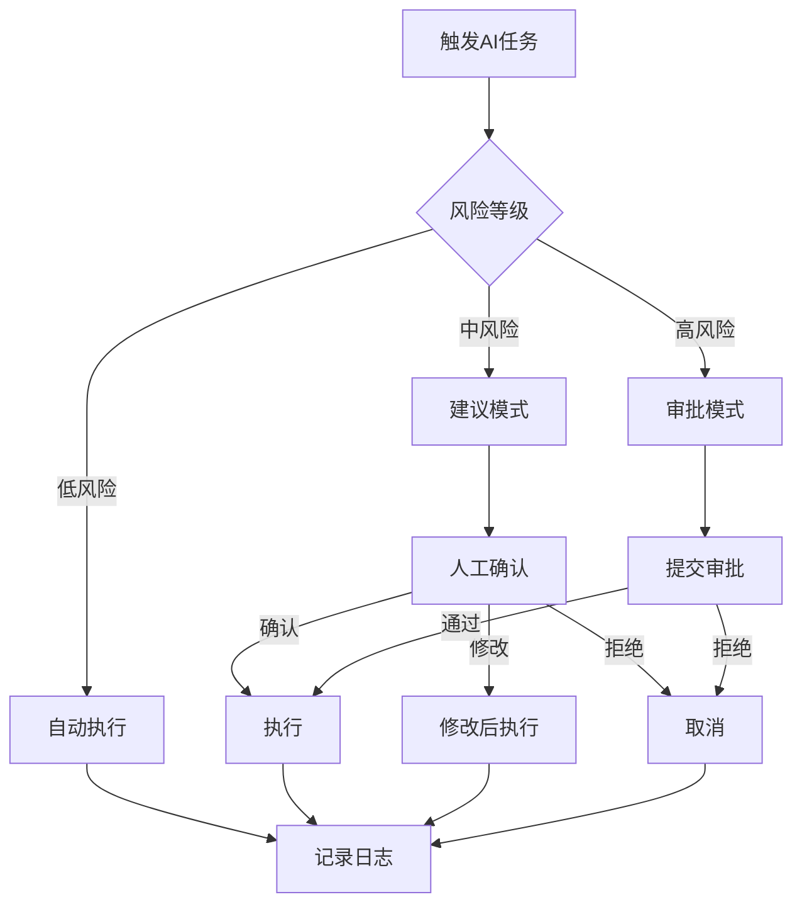
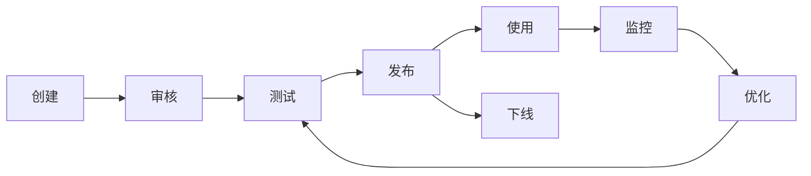
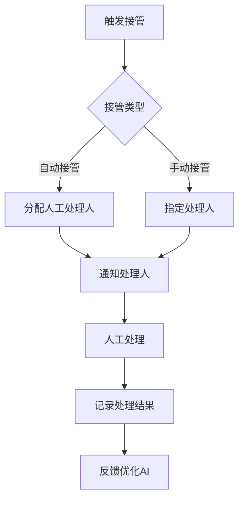

# MOY AI治理与执行规范

---

## 文档元信息

| 属性 | 内容 |
|------|------|
| 文档名称 | MOY AI治理与执行规范 |
| 文档编号 | MOY_AI_GOV_001 |
| 版本号 | v1.0 |
| 状态 | 已确认 |
| 作者 | MOY 文档架构组 |
| 日期 | 2026-04-05 |
| 目标读者 | 系统架构师、AI工程师、产品经理、合规人员 |
| 输入来源 | [PRD](./06_PRD_产品需求规格说明书_v0.1.md)、[配置中心设计](./19_配置中心设计.md) |

---

## 一、文档目的

本文档定义 MOY 系统的 AI 治理与执行规范，作为企业级 AI 原生客户管理系统的 AI 安全基线，用于：

1. 定义 AI 任务类型和执行边界
2. 规范人机协同的工作流程
3. 建立高风险操作的确认机制
4. 确保 AI 输出的可追溯性
5. 控制幻觉风险和数据安全
6. 建立成本监控和降级策略

---

## 二、AI任务类型定义

### 2.1 任务分类

| 任务类型 | 编码 | 风险等级 | 说明 |
|----------|------|----------|------|
| 智能回复 | smart_reply | 低 | 生成客服回复建议 |
| 知识问答 | knowledge_qa | 低 | 基于知识库的问答 |
| 线索评分 | lead_score | 中 | 线索质量评估 |
| 情感分析 | sentiment | 低 | 客户情感判断 |
| 内容摘要 | summary | 低 | 会话内容摘要 |
| 数据提取 | extraction | 中 | 从文本提取结构化数据 |
| 自动分类 | classification | 中 | 自动分类打标 |
| 自动分配 | auto_assign | 高 | 自动分配资源 |
| 自动回复 | auto_reply | 高 | 自动发送回复 |
| 自动决策 | auto_decision | 高 | 自动执行业务决策 |

### 2.2 任务执行模式

| 模式 | 说明 | 适用任务 |
|------|------|----------|
| 建议模式 | AI生成建议，人工确认后执行 | 智能回复、线索评分 |
| 辅助模式 | AI辅助人工，人工主导决策 | 知识问答、情感分析 |
| 自动模式 | AI自动执行，事后可追溯 | 自动分类、内容摘要 |
| 审批模式 | AI执行高风险操作，需人工审批 | 自动分配、自动决策 |

### 2.3 任务配置

| 配置项 | 说明 | 默认值 |
|--------|------|--------|
| 执行模式 | 任务执行模式 | 建议模式 |
| 超时时间 | 任务执行超时（秒） | 30 |
| 重试次数 | 失败重试次数 | 2 |
| 置信度阈值 | 自动执行的最小置信度 | 0.8 |
| 人工确认 | 是否需要人工确认 | 按风险等级 |

---

## 三、人机协同边界

### 3.1 协同原则

| 原则 | 说明 |
|------|------|
| 人工优先 | 高风险操作必须人工确认 |
| 透明可控 | AI决策过程可解释、可干预 |
| 可追溯 | 所有AI操作可追溯审计 |
| 可回滚 | AI操作结果可回滚撤销 |
| 责任明确 | AI辅助决策，人工承担责任 |

### 3.2 任务协同边界

| 任务类型 | AI职责 | 人工职责 | 协同方式 |
|----------|--------|----------|----------|
| 智能回复 | 生成回复建议 | 选择/修改/发送 | AI建议，人工执行 |
| 知识问答 | 检索知识生成答案 | 确认/修改/发送 | AI辅助，人工决策 |
| 线索评分 | 计算评分和因子 | 确认/调整评分 | AI计算，人工确认 |
| 自动分类 | 预测分类标签 | 确认/修改标签 | AI预测，人工审核 |
| 自动分配 | 推荐分配对象 | 确认/调整分配 | AI推荐，人工确认 |
| 自动回复 | 生成回复内容 | 审核/启用规则 | AI生成，人工审核 |

### 3.3 协同流程



---

## 四、高风险操作确认机制

### 4.1 高风险操作定义

| 操作类型 | 风险因素 | 风险等级 |
|----------|----------|----------|
| 自动发送消息 | 可能发送不当内容 | 高 |
| 自动分配客户 | 影响业务归属 | 高 |
| 自动关闭工单 | 可能遗漏问题 | 高 |
| 自动修改数据 | 数据一致性风险 | 高 |
| 批量操作 | 影响范围大 | 高 |

### 4.2 确认机制

#### 4.2.1 确认类型

| 确认类型 | 说明 | 适用场景 |
|----------|------|----------|
| 即时确认 | 执行前弹窗确认 | 单次高风险操作 |
| 批量确认 | 批量操作前确认 | 批量数据处理 |
| 规则审批 | 启用规则需审批 | 自动化规则启用 |
| 超时确认 | 超时未确认自动处理 | 紧急场景 |

#### 4.2.2 确认流程

| 步骤 | 操作 | 说明 |
|------|------|------|
| 1 | AI生成建议 | AI生成操作建议 |
| 2 | 展示确认界面 | 展示操作详情和风险提示 |
| 3 | 人工审核 | 人工审核操作内容 |
| 4 | 确认/修改/拒绝 | 人工做出决策 |
| 5 | 执行/取消 | 根据决策执行或取消 |
| 6 | 记录日志 | 记录完整操作日志 |

#### 4.2.3 确认界面要求

| 要求 | 说明 |
|------|------|
| 操作说明 | 清晰说明AI建议的操作内容 |
| 风险提示 | 明确提示操作风险 |
| 影响范围 | 说明操作影响的数据范围 |
| 可编辑 | 允许人工修改AI建议 |
| 撤销选项 | 提供撤销/回滚选项 |

### 4.3 确认权限

| 操作类型 | 确认权限 | 备用确认人 |
|----------|----------|------------|
| 自动发送消息 | 客服专员及以上 | 客服主管 |
| 自动分配客户 | 销售主管及以上 | 租户管理员 |
| 自动关闭工单 | 客服主管及以上 | 租户管理员 |
| 自动修改数据 | 部门主管及以上 | 租户管理员 |
| 批量操作 | 租户管理员 | 平台管理员 |

---

## 五、AI输出可追溯性

### 5.1 追溯要求

| 要求 | 说明 |
|------|------|
| 输入记录 | 记录完整的输入数据和上下文 |
| 输出记录 | 记录完整的AI输出结果 |
| 模型记录 | 记录使用的模型和版本 |
| 参数记录 | 记录生成参数配置 |
| 时间记录 | 记录执行时间和耗时 |
| 用户记录 | 记录触发用户和确认用户 |

### 5.2 追溯数据结构

```json
{
  "task_id": "ai_task_001",
  "task_type": "smart_reply",
  "trace_info": {
    "input": {
      "conversation_id": 123,
      "customer_message": "我想了解产品价格",
      "context": {
        "customer_history": [...],
        "product_info": {...}
      }
    },
    "model": {
      "provider": "openai",
      "model_name": "gpt-4",
      "model_version": "2024-01-01",
      "parameters": {
        "temperature": 0.7,
        "max_tokens": 500
      }
    },
    "output": {
      "suggestions": [
        {
          "content": "您好，感谢您的咨询...",
          "confidence": 0.92
        }
      ],
      "tokens_used": {
        "input": 150,
        "output": 80,
        "total": 230
      }
    },
    "execution": {
      "started_at": "2026-04-05T10:00:00Z",
      "completed_at": "2026-04-05T10:00:02Z",
      "duration_ms": 2000,
      "status": "completed"
    },
    "human_interaction": {
      "confirmed_by": 1,
      "confirmed_at": "2026-04-05T10:00:05Z",
      "action": "approved",
      "modifications": null
    }
  }
}
```

### 5.3 追溯查询

| 查询维度 | 说明 |
|----------|------|
| 按任务ID | 查询单个AI任务的完整记录 |
| 按用户 | 查询用户触发的所有AI任务 |
| 按时间范围 | 查询时间范围内的AI任务 |
| 按任务类型 | 查询特定类型的AI任务 |
| 按关联对象 | 查询关联业务对象的AI任务 |
| 按模型 | 查询使用特定模型的AI任务 |

---

## 六、提示词管理

### 6.1 提示词生命周期



### 6.2 提示词版本管理

| 版本状态 | 说明 |
|----------|------|
| 草稿 | 新创建，可编辑 |
| 待审核 | 提交审核，不可编辑 |
| 已发布 | 审核通过，可使用 |
| 已下线 | 停止使用，不可恢复 |

### 6.3 提示词审核

| 审核项 | 说明 |
|--------|------|
| 安全性 | 是否包含敏感信息、有害内容 |
| 合规性 | 是否符合法律法规要求 |
| 准确性 | 是否能生成预期结果 |
| 偏见性 | 是否存在偏见或歧视 |
| 效率性 | Token消耗是否合理 |

### 6.4 提示词模板

| 模板类型 | 说明 | 变量示例 |
|----------|------|----------|
| 智能回复 | 客服回复建议 | customer_message, conversation_history |
| 知识问答 | 知识库问答 | question, knowledge_context |
| 线索评分 | 线索质量评分 | lead_info, scoring_criteria |
| 情感分析 | 情感判断 | text_content |
| 内容摘要 | 内容总结 | conversation_content |

---

## 七、模型选择策略

### 7.1 模型池

| 模型 | 提供商 | 适用场景 | 成本等级 | 质量等级 |
|------|--------|----------|----------|----------|
| gpt-4 | OpenAI | 复杂任务 | 高 | 高 |
| gpt-3.5-turbo | OpenAI | 常规任务 | 低 | 中 |
| gpt-4-turbo | OpenAI | 长文本任务 | 中 | 高 |
| claude-3 | Anthropic | 安全敏感任务 | 中 | 高 |

### 7.2 选择策略

| 策略 | 说明 | 配置方式 |
|------|------|----------|
| 固定模型 | 始终使用指定模型 | model_code: "gpt-4" |
| 按任务类型 | 不同任务使用不同模型 | task_model_mapping |
| 按成本优先 | 优先使用低成本模型 | priority: "cost" |
| 按质量优先 | 优先使用高质量模型 | priority: "quality" |
| 按租户配置 | 租户自定义模型选择 | org_model_config |

### 7.3 模型配置示例

```json
{
  "model_selection": {
    "strategy": "task_type",
    "task_model_mapping": {
      "smart_reply": "gpt-3.5-turbo",
      "knowledge_qa": "gpt-4",
      "lead_score": "gpt-3.5-turbo",
      "sentiment": "gpt-3.5-turbo",
      "summary": "gpt-4-turbo"
    },
    "fallback_model": "gpt-3.5-turbo"
  }
}
```

---

## 八、Token/调用成本监控

### 8.1 监控指标

| 指标 | 说明 | 告警阈值 |
|------|------|----------|
| 日调用次数 | 每日AI调用总次数 | >10000 |
| 日Token消耗 | 每日Token消耗总量 | >1000000 |
| 平均响应时间 | 平均AI响应时间 | >5s |
| 失败率 | AI调用失败率 | >5% |
| 成本金额 | 每日AI调用成本 | >$100 |

### 8.2 成本控制

| 控制项 | 说明 | 配置方式 |
|--------|------|----------|
| 租户配额 | 租户每日Token上限 | org_daily_token_limit |
| 用户配额 | 用户每日调用上限 | user_daily_call_limit |
| 任务配额 | 任务类型调用上限 | task_type_limit |
| 预算限制 | 月度预算上限 | monthly_budget |

### 8.3 成本报表

| 报表 | 说明 | 周期 |
|------|------|------|
| 调用统计 | 各任务类型调用次数 | 日/周/月 |
| Token消耗 | Token消耗明细 | 日/周/月 |
| 成本分析 | 成本趋势和分布 | 周/月 |
| 租户成本 | 各租户成本统计 | 月 |

---

## 九、失败重试与降级策略

### 9.1 重试策略

| 场景 | 重试次数 | 重试间隔 | 最大等待 |
|------|----------|----------|----------|
| 网络超时 | 3 | 指数退避 | 60s |
| 服务限流 | 3 | 固定间隔 | 30s |
| 模型过载 | 2 | 固定间隔 | 20s |
| 其他错误 | 1 | 固定间隔 | 10s |

### 9.2 降级策略

| 降级级别 | 触发条件 | 降级措施 |
|----------|----------|----------|
| 一级降级 | 单模型故障 | 切换备用模型 |
| 二级降级 | 多模型故障 | 降低输出质量要求 |
| 三级降级 | 服务完全不可用 | 返回缓存结果或默认回复 |
| 四级降级 | 长时间不可用 | 禁用AI功能，提示人工处理 |

### 9.3 降级配置

```json
{
  "degradation": {
    "levels": [
      {
        "level": 1,
        "trigger": "single_model_failure",
        "action": "switch_model",
        "fallback_model": "gpt-3.5-turbo"
      },
      {
        "level": 2,
        "trigger": "multi_model_failure",
        "action": "reduce_quality",
        "config": {
          "max_tokens": 100,
          "temperature": 0.3
        }
      },
      {
        "level": 3,
        "trigger": "service_unavailable",
        "action": "use_cache",
        "fallback_message": "AI服务暂时不可用，请稍后重试"
      },
      {
        "level": 4,
        "trigger": "long_outage",
        "action": "disable_ai",
        "message": "AI功能已暂时关闭，请人工处理"
      }
    ]
  }
}
```

---

## 十、幻觉风险控制

### 10.1 幻觉类型

| 类型 | 说明 | 示例 |
|------|------|------|
| 事实性幻觉 | 编造不存在的事实 | 虚假的产品信息 |
| 数据幻觉 | 编造不存在的数据 | 错误的价格、日期 |
| 来源幻觉 | 错误归因信息来源 | 引用不存在的文档 |
| 逻辑幻觉 | 逻辑推理错误 | 错误的因果关系 |

### 10.2 控制措施

| 措施 | 说明 | 实现方式 |
|------|------|----------|
| 知识约束 | 限制AI使用指定知识库 | RAG检索增强 |
| 引用验证 | 验证引用来源真实性 | 来源链接检查 |
| 置信度过滤 | 过滤低置信度输出 | confidence_threshold |
| 人工审核 | 高风险内容人工审核 | human_review_required |
| 免责声明 | 添加AI生成声明 | output_disclaimer |

### 10.3 幻觉检测

| 检测方法 | 说明 | 准确率 |
|----------|------|--------|
| 自一致性检查 | 多次生成比较一致性 | 85% |
| 事实核查 | 与知识库比对验证 | 90% |
| 引用验证 | 验证引用来源存在性 | 95% |
| 置信度评估 | 评估输出置信度 | 80% |

### 10.4 幻觉处理

| 场景 | 处理方式 |
|------|----------|
| 检测到幻觉 | 标记警告，建议人工审核 |
| 低置信度输出 | 提示用户核实信息 |
| 高风险领域 | 强制人工审核 |
| 关键业务数据 | 禁止AI自动生成 |

---

## 十一、人工接管机制

### 11.1 接管触发条件

| 触发条件 | 说明 | 接管方式 |
|----------|------|----------|
| AI失败 | AI任务执行失败 | 自动转人工 |
| 置信度过低 | 置信度低于阈值 | 提示人工介入 |
| 用户请求 | 用户主动请求人工 | 立即转人工 |
| 敏感内容 | 检测到敏感内容 | 阻断并通知人工 |
| 异常行为 | 检测到异常AI行为 | 自动暂停并通知 |

### 11.2 接管流程



### 11.3 接管配置

| 配置项 | 说明 | 默认值 |
|--------|------|--------|
| 自动接管阈值 | 置信度低于此值自动接管 | 0.6 |
| 接管超时 | 接管后人工响应超时 | 5分钟 |
| 接管通知 | 接管通知方式 | 站内+邮件 |
| 接管人分配 | 接管人分配策略 | 轮询分配 |

### 11.4 接管记录

| 字段 | 说明 |
|------|------|
| takeover_id | 接管记录ID |
| task_id | 原AI任务ID |
| trigger_reason | 触发原因 |
| trigger_time | 触发时间 |
| assigned_to | 分配给谁 |
| handle_time | 处理时间 |
| handle_result | 处理结果 |
| feedback | 反馈信息 |

---

## 十二、AI安全策略

### 12.1 输入安全

| 安全措施 | 说明 |
|----------|------|
| 敏感词过滤 | 过滤输入中的敏感词 |
| Prompt注入防护 | 检测并阻止Prompt注入攻击 |
| 输入长度限制 | 限制输入最大长度 |
| 内容审核 | 审核输入内容合规性 |

### 12.2 输出安全

| 安全措施 | 说明 |
|----------|------|
| 内容审核 | 审核输出内容合规性 |
| 敏感信息过滤 | 过滤输出中的敏感信息 |
| 格式验证 | 验证输出格式正确性 |
| 免责声明 | 添加AI生成声明 |

### 12.3 数据安全

| 安全措施 | 说明 |
|----------|------|
| 数据脱敏 | 敏感数据脱敏后发送AI |
| 数据隔离 | 租户数据隔离处理 |
| 数据留存 | 控制AI数据留存时间 |
| 数据加密 | 传输和存储加密 |

---

## 十三、AI治理数据表

### 13.1 ai_tasks（AI任务表）

| 字段名 | 类型 | 说明 |
|--------|------|------|
| id | BIGSERIAL | 任务ID |
| org_id | BIGINT | 租户ID |
| task_type | VARCHAR(32) | 任务类型 |
| execution_mode | VARCHAR(16) | 执行模式 |
| input_data | JSONB | 输入数据 |
| output_data | JSONB | 输出数据 |
| model_name | VARCHAR(64) | 模型名称 |
| model_version | VARCHAR(32) | 模型版本 |
| parameters | JSONB | 生成参数 |
| confidence | DECIMAL(5,4) | 置信度 |
| tokens_input | INTEGER | 输入Token |
| tokens_output | INTEGER | 输出Token |
| cost_amount | DECIMAL(10,4) | 成本金额 |
| duration_ms | INTEGER | 执行耗时 |
| status | VARCHAR(16) | 状态 |
| error_message | VARCHAR(512) | 错误信息 |
| human_confirmed | SMALLINT | 是否人工确认 |
| confirmed_by | BIGINT | 确认人ID |
| confirmed_at | TIMESTAMP | 确认时间 |
| created_at | TIMESTAMP | 创建时间 |

### 13.2 ai_prompt_templates（提示词模板表）

| 字段名 | 类型 | 说明 |
|--------|------|------|
| id | BIGSERIAL | 模板ID |
| org_id | BIGINT | 租户ID |
| template_code | VARCHAR(32) | 模板编码 |
| template_name | VARCHAR(64) | 模板名称 |
| template_type | VARCHAR(32) | 模板类型 |
| system_prompt | TEXT | 系统提示词 |
| user_prompt_template | TEXT | 用户提示词模板 |
| variables | JSONB | 变量定义 |
| version | INTEGER | 版本号 |
| status | VARCHAR(16) | 状态 |
| created_at | TIMESTAMP | 创建时间 |
| updated_at | TIMESTAMP | 更新时间 |

### 13.3 ai_model_configs（模型配置表）

| 字段名 | 类型 | 说明 |
|--------|------|------|
| id | BIGSERIAL | 配置ID |
| org_id | BIGINT | 租户ID |
| model_code | VARCHAR(32) | 模型编码 |
| model_name | VARCHAR(64) | 模型名称 |
| provider | VARCHAR(32) | 提供商 |
| api_endpoint | VARCHAR(256) | API端点 |
| default_params | JSONB | 默认参数 |
| limits | JSONB | 限制配置 |
| status | VARCHAR(16) | 状态 |

### 13.4 ai_takeovers（人工接管表）

| 字段名 | 类型 | 说明 |
|--------|------|------|
| id | BIGSERIAL | 接管ID |
| org_id | BIGINT | 租户ID |
| task_id | BIGINT | AI任务ID |
| trigger_reason | VARCHAR(32) | 触发原因 |
| trigger_time | TIMESTAMP | 触发时间 |
| assigned_to | BIGINT | 分配给谁 |
| handle_time | TIMESTAMP | 处理时间 |
| handle_result | VARCHAR(16) | 处理结果 |
| feedback | TEXT | 反馈信息 |

---

## 十四、版本与变更记录

| 版本 | 日期 | 作者 | 变更摘要 | 状态 |
|------|------|------|----------|------|
| v1.0 | 2026-04-05 | MOY 文档架构组 | 初稿 | 已确认 |

---

## 十五、依赖文档

| 文档 | 版本 | 用途 |
|------|------|------|
| [06_PRD_产品需求规格说明书_v0.1.md](./06_PRD_产品需求规格说明书_v0.1.md) | v2.0 | 业务需求 |
| [18_审计与日志规范.md](./18_审计与日志规范.md) | v1.0 | 审计要求 |
| [19_配置中心设计.md](./19_配置中心设计.md) | v1.0 | 配置管理 |

---

## 十六、待确认事项

1. 是否需要支持多模型并行执行对比？
2. AI输出的法律责任如何界定？
3. 是否需要AI伦理审查机制？
4. 如何处理AI模型的版本升级和兼容性？
