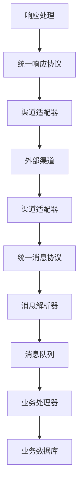
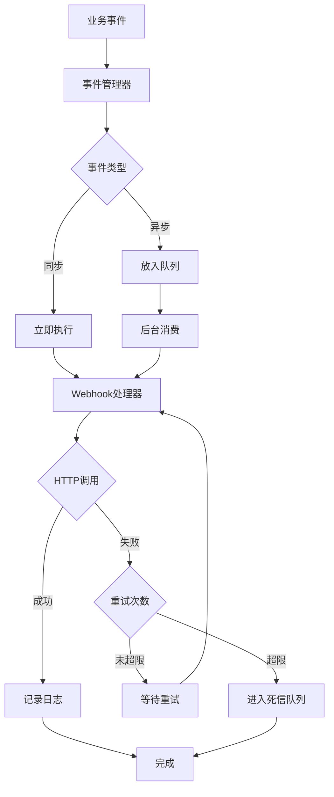

# MOY 集成架构设计

---

## 文档元信息

| 属性 | 内容 |
|------|------|
| 文档名称 | MOY 集成架构设计 |
| 文档编号 | MOY_INTEGRATION_001 |
| 版本号 | v1.0 |
| 状态 | 已确认 |
| 作者 | MOY 文档架构组 |
| 日期 | 2026-04-05 |
| 目标读者 | 系统架构师、后端开发、集成工程师 |
| 输入来源 | [HLD](./09_HLD_系统高层设计.md)、[配置中心设计](./19_配置中心设计.md) |

---

## 一、文档目的

本文档定义 MOY 系统的集成架构设计，作为企业级 AI 原生客户管理系统的集成基线，用于：

1. 定义 IM/聊天渠道的抽象接入方式
2. 预留 CRM/ERP/工单系统/邮件系统的对接能力
3. 设计 Webhook 事件通知机制
4. 规划 API Key / OAuth / SSO 等身份集成方案
5. 为集成功能开发提供设计依据

---

## 二、集成架构总览

### 2.1 集成层次

```
MOY 系统
├── 渠道接入层
│   ├── IM渠道（微信、企业微信、钉钉等）
│   ├── 表单渠道（官网表单、第三方表单）
│   └── 语音渠道（电话 IVR）
├── 业务集成层
│   ├── CRM集成
│   ├── ERP集成
│   ├── 工单系统集成
│   └── 邮件系统集成
├── 事件通知层
│   ├── Webhook
│   └── 消息队列
└── 身份集成层
    ├── OAuth 2.0
    ├── SSO 单点登录
    └── API Key
```

### 2.2 集成模式

| 模式 | 说明 | 适用场景 |
|------|------|----------|
| API 推送 | MOY 调用外部系统 API | 数据同步、消息通知 |
| Webhook 回调 | 外部系统调用 MOY API | 事件触发、数据回传 |
| 消息队列 | 异步消息传递 | 大数据量同步 |
| 文件传输 | 批量数据交换 | 定期数据同步 |

---

## 三、IM/聊天渠道接入

### 3.1 渠道接入架构



### 3.2 渠道适配器接口

```java
public interface ChannelAdapter {
    // 初始化渠道连接
    void initialize(ChannelConfig config);
    
    // 处理接收消息
    void onMessageReceived(ChannelMessage message);
    
    // 发送消息
    void sendMessage(ChannelMessage message);
    
    // 处理回调事件
    void onCallback(CallbackEvent event);
    
    // 健康检查
    boolean healthCheck();
}
```

### 3.3 渠道配置

| 渠道类型 | 接入方式 | 认证方式 | 消息协议 |
|----------|----------|----------|----------|
| 微信公众号 | OAuth + Webhook | AppID/AppSecret | 微信消息协议 |
| 企业微信 | OAuth + Webhook | CorpID/CorpSecret |
| 钉钉 | OAuth + Webhook | AppKey/AppSecret |
| WhatsApp | API + Webhook | API Key |
| Telegram Bot | Webhook | Bot Token |
| Slack | Webhook + API | OAuth |
| 自定义Web表单 | API | Token | REST |

### 3.4 消息统一协议

```json
{
  "message_id": "msg_xxx",
  "channel_code": "wechat_mp",
  "conversation_id": "conv_xxx",
  "sender": {
    "sender_type": "customer",
    "sender_id": "wx_openid_xxx",
    "sender_name": "客户A"
  },
  "content": {
    "content_type": "text",
    "text": "我想咨询产品"
  },
  "metadata": {
    "ip_address": "xxx",
    "user_agent": "xxx"
  },
  "timestamp": "2026-04-05T10:00:00Z"
}
```

### 3.5 渠道消息映射

| 外部渠道消息 | MOY 消息类型 |
|--------------|--------------|
| 微信文本消息 | text |
| 微信图片消息 | image |
| 微信语音消息 | voice |
| 微信视频消息 | video |
| 微信位置消息 | location |
| 微信链接消息 | link |
| 微信小程序消息 | miniprogram |
| 企业微信文本 | text |
| 钉钉文本 | text |

---

## 四、CRM/ERP/工单系统/邮件系统对接

### 4.1 对接模式

| 外部系统 | 对接方向 | 数据同步 | 实时性 |
|----------|----------|----------|--------|
| CRM系统 | 双向 | 客户/联系人/商机 | 准实时 |
| ERP系统 | 单向 | 客户/订单/产品 | 定时 |
| 工单系统 | 双向 | 工单/处理记录 | 实时 |
| 邮件系统 | 双向 | 邮件/客户 | 实时 |

### 4.2 对接配置

#### 4.2.1 集成连接表

| 字段名 | 类型 | 说明 |
|--------|------|------|
| id | BIGSERIAL | 连接ID |
| org_id | BIGINT | 租户ID |
| integration_type | VARCHAR(32) | 集成类型 |
| integration_name | VARCHAR(64) | 集成名称 |
| config | JSONB | 连接配置 |
| credentials | JSONB | 认证信息（加密） |
| sync_config | JSONB | 同步配置 |
| status | VARCHAR(16) | 状态 |
| last_sync_at | TIMESTAMP | 最后同步时间 |
| created_at | TIMESTAMP | 创建时间 |
| updated_at | TIMESTAMP | 更新时间 |

#### 4.2.2 集成配置示例

```json
{
  "integration_type": "crm",
  "integration_name": "Salesforce对接",
  "config": {
    "endpoint": "https://xxx.salesforce.com",
    "api_version": "v57.0",
    "timeout": 30000
  },
  "credentials": {
    "client_id": "encrypted:xxx",
    "client_secret": "encrypted:xxx",
    "refresh_token": "encrypted:xxx"
  },
  "sync_config": {
    "direction": "bidirectional",
    "sync_entities": [
      {
        "entity": "customer",
        "direction": "inbound",
        "mapping": {
          "sf_field": "Account",
          "moy_field": "customer",
          "field_mapping": {...}
        }
      }
    ],
    "schedule": "0 */6 * * *"
  }
}
```

### 4.3 数据映射

#### 4.3.1 客户数据映射

| MOY字段 | Salesforce字段 | 方向 | 映射规则 |
|----------|---------------|------|----------|
| name | Name | 双向 | 直接映射 |
| phone | Phone | 双向 | 直接映射 |
| email | Email | 双向 | 直接映射 |
| company | Account.Name | 双向 | 直接映射 |
| level | Rating | 双向 | A→Hot, B→Warm, C→Cold |
| source | LeadSource | 入站 | 直接映射 |

#### 4.3.2 工单数据映射

| MOY字段 | 外部工单系统字段 | 方向 | 映射规则 |
|----------|-----------------|------|----------|
| title | subject | 双向 | 直接映射 |
| description | description | 双向 | 直接映射 |
| priority | priority | 双向 | urgent→1, high→2, normal→3, low→4 |
| status | status | 双向 | 状态映射表 |
| customer_id | customer_id | 入站 | 客户ID映射 |

### 4.4 同步策略

| 同步类型 | 说明 | 触发方式 |
|----------|------|----------|
| 实时同步 | 事件触发即时同步 | Webhook/消息队列 |
| 定时同步 | 固定周期批量同步 | Cron任务 |
| 手动同步 | 管理员手动触发 | 手动操作 |
| 增量同步 | 只同步变更数据 | 变更时间戳 |

---

## 五、Webhook 机制

### 5.1 Webhook 架构



### 5.2 Webhook 配置

| 字段名 | 类型 | 说明 |
|--------|------|------|
| id | BIGSERIAL | Webhook ID |
| org_id | BIGINT | 租户ID |
| name | VARCHAR(64) | Webhook名称 |
| url | VARCHAR(256) | 回调URL |
| events | JSONB | 订阅事件列表 |
| secret | VARCHAR(256) | 签名密钥 |
| headers | JSONB | 自定义请求头 |
| retry_config | JSONB | 重试配置 |
| status | VARCHAR(16) | 状态 |

### 5.3 事件类型

| 事件分类 | 事件编码 | 说明 |
|----------|----------|------|
| 客户事件 | customer.created | 客户创建 |
| | customer.updated | 客户更新 |
| | customer.deleted | 客户删除 |
| 线索事件 | lead.created | 线索创建 |
| | lead.assigned | 线索分配 |
| | lead.converted | 线索转化 |
| 商机事件 | opportunity.created | 商机创建 |
| | opportunity.stage_changed | 阶段变更 |
| | opportunity.won | 商机成交 |
| 工单事件 | ticket.created | 工单创建 |
| | ticket.assigned | 工单分配 |
| | ticket.resolved | 工单解决 |
| | ticket.closed | 工单关闭 |
| 会话事件 | conversation.created | 会话开始 |
| | conversation.ended | 会话结束 |
| | conversation.message | 新消息 |

### 5.4 事件Payload

```json
{
  "event_id": "evt_xxx",
  "event_type": "customer.created",
  "org_id": 1,
  "timestamp": "2026-04-05T10:00:00Z",
  "data": {
    "customer_id": 100,
    "customer_name": "测试客户",
    "created_by": 1,
    "created_at": "2026-04-05T10:00:00Z"
  },
  "signature": "sha256=xxx"
}
```

### 5.5 签名机制

```java
// 生成签名
String generateSignature(String payload, String secret) {
    String signature = "sha256=" + HmacSHA256(payload, secret);
    return signature;
}

// 验证签名
boolean verifySignature(String payload, String signature, String secret) {
    String expected = generateSignature(payload, secret);
    return expected.equals(signature);
}
```

### 5.6 重试策略

| 重试次数 | 等待时间 | 说明 |
|----------|----------|------|
| 第1次 | 1分钟 | 立即重试 |
| 第2次 | 5分钟 | 第1次失败后 |
| 第3次 | 30分钟 | 第2次失败后 |
| 第4次 | 2小时 | 第3次失败后 |
| 第5次 | 24小时 | 第4次失败后 |

---

## 六、身份集成

### 6.1 身份集成模式

| 模式 | 说明 | 适用场景 |
|------|------|----------|
| API Key | 简单API调用认证 | 内部系统对接 |
| OAuth 2.0 | 标准授权协议 | 第三方应用接入 |
| SSO | 单点登录 | 企业内部系统对接 |
| JWT | 自包含Token | 服务间调用 |
| SAML | 企业级SSO | 大型企业对接 |

### 6.2 API Key 管理

#### 6.2.1 API Key 配置

| 字段名 | 类型 | 说明 |
|--------|------|------|
| id | BIGSERIAL | Key ID |
| org_id | BIGINT | 租户ID |
| name | VARCHAR(64) | Key名称 |
| key_prefix | VARCHAR(8) | Key前缀（显示用） |
| key_hash | VARCHAR(64) | Key哈希存储 |
| permissions | JSONB | 权限列表 |
| rate_limit | INTEGER | 请求频率限制 |
| expire_at | TIMESTAMP | 过期时间 |
| last_used_at | TIMESTAMP | 最后使用时间 |
| status | VARCHAR(16) | 状态 |
| created_at | TIMESTAMP | 创建时间 |

#### 6.2.2 API Key 使用

```http
GET /api/v1/customers
X-API-Key: moy_sk_xxxxxxxxxxxxx
```

#### 6.2.3 Key 管理接口

| 接口 | 方法 | 说明 |
|------|------|------|
| /api/v1/api-keys | GET | 获取API Key列表 |
| /api/v1/api-keys | POST | 创建API Key |
| /api/v1/api-keys/{id} | GET | 获取API Key详情 |
| /api/v1/api-keys/{id} | PUT | 更新API Key |
| /api/v1/api-keys/{id} | DELETE | 删除API Key |
| /api/v1/api-keys/{id}/rotate | POST | 轮换API Key |

### 6.3 OAuth 2.0 集成

#### 6.3.1 支持的授权模式

| 模式 | 说明 | 适用场景 |
|------|------|----------|
| Authorization Code | 标准授权码模式 | Web应用 |
| Authorization Code + PKCE | 安全授权码模式 | 移动应用/SPA |
| Client Credentials | 客户端凭据模式 | 服务间调用 |
| Refresh Token | 刷新Token模式 | 令牌续期 |

#### 6.3.2 OAuth 配置

| 字段名 | 类型 | 说明 |
|--------|------|------|
| id | BIGSERIAL | 配置ID |
| org_id | BIGINT | 租户ID |
| provider | VARCHAR(32) | OAuth提供商 |
| client_id | VARCHAR(128) | 客户端ID |
| client_secret | VARCHAR(256) | 客户端密钥 |
| redirect_uris | JSONB | 回调地址列表 |
| scopes | JSONB | 授权范围 |
| config | JSONB | 提供商特定配置 |

#### 6.3.3 支持的OAuth提供商

| 提供商 | 支持功能 | 说明 |
|----------|----------|------|
| Microsoft (Azure AD) | SSO、用户同步 | 企业Microsoft 365 |
| Google | SSO、用户同步 | 企业Google Workspace |
| 钉钉 | SSO、消息推送 | 钉钉企业版 |
| 企业微信 | SSO、消息推送 | 企业微信 |
| 自定义OIDC | SSO | 支持OIDC协议 |

### 6.4 SSO 单点登录

#### 6.4.1 SSO 配置

| 字段名 | 类型 | 说明 |
|--------|------|------|
| id | BIGSERIAL | 配置ID |
| org_id | BIGINT | 租户ID |
| sso_type | VARCHAR(32) | SSO类型：saml/oidc/cas |
| idp_entity_id | VARCHAR(256) | IdP实体ID |
| idp_sso_url | VARCHAR(256) | IdP登录URL |
| idp_certificate | TEXT | IdP证书 |
| sp_entity_id | VARCHAR(256) | SP实体ID |
| attribute_mapping | JSONB | 属性映射 |
| config | JSONB | 其他配置 |

#### 6.4.2 SAML 属性映射

```json
{
  "attribute_mapping": {
    "name_id": "email",
    "email": "email",
    "display_name": "displayName",
    "department": "department",
    "phone": "phone"
  }
}
```

---

## 七、集成日志与监控

### 7.1 集成日志

| 字段名 | 类型 | 说明 |
|--------|------|------|
| id | BIGSERIAL | 日志ID |
| org_id | BIGINT | 租户ID |
| integration_id | BIGINT | 集成ID |
| integration_type | VARCHAR(32) | 集成类型 |
| direction | VARCHAR(16) | 方向：inbound/outbound |
| event_type | VARCHAR(32) | 事件类型 |
| request_data | JSONB | 请求数据 |
| response_data | JSONB | 响应数据 |
| status | VARCHAR(16) | 状态 |
| error_message | VARCHAR(512) | 错误信息 |
| duration_ms | INTEGER | 耗时 |
| created_at | TIMESTAMP | 创建时间 |

### 7.2 集成监控

| 监控指标 | 说明 | 告警阈值 |
|----------|------|----------|
| 请求成功率 | 集成请求成功率 | <95% |
| 平均响应时间 | 集成响应时间 | >5s |
| 错误率 | 集成错误率 | >5% |
| 队列积压 | 消息队列积压数 | >1000 |

---

## 八、集成数据表

### 8.1 核心表

| 表名 | 说明 |
|------|------|
| integrations | 集成配置表 |
| integration_logs | 集成日志表 |
| webhooks | Webhook配置表 |
| webhook_events | Webhook事件表 |
| webhook_deliveries | Webhook投递记录表 |
| channel_configs | 渠道配置表 |
| channel_messages | 渠道消息表 |
| api_keys | API Key表 |
| oauth_configs | OAuth配置表 |
| sso_configs | SSO配置表 |

### 8.2 integrations（集成配置表）

| 字段名 | 类型 | 说明 |
|--------|------|------|
| id | BIGSERIAL | 集成ID |
| org_id | BIGINT | 租户ID |
| integration_type | VARCHAR(32) | 集成类型 |
| integration_name | VARCHAR(64) | 集成名称 |
| config | JSONB | 连接配置 |
| credentials | JSONB | 认证信息 |
| sync_config | JSONB | 同步配置 |
| status | VARCHAR(16) | 状态 |
| last_sync_at | TIMESTAMP | 最后同步时间 |
| created_at | TIMESTAMP | 创建时间 |
| updated_at | TIMESTAMP | 更新时间 |

### 8.3 webhooks（Webhook配置表）

| 字段名 | 类型 | 说明 |
|--------|------|------|
| id | BIGSERIAL | Webhook ID |
| org_id | BIGINT | 租户ID |
| name | VARCHAR(64) | Webhook名称 |
| url | VARCHAR(256) | 回调URL |
| events | JSONB | 订阅事件 |
| secret | VARCHAR(256) | 签名密钥 |
| headers | JSONB | 自定义请求头 |
| retry_config | JSONB | 重试配置 |
| status | VARCHAR(16) | 状态 |
| created_at | TIMESTAMP | 创建时间 |
| updated_at | TIMESTAMP | 更新时间 |

### 8.4 channel_configs（渠道配置表）

| 字段名 | 类型 | 说明 |
|--------|------|------|
| id | BIGSERIAL | 渠道ID |
| org_id | BIGINT | 租户ID |
| channel_code | VARCHAR(32) | 渠道编码 |
| channel_name | VARCHAR(64) | 渠道名称 |
| channel_type | VARCHAR(16) | 渠道类型 |
| config | JSONB | 渠道配置 |
| credentials | JSONB | 认证信息 |
| message_mapping | JSONB | 消息映射 |
| status | VARCHAR(16) | 状态 |
| created_at | TIMESTAMP | 创建时间 |
| updated_at | TIMESTAMP | 更新时间 |

---

## 九、集成API

### 9.1 集成管理

| 接口 | 方法 | 说明 |
|------|------|------|
| /api/v1/integrations | GET | 获取集成列表 |
| /api/v1/integrations | POST | 创建集成 |
| /api/v1/integrations/{id} | GET | 获取集成详情 |
| /api/v1/integrations/{id} | PUT | 更新集成 |
| /api/v1/integrations/{id} | DELETE | 删除集成 |
| /api/v1/integrations/{id}/test | POST | 测试集成 |

### 9.2 Webhook管理

| 接口 | 方法 | 说明 |
|------|------|------|
| /api/v1/webhooks | GET | 获取Webhook列表 |
| /api/v1/webhooks | POST | 创建Webhook |
| /api/v1/webhooks/{id} | GET | 获取Webhook详情 |
| /api/v1/webhooks/{id} | PUT | 更新Webhook |
| /api/v1/webhooks/{id} | DELETE | 删除Webhook |
| /api/v1/webhooks/{id}/test | POST | 测试Webhook |

### 9.3 渠道管理

| 接口 | 方法 | 说明 |
|------|------|------|
| /api/v1/channels | GET | 获取渠道列表 |
| /api/v1/channels | POST | 创建渠道 |
| /api/v1/channels/{id} | GET | 获取渠道详情 |
| /api/v1/channels/{id} | PUT | 更新渠道 |
| /api/v1/channels/{id} | DELETE | 删除渠道 |

### 9.4 身份集成

| 接口 | 方法 | 说明 |
|------|------|------|
| /api/v1/api-keys | GET | 获取API Key列表 |
| /api/v1/api-keys | POST | 创建API Key |
| /api/v1/api-keys/{id} | DELETE | 删除API Key |
| /api/v1/oauth/config | GET | 获取OAuth配置 |
| /api/v1/oauth/config | PUT | 更新OAuth配置 |
| /api/v1/sso/config | GET | 获取SSO配置 |
| /api/v1/sso/config | PUT | 更新SSO配置 |

---

## 十、版本与变更记录

| 版本 | 日期 | 作者 | 变更摘要 | 状态 |
|------|------|------|----------|------|
| v1.0 | 2026-04-05 | MOY 文档架构组 | 初稿 | 已确认 |

---

## 十一、依赖文档

| 文档 | 版本 | 用途 |
|------|------|------|
| [09_HLD_系统高层设计.md](./09_HLD_系统高层设计.md) | v1.0 | 架构设计 |
| [19_配置中心设计.md](./19_配置中心设计.md) | v1.0 | 配置管理 |
| [18_审计与日志规范.md](./18_审计与日志规范.md) | v1.0 | 审计要求 |

---

## 十二、待确认事项

1. 需要支持哪些具体渠道的接入？
2. 外部系统对接的优先级顺序是什么？
3. SSO对接需要支持哪些IdP？
4. 是否需要支持集成市场的概念？
