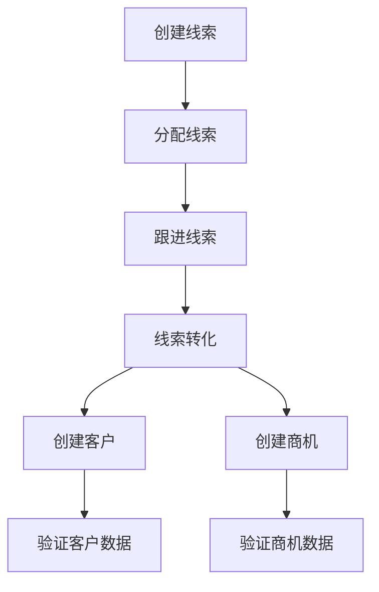
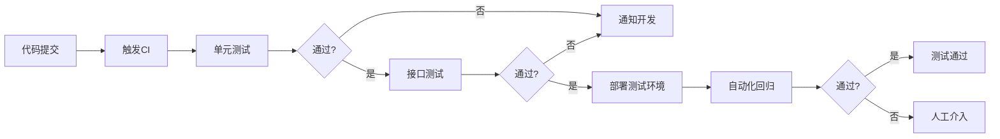
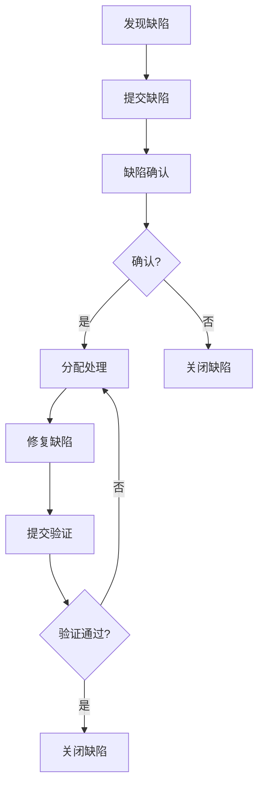

# MOY 测试与验收方案

---

## 文档元信息

| 属性 | 内容 |
|------|------|
| 文档名称 | MOY 测试与验收方案 |
| 文档编号 | MOY_TEST_001 |
| 版本号 | v1.0 |
| 状态 | 已确认 |
| 作者 | MOY 文档架构组 |
| 日期 | 2026-04-05 |
| 目标读者 | 测试工程师、开发工程师、产品经理、项目经理 |
| 输入来源 | [PRD](./06_PRD_产品需求规格说明书_v0.1.md)、[API](./11_API_接口设计说明.md)、[NFR](./22_非功能需求说明书.md) |

---

## 一、文档目的

本文档定义 MOY 系统的测试策略与验收标准，作为企业级 AI 原生客户管理系统的质量保障基线，用于：

1. 定义各层级测试的范围和策略
2. 明确测试用例设计规范
3. 制定UAT验收标准
4. 规范测试流程与质量门禁
5. 确保系统交付质量

---

## 二、测试策略总览

### 2.1 测试金字塔

```
                    ┌─────────┐
                    │  E2E    │  5%
                    ├─────────┤
                    │ 集成测试 │  15%
                    ├─────────┤
                    │ 接口测试 │  30%
                    ├─────────┤
                    │ 单元测试 │  50%
                    └─────────┘
```

### 2.2 测试类型与比例

| 测试类型 | 占比 | 责任人 | 说明 |
|----------|------|--------|------|
| 单元测试 | 50% | 开发工程师 | 代码级别测试 |
| 接口测试 | 30% | 测试工程师 | API接口测试 |
| 集成测试 | 15% | 测试工程师 | 模块集成测试 |
| 端到端测试 | 5% | 测试工程师 | 业务流程测试 |

### 2.3 测试环境

| 环境 | 用途 | 数据 | 说明 |
|------|------|------|------|
| 开发环境 | 开发自测 | 模拟数据 | 开发人员使用 |
| 测试环境 | 功能测试 | 测试数据 | 测试团队使用 |
| 预发布环境 | UAT验收 | 生产镜像 | 验收测试使用 |
| 生产环境 | 正式运行 | 真实数据 | 上线运行 |

---

## 三、单元测试

### 3.1 测试范围

| 模块 | 测试重点 | 覆盖率要求 |
|------|----------|------------|
| 权限模块 | 权限校验逻辑、角色判断 | ≥80% |
| 业务规则 | 状态机流转、业务校验 | ≥80% |
| 数据处理 | 数据转换、格式校验 | ≥70% |
| 工具类 | 工具方法、通用逻辑 | ≥90% |
| AI模块 | AI调用封装、结果处理 | ≥70% |

### 3.2 测试规范

| 规范项 | 要求 |
|--------|------|
| 命名规范 | 测试类以Test结尾，方法以test开头 |
| 断言规范 | 使用明确的断言，避免assertTrue |
| 数据准备 | 使用Mock数据，不依赖外部环境 |
| 隔离性 | 测试之间相互独立，无依赖关系 |
| 可重复性 | 测试可重复执行，结果一致 |

### 3.3 测试用例示例

```java
@Test
public void testLeadStatusTransition_FromNewToAssigned_ShouldSuccess() {
    Lead lead = new Lead();
    lead.setStatus("new");
    
    boolean result = leadService.transitionStatus(lead, "assigned");
    
    assertTrue(result);
    assertEquals("assigned", lead.getStatus());
}

@Test
public void testLeadStatusTransition_FromConvertedToAssigned_ShouldFail() {
    Lead lead = new Lead();
    lead.setStatus("converted");
    
    assertThrows(BusinessException.class, () -> {
        leadService.transitionStatus(lead, "assigned");
    });
}
```

### 3.4 覆盖率统计

| 模块 | 行覆盖率 | 分支覆盖率 | 方法覆盖率 |
|------|----------|------------|------------|
| 权限模块 | 85% | 80% | 90% |
| 客户模块 | 75% | 70% | 85% |
| 线索模块 | 78% | 72% | 88% |
| 商机模块 | 76% | 70% | 85% |
| 工单模块 | 80% | 75% | 88% |
| AI模块 | 72% | 68% | 80% |

---

## 四、接口测试

### 4.1 测试范围

| 接口分类 | 测试重点 | 测试数量 |
|----------|----------|----------|
| 认证接口 | 登录、登出、Token刷新 | 5个 |
| 用户管理 | CRUD、角色分配 | 6个 |
| 客户管理 | CRUD、批量操作、导出 | 12个 |
| 线索管理 | CRUD、转化、分配 | 10个 |
| 商机管理 | CRUD、阶段变更 | 10个 |
| 会话管理 | CRUD、消息、智能回复 | 12个 |
| 工单管理 | CRUD、状态变更 | 12个 |
| 知识库 | CRUD、搜索、问答 | 8个 |
| AI接口 | 智能回复、评分、问答 | 5个 |

### 4.2 接口测试规范

| 测试项 | 验证内容 |
|--------|----------|
| 正常场景 | 正确参数返回正确结果 |
| 参数校验 | 必填参数、参数类型、参数范围 |
| 权限校验 | 无权限返回403 |
| 业务规则 | 业务规则约束验证 |
| 边界值 | 边界条件处理 |
| 异常处理 | 异常场景返回正确错误码 |

### 4.3 接口测试用例模板

```yaml
test_case:
  id: TC_API_001
  name: 创建客户-正常场景
  priority: P0
  preconditions:
    - 用户已登录
    - 用户有customer:create权限
  test_steps:
    - step: 发送创建客户请求
      request:
        method: POST
        url: /api/v1/customers
        headers:
          Authorization: Bearer {token}
        body:
          name: 测试客户
          type: enterprise
          phone: "13800138000"
      expected:
        status_code: 200
        body:
          code: 0
          data.name: 测试客户
  postconditions:
    - 删除创建的客户
```

### 4.4 接口测试覆盖率

| 模块 | 接口总数 | 测试覆盖 | 覆盖率 |
|------|----------|----------|--------|
| 认证模块 | 5 | 5 | 100% |
| 用户管理 | 6 | 6 | 100% |
| 客户管理 | 12 | 12 | 100% |
| 线索管理 | 10 | 10 | 100% |
| 商机管理 | 10 | 10 | 100% |
| 会话管理 | 12 | 12 | 100% |
| 工单管理 | 12 | 12 | 100% |
| 知识库 | 8 | 8 | 100% |
| AI接口 | 5 | 5 | 100% |

---

## 五、集成测试

### 5.1 测试范围

| 集成场景 | 测试重点 | 优先级 |
|----------|----------|--------|
| 数据库集成 | 数据持久化、事务一致性 | P0 |
| 缓存集成 | 缓存读写、缓存失效 | P0 |
| 消息队列集成 | 消息发送、消费确认 | P1 |
| AI服务集成 | AI调用、结果处理 | P1 |
| 搜索服务集成 | 索引同步、搜索查询 | P1 |

### 5.2 集成测试场景

#### 5.2.1 数据库集成测试

| 场景 | 验证内容 |
|------|----------|
| 事务回滚 | 异常时数据回滚 |
| 并发写入 | 并发写入数据一致性 |
| 级联操作 | 关联数据级联更新 |
| 软删除 | 删除后数据不可见 |

#### 5.2.2 缓存集成测试

| 场景 | 验证内容 |
|------|----------|
| 缓存命中 | 缓存数据正确返回 |
| 缓存更新 | 数据更新后缓存同步 |
| 缓存失效 | 缓存过期后重新加载 |
| 缓存穿透 | 不存在数据处理 |

#### 5.2.3 AI服务集成测试

| 场景 | 验证内容 |
|------|----------|
| 正常调用 | AI服务正常返回 |
| 超时处理 | AI服务超时降级 |
| 错误处理 | AI服务错误降级 |
| 结果解析 | AI结果正确解析 |

---

## 六、业务流程测试

### 6.1 核心业务流程

| 流程名称 | 测试场景 | 优先级 |
|----------|----------|--------|
| 线索转化流程 | 线索→客户→商机 | P0 |
| 客户服务流程 | 会话→工单→解决 | P0 |
| 商机成交流程 | 商机创建→阶段推进→成交 | P0 |
| 工单处理流程 | 工单创建→分配→处理→关闭 | P0 |

### 6.2 线索转化流程测试



| 步骤 | 操作 | 验证点 |
|------|------|--------|
| 1 | 创建线索 | 线索创建成功，状态为new |
| 2 | 分配线索 | 线索状态变为assigned |
| 3 | 添加跟进 | 跟进记录创建成功 |
| 4 | 转化线索 | 状态变为converted |
| 5 | 验证客户 | 客户自动创建，数据正确 |
| 6 | 验证商机 | 商机自动创建，阶段正确 |

### 6.3 客户服务流程测试

| 步骤 | 操作 | 验证点 |
|------|------|--------|
| 1 | 发起会话 | 会话创建成功 |
| 2 | 发送消息 | 消息记录正确 |
| 3 | AI智能回复 | AI建议生成成功 |
| 4 | 创建工单 | 工单关联会话 |
| 5 | 处理工单 | 工单状态流转正确 |
| 6 | 关闭会话 | 会话状态变为closed |

---

## 七、权限测试

### 7.1 测试范围

| 测试类型 | 测试内容 |
|----------|----------|
| 功能权限 | 菜单、按钮、操作权限 |
| 数据权限 | 数据范围、数据隔离 |
| 字段权限 | 字段可见性、可编辑性 |
| 跨租户隔离 | 租户数据隔离 |

### 7.2 角色权限测试矩阵

| 角色 | 客户创建 | 客户删除 | 客户导出 | 用户管理 | 系统配置 |
|------|----------|----------|----------|----------|----------|
| 租户管理员 | ✓ | ✓ | ✓ | ✓ | ✓ |
| 销售主管 | ✓ | ✓(部门) | ✓ | ✗ | ✗ |
| 销售专员 | ✓ | ✗ | ✗ | ✗ | ✗ |
| 客服主管 | ✗ | ✗ | ✗ | ✓(部门) | ✗ |
| 客服专员 | ✗ | ✗ | ✗ | ✗ | ✗ |
| 只读用户 | ✗ | ✗ | ✗ | ✗ | ✗ |

### 7.3 数据权限测试

| 测试场景 | 测试用户 | 预期结果 |
|----------|----------|----------|
| 查看全部数据 | 租户管理员 | 可见租户所有数据 |
| 查看部门数据 | 销售主管 | 可见本部门及下级数据 |
| 查看个人数据 | 销售专员 | 仅可见个人数据 |
| 跨租户访问 | 用户A访问租户B数据 | 返回403禁止访问 |

### 7.4 权限边界测试

| 测试场景 | 操作 | 预期结果 |
|----------|------|----------|
| 无权限访问 | 无权限用户访问功能 | 返回403 |
| 越权操作 | 普通用户删除他人数据 | 返回403 |
| 跨部门操作 | 用户操作其他部门数据 | 返回403 |
| 跨租户操作 | 用户操作其他租户数据 | 返回403 |

---

## 八、AI输出质量验证

### 8.1 AI测试策略

| 测试类型 | 测试内容 | 验证方式 |
|----------|----------|----------|
| 功能测试 | AI功能正常工作 | 输入输出验证 |
| 质量测试 | AI输出质量评估 | 人工评估+自动化指标 |
| 边界测试 | AI边界场景处理 | 异常输入测试 |
| 安全测试 | AI输出安全性 | 敏感内容检测 |

### 8.2 智能回复质量验证

| 评估维度 | 评估标准 | 合格阈值 |
|----------|----------|----------|
| 相关性 | 回复与问题相关 | ≥90% |
| 准确性 | 回复内容准确 | ≥85% |
| 专业性 | 回复专业规范 | ≥80% |
| 友好度 | 回复语气友好 | ≥85% |
| 时效性 | 响应时间 | ≤5秒 |

### 8.3 知识问答质量验证

| 测试场景 | 测试数据 | 验证标准 |
|----------|----------|----------|
| 常见问题 | 100个标准问题 | 准确率≥90% |
| 复杂问题 | 50个复杂问题 | 准确率≥80% |
| 边界问题 | 30个边界问题 | 合理回复率≥70% |
| 无关问题 | 20个无关问题 | 正确拒绝率≥90% |

### 8.4 线索评分验证

| 验证项 | 验证方法 | 合格标准 |
|--------|----------|----------|
| 评分一致性 | 同一线索多次评分 | 分数差异≤5% |
| 评分区分度 | 高低质量线索评分对比 | 分数差异≥20% |
| 因子合理性 | 评分因子权重 | 符合业务规则 |
| 异常处理 | 异常数据处理 | 返回合理结果 |

### 8.5 AI幻觉检测

| 检测类型 | 检测方法 | 处理方式 |
|----------|----------|----------|
| 事实性幻觉 | 与知识库比对 | 标记警告 |
| 数据幻觉 | 数据格式验证 | 过滤修正 |
| 来源幻觉 | 引用验证 | 移除引用 |
| 逻辑幻觉 | 逻辑一致性检查 | 人工审核 |

---

## 九、自动化规则测试

### 9.1 测试范围

| 规则类型 | 测试场景 |
|----------|----------|
| 线索分配规则 | 触发条件、分配结果 |
| 会话分配规则 | 触发条件、分配结果 |
| 工单分配规则 | 触发条件、分配结果 |
| 状态变更规则 | 触发条件、变更结果 |
| 通知规则 | 触发条件、通知发送 |

### 9.2 规则测试用例

```yaml
test_case:
  id: TC_RULE_001
  name: 线索自动分配规则-官网来源
  priority: P0
  rule_config:
    name: 官网线索分配
    trigger_event: lead_create
    conditions:
      source: website
    actions:
      type: assign
      strategy: round_robin
      candidates:
        type: department
        department_id: 2
  test_steps:
    - step: 创建官网来源线索
      input:
        name: 测试线索
        source: website
      expected:
        - 线索被分配给销售部成员
        - 分配按轮询方式进行
        - 发送分配通知
```

### 9.3 规则执行验证

| 验证项 | 验证内容 |
|--------|----------|
| 条件匹配 | 规则条件正确匹配 |
| 动作执行 | 规则动作正确执行 |
| 优先级 | 多规则按优先级执行 |
| 异常处理 | 规则执行异常处理 |
| 日志记录 | 规则执行日志完整 |

---

## 十、边界与异常测试

### 10.1 边界值测试

| 测试对象 | 边界值 | 预期结果 |
|----------|--------|----------|
| 分页大小 | 0, 1, 100, 101 | 正确处理边界 |
| 字符串长度 | 空, 最大长度+1 | 正确校验 |
| 数值范围 | 最小值, 最大值 | 正确处理 |
| 日期范围 | 过去, 未来 | 正确校验 |

### 10.2 异常场景测试

| 异常场景 | 测试操作 | 预期结果 |
|----------|----------|----------|
| 网络超时 | 模拟网络延迟 | 超时提示，可重试 |
| 服务不可用 | 模拟服务宕机 | 降级处理，友好提示 |
| 数据库异常 | 模拟数据库故障 | 错误日志，降级处理 |
| 缓存异常 | 模拟缓存故障 | 直连数据库 |
| AI服务异常 | 模拟AI服务故障 | 关闭AI功能，提示用户 |

### 10.3 并发测试场景

| 场景 | 并发数 | 预期结果 |
|------|--------|----------|
| 同时创建客户 | 100 | 数据一致，无重复 |
| 同时修改数据 | 50 | 乐观锁生效 |
| 同时导出数据 | 20 | 排队处理 |
| 同时AI调用 | 30 | 限流生效 |

---

## 十一、UAT验收标准

### 11.1 客户管理模块验收

| 验收项 | 验收标准 | 验收方式 |
|--------|----------|----------|
| 客户创建 | 必填字段校验正确，数据保存成功 | 功能测试 |
| 客户查询 | 列表展示正确，筛选条件生效 | 功能测试 |
| 客户修改 | 数据更新成功，变更记录完整 | 功能测试 |
| 客户删除 | 软删除生效，关联数据处理正确 | 功能测试 |
| 客户导出 | 导出数据完整，格式正确 | 功能测试 |
| 客户分配 | 分配成功，通知发送 | 功能测试 |
| 权限控制 | 数据范围权限正确 | 权限测试 |

### 11.2 线索管理模块验收

| 验收项 | 验收标准 | 验收方式 |
|--------|----------|----------|
| 线索创建 | 数据保存成功，状态正确 | 功能测试 |
| 线索分配 | 分配成功，状态流转正确 | 功能测试 |
| 线索跟进 | 跟进记录保存成功 | 功能测试 |
| 线索转化 | 转化成功，客户商机创建正确 | 流程测试 |
| 线索导入 | 批量导入成功，数据正确 | 功能测试 |
| 状态流转 | 状态机规则正确执行 | 业务规则测试 |

### 11.3 商机管理模块验收

| 验收项 | 验收标准 | 验收方式 |
|--------|----------|----------|
| 商机创建 | 数据保存成功，阶段正确 | 功能测试 |
| 阶段变更 | 状态流转正确，历史记录完整 | 功能测试 |
| 商机关闭 | 关闭成功，统计数据更新 | 功能测试 |
| 预计金额 | 金额计算正确，统计准确 | 功能测试 |
| 赢单率 | 各阶段赢单率显示正确 | 功能测试 |

### 11.4 会话管理模块验收

| 验收项 | 验收标准 | 验收方式 |
|--------|----------|----------|
| 会话创建 | 会话创建成功，关联客户正确 | 功能测试 |
| 消息收发 | 消息发送接收正常 | 功能测试 |
| 智能回复 | AI建议生成正确，质量达标 | AI测试 |
| 会话转接 | 转接成功，历史保留 | 功能测试 |
| 会话关闭 | 关闭成功，状态正确 | 功能测试 |

### 11.5 工单管理模块验收

| 验收项 | 验收标准 | 验收方式 |
|--------|----------|----------|
| 工单创建 | 数据保存成功，编号生成正确 | 功能测试 |
| 工单分配 | 分配成功，通知发送 | 功能测试 |
| 状态流转 | 状态机规则正确执行 | 业务规则测试 |
| SLA监控 | 超时预警正确触发 | 功能测试 |
| 工单解决 | 解决成功，满意度调查发送 | 功能测试 |

### 11.6 AI功能验收

| 验收项 | 验收标准 | 验收方式 |
|--------|----------|----------|
| 智能回复 | 回复质量达标，响应时间符合要求 | AI测试 |
| 知识问答 | 问答准确率达标 | AI测试 |
| 线索评分 | 评分合理，区分度达标 | AI测试 |
| 人机协同 | 高风险操作需人工确认 | 功能测试 |
| 审计追溯 | AI执行记录完整 | 审计测试 |

### 11.7 报表验收

| 验收项 | 验收标准 | 验收方式 |
|--------|----------|----------|
| 销售看板 | 数据准确，图表展示正确 | 功能测试 |
| 客服看板 | 数据准确，实时更新 | 功能测试 |
| 数据导出 | 导出数据完整，格式正确 | 功能测试 |
| 时间范围 | 时间筛选正确 | 功能测试 |

### 11.8 审计日志验收

| 验收项 | 验收标准 | 验收方式 |
|--------|----------|----------|
| 登录日志 | 登录记录完整 | 审计测试 |
| 操作日志 | 关键操作记录完整 | 审计测试 |
| 数据变更 | 变更前后值记录正确 | 审计测试 |
| 日志查询 | 查询条件正确，结果完整 | 功能测试 |
| 日志导出 | 导出数据完整 | 功能测试 |

---

## 十二、回归测试策略

### 12.1 回归测试范围

| 触发条件 | 测试范围 | 执行频率 |
|----------|----------|----------|
| 功能变更 | 变更模块+关联模块 | 每次变更 |
| 版本发布 | 全量核心功能 | 每次发布 |
| 定期回归 | 全量功能 | 每月一次 |

### 12.2 回归测试用例库

| 模块 | 核心用例数 | 自动化率 |
|------|------------|----------|
| 认证模块 | 10 | 100% |
| 客户管理 | 30 | 90% |
| 线索管理 | 25 | 90% |
| 商机管理 | 20 | 85% |
| 会话管理 | 25 | 85% |
| 工单管理 | 30 | 90% |
| AI功能 | 15 | 60% |

### 12.3 自动化回归流程



---

## 十三、测试准入准出标准

### 13.1 测试准入标准

| 准入项 | 标准 |
|--------|------|
| 需求文档 | 需求已评审确认 |
| 设计文档 | 设计文档已完成 |
| 代码提交 | 代码已提交并通过代码审查 |
| 单元测试 | 单元测试通过率≥95% |
| 部署包 | 测试环境部署成功 |
| 冒烟测试 | 冒烟测试通过 |

### 13.2 测试准出标准

| 准出项 | 标准 |
|--------|------|
| 用例执行 | 测试用例执行率100% |
| 缺陷修复 | P0/P1缺陷修复率100% |
| 缺陷遗留 | P2缺陷≤5个，P3缺陷≤10个 |
| 回归测试 | 回归测试通过 |
| 性能测试 | 性能指标达标 |
| 安全测试 | 无高危安全漏洞 |

---

## 十四、缺陷管理

### 14.1 缺陷等级定义

| 等级 | 定义 | 处理时限 |
|------|------|----------|
| P0-致命 | 系统崩溃、数据丢失、安全漏洞 | 立即修复 |
| P1-严重 | 核心功能不可用、数据错误 | 24小时内 |
| P2-一般 | 功能缺陷、体验问题 | 3天内 |
| P3-建议 | 优化建议、非功能问题 | 下版本 |

### 14.2 缺陷处理流程



### 14.3 缺陷统计指标

| 指标 | 计算方式 | 目标值 |
|------|----------|--------|
| 缺陷密度 | 缺陷数/功能点 | ≤0.5 |
| 缺陷修复率 | 已修复/总缺陷 | ≥95% |
| 缺陷重开率 | 重开/已关闭 | ≤5% |
| 缺陷遗留率 | 遗留/总缺陷 | ≤5% |

---

## 十五、版本与变更记录

| 版本 | 日期 | 作者 | 变更摘要 | 状态 |
|------|------|------|----------|------|
| v1.0 | 2026-04-05 | MOY 文档架构组 | 初稿 | 已确认 |

---

## 十六、依赖文档

| 文档 | 版本 | 用途 |
|------|------|------|
| [06_PRD_产品需求规格说明书_v0.1.md](./06_PRD_产品需求规格说明书_v0.1.md) | v2.0 | 业务需求 |
| [11_API_接口设计说明.md](./11_API_接口设计说明.md) | v3.0 | 接口定义 |
| [22_非功能需求说明书.md](./22_非功能需求说明书.md) | v1.0 | 非功能需求 |

---

## 十七、待确认事项

1. AI测试数据集是否需要专门准备？
2. 性能测试环境是否独立部署？
3. 安全测试是否需要第三方渗透测试？
4. UAT验收是否需要客户参与？
