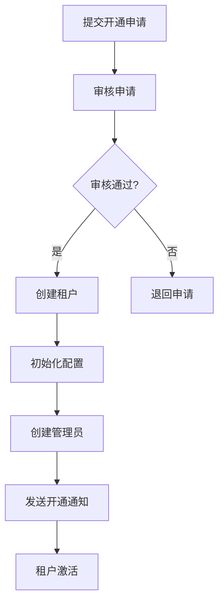
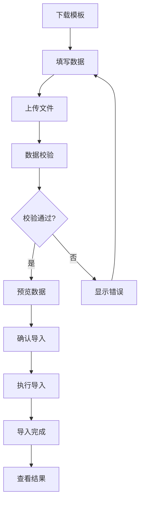
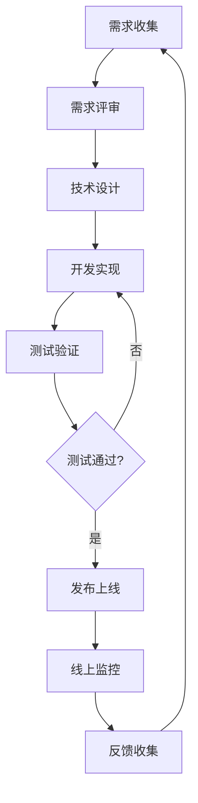

# MOY 实施与上线指南

---

## 文档元信息

| 属性 | 内容 |
|------|------|
| 文档名称 | MOY 实施与上线指南 |
| 文档编号 | MOY_DEPLOY_001 |
| 版本号 | v1.0 |
| 状态 | 已确认 |
| 作者 | MOY 文档架构组 |
| 日期 | 2026-04-05 |
| 目标读者 | 实施工程师、运维工程师、项目经理 |
| 输入来源 | [HLD](./09_HLD_系统高层设计.md)、[配置中心设计](./19_配置中心设计.md) |

---

## 一、文档目的

本文档定义 MOY 系统的实施与上线流程，作为企业级 AI 原生客户管理系统的交付基线，用于：

1. 指导系统首次部署和配置
2. 规范租户开通和初始化流程
3. 明确数据导入规则和策略
4. 提供培训与试运行建议
5. 制定监控告警和回滚方案

---

## 二、系统环境要求

### 2.1 硬件要求

| 组件 | 最低配置 | 推荐配置 | 说明 |
|------|----------|----------|------|
| 应用服务器 | 4核8G | 8核16G | 支持水平扩展 |
| 数据库服务器 | 8核16G | 16核32G | 主从部署 |
| 缓存服务器 | 4核8G | 8核16G | 哨兵模式 |
| 消息队列 | 4核8G | 8核16G | 集群模式 |
| 文件存储 | 100GB | 1TB | 对象存储 |

### 2.2 软件要求

| 软件 | 版本要求 | 说明 |
|------|----------|------|
| 操作系统 | CentOS 7+/Ubuntu 20.04+ | Linux服务器 |
| Docker | 20.10+ | 容器运行环境 |
| Kubernetes | 1.20+ | 容器编排（可选） |
| PostgreSQL | 15+ | 主数据库 |
| Redis | 7+ | 缓存服务 |
| RabbitMQ | 3.12+ | 消息队列 |
| Elasticsearch | 8+ | 搜索引擎 |
| Nginx | 1.24+ | 反向代理 |

### 2.3 网络要求

| 端口 | 服务 | 说明 |
|------|------|------|
| 80/443 | Nginx | HTTP/HTTPS |
| 8080 | 应用服务 | API服务 |
| 5432 | PostgreSQL | 数据库 |
| 6379 | Redis | 缓存 |
| 5672 | RabbitMQ | 消息队列 |
| 9200 | Elasticsearch | 搜索引擎 |

---

## 三、首次部署准备

### 3.1 部署前检查清单

| 检查项 | 检查内容 | 确认状态 |
|--------|----------|----------|
| 服务器资源 | CPU/内存/磁盘满足要求 | □ |
| 网络连通 | 服务器间网络互通 | □ |
| 依赖软件 | 所需软件已安装 | □ |
| 域名证书 | SSL证书已准备 | □ |
| 配置文件 | 配置文件已准备 | □ |
| 数据库脚本 | 初始化脚本已准备 | □ |

### 3.2 配置文件清单

| 配置文件 | 用途 | 存放路径 |
|----------|------|----------|
| application.yml | 应用配置 | /opt/moy/config/ |
| database.yml | 数据库配置 | /opt/moy/config/ |
| redis.yml | 缓存配置 | /opt/moy/config/ |
| nginx.conf | Nginx配置 | /etc/nginx/ |
| docker-compose.yml | 容器编排 | /opt/moy/ |

### 3.3 环境变量配置

| 变量名 | 说明 | 示例值 |
|--------|------|--------|
| MOY_ENV | 运行环境 | production |
| MOY_DB_HOST | 数据库地址 | db.example.com |
| MOY_DB_PORT | 数据库端口 | 5432 |
| MOY_DB_NAME | 数据库名称 | moy |
| MOY_DB_USER | 数据库用户 | moy_user |
| MOY_DB_PASSWORD | 数据库密码 | ****** |
| MOY_REDIS_HOST | Redis地址 | redis.example.com |
| MOY_REDIS_PORT | Redis端口 | 6379 |
| MOY_REDIS_PASSWORD | Redis密码 | ****** |
| MOY_AI_API_KEY | AI服务密钥 | ****** |
| MOY_SECRET_KEY | 应用密钥 | ****** |

### 3.4 部署步骤

```bash
# 1. 创建部署目录
mkdir -p /opt/moy/{config,logs,data}

# 2. 上传部署包
scp moy-deploy.tar.gz user@server:/opt/moy/

# 3. 解压部署包
cd /opt/moy && tar -xzf moy-deploy.tar.gz

# 4. 配置环境变量
cp .env.example .env
vi .env

# 5. 初始化数据库
psql -U postgres -f scripts/init-db.sql

# 6. 启动服务
docker-compose up -d

# 7. 检查服务状态
docker-compose ps

# 8. 查看启动日志
docker-compose logs -f
```

---

## 四、初始化配置项

### 4.1 系统初始化配置

| 配置项 | 配置值 | 说明 |
|--------|--------|------|
| 系统名称 | MOY客户管理系统 | 系统显示名称 |
| 系统Logo | 默认Logo | 可自定义上传 |
| 默认语言 | zh_CN | 默认中文 |
| 默认时区 | Asia/Shanghai | 默认时区 |
| 会话超时 | 7200秒 | 2小时无操作超时 |

### 4.2 安全初始化配置

| 配置项 | 配置值 | 说明 |
|--------|--------|------|
| 密码最小长度 | 8位 | 密码强度要求 |
| 密码复杂度 | 大小写+数字 | 密码规则 |
| 登录失败锁定 | 5次 | 失败锁定次数 |
| 锁定时间 | 30分钟 | 锁定持续时间 |
| Token有效期 | 2小时 | Access Token有效期 |
| Refresh Token | 7天 | 刷新Token有效期 |

### 4.3 业务初始化配置

| 配置项 | 配置值 | 说明 |
|--------|--------|------|
| 客户编码规则 | C{YYYYMMDD}{0001} | 自动生成规则 |
| 线索编码规则 | L{YYYYMMDD}{0001} | 自动生成规则 |
| 商机编码规则 | O{YYYYMMDD}{0001} | 自动生成规则 |
| 工单编码规则 | T{YYYYMMDD}{0001} | 自动生成规则 |
| 公海池回收周期 | 30天 | 无跟进自动回收 |

### 4.4 AI初始化配置

| 配置项 | 配置值 | 说明 |
|--------|--------|------|
| 默认AI模型 | gpt-3.5-turbo | 默认使用模型 |
| 智能回复温度 | 0.7 | 生成随机性 |
| 最大Token数 | 1000 | 单次生成上限 |
| AI调用超时 | 30秒 | 超时时间 |
| 置信度阈值 | 0.7 | 自动执行阈值 |

---

## 五、租户开通流程

### 5.1 租户开通步骤



### 5.2 租户创建脚本

```sql
-- 创建租户
INSERT INTO organizations (name, code, status, edition, max_users, expire_at)
VALUES ('客户公司名称', 'CUSTOMER001', 'active', 'professional', 50, '2027-04-05');

-- 获取租户ID
SELECT id FROM organizations WHERE code = 'CUSTOMER001';
```

### 5.3 租户配置项

| 配置项 | 说明 | 默认值 |
|--------|------|--------|
| 租户名称 | 企业名称 | - |
| 租户编码 | 唯一标识 | 自动生成 |
| 版本类型 | trial/standard/professional/enterprise | standard |
| 最大用户数 | 用户数限制 | 10 |
| 存储空间 | 存储空间限制(MB) | 10240 |
| 服务到期 | 服务到期时间 | 1年后 |
| 功能模块 | 启用的功能模块 | 全部 |

---

## 六、角色与权限初始化

### 6.1 系统角色初始化

| 角色编码 | 角色名称 | 说明 |
|----------|----------|------|
| org_admin | 租户管理员 | 租户最高权限 |
| sales_manager | 销售主管 | 销售团队管理 |
| sales_rep | 销售专员 | 一线销售 |
| service_manager | 客服主管 | 客服团队管理 |
| service_agent | 客服专员 | 一线客服 |
| ai_operator | AI运营管理员 | AI规则配置 |
| auditor | 审计查看者 | 只读+审计 |
| readonly | 只读用户 | 只读权限 |

### 6.2 角色权限初始化脚本

```sql
-- 初始化角色
INSERT INTO roles (org_id, code, name, is_system, data_scope) VALUES
(1, 'org_admin', '租户管理员', 1, 'all'),
(1, 'sales_manager', '销售主管', 1, 'department'),
(1, 'sales_rep', '销售专员', 1, 'self'),
(1, 'service_manager', '客服主管', 1, 'department'),
(1, 'service_agent', '客服专员', 1, 'self'),
(1, 'ai_operator', 'AI运营管理员', 1, 'all'),
(1, 'auditor', '审计查看者', 1, 'all'),
(1, 'readonly', '只读用户', 1, 'self');

-- 初始化角色权限
INSERT INTO role_permissions (role_id, permission_id)
SELECT r.id, p.id FROM roles r, permissions p
WHERE r.code = 'org_admin';
```

### 6.3 管理员账号创建

```sql
-- 创建管理员账号
INSERT INTO users (org_id, username, password, real_name, email, phone, status, is_admin)
VALUES (1, 'admin', '$2a$10$...', '系统管理员', 'admin@company.com', '13800138000', 'active', 1);

-- 分配管理员角色
INSERT INTO user_roles (user_id, role_id)
SELECT u.id, r.id FROM users u, roles r
WHERE u.username = 'admin' AND r.code = 'org_admin';
```

---

## 七、基础字典初始化

### 7.1 字典类型初始化

| 字典类型 | 类型编码 | 说明 |
|----------|----------|------|
| 客户类型 | customer_type | 个人/企业 |
| 客户等级 | customer_level | A/B/C/D |
| 客户来源 | customer_source | 渠道来源 |
| 客户生命周期 | customer_lifecycle | 生命周期状态 |
| 线索来源 | lead_source | 线索渠道 |
| 线索状态 | lead_status | 线索状态 |
| 商机阶段 | opportunity_stage | 商机阶段 |
| 工单类型 | ticket_type | 工单分类 |
| 工单优先级 | ticket_priority | 优先级 |
| 工单状态 | ticket_status | 工单状态 |

### 7.2 字典项初始化脚本

```sql
-- 初始化客户类型
INSERT INTO dict_types (type_code, type_name, is_system) VALUES
('customer_type', '客户类型', 1);

INSERT INTO dict_items (type_id, item_code, item_name, sort_order) VALUES
(1, 'individual', '个人', 1),
(1, 'enterprise', '企业', 2);

-- 初始化客户等级
INSERT INTO dict_types (type_code, type_name, is_system) VALUES
('customer_level', '客户等级', 1);

INSERT INTO dict_items (type_id, item_code, item_name, sort_order) VALUES
(2, 'A', 'A级客户', 1),
(2, 'B', 'B级客户', 2),
(2, 'C', 'C级客户', 3),
(2, 'D', 'D级客户', 4);

-- 初始化线索状态
INSERT INTO dict_types (type_code, type_name, is_system) VALUES
('lead_status', '线索状态', 1);

INSERT INTO dict_items (type_id, item_code, item_name, sort_order) VALUES
(3, 'new', '新线索', 1),
(3, 'assigned', '已分配', 2),
(3, 'following', '跟进中', 3),
(3, 'converted', '已转化', 4),
(3, 'invalid', '已失效', 5);
```

### 7.3 渠道初始化

| 渠道编码 | 渠道名称 | 渠道类型 | 说明 |
|----------|----------|----------|------|
| website | 官网表单 | online | 官网咨询表单 |
| wechat_mp | 微信公众号 | online | 微信公众号咨询 |
| wecom | 企业微信 | online | 企业微信咨询 |
| phone | 电话咨询 | offline | 电话咨询 |
| event | 活动报名 | offline | 线下活动报名 |
| referral | 客户转介绍 | referral | 老客户推荐 |

---

## 八、数据导入规则

### 8.1 导入数据类型

| 数据类型 | 导入方式 | 模板格式 | 说明 |
|----------|----------|----------|------|
| 客户数据 | 批量导入 | Excel/CSV | 支持增量导入 |
| 线索数据 | 批量导入 | Excel/CSV | 支持增量导入 |
| 联系人数据 | 批量导入 | Excel/CSV | 关联客户 |
| 产品数据 | 批量导入 | Excel/CSV | 产品信息 |
| 知识库数据 | 批量导入 | Word/Excel | 知识条目 |

### 8.2 导入模板规范

**客户导入模板：**

| 字段名 | 必填 | 类型 | 说明 |
|--------|------|------|------|
| 客户名称 | 是 | 文本 | 最大64字符 |
| 客户类型 | 是 | 枚举 | 个人/企业 |
| 联系电话 | 否 | 文本 | 手机号格式 |
| 联系邮箱 | 否 | 文本 | 邮箱格式 |
| 公司名称 | 否 | 文本 | 最大128字符 |
| 客户来源 | 否 | 枚举 | 字典值 |
| 客户等级 | 否 | 枚举 | A/B/C/D |
| 备注 | 否 | 文本 | 最大500字符 |

### 8.3 导入规则

| 规则项 | 说明 |
|--------|------|
| 重复检测 | 按名称+电话判断重复 |
| 数据校验 | 按字段规则校验 |
| 错误处理 | 记录错误行，继续导入 |
| 导入日志 | 记录导入结果 |
| 审计记录 | 记录数据来源 |

### 8.4 导入流程



---

## 九、培训与试运行建议

### 9.1 培训计划

| 培训对象 | 培训内容 | 培训时长 | 培训方式 |
|----------|----------|----------|----------|
| 系统管理员 | 系统配置、用户管理、权限管理 | 4小时 | 现场+实操 |
| 销售主管 | 客户管理、线索管理、商机管理、数据看板 | 3小时 | 现场+实操 |
| 销售专员 | 客户操作、线索操作、商机操作 | 2小时 | 现场+实操 |
| 客服主管 | 会话管理、工单管理、知识库、数据看板 | 3小时 | 现场+实操 |
| 客服专员 | 会话操作、工单操作、知识库使用 | 2小时 | 现场+实操 |
| AI运营管理员 | 自动化规则、AI配置、提示词管理 | 3小时 | 现场+实操 |

### 9.2 培训材料

| 材料类型 | 内容 | 格式 |
|----------|------|------|
| 用户手册 | 各角色操作指南 | PDF/在线文档 |
| 视频教程 | 功能演示视频 | MP4 |
| 快速入门 | 新用户快速上手指南 | PDF |
| FAQ | 常见问题解答 | 在线文档 |

### 9.3 试运行计划

| 阶段 | 时长 | 目标 | 验收标准 |
|------|------|------|----------|
| 熟悉阶段 | 1周 | 用户熟悉系统 | 用户能独立操作 |
| 并行阶段 | 2周 | 新旧系统并行 | 数据一致性验证 |
| 切换阶段 | 1周 | 全面切换新系统 | 业务正常运转 |
| 稳定阶段 | 2周 | 系统稳定运行 | 无重大问题 |

### 9.4 试运行检查点

| 检查项 | 检查频率 | 责任人 |
|--------|----------|--------|
| 系统可用性 | 每日 | 运维 |
| 用户反馈 | 每日 | 项目经理 |
| 数据准确性 | 每周 | 测试 |
| 性能监控 | 每日 | 运维 |
| 问题处理 | 实时 | 开发 |

---

## 十、监控与告警建议

### 10.1 监控指标

| 监控类型 | 监控指标 | 采集频率 | 告警阈值 |
|----------|----------|----------|----------|
| 服务器 | CPU使用率 | 1分钟 | >80% |
| 服务器 | 内存使用率 | 1分钟 | >85% |
| 服务器 | 磁盘使用率 | 5分钟 | >80% |
| 应用 | QPS | 10秒 | - |
| 应用 | 响应时间 | 10秒 | >5秒 |
| 应用 | 错误率 | 1分钟 | >1% |
| 数据库 | 连接数 | 1分钟 | >80% |
| 数据库 | 慢查询 | 1分钟 | >1秒 |
| 缓存 | 命中率 | 10秒 | <80% |
| 消息队列 | 积压数 | 1分钟 | >1000 |

### 10.2 告警配置

| 告警级别 | 告警条件 | 通知方式 | 响应时间 |
|----------|----------|----------|----------|
| P0-紧急 | 服务不可用 | 电话+短信+邮件 | 5分钟 |
| P1-严重 | 核心功能异常 | 短信+邮件 | 15分钟 |
| P2-一般 | 性能下降 | 邮件 | 1小时 |
| P3-提示 | 资源预警 | 邮件 | 4小时 |

### 10.3 监控仪表盘

| 仪表盘 | 展示内容 | 刷新频率 |
|--------|----------|----------|
| 系统概览 | 整体健康状态、关键指标 | 10秒 |
| 应用监控 | QPS、响应时间、错误率 | 10秒 |
| 基础设施 | CPU、内存、磁盘、网络 | 1分钟 |
| 业务监控 | 用户数、订单数、转化率 | 5分钟 |

### 10.4 日志管理

| 日志类型 | 存储周期 | 查询方式 |
|----------|----------|----------|
| 应用日志 | 30天 | ELK |
| 访问日志 | 30天 | ELK |
| 错误日志 | 90天 | ELK |
| 审计日志 | 180天 | 数据库 |
| 慢查询日志 | 30天 | 文件 |

---

## 十一、回滚方案

### 11.1 回滚场景

| 场景 | 触发条件 | 回滚方式 |
|------|----------|----------|
| 应用异常 | 重大Bug导致系统不可用 | 应用版本回滚 |
| 数据异常 | 数据错误或丢失 | 数据库时间点恢复 |
| 配置异常 | 配置错误导致功能异常 | 配置回滚 |
| 性能问题 | 性能严重下降 | 版本回滚 |

### 11.2 应用回滚步骤

```bash
# 1. 停止当前版本
docker-compose down

# 2. 切换到上一版本
git checkout v1.0.0

# 3. 重新部署
docker-compose up -d

# 4. 验证服务
curl http://localhost:8080/health

# 5. 通知相关方
# 发送回滚通知
```

### 11.3 数据库回滚步骤

```bash
# 1. 停止应用服务
docker-compose stop app

# 2. 恢复数据库备份
pg_restore -d moy /backup/moy_20260405.dump

# 3. 验证数据
psql -d moy -c "SELECT count(*) FROM customers;"

# 4. 启动应用
docker-compose start app

# 5. 验证功能
# 执行功能验证测试
```

### 11.4 配置回滚步骤

```bash
# 1. 获取历史配置
git log --oneline config/

# 2. 回滚配置文件
git checkout <commit-hash> -- config/

# 3. 重启服务
docker-compose restart app

# 4. 验证配置
curl http://localhost:8080/api/v1/settings
```

### 11.5 回滚验证清单

| 验证项 | 验证内容 | 确认状态 |
|--------|----------|----------|
| 服务状态 | 所有服务正常运行 | □ |
| 功能验证 | 核心功能正常 | □ |
| 数据验证 | 数据完整性 | □ |
| 性能验证 | 性能指标正常 | □ |
| 日志检查 | 无异常错误日志 | □ |

---

## 十二、后续版本迭代建议

### 12.1 版本规划

| 版本 | 发布周期 | 主要内容 |
|------|----------|----------|
| v1.1 | 2周 | Bug修复、小功能优化 |
| v1.2 | 1月 | 功能增强、性能优化 |
| v1.5 | 3月 | 新功能模块 |
| v2.0 | 6月 | 重大版本升级 |

### 12.2 迭代流程



### 12.3 发布策略

| 策略 | 说明 | 适用场景 |
|------|------|----------|
| 蓝绿部署 | 两套环境切换 | 重大版本发布 |
| 灰度发布 | 部分用户先体验 | 新功能发布 |
| 滚动发布 | 逐个实例更新 | 小版本更新 |

### 12.4 版本维护

| 版本状态 | 维护周期 | 说明 |
|----------|----------|------|
| 最新版本 | 持续维护 | 功能更新+Bug修复 |
| 上一版本 | 3个月 | 仅Bug修复 |
| 更早版本 | 停止维护 | 建议升级 |

---

## 十三、上线检查清单

### 13.1 技术检查

| 检查项 | 检查内容 | 确认状态 |
|--------|----------|----------|
| 服务器资源 | CPU/内存/磁盘满足要求 | □ |
| 网络配置 | 域名解析、SSL证书 | □ |
| 数据库 | 数据库初始化、索引创建 | □ |
| 缓存 | Redis配置、数据预热 | □ |
| 消息队列 | 队列创建、权限配置 | □ |
| 日志收集 | 日志收集配置正常 | □ |
| 监控告警 | 监控指标、告警规则 | □ |
| 备份策略 | 备份任务配置正常 | □ |

### 13.2 业务检查

| 检查项 | 检查内容 | 确认状态 |
|--------|----------|----------|
| 租户创建 | 租户信息完整 | □ |
| 用户创建 | 管理员账号创建 | □ |
| 角色权限 | 角色权限配置正确 | □ |
| 字典数据 | 基础字典初始化 | □ |
| 渠道配置 | 渠道信息配置 | □ |
| AI配置 | AI模型配置正确 | □ |
| 数据导入 | 历史数据导入完成 | □ |

### 13.3 安全检查

| 检查项 | 检查内容 | 确认状态 |
|--------|----------|----------|
| 访问控制 | 权限配置正确 | □ |
| 密码策略 | 密码强度要求生效 | □ |
| 数据加密 | 敏感数据加密存储 | □ |
| 传输加密 | HTTPS配置正确 | □ |
| 安全扫描 | 无高危漏洞 | □ |
| 日志审计 | 审计日志记录正常 | □ |

### 13.4 运维检查

| 检查项 | 检查内容 | 确认状态 |
|--------|----------|----------|
| 部署文档 | 部署文档完整 | □ |
| 运维手册 | 运维手册完整 | □ |
| 应急预案 | 应急预案制定 | □ |
| 值班安排 | 值班人员安排 | □ |
| 联系方式 | 紧急联系方式 | □ |

---

## 十四、版本与变更记录

| 版本 | 日期 | 作者 | 变更摘要 | 状态 |
|------|------|------|----------|------|
| v1.0 | 2026-04-05 | MOY 文档架构组 | 初稿 | 已确认 |

---

## 十五、依赖文档

| 文档 | 版本 | 用途 |
|------|------|------|
| [09_HLD_系统高层设计.md](./09_HLD_系统高层设计.md) | v1.0 | 架构设计 |
| [19_配置中心设计.md](./19_配置中心设计.md) | v1.0 | 配置管理 |
| [22_非功能需求说明书.md](./22_非功能需求说明书.md) | v1.0 | 非功能需求 |
| [23_测试与验收方案.md](./23_测试与验收方案.md) | v1.0 | 测试验收 |

---

## 十六、待确认事项

1. 是否需要支持多数据中心部署？
2. 灾备方案是否需要异地部署？
3. 是否需要提供SaaS版本部署方案？
4. 是否需要支持私有化部署定制？
