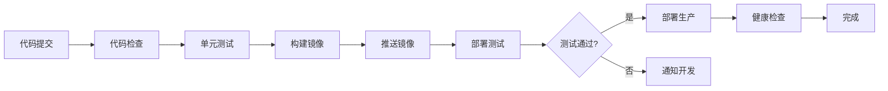

# MOY 部署架构设计

---

## 文档元信息

| 属性 | 内容 |
|------|------|
| 文档名称 | MOY 部署架构设计 |
| 文档编号 | MOY_DEPLOY_ARCH_001 |
| 版本号 | v1.0 |
| 状态 | 已确认 |
| 作者 | MOY 文档架构组 |
| 日期 | 2026-04-05 |
| 目标读者 | 系统架构师、运维工程师、DevOps工程师 |
| 输入来源 | [HLD](./09_HLD_系统高层设计.md)、[非功能需求](./22_非功能需求说明书.md) |

---

## 一、文档目的

本文档定义 MOY 系统的部署架构设计，作为企业级 AI 原生客户管理系统的运维基线，用于：

1. 定义生产环境的部署拓扑
2. 规划容器化与编排策略
3. 设计高可用与灾备方案
4. 规范CI/CD流水线
5. 确保系统可运维、可扩展

---

## 二、部署架构总览

### 2.1 整体架构

```
┌─────────────────────────────────────────────────────────────────┐
│                         用户访问层                               │
│  ┌─────────┐  ┌─────────┐  ┌─────────┐  ┌─────────┐            │
│  │ Web端   │  │ API调用 │  │ Webhook │  │ IM渠道  │            │
│  └────┬────┘  └────┬────┘  └────┬────┘  └────┬────┘            │
└───────┼────────────┼────────────┼────────────┼──────────────────┘
        │            │            │            │
        ▼            ▼            ▼            ▼
┌─────────────────────────────────────────────────────────────────┐
│                         接入层                                   │
│  ┌──────────────────────────────────────────────────────────┐  │
│  │                    CDN / WAF                              │  │
│  └──────────────────────────────────────────────────────────┘  │
│  ┌──────────────────────────────────────────────────────────┐  │
│  │                    Nginx (LB)                             │  │
│  └──────────────────────────────────────────────────────────┘  │
└─────────────────────────────────────────────────────────────────┘
        │
        ▼
┌─────────────────────────────────────────────────────────────────┐
│                         应用层                                   │
│  ┌─────────┐  ┌─────────┐  ┌─────────┐  ┌─────────┐            │
│  │ API服务 │  │ API服务 │  │ API服务 │  │ API服务 │  (多实例)  │
│  └────┬────┘  └────┬────┘  └────┬────┘  └────┬────┘            │
│       │            │            │            │                   │
│  ┌────┴────────────┴────────────┴────────────┴────┐            │
│  │              服务网格 (Service Mesh)            │            │
│  └─────────────────────────────────────────────────┘            │
└─────────────────────────────────────────────────────────────────┘
        │
        ▼
┌─────────────────────────────────────────────────────────────────┐
│                         数据层                                   │
│  ┌─────────────┐  ┌─────────────┐  ┌─────────────┐             │
│  │ PostgreSQL  │  │   Redis     │  │ RabbitMQ    │             │
│  │ (主从集群)  │  │ (哨兵模式)  │  │ (镜像队列)  │             │
│  └─────────────┘  └─────────────┘  └─────────────┘             │
│  ┌─────────────┐  ┌─────────────┐                               │
│  │Elasticsearch│  │  对象存储   │                               │
│  │ (集群模式)  │  │  (MinIO)   │                               │
│  └─────────────┘  └─────────────┘                               │
└─────────────────────────────────────────────────────────────────┘
```

### 2.2 部署模式

| 模式 | 说明 | 适用场景 |
|------|------|----------|
| 单机部署 | 所有服务部署在一台服务器 | 开发/测试环境 |
| 分布式部署 | 服务分散部署在多台服务器 | 生产环境 |
| 容器化部署 | 使用Docker/Kubernetes | 推荐（生产环境） |
| 混合云部署 | 公有云+私有云混合 | 企业定制场景 |

---

## 三、容器化设计

### 3.1 Docker镜像规范

#### 3.1.1 基础镜像

| 服务 | 基础镜像 | 大小 |
|------|----------|------|
| API服务 | node:20-alpine | ~180MB |
| Nginx | nginx:1.24-alpine | ~25MB |
| PostgreSQL | postgres:15-alpine | ~230MB |
| Redis | redis:7-alpine | ~30MB |

#### 3.1.2 Dockerfile规范

```dockerfile
# API服务 Dockerfile
FROM node:20-alpine AS builder

WORKDIR /app

COPY package*.json ./
RUN npm ci --only=production

COPY . .
RUN npm run build

FROM node:20-alpine AS runner

WORKDIR /app

RUN addgroup --system --gid 1001 nodejs
RUN adduser --system --uid 1001 moy

COPY --from=builder --chown=moy:nodejs /app/dist ./dist
COPY --from=builder --chown=moy:nodejs /app/node_modules ./node_modules
COPY --from=builder --chown=moy:nodejs /app/package.json ./

USER moy

EXPOSE 8080

ENV NODE_ENV=production
ENV PORT=8080

CMD ["node", "dist/main.js"]
```

#### 3.1.3 镜像标签规范

| 标签格式 | 说明 | 示例 |
|----------|------|------|
| latest | 最新版本 | moy-api:latest |
| {version} | 正式版本 | moy-api:1.0.0 |
| {version}-{env} | 环境版本 | moy-api:1.0.0-prod |
| {branch}-{commit} | 开发版本 | moy-api:main-abc123 |

### 3.2 Docker Compose配置

```yaml
# docker-compose.yml
version: '3.8'

services:
  nginx:
    image: nginx:1.24-alpine
    ports:
      - "80:80"
      - "443:443"
    volumes:
      - ./nginx/nginx.conf:/etc/nginx/nginx.conf:ro
      - ./nginx/ssl:/etc/nginx/ssl:ro
    depends_on:
      - api
    networks:
      - moy-network
    restart: always

  api:
    image: moy-api:${API_VERSION:-latest}
    ports:
      - "8080:8080"
    environment:
      - NODE_ENV=production
      - DB_HOST=postgres
      - DB_PORT=5432
      - DB_NAME=moy
      - DB_USER=${DB_USER}
      - DB_PASSWORD=${DB_PASSWORD}
      - REDIS_HOST=redis
      - REDIS_PORT=6379
      - RABBITMQ_HOST=rabbitmq
    depends_on:
      postgres:
        condition: service_healthy
      redis:
        condition: service_healthy
    networks:
      - moy-network
    restart: always
    deploy:
      replicas: 3
      resources:
        limits:
          cpus: '2'
          memory: 2G
        reservations:
          cpus: '0.5'
          memory: 512M

  postgres:
    image: postgres:15-alpine
    ports:
      - "5432:5432"
    environment:
      - POSTGRES_DB=moy
      - POSTGRES_USER=${DB_USER}
      - POSTGRES_PASSWORD=${DB_PASSWORD}
    volumes:
      - postgres-data:/var/lib/postgresql/data
      - ./init-db:/docker-entrypoint-initdb.d:ro
    networks:
      - moy-network
    restart: always
    healthcheck:
      test: ["CMD-SHELL", "pg_isready -U ${DB_USER} -d moy"]
      interval: 10s
      timeout: 5s
      retries: 5

  redis:
    image: redis:7-alpine
    ports:
      - "6379:6379"
    volumes:
      - redis-data:/data
    networks:
      - moy-network
    restart: always
    healthcheck:
      test: ["CMD", "redis-cli", "ping"]
      interval: 10s
      timeout: 5s
      retries: 5

  rabbitmq:
    image: rabbitmq:3.12-management-alpine
    ports:
      - "5672:5672"
      - "15672:15672"
    environment:
      - RABBITMQ_DEFAULT_USER=${RABBITMQ_USER}
      - RABBITMQ_DEFAULT_PASS=${RABBITMQ_PASSWORD}
    volumes:
      - rabbitmq-data:/var/lib/rabbitmq
    networks:
      - moy-network
    restart: always

  elasticsearch:
    image: elasticsearch:8.11.0
    ports:
      - "9200:9200"
    environment:
      - discovery.type=single-node
      - xpack.security.enabled=false
      - "ES_JAVA_OPTS=-Xms1g -Xmx1g"
    volumes:
      - es-data:/usr/share/elasticsearch/data
    networks:
      - moy-network
    restart: always

networks:
  moy-network:
    driver: bridge

volumes:
  postgres-data:
  redis-data:
  rabbitmq-data:
  es-data:
```

### 3.3 Kubernetes部署

#### 3.3.1 Namespace配置

```yaml
# namespace.yaml
apiVersion: v1
kind: Namespace
metadata:
  name: moy
  labels:
    app: moy
    environment: production
```

#### 3.3.2 ConfigMap配置

```yaml
# configmap.yaml
apiVersion: v1
kind: ConfigMap
metadata:
  name: moy-config
  namespace: moy
data:
  NODE_ENV: "production"
  DB_HOST: "postgres-service"
  DB_PORT: "5432"
  DB_NAME: "moy"
  REDIS_HOST: "redis-service"
  REDIS_PORT: "6379"
  RABBITMQ_HOST: "rabbitmq-service"
```

#### 3.3.3 Deployment配置

```yaml
# deployment.yaml
apiVersion: apps/v1
kind: Deployment
metadata:
  name: moy-api
  namespace: moy
spec:
  replicas: 3
  selector:
    matchLabels:
      app: moy-api
  template:
    metadata:
      labels:
        app: moy-api
    spec:
      containers:
        - name: api
          image: moy-api:1.0.0
          ports:
            - containerPort: 8080
          envFrom:
            - configMapRef:
                name: moy-config
            - secretRef:
                name: moy-secrets
          resources:
            limits:
              cpu: "2"
              memory: "2Gi"
            requests:
              cpu: "500m"
              memory: "512Mi"
          livenessProbe:
            httpGet:
              path: /health
              port: 8080
            initialDelaySeconds: 30
            periodSeconds: 10
          readinessProbe:
            httpGet:
              path: /ready
              port: 8080
            initialDelaySeconds: 5
            periodSeconds: 5
      affinity:
        podAntiAffinity:
          preferredDuringSchedulingIgnoredDuringExecution:
            - weight: 100
              podAffinityTerm:
                labelSelector:
                  matchLabels:
                    app: moy-api
                topologyKey: kubernetes.io/hostname
```

#### 3.3.4 Service配置

```yaml
# service.yaml
apiVersion: v1
kind: Service
metadata:
  name: moy-api-service
  namespace: moy
spec:
  selector:
    app: moy-api
  ports:
    - port: 80
      targetPort: 8080
  type: ClusterIP
```

#### 3.3.5 Ingress配置

```yaml
# ingress.yaml
apiVersion: networking.k8s.io/v1
kind: Ingress
metadata:
  name: moy-ingress
  namespace: moy
  annotations:
    nginx.ingress.kubernetes.io/ssl-redirect: "true"
    nginx.ingress.kubernetes.io/proxy-body-size: "10m"
spec:
  ingressClassName: nginx
  tls:
    - hosts:
        - moy.example.com
      secretName: moy-tls
  rules:
    - host: moy.example.com
      http:
        paths:
          - path: /
            pathType: Prefix
            backend:
              service:
                name: moy-api-service
                port:
                  number: 80
```

---

## 四、高可用设计

### 4.1 应用层高可用

| 策略 | 说明 |
|------|------|
| 多实例部署 | 至少3个API实例 |
| 负载均衡 | Nginx/K8s Service |
| 健康检查 | 存活探针+就绪探针 |
| 自动伸缩 | HPA水平自动伸缩 |
| 故障转移 | 自动重启+重新调度 |

### 4.2 数据库高可用

#### 4.2.1 PostgreSQL主从架构

```
┌─────────────┐     ┌─────────────┐
│   Primary   │────▶│   Standby   │
│  (Master)   │     │  (Slave)    │
└──────┬──────┘     └──────┬──────┘
       │                   │
       ▼                   ▼
┌─────────────┐     ┌─────────────┐
│  读写请求   │     │  只读请求   │
└─────────────┘     └─────────────┘
```

#### 4.2.2 Redis哨兵模式

```
┌─────────────────────────────────────┐
│            Sentinel 集群             │
│  ┌─────────┐ ┌─────────┐ ┌─────────┐│
│  │Sentinel │ │Sentinel │ │Sentinel ││
│  └────┬────┘ └────┬────┘ └────┬────┘│
└───────┼──────────┼──────────┼───────┘
        │          │          │
        ▼          ▼          ▼
┌─────────────┐ ┌─────────────┐
│   Master    │ │   Slave     │
└─────────────┘ └─────────────┘
```

### 4.3 灾备方案

#### 4.3.1 灾备架构

| 方案 | RTO | RPO | 成本 |
|------|-----|-----|------|
| 主备切换 | 5分钟 | 0 | 中 |
| 同城双活 | 0 | 0 | 高 |
| 异地灾备 | 30分钟 | 1小时 | 高 |

#### 4.3.2 备份策略

| 备份类型 | 频率 | 保留周期 | 存储位置 |
|----------|------|----------|----------|
| 全量备份 | 每周 | 4周 | 异地存储 |
| 增量备份 | 每日 | 30天 | 异地存储 |
| 实时备份 | 实时 | 7天 | 本地+异地 |

---

## 五、CI/CD流水线

### 5.1 流水线架构



### 5.2 GitHub Actions配置

```yaml
# .github/workflows/ci-cd.yml
name: CI/CD Pipeline

on:
  push:
    branches: [main, develop]
  pull_request:
    branches: [main]

jobs:
  lint:
    runs-on: ubuntu-latest
    steps:
      - uses: actions/checkout@v4
      - uses: actions/setup-node@v4
        with:
          node-version: '20'
          cache: 'npm'
      - run: npm ci
      - run: npm run lint

  test:
    runs-on: ubuntu-latest
    needs: lint
    steps:
      - uses: actions/checkout@v4
      - uses: actions/setup-node@v4
        with:
          node-version: '20'
          cache: 'npm'
      - run: npm ci
      - run: npm run test:cov
      - uses: codecov/codecov-action@v3

  build:
    runs-on: ubuntu-latest
    needs: test
    if: github.ref == 'refs/heads/main'
    steps:
      - uses: actions/checkout@v4
      - name: Build and push Docker image
        uses: docker/build-push-action@v5
        with:
          push: true
          tags: |
            moy-api:${{ github.sha }}
            moy-api:latest

  deploy-staging:
    runs-on: ubuntu-latest
    needs: build
    environment: staging
    steps:
      - name: Deploy to staging
        run: |
          kubectl set image deployment/moy-api api=moy-api:${{ github.sha }} -n moy-staging

  deploy-production:
    runs-on: ubuntu-latest
    needs: deploy-staging
    environment: production
    if: github.ref == 'refs/heads/main'
    steps:
      - name: Deploy to production
        run: |
          kubectl set image deployment/moy-api api=moy-api:${{ github.sha }} -n moy
```

---

## 六、监控与告警

### 6.1 监控架构

```
┌─────────────────────────────────────────────────────────────┐
│                    Prometheus + Grafana                      │
│  ┌─────────────┐  ┌─────────────┐  ┌─────────────┐         │
│  │   指标采集  │  │   指标存储  │  │   可视化    │         │
│  │ (Prometheus)│  │ (Prometheus)│  │  (Grafana)  │         │
│  └─────────────┘  └─────────────┘  └─────────────┘         │
└─────────────────────────────────────────────────────────────┘
        │
        ▼
┌─────────────────────────────────────────────────────────────┐
│                    日志收集 (ELK)                             │
│  ┌─────────────┐  ┌─────────────┐  ┌─────────────┐         │
│  │  Filebeat   │  │ Logstash    │  │Elasticsearch│         │
│  └─────────────┘  └─────────────┘  └─────────────┘         │
│  ┌─────────────┐                                            │
│  │   Kibana    │                                            │
│  └─────────────┘                                            │
└─────────────────────────────────────────────────────────────┘
        │
        ▼
┌─────────────────────────────────────────────────────────────┐
│                    链路追踪 (Jaeger)                          │
│  ┌─────────────┐  ┌─────────────┐  ┌─────────────┐         │
│  │   Agent     │  │   Collector │  │    Query    │         │
│  └─────────────┘  └─────────────┘  └─────────────┘         │
└─────────────────────────────────────────────────────────────┘
```

### 6.2 告警规则

| 告警名称 | 条件 | 级别 | 通知方式 |
|----------|------|------|----------|
| 服务不可用 | 健康检查失败 | P0 | 电话+短信+邮件 |
| CPU使用率过高 | >80%持续5分钟 | P1 | 短信+邮件 |
| 内存使用率过高 | >85%持续5分钟 | P1 | 短信+邮件 |
| 磁盘使用率过高 | >80% | P2 | 邮件 |
| 接口响应慢 | >5秒持续3分钟 | P2 | 邮件 |
| 错误率过高 | >1%持续1分钟 | P1 | 短信+邮件 |

---

## 七、资源规划

### 7.1 生产环境资源

| 组件 | 实例数 | CPU | 内存 | 存储 |
|------|--------|-----|------|------|
| API服务 | 3+ | 2核 | 2GB | - |
| Nginx | 2 | 1核 | 512MB | - |
| PostgreSQL | 2(主从) | 4核 | 8GB | 500GB SSD |
| Redis | 3(哨兵) | 2核 | 4GB | 50GB |
| RabbitMQ | 3(集群) | 2核 | 4GB | 50GB |
| Elasticsearch | 3 | 4核 | 8GB | 500GB SSD |

### 7.2 测试环境资源

| 组件 | 实例数 | CPU | 内存 | 存储 |
|------|--------|-----|------|------|
| API服务 | 2 | 1核 | 1GB | - |
| Nginx | 1 | 1核 | 256MB | - |
| PostgreSQL | 1 | 2核 | 4GB | 100GB |
| Redis | 1 | 1核 | 1GB | 10GB |
| RabbitMQ | 1 | 1核 | 1GB | 10GB |
| Elasticsearch | 1 | 2核 | 4GB | 100GB |

---

## 八、版本与变更记录

| 版本 | 日期 | 作者 | 变更摘要 | 状态 |
|------|------|------|----------|------|
| v1.0 | 2026-04-05 | MOY 文档架构组 | 初稿 | 已确认 |

---

## 九、依赖文档

| 文档 | 版本 | 用途 |
|------|------|------|
| [09_HLD_系统高层设计.md](./09_HLD_系统高层设计.md) | v1.0 | 架构设计 |
| [22_非功能需求说明书.md](./22_非功能需求说明书.md) | v1.0 | 非功能需求 |
| [24_实施与上线指南.md](./24_实施与上线指南.md) | v1.0 | 实施指南 |

---

## 十、待确认事项

1. 是否需要支持多云部署？
2. 是否需要支持灰度发布？
3. 是否需要支持自动扩缩容？
4. 监控系统是否需要独立部署？
