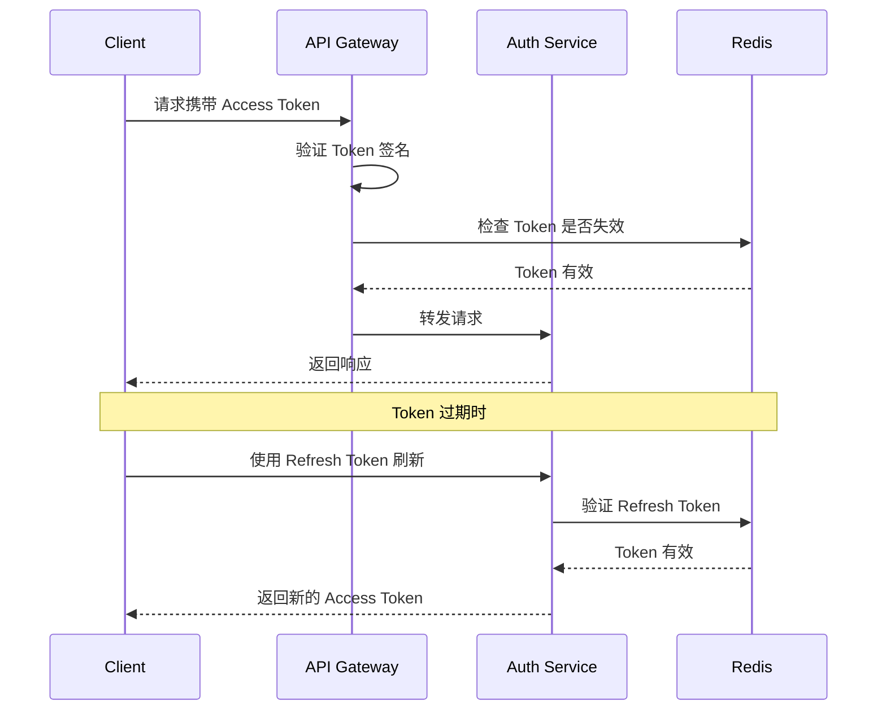

# MOY 技术选型冻结

---

## 文档元信息

| 属性     | 内容                      |
| -------- | ------------------------- |
| 文档名称 | MOY 技术选型冻结          |
| 文档编号 | MOY_TECH_001              |
| 版本号   | v1.0                      |
| 状态     | 已确认                    |
| 作者     | MOY 文档架构组            |
| 日期     | 2026-04-05                |
| 目标读者 | 技术负责人、架构师、开发团队 |

---

## 一、文档目的

本文档作为 MOY 项目首期 MVP 的**技术选型基线**，用于：

1. 冻结所有技术选型决策，消除 [TBD] 不确定项
2. 为后续开发、部署、运维提供明确的技术指导
3. 定义技术边界与约束条件
4. 作为架构评审与代码评审的依据

**重要说明：** 本文档所有选型均为首期 MVP 阶段的决策，后续版本可根据业务发展进行调整。

---

## 二、技术选型总览

### 2.1 已确定的技术栈

| 层级     | 技术选型                     | 版本要求 | 确定时间 | 状态   |
| -------- | ---------------------------- | -------- | -------- | ------ |
| 前端框架 | Next.js + React + TypeScript | 14.x     | 已确定   | ✅ 冻结 |
| 后端框架 | NestJS + TypeScript          | 10.x     | 已确定   | ✅ 冻结 |
| 数据库   | PostgreSQL                   | 15+      | 已确定   | ✅ 冻结 |
| 缓存     | Redis                        | 7+       | 已确定   | ✅ 冻结 |
| 消息队列 | Redis Streams                | 7+       | 已确定   | ✅ 冻结 |
| 实时通信 | WebSocket (Socket.io)        | 4.x      | 已确定   | ✅ 冻结 |

### 2.2 本次冻结的技术选型

| 技术项           | 首期推荐方案      | 次选方案           | 决策状态 |
| ---------------- | ----------------- | ------------------ | -------- |
| LLM 服务商       | DeepSeek          | 通义千问           | ✅ 已冻结 |
| 云服务商         | 阿里云            | 腾讯云             | ✅ 已冻结 |
| 文件存储         | 阿里云 OSS        | 腾讯云 COS         | ✅ 已冻结 |
| 日志方案         | 阿里云 SLS        | ELK Stack          | ✅ 已冻结 |
| 监控方案         | Prometheus        | 阿里云 ARMS        | ✅ 已冻结 |
| API 网关         | Kong              | Nginx              | ✅ 已冻结 |
| 鉴权策略         | JWT + Redis       | Session + Redis    | ✅ 已冻结 |
| WebSocket 首期   | 实现              | -                  | ✅ 已冻结 |
| Elasticsearch    | 首期实现          | 延后实现           | ✅ 已冻结 |
| 数据库读写分离   | 首期不实现        | 主从复制           | ✅ 已冻结 |
| 导入导出异步     | 异步处理          | 同步处理           | ✅ 已冻结 |
| 文件上传扫描     | 首期不实现        | 病毒扫描服务       | ✅ 已冻结 |

---

## 三、核心技术服务选型

### 3.1 LLM 服务商

| 属性         | 内容                                   |
| ------------ | -------------------------------------- |
| **首期方案** | DeepSeek API                           |
| **次选方案** | 通义千问 API                           |
| **决策理由** | 见下方详细分析                         |
| **冻结状态** | ✅ 已冻结                              |

#### 决策理由

| 评估维度     | DeepSeek | 通义千问 | 文心一言 | OpenAI |
| ------------ | -------- | -------- | -------- | ------ |
| 中文理解能力 | ⭐⭐⭐⭐⭐ | ⭐⭐⭐⭐⭐ | ⭐⭐⭐⭐ | ⭐⭐⭐ |
| API 稳定性   | ⭐⭐⭐⭐ | ⭐⭐⭐⭐⭐ | ⭐⭐⭐⭐ | ⭐⭐⭐⭐⭐ |
| 价格竞争力   | ⭐⭐⭐⭐⭐ | ⭐⭐⭐⭐ | ⭐⭐⭐ | ⭐⭐ |
| 国内访问延迟 | ⭐⭐⭐⭐⭐ | ⭐⭐⭐⭐⭐ | ⭐⭐⭐⭐⭐ | ⭐⭐ |
| 上下文长度   | 64K      | 32K      | 32K      | 128K   |
| 合规性       | ✅       | ✅       | ✅       | ⚠️ 需代理 |

**综合结论：**

1. **DeepSeek 作为首期方案**：价格优势明显（约为 GPT-4 的 1/10），中文能力强，国内访问延迟低，适合 MVP 阶段快速验证
2. **通义千问作为次选**：阿里云生态集成度高，稳定性好，如需与阿里云深度集成可切换
3. **不选 OpenAI**：国内访问需代理，合规风险，成本较高

#### 技术实现

```typescript
@Injectable()
export class LLMGatewayService {
  private readonly providers: Map<string, LLMProvider> = new Map();
  
  constructor(
    private readonly configService: ConfigService,
    private readonly deepseekProvider: DeepSeekProvider,
    private readonly qwenProvider: QwenProvider,
  ) {
    this.providers.set('deepseek', this.deepseekProvider);
    this.providers.set('qwen', this.qwenProvider);
  }
  
  async chat(request: ChatRequest): Promise<ChatResponse> {
    const provider = this.configService.get<string>('LLM_PROVIDER', 'deepseek');
    const llm = this.providers.get(provider);
    
    if (!llm) {
      throw new Error(`LLM provider ${provider} not configured`);
    }
    
    return llm.chat(request);
  }
  
  async chatWithFallback(request: ChatRequest): Promise<ChatResponse> {
    try {
      return await this.chat(request);
    } catch (error) {
      this.logger.warn(`Primary LLM failed, trying fallback: ${error.message}`);
      const fallback = this.providers.get('qwen');
      return fallback.chat(request);
    }
  }
}
```

#### 对系统边界的影响

| 影响项       | 说明                                       |
| ------------ | ------------------------------------------ |
| API 调用     | 需实现统一的 LLM Gateway，支持多供应商切换  |
| Token 管理   | 需实现 Token 计费与限流                    |
| 响应超时     | 需设置合理的超时时间（建议 30s）           |
| 降级策略     | LLM 不可用时降级为纯人工服务               |

---

### 3.2 云服务商

| 属性         | 内容                                   |
| ------------ | -------------------------------------- |
| **首期方案** | 阿里云                                 |
| **次选方案** | 腾讯云                                 |
| **决策理由** | 见下方详细分析                         |
| **冻结状态** | ✅ 已冻结                              |

#### 决策理由

| 评估维度     | 阿里云   | 腾讯云   | AWS      |
| ------------ | -------- | -------- | -------- |
| 国内市场份额 | ⭐⭐⭐⭐⭐ | ⭐⭐⭐⭐ | ⭐⭐     |
| 产品完整性   | ⭐⭐⭐⭐⭐ | ⭐⭐⭐⭐ | ⭐⭐⭐⭐⭐ |
| 价格竞争力   | ⭐⭐⭐⭐ | ⭐⭐⭐⭐ | ⭐⭐⭐   |
| 技术支持     | ⭐⭐⭐⭐ | ⭐⭐⭐⭐ | ⭐⭐⭐   |
| 企业客户案例 | ⭐⭐⭐⭐⭐ | ⭐⭐⭐⭐ | ⭐⭐⭐⭐ |

**综合结论：**

1. **阿里云作为首期方案**：国内市场份额最大，产品线最全，企业客户案例丰富
2. **腾讯云作为次选**：价格竞争力强，微信生态集成度高
3. **不选 AWS**：国内访问需备案，成本较高

#### 阿里云服务清单

| 服务类型     | 阿里云产品       | 用途               |
| ------------ | ---------------- | ------------------ |
| 计算         | ECS / ACK        | 应用服务器         |
| 数据库       | RDS PostgreSQL   | 托管数据库         |
| 缓存         | Redis            | 托管 Redis         |
| 对象存储     | OSS              | 文件存储           |
| 日志服务     | SLS              | 日志收集与分析     |
| 负载均衡     | SLB / ALB        | 负载均衡           |
| CDN          | CDN              | 静态资源加速       |
| 安全         | WAF / DDoS       | 安全防护           |
| 监控         | ARMS             | 应用监控           |

#### 对系统边界的影响

| 影响项       | 说明                                       |
| ------------ | ------------------------------------------ |
| 部署架构     | 基于阿里云 ECS 或 ACK 部署                 |
| 数据存储     | 使用 OSS 作为文件存储                      |
| 日志收集     | 使用 SLS 作为日志方案                      |
| 监控告警     | 可选 ARMS 或自建 Prometheus                |

---

### 3.3 文件存储

| 属性         | 内容                                   |
| ------------ | -------------------------------------- |
| **首期方案** | 阿里云 OSS                             |
| **次选方案** | 腾讯云 COS                             |
| **决策理由** | 与云服务商保持一致，降低运维复杂度     |
| **冻结状态** | ✅ 已冻结                              |

#### 技术实现

```typescript
@Injectable()
export class FileStorageService {
  private readonly ossClient: OSS;
  
  constructor(private readonly configService: ConfigService) {
    this.ossClient = new OSS({
      region: configService.get('OSS_REGION'),
      bucket: configService.get('OSS_BUCKET'),
      accessKeyId: configService.get('OSS_ACCESS_KEY_ID'),
      accessKeySecret: configService.get('OSS_ACCESS_KEY_SECRET'),
    });
  }
  
  async upload(file: Express.Multer.File, orgId: bigint): Promise<UploadResult> {
    const key = this.generateKey(file, orgId);
    const result = await this.ossClient.put(key, file.buffer);
    
    return {
      key,
      url: result.url,
      size: file.size,
      mimeType: file.mimetype,
    };
  }
  
  private generateKey(file: Express.Multer.File, orgId: bigint): string {
    const date = new Date();
    const year = date.getFullYear();
    const month = String(date.getMonth() + 1).padStart(2, '0');
    const ext = path.extname(file.originalname);
    const uuid = randomUUID();
    
    return `moy/${orgId}/${year}/${month}/${uuid}${ext}`;
  }
}
```

#### 存储路径规范

```
moy/
├── {org_id}/                    # 租户隔离
│   ├── {year}/                  # 年份
│   │   ├── {month}/             # 月份
│   │   │   ├── {uuid}.jpg       # 文件
│   │   │   ├── {uuid}.png
│   │   │   └── {uuid}.pdf
```

#### 对系统边界的影响

| 影响项       | 说明                                       |
| ------------ | ------------------------------------------ |
| 文件上传     | 通过后端代理上传，支持签名 URL 直传        |
| 文件访问     | 支持私有 Bucket + 签名 URL 访问            |
| 存储成本     | 按量计费，需设置生命周期策略               |

---

### 3.4 日志方案

| 属性         | 内容                                   |
| ------------ | -------------------------------------- |
| **首期方案** | 阿里云 SLS                             |
| **次选方案** | ELK Stack                              |
| **决策理由** | 运维成本低，与阿里云生态集成            |
| **冻结状态** | ✅ 已冻结                              |

#### 日志分类

| 日志类型     | 存储位置       | 保留周期 | 说明               |
| ------------ | -------------- | -------- | ------------------ |
| 访问日志     | SLS            | 30 天    | API 请求日志       |
| 业务日志     | SLS            | 90 天    | 业务操作日志       |
| 错误日志     | SLS            | 90 天    | 异常错误日志       |
| 审计日志     | PostgreSQL     | 永久     | 敏感操作审计       |
| AI 调用日志  | SLS            | 90 天    | LLM 调用记录       |

#### 日志格式规范

```json
{
  "timestamp": "2026-04-05T10:30:00.000Z",
  "level": "INFO",
  "service": "moy-api",
  "traceId": "abc123",
  "orgId": "1001",
  "userId": "2001",
  "action": "customer.create",
  "resource": "customer",
  "resourceId": "3001",
  "message": "Customer created successfully",
  "metadata": {
    "ip": "192.168.1.1",
    "userAgent": "Mozilla/5.0..."
  }
}
```

#### 对系统边界的影响

| 影响项       | 说明                                       |
| ------------ | ------------------------------------------ |
| 日志收集     | 应用日志通过 Logtail 收集到 SLS            |
| 日志查询     | 通过 SLS 控制台或 API 查询                 |
| 告警配置     | 配置 SLS 告警规则                          |

---

### 3.5 监控方案

| 属性         | 内容                                   |
| ------------ | -------------------------------------- |
| **首期方案** | Prometheus + Grafana                   |
| **次选方案** | 阿里云 ARMS                            |
| **决策理由** | 开源方案，成本低，社区活跃              |
| **冻结状态** | ✅ 已冻结                              |

#### 监控指标分类

| 监控类型     | 指标项                                   | 采集方式       |
| ------------ | ---------------------------------------- | -------------- |
| 系统监控     | CPU、内存、磁盘、网络                    | Node Exporter  |
| 应用监控     | 请求量、响应时间、错误率                  | Prometheus SDK |
| 业务监控     | 线索数、商机数、工单数                    | 自定义指标     |
| AI 监控      | LLM 调用量、Token 消耗、响应延迟          | 自定义指标     |

#### Grafana Dashboard 规划

| Dashboard 名称      | 面向角色   | 核心指标                                   |
| ------------------- | ---------- | ------------------------------------------ |
| 系统概览            | 运维       | CPU、内存、磁盘、网络                      |
| 应用性能            | 开发       | QPS、响应时间、错误率                      |
| 业务指标            | 产品       | 线索转化率、商机成交率、工单处理时效       |
| AI 服务             | 开发       | LLM 调用量、Token 消耗、响应延迟           |

#### 对系统边界的影响

| 影响项       | 说明                                       |
| ------------ | ------------------------------------------ |
| 指标采集     | 应用集成 prom-client 采集指标              |
| 数据存储     | Prometheus 数据保留 15 天                   |
| 告警通知     | 通过 AlertManager 发送告警                 |

---

### 3.6 API 网关

| 属性         | 内容                                   |
| ------------ | -------------------------------------- |
| **首期方案** | Kong                                   |
| **次选方案** | Nginx                                  |
| **决策理由** | 功能丰富，支持插件扩展，社区活跃        |
| **冻结状态** | ✅ 已冻结                              |

#### Kong 功能配置

| 功能         | 配置说明                                   |
| ------------ | ------------------------------------------ |
| 路由        | 基于路径的请求路由                         |
| 认证        | JWT 认证插件                               |
| 限流        | Rate Limiting 插件                         |
| 日志        | File Log 插件                              |
| CORS        | CORS 插件                                  |

#### Kong 路由配置示例

```yaml
_format_version: "3.0"

services:
  - name: moy-api
    url: http://moy-api:3000
    routes:
      - name: api-route
        paths:
          - /api
    plugins:
      - name: jwt
      - name: rate-limiting
        config:
          minute: 100
          policy: local
      - name: cors
        config:
          origins:
            - "*"
          methods:
            - GET
            - POST
            - PUT
            - DELETE
          headers:
            - Accept
            - Authorization
            - Content-Type
```

#### 对系统边界的影响

| 影响项       | 说明                                       |
| ------------ | ------------------------------------------ |
| 请求入口     | 所有 API 请求通过 Kong 代理                |
| 认证鉴权     | JWT 认证在网关层完成                       |
| 限流熔断     | 在网关层实现限流                           |

---

### 3.7 鉴权策略

| 属性         | 内容                                   |
| ------------ | -------------------------------------- |
| **首期方案** | JWT + Redis                            |
| **次选方案** | Session + Redis                        |
| **决策理由** | 无状态，适合分布式部署                  |
| **冻结状态** | ✅ 已冻结                              |

#### Token 设计

| Token 类型   | 有效期   | 存储位置   | 用途               |
| ------------ | -------- | ---------- | ------------------ |
| Access Token | 2 小时   | 客户端     | API 认证           |
| Refresh Token| 7 天     | Redis      | 刷新 Access Token  |

#### JWT Payload 结构

```json
{
  "sub": "2001",
  "orgId": "1001",
  "roles": ["sales_rep"],
  "permissions": ["customer:read", "customer:write"],
  "iat": 1712345678,
  "exp": 1712352878
}
```

#### 认证流程



#### 对系统边界的影响

| 影响项       | 说明                                       |
| ------------ | ------------------------------------------ |
| 登录流程     | 登录成功返回 Access Token 和 Refresh Token |
| Token 刷新   | Refresh Token 刷新 Access Token            |
| 登出流程     | 将 Token 加入黑名单                        |

---

## 四、架构决策

### 4.1 WebSocket 首期实现

| 属性         | 内容                                   |
| ------------ | -------------------------------------- |
| **决策**     | 首期实现                               |
| **决策理由** | 会话管理核心功能依赖实时通信           |
| **冻结状态** | ✅ 已冻结                              |

#### 实现方案

| 组件         | 技术选型           | 说明               |
| ------------ | ------------------ | ------------------ |
| 服务端       | Socket.io (NestJS) | WebSocket 服务     |
| 客户端       | Socket.io-client   | WebSocket 客户端   |
| 连接管理     | Redis Adapter      | 支持多实例         |

#### 功能范围

| 功能         | 首期实现   | 说明                       |
| ------------ | ---------- | -------------------------- |
| 消息推送     | ✅         | 实时消息推送               |
| 会话状态     | ✅         | 会话状态同步               |
| 在线状态     | ✅         | 用户在线状态               |
| 打字提示     | ❌ P1      | 对方正在输入提示           |
| 消息已读     | ❌ P1      | 消息已读回执               |

---

### 4.2 Elasticsearch 首期实现

| 属性         | 内容                                   |
| ------------ | -------------------------------------- |
| **决策**     | 首期实现                               |
| **决策理由** | 知识库全文检索核心功能依赖 ES          |
| **冻结状态** | ✅ 已冻结                              |

#### 实现方案

| 组件         | 配置               | 说明               |
| ------------ | ------------------ | ------------------ |
| 版本         | Elasticsearch 8.x  | 最新稳定版         |
| 部署方式     | 单节点             | MVP 阶段单节点     |
| 索引策略     | 按租户分索引       | 数据隔离           |

#### 索引设计

```
moy_knowledge_{org_id}
├── mappings
│   ├── title: text
│   ├── content: text
│   ├── category_id: keyword
│   ├── tags: keyword
│   ├── status: keyword
│   └── created_at: date
```

---

### 4.3 数据库读写分离

| 属性         | 内容                                   |
| ------------ | -------------------------------------- |
| **决策**     | 首期不实现                             |
| **决策理由** | MVP 阶段单实例足够，降低运维复杂度     |
| **冻结状态** | ✅ 已冻结                              |

#### 首期方案

| 配置项       | 值                 | 说明               |
| ------------ | ------------------ | ------------------ |
| 实例类型     | RDS PostgreSQL     | 阿里云托管         |
| 规格         | 4核8G              | MVP 阶段规格       |
| 存储空间     | 100GB SSD          | 预留扩展空间       |

#### 后续扩展方案

| 阶段         | 方案               | 触发条件           |
| ------------ | ------------------ | ------------------ |
| P1           | 只读实例           | 读 QPS > 1000      |
| P2           | 分库分表           | 数据量 > 1000万    |

---

### 4.4 导入导出异步处理

| 属性         | 内容                                   |
| ------------ | -------------------------------------- |
| **决策**     | 异步处理                             |
| **决策理由** | 大文件导入导出耗时，避免阻塞请求      |
| **冻结状态** | ✅ 已冻结                              |

#### 实现方案

```typescript
@Injectable()
export class ImportExportService {
  constructor(
    private readonly redisService: RedisService,
    private readonly taskRepository: TaskRepository,
  ) {}
  
  async createImportTask(
    type: ImportType,
    file: Express.Multer.File,
    orgId: bigint,
    userId: bigint,
  ): Promise<ImportTask> {
    const task = await this.taskRepository.save({
      type,
      status: TaskStatus.PENDING,
      orgId,
      createdBy: userId,
      total: 0,
      processed: 0,
      failed: 0,
    });
    
    await this.redisService.xadd(
      `import:tasks:${orgId}`,
      '*',
      JSON.stringify({ taskId: task.id, filePath: file.path }),
    );
    
    return task;
  }
  
  async getTaskStatus(taskId: bigint): Promise<ImportTaskStatus> {
    const task = await this.taskRepository.findById(taskId);
    return {
      id: task.id,
      status: task.status,
      total: task.total,
      processed: task.processed,
      failed: task.failed,
      errors: task.errors,
    };
  }
}
```

#### 任务状态

| 状态         | 说明               |
| ------------ | ------------------ |
| PENDING      | 等待处理           |
| PROCESSING   | 处理中             |
| COMPLETED    | 处理完成           |
| FAILED       | 处理失败           |

---

### 4.5 文件上传扫描

| 属性         | 内容                                   |
| ------------ | -------------------------------------- |
| **决策**     | 首期不实现                             |
| **决策理由** | MVP 阶段优先核心功能，降低成本         |
| **冻结状态** | ✅ 已冻结                              |

#### 首期安全措施

| 措施         | 说明                                       |
| ------------ | ------------------------------------------ |
| 文件类型限制 | 仅允许指定类型（jpg, png, pdf, docx 等）   |
| 文件大小限制 | 单文件最大 10MB                            |
| 文件名处理   | 使用 UUID 重命名，防止路径遍历             |

#### 后续扩展方案

| 阶段         | 方案               | 说明               |
| ------------ | ------------------ | ------------------ |
| P1           | 病毒扫描服务       | 集成阿里云病毒检测 |

---

## 五、技术选型决策矩阵

### 5.1 决策汇总

| 编号        | 技术项           | 首期方案           | 次选方案           | 状态   |
| ----------- | ---------------- | ------------------ | ------------------ | ------ |
| TECH-001    | 前端框架         | Next.js 14         | -                  | ✅ 冻结 |
| TECH-002    | 后端框架         | NestJS 10          | -                  | ✅ 冻结 |
| TECH-003    | 数据库           | PostgreSQL 15      | -                  | ✅ 冻结 |
| TECH-004    | 缓存             | Redis 7            | -                  | ✅ 冻结 |
| TECH-005    | 消息队列         | Redis Streams      | -                  | ✅ 冻结 |
| TECH-006    | 实时通信         | WebSocket (Socket.io) | -               | ✅ 冻结 |
| TECH-007    | LLM 服务商       | DeepSeek           | 通义千问           | ✅ 冻结 |
| TECH-008    | 文件存储         | 阿里云 OSS         | 腾讯云 COS         | ✅ 冻结 |
| TECH-009    | 日志方案         | 阿里云 SLS         | ELK Stack          | ✅ 冻结 |
| TECH-010    | 监控方案         | Prometheus         | 阿里云 ARMS        | ✅ 冻结 |
| TECH-011    | 云服务商         | 阿里云             | 腾讯云             | ✅ 冻结 |
| TECH-012    | API 网关         | Kong               | Nginx              | ✅ 冻结 |
| TECH-013    | 鉴权策略         | JWT + Redis        | Session + Redis    | ✅ 冻结 |
| TECH-014    | 搜索引擎         | Elasticsearch 8    | PostgreSQL FTS     | ✅ 冻结 |
| ARCH-001    | WebSocket 首期   | 实现               | -                  | ✅ 冻结 |
| ARCH-002    | ES 首期部署      | 实现               | -                  | ✅ 冻结 |
| ARCH-003    | 读写分离首期     | 不实现             | -                  | ✅ 冻结 |
| ARCH-004    | 导入导出异步     | 异步处理           | -                  | ✅ 冻结 |
| ARCH-005    | 文件扫描首期     | 不实现             | -                  | ✅ 冻结 |

### 5.2 HLD 待确认项处理

| 编号        | 待确认事项               | 决策结果           | 处理状态 |
| ----------- | ------------------------ | ------------------ | -------- |
| TBD-HLD-001 | LLM 服务商最终选择       | DeepSeek           | ✅ 已解决 |
| TBD-HLD-002 | 云服务商最终选择         | 阿里云             | ✅ 已解决 |
| TBD-HLD-003 | 消息队列技术选型         | Redis Streams      | ✅ 已解决 |
| TBD-HLD-004 | 日志服务技术选型         | 阿里云 SLS         | ✅ 已解决 |
| TBD-HLD-005 | 数据库读写分离首期       | 不实现             | ✅ 已解决 |
| TBD-HLD-006 | Elasticsearch 首期部署   | 实现               | ✅ 已解决 |

---

## 六、技术边界约束

### 6.1 首期技术边界

| 边界类型     | 约束条件                                   |
| ------------ | ------------------------------------------ |
| 部署环境     | 仅支持阿里云部署                           |
| 终端支持     | 仅支持 Web 端                              |
| 数据库       | 单实例，不实现读写分离                     |
| 消息队列     | 使用 Redis Streams，不引入 Kafka/RabbitMQ  |
| 搜索引擎     | 单节点 Elasticsearch                       |
| AI 服务      | 仅支持 DeepSeek/通义千问                   |

### 6.2 技术债务记录

| 债务项       | 当前状态   | 计划解决阶段 | 影响               |
| ------------ | ---------- | ------------ | ------------------ |
| 数据库读写分离 | 未实现     | P1           | 高并发读性能受限   |
| 文件病毒扫描   | 未实现     | P1           | 安全风险           |
| 多云部署     | 未实现     | P2           | 供应商锁定风险     |
| 服务网格     | 未实现     | P2           | 微服务治理能力有限 |

---

## 七、环境配置清单

### 7.1 开发环境

| 组件         | 配置               | 说明               |
| ------------ | ------------------ | ------------------ |
| Node.js      | 20.x LTS           | 运行环境           |
| PostgreSQL   | 15.x               | 本地数据库         |
| Redis        | 7.x                | 本地缓存           |
| Elasticsearch| 8.x                | 本地搜索           |

### 7.2 测试环境

| 组件         | 配置               | 说明               |
| ------------ | ------------------ | ------------------ |
| ECS          | 2核4G              | 应用服务器         |
| RDS          | 2核4G 50GB         | 托管数据库         |
| Redis        | 1G                 | 托管缓存           |
| OSS          | 标准存储           | 文件存储           |

### 7.3 生产环境

| 组件         | 配置               | 说明               |
| ------------ | ------------------ | ------------------ |
| ECS          | 4核8G × 2          | 应用服务器集群     |
| RDS          | 4核8G 100GB        | 托管数据库         |
| Redis        | 2G 主从            | 托管缓存           |
| OSS          | 标准存储           | 文件存储           |
| SLB          | 按量付费           | 负载均衡           |
| SLS          | 按量付费           | 日志服务           |

---

## 八、成本估算

### 8.1 阿里云月度成本（生产环境）

| 服务         | 规格               | 月度成本（元）     |
| ------------ | ------------------ | ------------------ |
| ECS          | 4核8G × 2          | ~800               |
| RDS          | 4核8G 100GB        | ~1200              |
| Redis        | 2G 主从            | ~400               |
| OSS          | 100GB              | ~20                |
| SLB          | 按量               | ~100               |
| SLS          | 按量               | ~200               |
| 带宽         | 5Mbps              | ~300               |
| **合计**     | -                  | **~3020**          |

### 8.2 LLM 服务成本

| 服务         | 单价               | 月度预估（元）     |
| ------------ | ------------------ | ------------------ |
| DeepSeek     | ¥1/百万 Token      | ~500               |
| 通义千问     | ¥2/百万 Token      | ~1000（备用）      |

---

## 九、版本与变更记录

| 版本 | 日期       | 作者           | 变更摘要                     | 状态   |
| ---- | ---------- | -------------- | ---------------------------- | ------ |
| v1.0 | 2026-04-05 | MOY 文档架构组 | 技术选型冻结，消除所有TBD    | 已确认 |

---

## 十、依赖文档

| 文档                                                      | 用途             |
| --------------------------------------------------------- | ---------------- |
| [HLD](./09_HLD_系统高层设计.md)                           | 系统架构设计     |
| [未决事项清单](./15_未决事项清单.md)                      | 待确认事项       |
| [部署架构设计](./26_部署架构设计.md)                      | 部署架构         |
| [安全设计规范](./30_安全设计规范.md)                      | 安全设计         |
