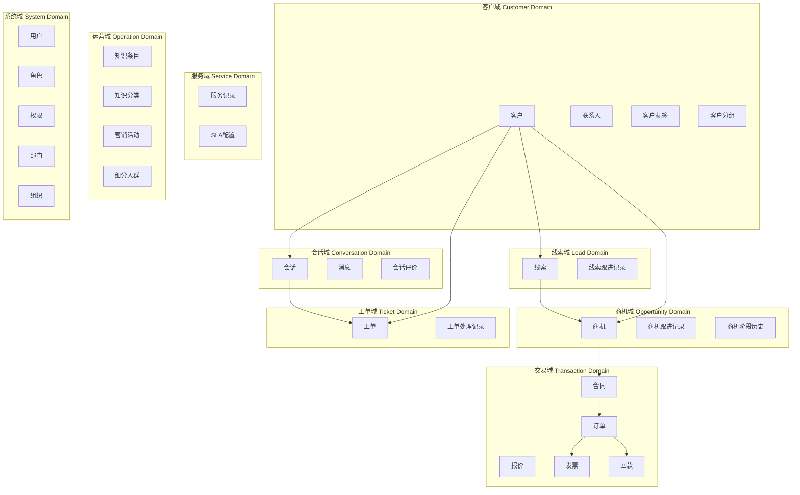
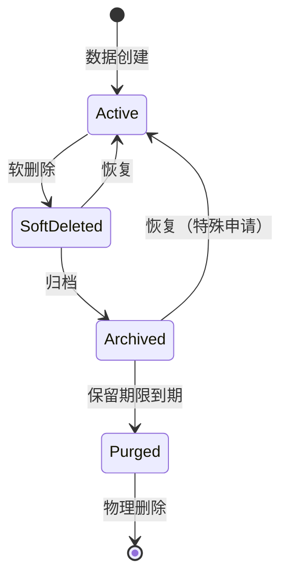

# MOY 终局版对象模型与数据域设计

---

## 文档元信息

| 属性     | 内容                                                                                     |
| -------- | ---------------------------------------------------------------------------------------- |
| 文档名称 | MOY 终局版对象模型与数据域设计                                                           |
| 文档编号 | MOY_FINAL_006                                                                            |
| 版本号   | v1.0                                                                                     |
| 状态     | 已确认                                                                                   |
| 作者     | MOY 文档架构组                                                                           |
| 日期     | 2026-04-05                                                                               |
| 目标读者 | 产品负责人、技术负责人、架构师、后端开发、数据库管理员、测试工程师                       |
| 输入来源 | [02_业务域地图](./02_终局版业务域地图与能力版图.md)、[04_端到端业务链路](./04_终局版端到端业务链路蓝图.md)、[05_系统信息架构](./05_终局版系统信息架构与模块树.md)、[P0_DBD](../p0_snapshot/10_DBD_数据模型与数据字典.md) |

---

## 一、文档目的

本文档作为 MOY 终局版的**对象模型与数据域设计基线**，用于：

1. 定义终局版完整的业务对象模型与实体关系
2. 定义数据域的划分边界与域间关系
3. 定义主对象、附属对象、事件对象、审计对象的分类体系
4. 定义对象间的关联关系与引用约束
5. 定义数据生命周期管理规则（软删除、归档、脱敏、留存）
6. 为数据库设计、API 设计、权限设计提供输入
7. 明确与 P0/P1 首期基线的差异与演进路径

**阅读建议：**

- 产品负责人：重点阅读对象清单、数据域划分、对象关系图
- 技术负责人：重点阅读对象模型、数据域边界、生命周期规则
- 后端开发：重点阅读对象属性、关联关系、约束规则
- 数据库管理员：重点阅读ER图、索引设计、归档规则
- 测试工程师：重点阅读对象状态、关联约束、边界条件

---

## 二、适用范围

| 维度     | 范围说明                                       |
| -------- | ---------------------------------------------- |
| 产品范围 | MOY 终局版全量业务                             |
| 数据范围 | 所有业务数据、系统数据、日志数据、配置数据     |
| 租户范围 | 多租户 SaaS 模式，支持数据隔离                 |
| 存储范围 | PostgreSQL 主库、Redis 缓存、对象存储、日志存储 |

---

## 三、术语定义

### 3.1 对象模型术语

| 术语       | 英文               | 定义                                               |
| ---------- | ------------------ | -------------------------------------------------- |
| 对象模型   | Object Model       | 业务实体的抽象表示，包含属性、关系、行为           |
| 主对象     | Primary Object     | 核心业务实体，具有独立生命周期和业务含义           |
| 附属对象   | Dependent Object   | 依附于主对象存在的实体，无独立业务含义             |
| 事件对象   | Event Object       | 记录业务事件或状态变更的实体                       |
| 审计对象   | Audit Object       | 记录系统操作、数据变更的审计日志实体               |
| 实体关系   | Entity Relationship | 对象间的关联、依赖、引用关系                      |

### 3.2 数据域术语

| 术语     | 英文           | 定义                                           |
| -------- | -------------- | ---------------------------------------------- |
| 数据域   | Data Domain    | 相关数据实体的逻辑分组，具有明确的业务边界     |
| 域边界   | Domain Boundary | 数据域之间的边界，定义数据归属与访问权限      |
| 域依赖   | Domain Dependency | 数据域之间的依赖关系，定义数据流向          |
| 数据主权 | Data Sovereignty | 数据的归属权与控制权，定义数据治理责任      |

### 3.3 数据生命周期术语

| 术语     | 英文               | 定义                                           |
| -------- | ------------------ | ---------------------------------------------- |
| 软删除   | Soft Delete        | 标记删除而非物理删除，支持数据恢复             |
| 归档     | Archive            | 将不活跃数据迁移至冷存储，降低存储成本         |
| 脱敏     | Data Masking       | 对敏感数据进行脱敏处理，保护数据隐私           |
| 留存     | Data Retention     | 数据保留的时间周期，到期后自动清理             |
| 数据血缘 | Data Lineage       | 数据的来源、流转、加工的完整链路               |

### 3.4 业务对象术语

| 术语     | 英文           | 定义                                           |
| -------- | -------------- | ---------------------------------------------- |
| 客户     | Customer       | 企业或个人客户，是业务经营的核心对象           |
| 线索     | Lead           | 潜在客户信息，是销售漏斗的入口                 |
| 商机     | Opportunity    | 具有成交可能性的销售机会                       |
| 会话     | Conversation   | 客户与客服之间的交互会话                       |
| 工单     | Ticket         | 客户问题或需求的处理单据                       |
| 合同     | Contract       | 与客户签订的正式协议                           |
| 订单     | Order          | 客户购买产品或服务的订单                       |

---

## 四、主对象清单

### 4.1 主对象总览

| 对象编号 | 对象名称   | 所属数据域   | 对象类型   | 优先级 | 阶段   | 说明                           |
| -------- | ---------- | ------------ | ---------- | ------ | ------ | ------------------------------ |
| OBJ-001  | 客户       | 客户域       | 主对象     | P0     | 首期   | 核心经营对象                   |
| OBJ-002  | 联系人     | 客户域       | 主对象     | P0     | 首期   | 客户联系人                     |
| OBJ-003  | 客户标签   | 客户域       | 主对象     | P0     | 首期   | 客户分类标签                   |
| OBJ-004  | 客户分组   | 客户域       | 主对象     | P0     | 首期   | 客户业务分组                   |
| OBJ-005  | 线索       | 线索域       | 主对象     | P0     | 首期   | 销售线索                       |
| OBJ-006  | 线索跟进记录 | 线索域     | 主对象     | P0     | 首期   | 线索跟进记录                   |
| OBJ-007  | 商机       | 商机域       | 主对象     | P0     | 首期   | 销售商机                       |
| OBJ-008  | 商机跟进记录 | 商机域     | 主对象     | P0     | 首期   | 商机跟进记录                   |
| OBJ-009  | 商机阶段历史 | 商机域     | 主对象     | P0     | 首期   | 商机阶段变更历史               |
| OBJ-010  | 会话       | 会话域       | 主对象     | P0     | 首期   | 客服会话                       |
| OBJ-011  | 消息       | 会话域       | 主对象     | P0     | 首期   | 会话消息                       |
| OBJ-012  | 会话评价   | 会话域       | 主对象     | P1     | 二期   | 会话满意度评价                 |
| OBJ-013  | 工单       | 工单域       | 主对象     | P0     | 首期   | 服务工单                       |
| OBJ-014  | 工单处理记录 | 工单域     | 主对象     | P0     | 首期   | 工单处理记录                   |
| OBJ-015  | 报价       | 交易域       | 主对象     | P1     | 二期   | 报价单                         |
| OBJ-016  | 合同       | 交易域       | 主对象     | P1     | 二期   | 销售合同                       |
| OBJ-017  | 订单       | 交易域       | 主对象     | P1     | 二期   | 销售订单                       |
| OBJ-018  | 发票       | 交易域       | 主对象     | P2     | 三期   | 发票记录                       |
| OBJ-019  | 回款       | 交易域       | 主对象     | P2     | 三期   | 回款记录                       |
| OBJ-020  | 服务记录   | 服务域       | 主对象     | P1     | 二期   | 服务交付记录                   |
| OBJ-021  | SLA配置    | 服务域       | 主对象     | P1     | 二期   | 服务等级配置                   |
| OBJ-022  | 知识条目   | 运营域       | 主对象     | P1     | 首期   | 知识库条目                     |
| OBJ-023  | 知识分类   | 运营域       | 主对象     | P1     | 首期   | 知识库分类                     |
| OBJ-024  | 营销活动   | 运营域       | 主对象     | P2     | 三期   | 营销活动管理                   |
| OBJ-025  | 细分人群   | 运营域       | 主对象     | P2     | 三期   | 客户细分人群                   |
| OBJ-026  | 用户       | 系统域       | 主对象     | P0     | 首期   | 系统用户                       |
| OBJ-027  | 角色       | 系统域       | 主对象     | P0     | 首期   | 用户角色                       |
| OBJ-028  | 权限       | 系统域       | 主对象     | P0     | 首期   | 系统权限                       |
| OBJ-029  | 部门       | 系统域       | 主对象     | P1     | 二期   | 组织部门                       |
| OBJ-030  | 组织       | 系统域       | 主对象     | P0     | 首期   | 租户组织                       |

### 4.2 客户域主对象

#### 4.2.1 客户（Customer）

| 属性分类 | 属性名称     | 数据类型       | 必填 | 说明                           |
| -------- | ------------ | -------------- | ---- | ------------------------------ |
| 基础属性 | id           | BIGSERIAL      | 是   | 客户ID，主键                   |
| 基础属性 | org_id       | BIGINT         | 是   | 组织ID，租户标识               |
| 基础属性 | name         | VARCHAR(128)   | 是   | 客户名称                       |
| 基础属性 | type         | VARCHAR(16)    | 是   | 客户类型：individual/enterprise|
| 联系属性 | phone        | VARCHAR(32)    | 否   | 手机号                         |
| 联系属性 | email        | VARCHAR(128)   | 否   | 邮箱                           |
| 联系属性 | company      | VARCHAR(128)   | 否   | 所属公司                       |
| 联系属性 | position     | VARCHAR(64)    | 否   | 职位                           |
| 联系属性 | address      | VARCHAR(256)   | 否   | 地址                           |
| 经营属性 | source       | VARCHAR(32)    | 否   | 客户来源                       |
| 经营属性 | level        | VARCHAR(16)    | 否   | 客户等级：A/B/C/D              |
| 经营属性 | status       | VARCHAR(16)    | 是   | 生命周期状态                   |
| 经营属性 | owner_id     | BIGINT         | 否   | 负责人ID                       |
| 经营属性 | industry     | VARCHAR(64)    | 否   | 行业                           |
| 经营属性 | scale        | VARCHAR(32)    | 否   | 企业规模                       |
| 扩展属性 | remark       | TEXT           | 否   | 备注                           |
| 扩展属性 | extra_data   | JSONB          | 否   | 扩展数据                       |
| 审计属性 | created_at   | TIMESTAMP      | 是   | 创建时间                       |
| 审计属性 | updated_at   | TIMESTAMP      | 是   | 更新时间                       |
| 审计属性 | created_by   | BIGINT         | 是   | 创建人ID                       |
| 审计属性 | updated_by   | BIGINT         | 是   | 更新人ID                       |
| 审计属性 | is_deleted   | SMALLINT       | 是   | 删除标识                       |

**业务规则：**
- 客户名称在租户内唯一
- 客户类型决定后续业务流程
- 客户状态遵循生命周期状态机
- 支持多联系人、多标签、多分组

#### 4.2.2 联系人（CustomerContact）

| 属性分类 | 属性名称     | 数据类型       | 必填 | 说明                           |
| -------- | ------------ | -------------- | ---- | ------------------------------ |
| 基础属性 | id           | BIGSERIAL      | 是   | 联系人ID，主键                 |
| 基础属性 | org_id       | BIGINT         | 是   | 组织ID                         |
| 基础属性 | customer_id  | BIGINT         | 是   | 客户ID                         |
| 基础属性 | name         | VARCHAR(64)    | 是   | 联系人姓名                     |
| 联系属性 | phone        | VARCHAR(32)    | 否   | 手机号                         |
| 联系属性 | email        | VARCHAR(128)   | 否   | 邮箱                           |
| 联系属性 | position     | VARCHAR(64)    | 否   | 职位                           |
| 联系属性 | department   | VARCHAR(64)    | 否   | 部门                           |
| 业务属性 | is_primary   | SMALLINT       | 是   | 是否主要联系人                 |
| 业务属性 | remark       | VARCHAR(256)   | 否   | 备注                           |
| 审计属性 | created_at   | TIMESTAMP      | 是   | 创建时间                       |
| 审计属性 | updated_at   | TIMESTAMP      | 是   | 更新时间                       |
| 审计属性 | created_by   | BIGINT         | 是   | 创建人ID                       |
| 审计属性 | updated_by   | BIGINT         | 是   | 更新人ID                       |
| 审计属性 | is_deleted   | SMALLINT       | 是   | 删除标识                       |

#### 4.2.3 客户标签（Tag）

| 属性分类 | 属性名称     | 数据类型       | 必填 | 说明                           |
| -------- | ------------ | -------------- | ---- | ------------------------------ |
| 基础属性 | id           | BIGSERIAL      | 是   | 标签ID，主键                   |
| 基础属性 | org_id       | BIGINT         | 是   | 组织ID                         |
| 基础属性 | name         | VARCHAR(32)    | 是   | 标签名称                       |
| 基础属性 | color        | VARCHAR(16)    | 否   | 标签颜色                       |
| 基础属性 | tag_type     | VARCHAR(16)    | 是   | 标签类型                       |
| 业务属性 | description  | VARCHAR(256)   | 否   | 标签描述                       |
| 业务属性 | sort_order   | INTEGER        | 是   | 排序                           |
| 审计属性 | created_at   | TIMESTAMP      | 是   | 创建时间                       |
| 审计属性 | updated_at   | TIMESTAMP      | 是   | 更新时间                       |
| 审计属性 | created_by   | BIGINT         | 是   | 创建人ID                       |
| 审计属性 | updated_by   | BIGINT         | 是   | 更新人ID                       |
| 审计属性 | is_deleted   | SMALLINT       | 是   | 删除标识                       |

#### 4.2.4 客户分组（CustomerGroup）

| 属性分类 | 属性名称     | 数据类型       | 必填 | 说明                           |
| -------- | ------------ | -------------- | ---- | ------------------------------ |
| 基础属性 | id           | BIGSERIAL      | 是   | 分组ID，主键                   |
| 基础属性 | org_id       | BIGINT         | 是   | 组织ID                         |
| 基础属性 | name         | VARCHAR(64)    | 是   | 分组名称                       |
| 基础属性 | code         | VARCHAR(32)    | 否   | 分组编码                       |
| 业务属性 | description  | VARCHAR(256)   | 否   | 分组描述                       |
| 业务属性 | rule_config  | JSONB          | 否   | 动态分组规则                   |
| 业务属性 | is_dynamic   | SMALLINT       | 是   | 是否动态分组                   |
| 统计属性 | member_count | INTEGER        | 是   | 成员数量                       |
| 审计属性 | created_at   | TIMESTAMP      | 是   | 创建时间                       |
| 审计属性 | updated_at   | TIMESTAMP      | 是   | 更新时间                       |
| 审计属性 | created_by   | BIGINT         | 是   | 创建人ID                       |
| 审计属性 | updated_by   | BIGINT         | 是   | 更新人ID                       |
| 审计属性 | is_deleted   | SMALLINT       | 是   | 删除标识                       |

### 4.3 线索域主对象

#### 4.3.1 线索（Lead）

| 属性分类 | 属性名称               | 数据类型       | 必填 | 说明                           |
| -------- | ---------------------- | -------------- | ---- | ------------------------------ |
| 基础属性 | id                     | BIGSERIAL      | 是   | 线索ID，主键                   |
| 基础属性 | org_id                 | BIGINT         | 是   | 组织ID                         |
| 基础属性 | customer_id            | BIGINT         | 否   | 客户ID（转化后关联）           |
| 基础属性 | owner_id               | BIGINT         | 否   | 负责人ID                       |
| 联系属性 | name                   | VARCHAR(64)    | 是   | 联系人姓名                     |
| 联系属性 | phone                  | VARCHAR(32)    | 是   | 手机号                         |
| 联系属性 | email                  | VARCHAR(128)   | 否   | 邮箱                           |
| 联系属性 | company                | VARCHAR(128)   | 否   | 公司                           |
| 来源属性 | source                 | VARCHAR(32)    | 否   | 线索来源                       |
| 来源属性 | channel_id             | BIGINT         | 否   | 渠道ID                         |
| 来源属性 | campaign_id            | BIGINT         | 否   | 营销活动ID                     |
| 状态属性 | status                 | VARCHAR(16)    | 是   | 状态                           |
| 状态属性 | converted_at           | TIMESTAMP      | 否   | 转化时间                       |
| 状态属性 | converted_opportunity_id | BIGINT       | 否   | 转化的商机ID                   |
| 状态属性 | invalid_reason         | VARCHAR(256)   | 否   | 无效原因                       |
| 评分属性 | score                  | DECIMAL(5,2)   | 否   | 线索评分                       |
| 评分属性 | grade                  | VARCHAR(16)    | 否   | 线索等级                       |
| 扩展属性 | remark                 | TEXT           | 否   | 备注                           |
| 扩展属性 | extra_data             | JSONB          | 否   | 扩展数据                       |
| 审计属性 | created_at             | TIMESTAMP      | 是   | 创建时间                       |
| 审计属性 | updated_at             | TIMESTAMP      | 是   | 更新时间                       |
| 审计属性 | created_by             | BIGINT         | 是   | 创建人ID                       |
| 审计属性 | updated_by             | BIGINT         | 是   | 更新人ID                       |
| 审计属性 | is_deleted             | SMALLINT       | 是   | 删除标识                       |

#### 4.3.2 线索跟进记录（LeadFollowUp）

| 属性分类 | 属性名称           | 数据类型       | 必填 | 说明                           |
| -------- | ------------------ | -------------- | ---- | ------------------------------ |
| 基础属性 | id                 | BIGSERIAL      | 是   | 记录ID，主键                   |
| 基础属性 | org_id             | BIGINT         | 是   | 组织ID                         |
| 基础属性 | lead_id            | BIGINT         | 是   | 线索ID                         |
| 基础属性 | user_id            | BIGINT         | 是   | 跟进人ID                       |
| 内容属性 | content            | TEXT           | 是   | 跟进内容                       |
| 内容属性 | follow_up_type     | VARCHAR(16)    | 否   | 跟进方式                       |
| 内容属性 | next_follow_up_at  | TIMESTAMP      | 否   | 下次跟进时间                   |
| 内容属性 | attachment_ids     | BIGINT[]       | 否   | 附件ID列表                     |
| 审计属性 | created_at         | TIMESTAMP      | 是   | 创建时间                       |
| 审计属性 | updated_at         | TIMESTAMP      | 是   | 更新时间                       |
| 审计属性 | created_by         | BIGINT         | 是   | 创建人ID                       |
| 审计属性 | updated_by         | BIGINT         | 是   | 更新人ID                       |
| 审计属性 | is_deleted         | SMALLINT       | 是   | 删除标识                       |

### 4.4 商机域主对象

#### 4.4.1 商机（Opportunity）

| 属性分类 | 属性名称             | 数据类型       | 必填 | 说明                           |
| -------- | -------------------- | -------------- | ---- | ------------------------------ |
| 基础属性 | id                   | BIGSERIAL      | 是   | 商机ID，主键                   |
| 基础属性 | org_id               | BIGINT         | 是   | 组织ID                         |
| 基础属性 | customer_id          | BIGINT         | 是   | 客户ID                         |
| 基础属性 | lead_id              | BIGINT         | 否   | 线索ID                         |
| 基础属性 | owner_id             | BIGINT         | 是   | 负责人ID                       |
| 基础属性 | name                 | VARCHAR(128)   | 是   | 商机名称                       |
| 金额属性 | amount               | DECIMAL(15,2)  | 否   | 商机金额                       |
| 金额属性 | expected_amount      | DECIMAL(15,2)  | 否   | 预期金额                       |
| 金额属性 | actual_amount        | DECIMAL(15,2)  | 否   | 实际成交金额                   |
| 阶段属性 | stage                | VARCHAR(16)    | 是   | 商机阶段                       |
| 阶段属性 | win_probability      | DECIMAL(5,2)   | 否   | 赢率                           |
| 阶段属性 | expected_close_date  | DATE           | 否   | 预计成交日期                   |
| 状态属性 | status               | VARCHAR(16)    | 是   | 状态                           |
| 状态属性 | lost_reason          | VARCHAR(256)   | 否   | 失败原因                       |
| 状态属性 | won_at               | TIMESTAMP      | 否   | 成交时间                       |
| 状态属性 | lost_at              | TIMESTAMP      | 否   | 失败时间                       |
| 关联属性 | contact_id           | BIGINT         | 否   | 主要联系人ID                   |
| 关联属性 | contract_id          | BIGINT         | 否   | 关联合同ID                     |
| 关联属性 | quote_id             | BIGINT         | 否   | 关联报价ID                     |
| 扩展属性 | remark               | TEXT           | 否   | 备注                           |
| 扩展属性 | extra_data           | JSONB          | 否   | 扩展数据                       |
| 审计属性 | created_at           | TIMESTAMP      | 是   | 创建时间                       |
| 审计属性 | updated_at           | TIMESTAMP      | 是   | 更新时间                       |
| 审计属性 | created_by           | BIGINT         | 是   | 创建人ID                       |
| 审计属性 | updated_by           | BIGINT         | 是   | 更新人ID                       |
| 审计属性 | is_deleted           | SMALLINT       | 是   | 删除标识                       |

#### 4.4.2 商机跟进记录（OpportunityFollowUp）

| 属性分类 | 属性名称           | 数据类型       | 必填 | 说明                           |
| -------- | ------------------ | -------------- | ---- | ------------------------------ |
| 基础属性 | id                 | BIGSERIAL      | 是   | 记录ID，主键                   |
| 基础属性 | org_id             | BIGINT         | 是   | 组织ID                         |
| 基础属性 | opportunity_id     | BIGINT         | 是   | 商机ID                         |
| 基础属性 | user_id            | BIGINT         | 是   | 跟进人ID                       |
| 内容属性 | content            | TEXT           | 是   | 跟进内容                       |
| 内容属性 | follow_up_type     | VARCHAR(16)    | 否   | 跟进方式                       |
| 内容属性 | next_follow_up_at  | TIMESTAMP      | 否   | 下次跟进时间                   |
| 内容属性 | attachment_ids     | BIGINT[]       | 否   | 附件ID列表                     |
| 审计属性 | created_at         | TIMESTAMP      | 是   | 创建时间                       |
| 审计属性 | updated_at         | TIMESTAMP      | 是   | 更新时间                       |
| 审计属性 | created_by         | BIGINT         | 是   | 创建人ID                       |
| 审计属性 | updated_by         | BIGINT         | 是   | 更新人ID                       |
| 审计属性 | is_deleted         | SMALLINT       | 是   | 删除标识                       |

#### 4.4.3 商机阶段历史（OpportunityStageHistory）

| 属性分类 | 属性名称         | 数据类型       | 必填 | 说明                           |
| -------- | ---------------- | -------------- | ---- | ------------------------------ |
| 基础属性 | id               | BIGSERIAL      | 是   | 记录ID，主键                   |
| 基础属性 | org_id           | BIGINT         | 是   | 组织ID                         |
| 基础属性 | opportunity_id   | BIGINT         | 是   | 商机ID                         |
| 阶段属性 | from_stage       | VARCHAR(16)    | 否   | 原阶段                         |
| 阶段属性 | to_stage         | VARCHAR(16)    | 是   | 目标阶段                       |
| 阶段属性 | reason           | VARCHAR(256)   | 否   | 变更原因                       |
| 金额属性 | amount_change    | DECIMAL(15,2)  | 否   | 金额变化                       |
| 操作属性 | user_id          | BIGINT         | 是   | 操作人ID                       |
| 审计属性 | created_at       | TIMESTAMP      | 是   | 创建时间                       |

### 4.5 会话域主对象

#### 4.5.1 会话（Conversation）

| 属性分类 | 属性名称             | 数据类型       | 必填 | 说明                           |
| -------- | -------------------- | -------------- | ---- | ------------------------------ |
| 基础属性 | id                   | BIGSERIAL      | 是   | 会话ID，主键                   |
| 基础属性 | org_id               | BIGINT         | 是   | 组织ID                         |
| 基础属性 | customer_id          | BIGINT         | 否   | 客户ID                         |
| 基础属性 | agent_id             | BIGINT         | 否   | 客服ID                         |
| 渠道属性 | channel              | VARCHAR(16)    | 是   | 渠道类型                       |
| 渠道属性 | external_id          | VARCHAR(64)    | 否   | 外部会话ID                     |
| 渠道属性 | channel_config       | JSONB          | 否   | 渠道配置                       |
| 状态属性 | status               | VARCHAR(16)    | 是   | 状态                           |
| 状态属性 | title                | VARCHAR(128)   | 否   | 会话标题                       |
| 状态属性 | priority             | VARCHAR(16)    | 否   | 优先级                         |
| 时间属性 | first_message_at     | TIMESTAMP      | 否   | 首条消息时间                   |
| 时间属性 | last_message_at      | TIMESTAMP      | 否   | 最后消息时间                   |
| 时间属性 | ended_at             | TIMESTAMP      | 否   | 结束时间                       |
| 时间属性 | end_reason           | VARCHAR(32)    | 否   | 结束原因                       |
| 评价属性 | satisfaction         | SMALLINT       | 否   | 满意度评分                     |
| 评价属性 | satisfaction_comment | VARCHAR(256)   | 否   | 满意度评价                     |
| 统计属性 | message_count        | INTEGER        | 是   | 消息数量                       |
| 统计属性 | duration_seconds     | INTEGER        | 是   | 会话时长（秒）                 |
| 审计属性 | created_at           | TIMESTAMP      | 是   | 创建时间                       |
| 审计属性 | updated_at           | TIMESTAMP      | 是   | 更新时间                       |
| 审计属性 | created_by           | BIGINT         | 否   | 创建人ID                       |
| 审计属性 | updated_by           | BIGINT         | 否   | 更新人ID                       |
| 审计属性 | is_deleted           | SMALLINT       | 是   | 删除标识                       |

#### 4.5.2 消息（Message）

| 属性分类 | 属性名称         | 数据类型       | 必填 | 说明                           |
| -------- | ---------------- | -------------- | ---- | ------------------------------ |
| 基础属性 | id               | BIGSERIAL      | 是   | 消息ID，主键                   |
| 基础属性 | org_id           | BIGINT         | 是   | 组织ID                         |
| 基础属性 | conversation_id  | BIGINT         | 是   | 会话ID                         |
| 发送属性 | sender_type      | VARCHAR(16)    | 是   | 发送者类型                     |
| 发送属性 | sender_id        | BIGINT         | 否   | 发送者ID                       |
| 发送属性 | sender_name      | VARCHAR(64)    | 否   | 发送者名称                     |
| 内容属性 | content          | TEXT           | 是   | 消息内容                       |
| 内容属性 | message_type     | VARCHAR(16)    | 是   | 消息类型                       |
| 内容属性 | attachment_url   | VARCHAR(512)   | 否   | 附件URL                        |
| 内容属性 | attachment_ids   | BIGINT[]       | 否   | 附件ID列表                     |
| AI属性   | is_ai_generated  | SMALLINT       | 是   | 是否AI生成                     |
| AI属性   | ai_confidence    | DECIMAL(5,4)   | 否   | AI置信度                       |
| AI属性   | ai_task_id       | BIGINT         | 否   | AI任务ID                       |
| 状态属性 | is_read          | SMALLINT       | 是   | 是否已读                       |
| 状态属性 | read_at          | TIMESTAMP      | 否   | 阅读时间                       |
| 时间属性 | sent_at          | TIMESTAMP      | 是   | 发送时间                       |
| 审计属性 | created_at       | TIMESTAMP      | 是   | 创建时间                       |

#### 4.5.3 会话评价（ConversationRating）

| 属性分类 | 属性名称         | 数据类型       | 必填 | 说明                           |
| -------- | ---------------- | -------------- | ---- | ------------------------------ |
| 基础属性 | id               | BIGSERIAL      | 是   | 评价ID，主键                   |
| 基础属性 | org_id           | BIGINT         | 是   | 组织ID                         |
| 基础属性 | conversation_id  | BIGINT         | 是   | 会话ID                         |
| 基础属性 | customer_id      | BIGINT         | 是   | 客户ID                         |
| 评价属性 | rating           | SMALLINT       | 是   | 评分（1-5）                    |
| 评价属性 | comment          | VARCHAR(256)   | 否   | 评价内容                       |
| 标签属性 | tags             | VARCHAR(32)[]  | 否   | 评价标签                       |
| 审计属性 | created_at       | TIMESTAMP      | 是   | 创建时间                       |

### 4.6 工单域主对象

#### 4.6.1 工单（Ticket）

| 属性分类 | 属性名称               | 数据类型       | 必填 | 说明                           |
| -------- | ---------------------- | -------------- | ---- | ------------------------------ |
| 基础属性 | id                     | BIGSERIAL      | 是   | 工单ID，主键                   |
| 基础属性 | org_id                 | BIGINT         | 是   | 组织ID                         |
| 基础属性 | customer_id            | BIGINT         | 是   | 客户ID                         |
| 基础属性 | conversation_id        | BIGINT         | 否   | 会话ID                         |
| 基础属性 | handler_id             | BIGINT         | 否   | 处理人ID                       |
| 基础属性 | title                  | VARCHAR(128)   | 是   | 工单标题                       |
| 分类属性 | type                   | VARCHAR(16)    | 是   | 工单类型                       |
| 分类属性 | category_id            | BIGINT         | 否   | 工单分类ID                     |
| 分类属性 | priority               | VARCHAR(16)    | 是   | 优先级                         |
| 状态属性 | status                 | VARCHAR(16)    | 是   | 状态                           |
| 内容属性 | description            | TEXT           | 是   | 问题描述                       |
| 内容属性 | solution               | TEXT           | 否   | 解决方案                       |
| 内容属性 | attachment_ids         | BIGINT[]       | 否   | 附件ID列表                     |
| SLA属性  | sla_due_at             | TIMESTAMP      | 否   | SLA截止时间                    |
| SLA属性  | sla_status             | VARCHAR(16)    | 否   | SLA状态                        |
| 时间属性 | resolved_at            | TIMESTAMP      | 否   | 解决时间                       |
| 时间属性 | closed_at              | TIMESTAMP      | 否   | 关闭时间                       |
| 评价属性 | satisfaction           | SMALLINT       | 否   | 满意度评分                     |
| 评价属性 | satisfaction_comment   | VARCHAR(256)   | 否   | 满意度评价                     |
| 审计属性 | created_at             | TIMESTAMP      | 是   | 创建时间                       |
| 审计属性 | updated_at             | TIMESTAMP      | 是   | 更新时间                       |
| 审计属性 | created_by             | BIGINT         | 是   | 创建人ID                       |
| 审计属性 | updated_by             | BIGINT         | 是   | 更新人ID                       |
| 审计属性 | is_deleted             | SMALLINT       | 是   | 删除标识                       |

#### 4.6.2 工单处理记录（TicketLog）

| 属性分类 | 属性名称         | 数据类型       | 必填 | 说明                           |
| -------- | ---------------- | -------------- | ---- | ------------------------------ |
| 基础属性 | id               | BIGSERIAL      | 是   | 记录ID，主键                   |
| 基础属性 | org_id           | BIGINT         | 是   | 组织ID                         |
| 基础属性 | ticket_id        | BIGINT         | 是   | 工单ID                         |
| 基础属性 | user_id          | BIGINT         | 是   | 操作人ID                       |
| 操作属性 | action           | VARCHAR(32)    | 是   | 操作类型                       |
| 操作属性 | from_status      | VARCHAR(16)    | 否   | 原状态                         |
| 操作属性 | to_status        | VARCHAR(16)    | 否   | 目标状态                       |
| 操作属性 | from_handler_id  | BIGINT         | 否   | 原处理人ID                     |
| 操作属性 | to_handler_id    | BIGINT         | 否   | 目标处理人ID                   |
| 内容属性 | content          | TEXT           | 否   | 操作内容                       |
| 审计属性 | created_at       | TIMESTAMP      | 是   | 创建时间                       |

### 4.7 交易域主对象

#### 4.7.1 报价（Quote）

| 属性分类 | 属性名称         | 数据类型       | 必填 | 说明                           |
| -------- | ---------------- | -------------- | ---- | ------------------------------ |
| 基础属性 | id               | BIGSERIAL      | 是   | 报价ID，主键                   |
| 基础属性 | org_id           | BIGINT         | 是   | 组织ID                         |
| 基础属性 | customer_id      | BIGINT         | 是   | 客户ID                         |
| 基础属性 | opportunity_id   | BIGINT         | 否   | 商机ID                         |
| 基础属性 | owner_id         | BIGINT         | 是   | 负责人ID                       |
| 基础属性 | quote_number     | VARCHAR(32)    | 是   | 报价单号                       |
| 基础属性 | name             | VARCHAR(128)   | 是   | 报价名称                       |
| 金额属性 | subtotal         | DECIMAL(15,2)  | 是   | 小计金额                       |
| 金额属性 | discount         | DECIMAL(15,2)  | 否   | 折扣金额                       |
| 金额属性 | tax              | DECIMAL(15,2)  | 否   | 税额                           |
| 金额属性 | total_amount     | DECIMAL(15,2)  | 是   | 总金额                         |
| 时间属性 | valid_from       | DATE           | 否   | 有效开始日期                   |
| 时间属性 | valid_to         | DATE           | 否   | 有效结束日期                   |
| 状态属性 | status           | VARCHAR(16)    | 是   | 状态                           |
| 审批属性 | approval_status  | VARCHAR(16)    | 否   | 审批状态                       |
| 审批属性 | approved_by      | BIGINT         | 否   | 审批人ID                       |
| 审批属性 | approved_at      | TIMESTAMP      | 否   | 审批时间                       |
| 扩展属性 | terms            | TEXT           | 否   | 条款说明                       |
| 扩展属性 | remark           | TEXT           | 否   | 备注                           |
| 审计属性 | created_at       | TIMESTAMP      | 是   | 创建时间                       |
| 审计属性 | updated_at       | TIMESTAMP      | 是   | 更新时间                       |
| 审计属性 | created_by       | BIGINT         | 是   | 创建人ID                       |
| 审计属性 | updated_by       | BIGINT         | 是   | 更新人ID                       |
| 审计属性 | is_deleted       | SMALLINT       | 是   | 删除标识                       |

#### 4.7.2 合同（Contract）

| 属性分类 | 属性名称         | 数据类型       | 必填 | 说明                           |
| -------- | ---------------- | -------------- | ---- | ------------------------------ |
| 基础属性 | id               | BIGSERIAL      | 是   | 合同ID，主键                   |
| 基础属性 | org_id           | BIGINT         | 是   | 组织ID                         |
| 基础属性 | customer_id      | BIGINT         | 是   | 客户ID                         |
| 基础属性 | opportunity_id   | BIGINT         | 否   | 商机ID                         |
| 基础属性 | owner_id         | BIGINT         | 是   | 负责人ID                       |
| 基础属性 | contract_number  | VARCHAR(32)    | 是   | 合同编号                       |
| 基础属性 | name             | VARCHAR(128)   | 是   | 合同名称                       |
| 类型属性 | contract_type    | VARCHAR(16)    | 是   | 合同类型                       |
| 金额属性 | total_amount     | DECIMAL(15,2)  | 是   | 合同总金额                     |
| 金额属性 | signed_amount    | DECIMAL(15,2)  | 否   | 签约金额                       |
| 时间属性 | start_date       | DATE           | 否   | 开始日期                       |
| 时间属性 | end_date         | DATE           | 否   | 结束日期                       |
| 时间属性 | signed_date      | DATE           | 否   | 签约日期                       |
| 状态属性 | status           | VARCHAR(16)    | 是   | 状态                           |
| 审批属性 | approval_status  | VARCHAR(16)    | 否   | 审批状态                       |
| 文档属性 | contract_file    | VARCHAR(512)   | 否   | 合同文件URL                    |
| 文档属性 | attachment_ids   | BIGINT[]       | 否   | 附件ID列表                     |
| 扩展属性 | terms            | TEXT           | 否   | 合同条款                       |
| 扩展属性 | remark           | TEXT           | 否   | 备注                           |
| 审计属性 | created_at       | TIMESTAMP      | 是   | 创建时间                       |
| 审计属性 | updated_at       | TIMESTAMP      | 是   | 更新时间                       |
| 审计属性 | created_by       | BIGINT         | 是   | 创建人ID                       |
| 审计属性 | updated_by       | BIGINT         | 是   | 更新人ID                       |
| 审计属性 | is_deleted       | SMALLINT       | 是   | 删除标识                       |

#### 4.7.3 订单（Order）

| 属性分类 | 属性名称         | 数据类型       | 必填 | 说明                           |
| -------- | ---------------- | -------------- | ---- | ------------------------------ |
| 基础属性 | id               | BIGSERIAL      | 是   | 订单ID，主键                   |
| 基础属性 | org_id           | BIGINT         | 是   | 组织ID                         |
| 基础属性 | customer_id      | BIGINT         | 是   | 客户ID                         |
| 基础属性 | contract_id      | BIGINT         | 否   | 合同ID                         |
| 基础属性 | owner_id         | BIGINT         | 是   | 负责人ID                       |
| 基础属性 | order_number     | VARCHAR(32)    | 是   | 订单编号                       |
| 金额属性 | total_amount     | DECIMAL(15,2)  | 是   | 订单总金额                     |
| 金额属性 | paid_amount      | DECIMAL(15,2)  | 是   | 已付金额                       |
| 金额属性 | unpaid_amount    | DECIMAL(15,2)  | 是   | 未付金额                       |
| 时间属性 | order_date       | DATE           | 是   | 下单日期                       |
| 时间属性 | delivery_date    | DATE           | 否   | 交付日期                       |
| 状态属性 | status           | VARCHAR(16)    | 是   | 订单状态                       |
| 状态属性 | payment_status   | VARCHAR(16)    | 是   | 付款状态                       |
| 状态属性 | delivery_status  | VARCHAR(16)    | 否   | 交付状态                       |
| 审批属性 | approval_status  | VARCHAR(16)    | 否   | 审批状态                       |
| 扩展属性 | remark           | TEXT           | 否   | 备注                           |
| 审计属性 | created_at       | TIMESTAMP      | 是   | 创建时间                       |
| 审计属性 | updated_at       | TIMESTAMP      | 是   | 更新时间                       |
| 审计属性 | created_by       | BIGINT         | 是   | 创建人ID                       |
| 审计属性 | updated_by       | BIGINT         | 是   | 更新人ID                       |
| 审计属性 | is_deleted       | SMALLINT       | 是   | 删除标识                       |

#### 4.7.4 发票（Invoice）

| 属性分类 | 属性名称         | 数据类型       | 必填 | 说明                           |
| -------- | ---------------- | -------------- | ---- | ------------------------------ |
| 基础属性 | id               | BIGSERIAL      | 是   | 发票ID，主键                   |
| 基础属性 | org_id           | BIGINT         | 是   | 组织ID                         |
| 基础属性 | customer_id      | BIGINT         | 是   | 客户ID                         |
| 基础属性 | order_id         | BIGINT         | 否   | 订单ID                         |
| 基础属性 | invoice_number   | VARCHAR(32)    | 是   | 发票号码                       |
| 类型属性 | invoice_type     | VARCHAR(16)    | 是   | 发票类型                       |
| 金额属性 | amount           | DECIMAL(15,2)  | 是   | 发票金额                       |
| 金额属性 | tax_amount       | DECIMAL(15,2)  | 否   | 税额                           |
| 时间属性 | invoice_date     | DATE           | 是   | 开票日期                       |
| 状态属性 | status           | VARCHAR(16)    | 是   | 状态                           |
| 抬头属性 | title            | VARCHAR(128)   | 是   | 发票抬头                       |
| 抬头属性 | tax_number       | VARCHAR(32)    | 否   | 纳税人识别号                   |
| 抬头属性 | bank_name        | VARCHAR(64)    | 否   | 开户银行                       |
| 抬头属性 | bank_account     | VARCHAR(32)    | 否   | 银行账号                       |
| 抬头属性 | address          | VARCHAR(256)   | 否   | 地址电话                       |
| 扩展属性 | remark           | TEXT           | 否   | 备注                           |
| 审计属性 | created_at       | TIMESTAMP      | 是   | 创建时间                       |
| 审计属性 | updated_at       | TIMESTAMP      | 是   | 更新时间                       |
| 审计属性 | created_by       | BIGINT         | 是   | 创建人ID                       |
| 审计属性 | updated_by       | BIGINT         | 是   | 更新人ID                       |
| 审计属性 | is_deleted       | SMALLINT       | 是   | 删除标识                       |

#### 4.7.5 回款（Payment）

| 属性分类 | 属性名称         | 数据类型       | 必填 | 说明                           |
| -------- | ---------------- | -------------- | ---- | ------------------------------ |
| 基础属性 | id               | BIGSERIAL      | 是   | 回款ID，主键                   |
| 基础属性 | org_id           | BIGINT         | 是   | 组织ID                         |
| 基础属性 | customer_id      | BIGINT         | 是   | 客户ID                         |
| 基础属性 | contract_id      | BIGINT         | 否   | 合同ID                         |
| 基础属性 | order_id         | BIGINT         | 否   | 订单ID                         |
| 基础属性 | payment_number   | VARCHAR(32)    | 是   | 回款编号                       |
| 金额属性 | amount           | DECIMAL(15,2)  | 是   | 回款金额                       |
| 方式属性 | payment_method   | VARCHAR(16)    | 是   | 回款方式                       |
| 时间属性 | payment_date     | DATE           | 是   | 回款日期                       |
| 状态属性 | status           | VARCHAR(16)    | 是   | 状态                           |
| 核销属性 | verified_amount  | DECIMAL(15,2)  | 否   | 已核销金额                     |
| 核销属性 | unverified_amount| DECIMAL(15,2)  | 否   | 未核销金额                     |
| 扩展属性 | remark           | TEXT           | 否   | 备注                           |
| 审计属性 | created_at       | TIMESTAMP      | 是   | 创建时间                       |
| 审计属性 | updated_at       | TIMESTAMP      | 是   | 更新时间                       |
| 审计属性 | created_by       | BIGINT         | 是   | 创建人ID                       |
| 审计属性 | updated_by       | BIGINT         | 是   | 更新人ID                       |
| 审计属性 | is_deleted       | SMALLINT       | 是   | 删除标识                       |

### 4.8 服务域主对象

#### 4.8.1 服务记录（ServiceRecord）

| 属性分类 | 属性名称         | 数据类型       | 必填 | 说明                           |
| -------- | ---------------- | -------------- | ---- | ------------------------------ |
| 基础属性 | id               | BIGSERIAL      | 是   | 记录ID，主键                   |
| 基础属性 | org_id           | BIGINT         | 是   | 组织ID                         |
| 基础属性 | customer_id      | BIGINT         | 是   | 客户ID                         |
| 基础属性 | contract_id      | BIGINT         | 否   | 合同ID                         |
| 基础属性 | handler_id       | BIGINT         | 是   | 处理人ID                       |
| 类型属性 | service_type     | VARCHAR(16)    | 是   | 服务类型                       |
| 时间属性 | service_date     | DATE           | 是   | 服务日期                       |
| 时间属性 | start_time       | TIMESTAMP      | 否   | 开始时间                       |
| 时间属性 | end_time         | TIMESTAMP      | 否   | 结束时间                       |
| 时长属性 | duration_minutes | INTEGER        | 否   | 服务时长（分钟）               |
| 内容属性 | content          | TEXT           | 是   | 服务内容                       |
| 内容属性 | result           | TEXT           | 否   | 服务结果                       |
| 状态属性 | status           | VARCHAR(16)    | 是   | 状态                           |
| 评价属性 | satisfaction     | SMALLINT       | 否   | 满意度评分                     |
| 评价属性 | comment          | VARCHAR(256)   | 否   | 评价内容                       |
| 扩展属性 | extra_data       | JSONB          | 否   | 扩展数据                       |
| 审计属性 | created_at       | TIMESTAMP      | 是   | 创建时间                       |
| 审计属性 | updated_at       | TIMESTAMP      | 是   | 更新时间                       |
| 审计属性 | created_by       | BIGINT         | 是   | 创建人ID                       |
| 审计属性 | updated_by       | BIGINT         | 是   | 更新人ID                       |
| 审计属性 | is_deleted       | SMALLINT       | 是   | 删除标识                       |

#### 4.8.2 SLA配置（SLAConfig）

| 属性分类 | 属性名称         | 数据类型       | 必填 | 说明                           |
| -------- | ---------------- | -------------- | ---- | ------------------------------ |
| 基础属性 | id               | BIGSERIAL      | 是   | 配置ID，主键                   |
| 基础属性 | org_id           | BIGINT         | 是   | 组织ID                         |
| 基础属性 | name             | VARCHAR(64)    | 是   | SLA名称                        |
| 类型属性 | target_type      | VARCHAR(16)    | 是   | 目标类型                       |
| 类型属性 | priority         | VARCHAR(16)    | 否   | 优先级                         |
| 时限属性 | response_time    | INTEGER        | 是   | 响应时限（分钟）               |
| 时限属性 | resolve_time     | INTEGER        | 是   | 解决时限（分钟）               |
| 时限属性 | work_calendar_id | BIGINT         | 否   | 工作日历ID                     |
| 告警属性 | warn_threshold   | INTEGER        | 否   | 预警阈值（分钟）               |
| 告警属性 | warn_notify      | JSONB          | 否   | 预警通知配置                   |
| 告警属性 | overdue_notify   | JSONB          | 否   | 超时通知配置                   |
| 状态属性 | status           | VARCHAR(16)    | 是   | 状态                           |
| 审计属性 | created_at       | TIMESTAMP      | 是   | 创建时间                       |
| 审计属性 | updated_at       | TIMESTAMP      | 是   | 更新时间                       |
| 审计属性 | created_by       | BIGINT         | 是   | 创建人ID                       |
| 审计属性 | updated_by       | BIGINT         | 是   | 更新人ID                       |
| 审计属性 | is_deleted       | SMALLINT       | 是   | 删除标识                       |

### 4.9 运营域主对象

#### 4.9.1 知识条目（KnowledgeItem）

| 属性分类 | 属性名称         | 数据类型       | 必填 | 说明                           |
| -------- | ---------------- | -------------- | ---- | ------------------------------ |
| 基础属性 | id               | BIGSERIAL      | 是   | 知识ID，主键                   |
| 基础属性 | org_id           | BIGINT         | 是   | 组织ID                         |
| 基础属性 | category_id      | BIGINT         | 否   | 分类ID                         |
| 基础属性 | title            | VARCHAR(256)   | 是   | 标题                           |
| 内容属性 | content          | TEXT           | 是   | 内容                           |
| 内容属性 | keywords         | VARCHAR(256)   | 否   | 关键词                         |
| 内容属性 | summary          | VARCHAR(512)   | 否   | 摘要                           |
| 类型属性 | item_type        | VARCHAR(16)    | 是   | 条目类型                       |
| 状态属性 | status           | VARCHAR(16)    | 是   | 状态                           |
| 统计属性 | view_count       | INTEGER        | 是   | 查看次数                       |
| 统计属性 | helpful_count    | INTEGER        | 是   | 有帮助次数                     |
| 统计属性 | use_count        | INTEGER        | 是   | 使用次数                       |
| 排序属性 | sort_order       | INTEGER        | 是   | 排序                           |
| 审计属性 | created_at       | TIMESTAMP      | 是   | 创建时间                       |
| 审计属性 | updated_at       | TIMESTAMP      | 是   | 更新时间                       |
| 审计属性 | created_by       | BIGINT         | 是   | 创建人ID                       |
| 审计属性 | updated_by       | BIGINT         | 是   | 更新人ID                       |
| 审计属性 | is_deleted       | SMALLINT       | 是   | 删除标识                       |

#### 4.9.2 知识分类（KnowledgeCategory）

| 属性分类 | 属性名称     | 数据类型       | 必填 | 说明                           |
| -------- | ------------ | -------------- | ---- | ------------------------------ |
| 基础属性 | id           | BIGSERIAL      | 是   | 分类ID，主键                   |
| 基础属性 | org_id       | BIGINT         | 是   | 组织ID                         |
| 基础属性 | parent_id    | BIGINT         | 否   | 父分类ID                       |
| 基础属性 | name         | VARCHAR(64)    | 是   | 分类名称                       |
| 基础属性 | code         | VARCHAR(32)    | 否   | 分类编码                       |
| 图标属性 | icon         | VARCHAR(64)    | 否   | 图标                           |
| 排序属性 | sort_order   | INTEGER        | 是   | 排序                           |
| 统计属性 | item_count   | INTEGER        | 是   | 条目数量                       |
| 审计属性 | created_at   | TIMESTAMP      | 是   | 创建时间                       |
| 审计属性 | updated_at   | TIMESTAMP      | 是   | 更新时间                       |
| 审计属性 | created_by   | BIGINT         | 是   | 创建人ID                       |
| 审计属性 | updated_by   | BIGINT         | 是   | 更新人ID                       |
| 审计属性 | is_deleted   | SMALLINT       | 是   | 删除标识                       |

#### 4.9.3 营销活动（Campaign）

| 属性分类 | 属性名称         | 数据类型       | 必填 | 说明                           |
| -------- | ---------------- | -------------- | ---- | ------------------------------ |
| 基础属性 | id               | BIGSERIAL      | 是   | 活动ID，主键                   |
| 基础属性 | org_id           | BIGINT         | 是   | 组织ID                         |
| 基础属性 | name             | VARCHAR(128)   | 是   | 活动名称                       |
| 基础属性 | code             | VARCHAR(32)    | 否   | 活动编码                       |
| 类型属性 | campaign_type    | VARCHAR(16)    | 是   | 活动类型                       |
| 渠道属性 | channel          | VARCHAR(16)    | 否   | 活动渠道                       |
| 时间属性 | start_date       | DATE           | 是   | 开始日期                       |
| 时间属性 | end_date         | DATE           | 是   | 结束日期                       |
| 预算属性 | budget           | DECIMAL(15,2)  | 否   | 预算                           |
| 预算属性 | actual_cost      | DECIMAL(15,2)  | 否   | 实际成本                       |
| 目标属性 | target_count     | INTEGER        | 否   | 目标数量                       |
| 统计属性 | lead_count       | INTEGER        | 是   | 产生线索数                     |
| 统计属性 | conversion_count | INTEGER        | 是   | 转化数量                       |
| 状态属性 | status           | VARCHAR(16)    | 是   | 状态                           |
| 扩展属性 | description      | TEXT           | 否   | 活动描述                       |
| 扩展属性 | config           | JSONB          | 否   | 活动配置                       |
| 审计属性 | created_at       | TIMESTAMP      | 是   | 创建时间                       |
| 审计属性 | updated_at       | TIMESTAMP      | 是   | 更新时间                       |
| 审计属性 | created_by       | BIGINT         | 是   | 创建人ID                       |
| 审计属性 | updated_by       | BIGINT         | 是   | 更新人ID                       |
| 审计属性 | is_deleted       | SMALLINT       | 是   | 删除标识                       |

#### 4.9.4 细分人群（Segment）

| 属性分类 | 属性名称         | 数据类型       | 必填 | 说明                           |
| -------- | ---------------- | -------------- | ---- | ------------------------------ |
| 基础属性 | id               | BIGSERIAL      | 是   | 人群ID，主键                   |
| 基础属性 | org_id           | BIGINT         | 是   | 组织ID                         |
| 基础属性 | name             | VARCHAR(64)    | 是   | 人群名称                       |
| 基础属性 | code             | VARCHAR(32)    | 否   | 人群编码                       |
| 规则属性 | rule_config      | JSONB          | 是   | 人群规则配置                   |
| 规则属性 | is_dynamic       | SMALLINT       | 是   | 是否动态人群                   |
| 统计属性 | member_count     | INTEGER        | 是   | 成员数量                       |
| 统计属性 | last_calculated_at| TIMESTAMP     | 否   | 最后计算时间                   |
| 状态属性 | status           | VARCHAR(16)    | 是   | 状态                           |
| 扩展属性 | description      | VARCHAR(256)   | 否   | 描述                           |
| 审计属性 | created_at       | TIMESTAMP      | 是   | 创建时间                       |
| 审计属性 | updated_at       | TIMESTAMP      | 是   | 更新时间                       |
| 审计属性 | created_by       | BIGINT         | 是   | 创建人ID                       |
| 审计属性 | updated_by       | BIGINT         | 是   | 更新人ID                       |
| 审计属性 | is_deleted       | SMALLINT       | 是   | 删除标识                       |

### 4.10 系统域主对象

#### 4.10.1 用户（User）

| 属性分类 | 属性名称         | 数据类型       | 必填 | 说明                           |
| -------- | ---------------- | -------------- | ---- | ------------------------------ |
| 基础属性 | id               | BIGSERIAL      | 是   | 用户ID，主键                   |
| 基础属性 | org_id           | BIGINT         | 是   | 组织ID                         |
| 基础属性 | username         | VARCHAR(64)    | 是   | 用户名                         |
| 基础属性 | password_hash    | VARCHAR(256)   | 是   | 密码哈希                       |
| 基础属性 | real_name        | VARCHAR(64)    | 是   | 真实姓名                       |
| 联系属性 | email            | VARCHAR(128)   | 否   | 邮箱                           |
| 联系属性 | phone            | VARCHAR(32)    | 否   | 手机号                         |
| 头像属性 | avatar           | VARCHAR(512)   | 否   | 头像URL                        |
| 部门属性 | department_id    | BIGINT         | 否   | 部门ID                         |
| 部门属性 | position         | VARCHAR(64)    | 否   | 职位                           |
| 状态属性 | status           | VARCHAR(16)    | 是   | 状态                           |
| 登录属性 | last_login_at    | TIMESTAMP      | 否   | 最后登录时间                   |
| 登录属性 | last_login_ip    | VARCHAR(64)    | 否   | 最后登录IP                     |
| 登录属性 | login_count      | INTEGER        | 是   | 登录次数                       |
| 配置属性 | preferences      | JSONB          | 否   | 用户偏好配置                   |
| 审计属性 | created_at       | TIMESTAMP      | 是   | 创建时间                       |
| 审计属性 | updated_at       | TIMESTAMP      | 是   | 更新时间                       |
| 审计属性 | created_by       | BIGINT         | 是   | 创建人ID                       |
| 审计属性 | updated_by       | BIGINT         | 是   | 更新人ID                       |
| 审计属性 | is_deleted       | SMALLINT       | 是   | 删除标识                       |

#### 4.10.2 角色（Role）

| 属性分类 | 属性名称     | 数据类型       | 必填 | 说明                           |
| -------- | ------------ | -------------- | ---- | ------------------------------ |
| 基础属性 | id           | BIGSERIAL      | 是   | 角色ID，主键                   |
| 基础属性 | org_id       | BIGINT         | 是   | 组织ID                         |
| 基础属性 | code         | VARCHAR(32)    | 是   | 角色编码                       |
| 基础属性 | name         | VARCHAR(64)    | 是   | 角色名称                       |
| 类型属性 | role_type    | VARCHAR(16)    | 是   | 角色类型                       |
| 系统属性 | is_system    | SMALLINT       | 是   | 是否系统角色                   |
| 数据权限 | data_scope   | VARCHAR(16)    | 否   | 数据范围                       |
| 扩展属性 | description  | VARCHAR(256)   | 否   | 角色描述                       |
| 审计属性 | created_at   | TIMESTAMP      | 是   | 创建时间                       |
| 审计属性 | updated_at   | TIMESTAMP      | 是   | 更新时间                       |
| 审计属性 | created_by   | BIGINT         | 是   | 创建人ID                       |
| 审计属性 | updated_by   | BIGINT         | 是   | 更新人ID                       |
| 审计属性 | is_deleted   | SMALLINT       | 是   | 删除标识                       |

#### 4.10.3 权限（Permission）

| 属性分类 | 属性名称     | 数据类型       | 必填 | 说明                           |
| -------- | ------------ | -------------- | ---- | ------------------------------ |
| 基础属性 | id           | BIGSERIAL      | 是   | 权限ID，主键                   |
| 基础属性 | code         | VARCHAR(64)    | 是   | 权限编码                       |
| 基础属性 | name         | VARCHAR(64)    | 是   | 权限名称                       |
| 模块属性 | module       | VARCHAR(32)    | 是   | 所属模块                       |
| 资源属性 | resource     | VARCHAR(32)    | 是   | 资源类型                       |
| 操作属性 | action       | VARCHAR(32)    | 是   | 操作类型                       |
| 扩展属性 | description  | VARCHAR(256)   | 否   | 权限描述                       |
| 审计属性 | created_at   | TIMESTAMP      | 是   | 创建时间                       |

#### 4.10.4 部门（Department）

| 属性分类 | 属性名称     | 数据类型       | 必填 | 说明                           |
| -------- | ------------ | -------------- | ---- | ------------------------------ |
| 基础属性 | id           | BIGSERIAL      | 是   | 部门ID，主键                   |
| 基础属性 | org_id       | BIGINT         | 是   | 组织ID                         |
| 基础属性 | parent_id    | BIGINT         | 否   | 父部门ID                       |
| 基础属性 | name         | VARCHAR(64)    | 是   | 部门名称                       |
| 基础属性 | code         | VARCHAR(32)    | 否   | 部门编码                       |
| 负责人   | manager_id   | BIGINT         | 否   | 部门负责人ID                   |
| 排序属性 | sort_order   | INTEGER        | 是   | 排序                           |
| 统计属性 | member_count | INTEGER        | 是   | 成员数量                       |
| 状态属性 | status       | VARCHAR(16)    | 是   | 状态                           |
| 审计属性 | created_at   | TIMESTAMP      | 是   | 创建时间                       |
| 审计属性 | updated_at   | TIMESTAMP      | 是   | 更新时间                       |
| 审计属性 | created_by   | BIGINT         | 是   | 创建人ID                       |
| 审计属性 | updated_by   | BIGINT         | 是   | 更新人ID                       |
| 审计属性 | is_deleted   | SMALLINT       | 是   | 删除标识                       |

#### 4.10.5 组织（Organization）

| 属性分类 | 属性名称     | 数据类型       | 必填 | 说明                           |
| -------- | ------------ | -------------- | ---- | ------------------------------ |
| 基础属性 | id           | BIGSERIAL      | 是   | 组织ID，主键                   |
| 基础属性 | name         | VARCHAR(128)   | 是   | 组织名称                       |
| 基础属性 | code         | VARCHAR(32)    | 是   | 组织编码                       |
| 联系属性 | contact_name | VARCHAR(64)    | 否   | 联系人                         |
| 联系属性 | contact_phone| VARCHAR(32)    | 否   | 联系电话                       |
| 联系属性 | contact_email| VARCHAR(128)   | 否   | 联系邮箱                       |
| 配额属性 | max_users    | INTEGER        | 否   | 最大用户数                     |
| 配额属性 | max_storage  | BIGINT         | 否   | 最大存储空间（字节）           |
| 时间属性 | expire_at    | TIMESTAMP      | 否   | 过期时间                       |
| 状态属性 | status       | VARCHAR(16)    | 是   | 状态                           |
| 配置属性 | config       | JSONB          | 否   | 组织配置                       |
| 审计属性 | created_at   | TIMESTAMP      | 是   | 创建时间                       |
| 审计属性 | updated_at   | TIMESTAMP      | 是   | 更新时间                       |
| 审计属性 | created_by   | BIGINT         | 否   | 创建人ID                       |
| 审计属性 | updated_by   | BIGINT         | 否   | 更新人ID                       |
| 审计属性 | is_deleted   | SMALLINT       | 是   | 删除标识                       |

### 4.11 商业化域主对象

#### 4.11.1 套餐（Plan）

| 属性分类 | 属性名称         | 数据类型       | 必填 | 说明                           |
| -------- | ---------------- | -------------- | ---- | ------------------------------ |
| 基础属性 | id               | BIGSERIAL      | 是   | 套餐ID，主键                   |
| 基础属性 | code             | VARCHAR(32)    | 是   | 套餐编码                       |
| 基础属性 | name             | VARCHAR(64)    | 是   | 套餐名称                       |
| 类型属性 | plan_type        | VARCHAR(16)    | 是   | 套餐类型（free/standard/pro/enterprise/flagship） |
| 价格属性 | price_monthly    | DECIMAL(10,2)  | 是   | 月价格                         |
| 价格属性 | price_yearly     | DECIMAL(10,2)  | 否   | 年价格                         |
| 配额属性 | max_users        | INTEGER        | 是   | 最大用户数                     |
| 配额属性 | max_storage      | BIGINT         | 是   | 最大存储空间（字节）           |
| 配额属性 | max_ai_calls     | INTEGER        | 否   | AI调用次数限制                 |
| 功能属性 | features         | JSONB          | 是   | 功能权限配置                   |
| 功能属性 | modules          | JSONB          | 否   | 模块权限配置                   |
| 状态属性 | status           | VARCHAR(16)    | 是   | 状态                           |
| 排序属性 | sort_order       | INTEGER        | 是   | 排序                           |
| 扩展属性 | description      | TEXT           | 否   | 套餐描述                       |
| 审计属性 | created_at       | TIMESTAMP      | 是   | 创建时间                       |
| 审计属性 | updated_at       | TIMESTAMP      | 是   | 更新时间                       |
| 审计属性 | is_deleted       | SMALLINT       | 是   | 删除标识                       |

#### 4.11.2 订阅（Subscription）

| 属性分类 | 属性名称         | 数据类型       | 必填 | 说明                           |
| -------- | ---------------- | -------------- | ---- | ------------------------------ |
| 基础属性 | id               | BIGSERIAL      | 是   | 订阅ID，主键                   |
| 基础属性 | org_id           | BIGINT         | 是   | 组织ID                         |
| 基础属性 | plan_id          | BIGINT         | 是   | 套餐ID                         |
| 周期属性 | billing_cycle    | VARCHAR(16)    | 是   | 计费周期（monthly/yearly）      |
| 周期属性 | seat_count       | INTEGER        | 是   | 席位数                         |
| 时间属性 | start_at         | TIMESTAMP      | 是   | 开始时间                       |
| 时间属性 | end_at           | TIMESTAMP      | 是   | 结束时间                       |
| 时间属性 | trial_end_at     | TIMESTAMP      | 否   | 试用结束时间                   |
| 状态属性 | status           | VARCHAR(16)    | 是   | 状态（trialing/active/past_due/cancelled/expired） |
| 金额属性 | total_amount     | DECIMAL(15,2)  | 是   | 订阅总金额                     |
| 金额属性 | paid_amount      | DECIMAL(15,2)  | 是   | 已支付金额                     |
| 自动属性 | auto_renew       | SMALLINT       | 是   | 是否自动续费                   |
| 审计属性 | created_at       | TIMESTAMP      | 是   | 创建时间                       |
| 审计属性 | updated_at       | TIMESTAMP      | 是   | 更新时间                       |
| 审计属性 | created_by       | BIGINT         | 是   | 创建人ID                       |
| 审计属性 | updated_by       | BIGINT         | 是   | 更新人ID                       |
| 审计属性 | is_deleted       | SMALLINT       | 是   | 删除标识                       |

#### 4.11.3 账单（Bill）

| 属性分类 | 属性名称         | 数据类型       | 必填 | 说明                           |
| -------- | ---------------- | -------------- | ---- | ------------------------------ |
| 基础属性 | id               | BIGSERIAL      | 是   | 账单ID，主键                   |
| 基础属性 | org_id           | BIGINT         | 是   | 组织ID                         |
| 基础属性 | bill_no          | VARCHAR(32)    | 是   | 账单编号                       |
| 基础属性 | subscription_id  | BIGINT         | 否   | 订阅ID                         |
| 周期属性 | billing_period_start | DATE       | 是   | 账单周期开始                   |
| 周期属性 | billing_period_end   | DATE       | 是   | 账单周期结束                   |
| 金额属性 | subtotal         | DECIMAL(15,2)  | 是   | 小计                           |
| 金额属性 | discount_amount  | DECIMAL(15,2)  | 否   | 折扣金额                       |
| 金额属性 | tax_amount       | DECIMAL(15,2)  | 否   | 税额                           |
| 金额属性 | total_amount     | DECIMAL(15,2)  | 是   | 总金额                         |
| 金额属性 | paid_amount      | DECIMAL(15,2)  | 是   | 已支付金额                     |
| 状态属性 | status           | VARCHAR(16)    | 是   | 状态（draft/issued/paid/overdue/void） |
| 时间属性 | issued_at        | TIMESTAMP      | 否   | 开票时间                       |
| 时间属性 | due_at           | TIMESTAMP      | 是   | 到期时间                       |
| 时间属性 | paid_at          | TIMESTAMP      | 否   | 支付时间                       |
| 审计属性 | created_at       | TIMESTAMP      | 是   | 创建时间                       |
| 审计属性 | updated_at       | TIMESTAMP      | 是   | 更新时间                       |
| 审计属性 | is_deleted       | SMALLINT       | 是   | 删除标识                       |

#### 4.11.4 账单明细（BillItem）

| 属性分类 | 属性名称         | 数据类型       | 必填 | 说明                           |
| -------- | ---------------- | -------------- | ---- | ------------------------------ |
| 基础属性 | id               | BIGSERIAL      | 是   | 明细ID，主键                   |
| 基础属性 | org_id           | BIGINT         | 是   | 组织ID                         |
| 基础属性 | bill_id          | BIGINT         | 是   | 账单ID                         |
| 类型属性 | item_type        | VARCHAR(16)    | 是   | 明细类型（seat/storage/ai_call/module/addon） |
| 描述属性 | description      | VARCHAR(256)   | 是   | 描述                           |
| 数量属性 | quantity         | INTEGER        | 是   | 数量                           |
| 单价属性 | unit_price       | DECIMAL(10,2)  | 是   | 单价                           |
| 金额属性 | amount           | DECIMAL(15,2)  | 是   | 金额                           |
| 折扣属性 | discount_amount  | DECIMAL(10,2)  | 否   | 折扣金额                       |
| 审计属性 | created_at       | TIMESTAMP      | 是   | 创建时间                       |

#### 4.11.5 支付记录（Payment）

| 属性分类 | 属性名称         | 数据类型       | 必填 | 说明                           |
| -------- | ---------------- | -------------- | ---- | ------------------------------ |
| 基础属性 | id               | BIGSERIAL      | 是   | 支付ID，主键                   |
| 基础属性 | org_id           | BIGINT         | 是   | 组织ID                         |
| 基础属性 | payment_no       | VARCHAR(32)    | 是   | 支付编号                       |
| 基础属性 | bill_id          | BIGINT         | 否   | 账单ID                         |
| 金额属性 | amount           | DECIMAL(15,2)  | 是   | 支付金额                       |
| 渠道属性 | payment_method   | VARCHAR(16)    | 是   | 支付方式（alipay/wechat/bank/credit） |
| 渠道属性 | payment_channel  | VARCHAR(32)    | 否   | 支付渠道                       |
| 状态属性 | status           | VARCHAR(16)    | 是   | 状态（pending/success/failed/refunded） |
| 外部属性 | external_no      | VARCHAR(64)    | 否   | 外部交易号                     |
| 时间属性 | paid_at          | TIMESTAMP      | 否   | 支付时间                       |
| 退款属性 | refund_amount    | DECIMAL(15,2)  | 否   | 退款金额                       |
| 退款属性 | refund_at        | TIMESTAMP      | 否   | 退款时间                       |
| 审计属性 | created_at       | TIMESTAMP      | 是   | 创建时间                       |
| 审计属性 | updated_at       | TIMESTAMP      | 是   | 更新时间                       |

#### 4.11.6 发票申请（InvoiceRequest）

| 属性分类 | 属性名称         | 数据类型       | 必填 | 说明                           |
| -------- | ---------------- | -------------- | ---- | ------------------------------ |
| 基础属性 | id               | BIGSERIAL      | 是   | 申请ID，主键                   |
| 基础属性 | org_id           | BIGINT         | 是   | 组织ID                         |
| 基础属性 | request_no       | VARCHAR(32)    | 是   | 申请编号                       |
| 类型属性 | invoice_type     | VARCHAR(16)    | 是   | 发票类型（normal/special）     |
| 抬头属性 | title            | VARCHAR(128)   | 是   | 发票抬头                       |
| 税号属性 | tax_no           | VARCHAR(32)    | 是   | 纳税人识别号                   |
| 地址属性 | address          | VARCHAR(256)   | 否   | 地址                           |
| 电话属性 | phone            | VARCHAR(32)    | 否   | 电话                           |
| 银行属性 | bank_name        | VARCHAR(64)    | 否   | 开户银行                       |
| 银行属性 | bank_account     | VARCHAR(32)    | 否   | 银行账号                       |
| 金额属性 | amount           | DECIMAL(15,2)  | 是   | 开票金额                       |
| 关联属性 | bill_ids         | BIGINT[]       | 是   | 关联账单ID列表                 |
| 状态属性 | status           | VARCHAR(16)    | 是   | 状态（pending/approved/rejected/issued） |
| 审核属性 | reviewer_id      | BIGINT         | 否   | 审核人ID                       |
| 审核属性 | review_at        | TIMESTAMP      | 否   | 审核时间                       |
| 审核属性 | review_comment   | VARCHAR(256)   | 否   | 审核意见                       |
| 开票属性 | invoice_no       | VARCHAR(32)    | 否   | 发票号码                       |
| 开票属性 | invoice_url      | VARCHAR(512)   | 否   | 发票文件URL                    |
| 开票属性 | issued_at        | TIMESTAMP      | 否   | 开票时间                       |
| 审计属性 | created_at       | TIMESTAMP      | 是   | 创建时间                       |
| 审计属性 | updated_at       | TIMESTAMP      | 是   | 更新时间                       |

#### 4.11.7 配额账户（QuotaAccount）

| 属性分类 | 属性名称         | 数据类型       | 必填 | 说明                           |
| -------- | ---------------- | -------------- | ---- | ------------------------------ |
| 基础属性 | id               | BIGSERIAL      | 是   | 账户ID，主键                   |
| 基础属性 | org_id           | BIGINT         | 是   | 组织ID                         |
| 类型属性 | quota_type       | VARCHAR(16)    | 是   | 配额类型（seat/storage/ai_call/api_call） |
| 配额属性 | total_quota      | BIGINT         | 是   | 总配额                         |
| 配额属性 | used_quota       | BIGINT         | 是   | 已用配额                       |
| 配额属性 | available_quota  | BIGINT         | 是   | 可用配额                       |
| 预警属性 | warn_threshold   | INTEGER        | 否   | 预警阈值（百分比）             |
| 预警属性 | warn_notified    | SMALLINT       | 是   | 是否已预警通知                 |
| 审计属性 | created_at       | TIMESTAMP      | 是   | 创建时间                       |
| 审计属性 | updated_at       | TIMESTAMP      | 是   | 更新时间                       |

#### 4.11.8 配额流水（QuotaLedger）

| 属性分类 | 属性名称         | 数据类型       | 必填 | 说明                           |
| -------- | ---------------- | -------------- | ---- | ------------------------------ |
| 基础属性 | id               | BIGSERIAL      | 是   | 流水ID，主键                   |
| 基础属性 | org_id           | BIGINT         | 是   | 组织ID                         |
| 基础属性 | account_id       | BIGINT         | 是   | 配额账户ID                     |
| 类型属性 | change_type      | VARCHAR(16)    | 是   | 变更类型（purchase/use/refund/gift） |
| 数量属性 | change_amount    | BIGINT         | 是   | 变更数量                       |
| 余额属性 | balance_before   | BIGINT         | 是   | 变更前余额                     |
| 余额属性 | balance_after    | BIGINT         | 是   | 变更后余额                     |
| 关联属性 | resource_type    | VARCHAR(32)    | 否   | 关联资源类型                   |
| 关联属性 | resource_id      | BIGINT         | 否   | 关联资源ID                     |
| 描述属性 | description      | VARCHAR(256)   | 否   | 描述                           |
| 审计属性 | created_at       | TIMESTAMP      | 是   | 创建时间                       |

#### 4.11.9 增购订单（AddOnOrder）

| 属性分类 | 属性名称         | 数据类型       | 必填 | 说明                           |
| -------- | ---------------- | -------------- | ---- | ------------------------------ |
| 基础属性 | id               | BIGSERIAL      | 是   | 订单ID，主键                   |
| 基础属性 | org_id           | BIGINT         | 是   | 组织ID                         |
| 基础属性 | order_no         | VARCHAR(32)    | 是   | 订单编号                       |
| 类型属性 | addon_type       | VARCHAR(16)    | 是   | 增购类型（seat/storage/ai_call） |
| 数量属性 | quantity         | INTEGER        | 是   | 增购数量                       |
| 单价属性 | unit_price       | DECIMAL(10,2)  | 是   | 单价                           |
| 金额属性 | total_amount     | DECIMAL(15,2)  | 是   | 总金额                         |
| 金额属性 | paid_amount      | DECIMAL(15,2)  | 是   | 已支付金额                     |
| 状态属性 | status           | VARCHAR(16)    | 是   | 状态（pending/paid/fulfilled/cancelled） |
| 时间属性 | paid_at          | TIMESTAMP      | 否   | 支付时间                       |
| 时间属性 | fulfilled_at     | TIMESTAMP      | 否   | 生效时间                       |
| 审计属性 | created_at       | TIMESTAMP      | 是   | 创建时间                       |
| 审计属性 | updated_at       | TIMESTAMP      | 是   | 更新时间                       |

#### 4.11.10 续费单（RenewalOrder）

| 属性分类 | 属性名称         | 数据类型       | 必填 | 说明                           |
| -------- | ---------------- | -------------- | ---- | ------------------------------ |
| 基础属性 | id               | BIGSERIAL      | 是   | 续费单ID，主键                 |
| 基础属性 | org_id           | BIGINT         | 是   | 组织ID                         |
| 基础属性 | order_no         | VARCHAR(32)    | 是   | 订单编号                       |
| 基础属性 | subscription_id  | BIGINT         | 是   | 订阅ID                         |
| 周期属性 | renewal_cycle    | VARCHAR(16)    | 是   | 续费周期（monthly/yearly）      |
| 时间属性 | current_end_at   | TIMESTAMP      | 是   | 当前到期时间                   |
| 时间属性 | new_end_at       | TIMESTAMP      | 是   | 续费后到期时间                 |
| 金额属性 | total_amount     | DECIMAL(15,2)  | 是   | 续费金额                       |
| 金额属性 | paid_amount      | DECIMAL(15,2)  | 是   | 已支付金额                     |
| 优惠属性 | discount_amount  | DECIMAL(10,2)  | 否   | 优惠金额                       |
| 状态属性 | status           | VARCHAR(16)    | 是   | 状态（pending/paid/fulfilled/cancelled） |
| 时间属性 | paid_at          | TIMESTAMP      | 否   | 支付时间                       |
| 时间属性 | fulfilled_at     | TIMESTAMP      | 否   | 生效时间                       |
| 审计属性 | created_at       | TIMESTAMP      | 是   | 创建时间                       |
| 审计属性 | updated_at       | TIMESTAMP      | 是   | 更新时间                       |

#### 4.11.11 欠费事件（OverdueEvent）

| 属性分类 | 属性名称         | 数据类型       | 必填 | 说明                           |
| -------- | ---------------- | -------------- | ---- | ------------------------------ |
| 基础属性 | id               | BIGSERIAL      | 是   | 事件ID，主键                   |
| 基础属性 | org_id           | BIGINT         | 是   | 组织ID                         |
| 基础属性 | subscription_id  | BIGINT         | 是   | 订阅ID                         |
| 基础属性 | bill_id          | BIGINT         | 是   | 账单ID                         |
| 类型属性 | event_type       | VARCHAR(16)    | 是   | 事件类型（overdue_1d/overdue_7d/overdue_14d/overdue_30d） |
| 金额属性 | overdue_amount   | DECIMAL(15,2)  | 是   | 欠费金额                       |
| 天数属性 | overdue_days     | INTEGER        | 是   | 欠费天数                       |
| 通知属性 | notified         | SMALLINT       | 是   | 是否已通知                     |
| 通知属性 | notified_at      | TIMESTAMP      | 否   | 通知时间                       |
| 处理属性 | action_taken     | VARCHAR(16)    | 否   | 已采取措施                     |
| 审计属性 | created_at       | TIMESTAMP      | 是   | 创建时间                       |

#### 4.11.12 停服记录（SuspensionRecord）

| 属性分类 | 属性名称         | 数据类型       | 必填 | 说明                           |
| -------- | ---------------- | -------------- | ---- | ------------------------------ |
| 基础属性 | id               | BIGSERIAL      | 是   | 记录ID，主键                   |
| 基础属性 | org_id           | BIGINT         | 是   | 组织ID                         |
| 基础属性 | subscription_id  | BIGINT         | 是   | 订阅ID                         |
| 类型属性 | suspension_type  | VARCHAR(16)    | 是   | 停服类型（overdue/violation/manual） |
| 原因属性 | reason           | VARCHAR(256)   | 是   | 停服原因                       |
| 时间属性 | suspended_at     | TIMESTAMP      | 是   | 停服时间                       |
| 时间属性 | restored_at      | TIMESTAMP      | 否   | 恢复时间                       |
| 恢复属性 | restore_reason   | VARCHAR(256)   | 否   | 恢复原因                       |
| 操作属性 | suspended_by     | BIGINT         | 是   | 停服操作人ID                   |
| 操作属性 | restored_by      | BIGINT         | 否   | 恢复操作人ID                   |
| 审计属性 | created_at       | TIMESTAMP      | 是   | 创建时间                       |
| 审计属性 | updated_at       | TIMESTAMP      | 是   | 更新时间                       |

---

## 五、附属对象清单

### 5.1 附属对象总览

| 对象编号 | 对象名称       | 所属数据域   | 依附对象     | 优先级 | 阶段   | 说明                   |
| -------- | -------------- | ------------ | ------------ | ------ | ------ | ---------------------- |
| DEP-001  | 跟进记录       | 通用         | 线索/商机    | P0     | 首期   | 通用跟进记录           |
| DEP-002  | 操作日志       | 系统域       | 所有对象     | P0     | 首期   | 用户操作日志           |
| DEP-003  | 附件           | 通用         | 所有对象     | P0     | 首期   | 文件附件               |
| DEP-004  | 标签关联       | 客户域       | 客户/线索    | P0     | 首期   | 对象标签关联           |
| DEP-005  | 分组成员       | 客户域       | 客户分组     | P0     | 首期   | 分组成员关联           |
| DEP-006  | 用户角色       | 系统域       | 用户         | P0     | 首期   | 用户角色关联           |
| DEP-007  | 角色权限       | 系统域       | 角色         | P0     | 首期   | 角色权限关联           |
| DEP-008  | 报价明细       | 交易域       | 报价         | P1     | 二期   | 报价产品明细           |
| DEP-009  | 订单明细       | 交易域       | 订单         | P1     | 二期   | 订单产品明细           |
| DEP-010  | 回款核销       | 交易域       | 回款         | P2     | 三期   | 回款核销记录           |

### 5.2 附属对象详细定义

#### 5.2.1 跟进记录（FollowUp）

| 属性名称         | 数据类型       | 必填 | 说明                           |
| ---------------- | -------------- | ---- | ------------------------------ |
| id               | BIGSERIAL      | 是   | 记录ID，主键                   |
| org_id           | BIGINT         | 是   | 组织ID                         |
| target_type      | VARCHAR(32)    | 是   | 目标对象类型                   |
| target_id        | BIGINT         | 是   | 目标对象ID                     |
| user_id          | BIGINT         | 是   | 跟进人ID                       |
| content          | TEXT           | 是   | 跟进内容                       |
| follow_up_type   | VARCHAR(16)    | 否   | 跟进方式                       |
| next_follow_up_at| TIMESTAMP      | 否   | 下次跟进时间                   |
| attachment_ids   | BIGINT[]       | 否   | 附件ID列表                     |
| created_at       | TIMESTAMP      | 是   | 创建时间                       |
| created_by       | BIGINT         | 是   | 创建人ID                       |
| is_deleted       | SMALLINT       | 是   | 删除标识                       |

#### 5.2.2 操作日志（OperationLog）

| 属性名称         | 数据类型       | 必填 | 说明                           |
| ---------------- | -------------- | ---- | ------------------------------ |
| id               | BIGSERIAL      | 是   | 日志ID，主键                   |
| org_id           | BIGINT         | 是   | 组织ID                         |
| user_id          | BIGINT         | 否   | 操作用户ID                     |
| action           | VARCHAR(32)    | 是   | 操作类型                       |
| description      | VARCHAR(256)   | 是   | 操作描述                       |
| resource_type    | VARCHAR(32)    | 否   | 资源类型                       |
| resource_id      | BIGINT         | 否   | 资源ID                         |
| ip_address       | VARCHAR(64)    | 否   | IP地址                         |
| user_agent       | VARCHAR(256)   | 否   | 用户代理                       |
| request_url      | VARCHAR(256)   | 否   | 请求URL                        |
| request_method   | VARCHAR(16)    | 否   | 请求方法                       |
| request_params   | JSONB          | 否   | 请求参数                       |
| response_code    | INTEGER        | 否   | 响应码                         |
| duration         | INTEGER        | 否   | 耗时（毫秒）                   |
| created_at       | TIMESTAMP      | 是   | 创建时间                       |

#### 5.2.3 附件（Attachment）

| 属性名称         | 数据类型       | 必填 | 说明                           |
| ---------------- | -------------- | ---- | ------------------------------ |
| id               | BIGSERIAL      | 是   | 附件ID，主键                   |
| org_id           | BIGINT         | 是   | 组织ID                         |
| file_name        | VARCHAR(256)   | 是   | 文件名                         |
| file_path        | VARCHAR(512)   | 是   | 文件路径                       |
| file_size        | BIGINT         | 是   | 文件大小（字节）               |
| file_type        | VARCHAR(64)    | 是   | 文件类型                       |
| mime_type        | VARCHAR(64)    | 是   | MIME类型                       |
| resource_type    | VARCHAR(32)    | 否   | 关联资源类型                   |
| resource_id      | BIGINT         | 否   | 关联资源ID                     |
| created_at       | TIMESTAMP      | 是   | 创建时间                       |
| created_by       | BIGINT         | 是   | 创建人ID                       |
| is_deleted       | SMALLINT       | 是   | 删除标识                       |

#### 5.2.4 标签关联（TagRelation）

| 属性名称         | 数据类型       | 必填 | 说明                           |
| ---------------- | -------------- | ---- | ------------------------------ |
| id               | BIGSERIAL      | 是   | ID，主键                       |
| org_id           | BIGINT         | 是   | 组织ID                         |
| tag_id           | BIGINT         | 是   | 标签ID                         |
| target_type      | VARCHAR(32)    | 是   | 目标对象类型                   |
| target_id        | BIGINT         | 是   | 目标对象ID                     |
| created_at       | TIMESTAMP      | 是   | 创建时间                       |
| created_by       | BIGINT         | 是   | 创建人ID                       |

#### 5.2.5 分组成员（GroupMember）

| 属性名称         | 数据类型       | 必填 | 说明                           |
| ---------------- | -------------- | ---- | ------------------------------ |
| id               | BIGSERIAL      | 是   | ID，主键                       |
| org_id           | BIGINT         | 是   | 组织ID                         |
| group_id         | BIGINT         | 是   | 分组ID                         |
| customer_id      | BIGINT         | 是   | 客户ID                         |
| created_at       | TIMESTAMP      | 是   | 创建时间                       |
| created_by       | BIGINT         | 是   | 创建人ID                       |

#### 5.2.6 用户角色（UserRole）

| 属性名称         | 数据类型       | 必填 | 说明                           |
| ---------------- | -------------- | ---- | ------------------------------ |
| id               | BIGSERIAL      | 是   | ID，主键                       |
| org_id           | BIGINT         | 是   | 组织ID                         |
| user_id          | BIGINT         | 是   | 用户ID                         |
| role_id          | BIGINT         | 是   | 角色ID                         |
| created_at       | TIMESTAMP      | 是   | 创建时间                       |
| created_by       | BIGINT         | 是   | 创建人ID                       |

#### 5.2.7 角色权限（RolePermission）

| 属性名称         | 数据类型       | 必填 | 说明                           |
| ---------------- | -------------- | ---- | ------------------------------ |
| id               | BIGSERIAL      | 是   | ID，主键                       |
| org_id           | BIGINT         | 是   | 组织ID                         |
| role_id          | BIGINT         | 是   | 角色ID                         |
| permission_id    | BIGINT         | 是   | 权限ID                         |
| created_at       | TIMESTAMP      | 是   | 创建时间                       |

---

## 六、事件对象清单

### 6.1 事件对象总览

| 对象编号 | 对象名称       | 事件类型     | 优先级 | 阶段   | 说明                   |
| -------- | -------------- | ------------ | ------ | ------ | ---------------------- |
| EVT-001  | 状态变更事件   | 业务事件     | P0     | 首期   | 对象状态变更记录       |
| EVT-002  | 业务事件       | 业务事件     | P0     | 首期   | 关键业务事件记录       |
| EVT-003  | 系统事件       | 系统事件     | P0     | 首期   | 系统级事件记录         |

### 6.2 事件对象详细定义

#### 6.2.1 状态变更事件（StateChangeEvent）

| 属性名称         | 数据类型       | 必填 | 说明                           |
| ---------------- | -------------- | ---- | ------------------------------ |
| id               | BIGSERIAL      | 是   | 事件ID，主键                   |
| org_id           | BIGINT         | 是   | 组织ID                         |
| resource_type    | VARCHAR(32)    | 是   | 资源类型                       |
| resource_id      | BIGINT         | 是   | 资源ID                         |
| from_status      | VARCHAR(16)    | 否   | 原状态                         |
| to_status        | VARCHAR(16)    | 是   | 目标状态                       |
| event_type       | VARCHAR(32)    | 是   | 事件类型                       |
| event_reason     | VARCHAR(256)   | 否   | 变更原因                       |
| user_id          | BIGINT         | 是   | 操作人ID                       |
| extra_data       | JSONB          | 否   | 扩展数据                       |
| created_at       | TIMESTAMP      | 是   | 创建时间                       |

#### 6.2.2 业务事件（BusinessEvent）

| 属性名称         | 数据类型       | 必填 | 说明                           |
| ---------------- | -------------- | ---- | ------------------------------ |
| id               | BIGSERIAL      | 是   | 事件ID，主键                   |
| org_id           | BIGINT         | 是   | 组织ID                         |
| event_type       | VARCHAR(32)    | 是   | 事件类型                       |
| event_code       | VARCHAR(32)    | 否   | 事件编码                       |
| event_name       | VARCHAR(64)    | 是   | 事件名称                       |
| resource_type    | VARCHAR(32)    | 否   | 资源类型                       |
| resource_id      | BIGINT         | 否   | 资源ID                         |
| event_data       | JSONB          | 否   | 事件数据                       |
| user_id          | BIGINT         | 否   | 触发用户ID                     |
| occurred_at      | TIMESTAMP      | 是   | 发生时间                       |
| created_at       | TIMESTAMP      | 是   | 创建时间                       |

#### 6.2.3 系统事件（SystemEvent）

| 属性名称         | 数据类型       | 必填 | 说明                           |
| ---------------- | -------------- | ---- | ------------------------------ |
| id               | BIGSERIAL      | 是   | 事件ID，主键                   |
| org_id           | BIGINT         | 否   | 组织ID                         |
| event_type       | VARCHAR(32)    | 是   | 事件类型                       |
| event_level      | VARCHAR(16)    | 是   | 事件级别                       |
| event_source     | VARCHAR(32)    | 是   | 事件来源                       |
| event_message    | TEXT           | 是   | 事件消息                       |
| event_data       | JSONB          | 否   | 事件数据                       |
| occurred_at      | TIMESTAMP      | 是   | 发生时间                       |
| created_at       | TIMESTAMP      | 是   | 创建时间                       |

---

## 七、审计对象清单

### 7.1 审计对象总览

| 对象编号 | 对象名称       | 审计类型     | 优先级 | 阶段   | 说明                   |
| -------- | -------------- | ------------ | ------ | ------ | ---------------------- |
| AUD-001  | 审计日志       | 数据审计     | P0     | 首期   | 数据变更审计日志       |
| AUD-002  | 登录日志       | 安全审计     | P0     | 首期   | 用户登录日志           |
| AUD-003  | AI执行日志     | AI审计       | P1     | 首期   | AI任务执行日志         |

### 7.2 审计对象详细定义

#### 7.2.1 审计日志（AuditLog）

| 属性名称         | 数据类型       | 必填 | 说明                           |
| ---------------- | -------------- | ---- | ------------------------------ |
| id               | BIGSERIAL      | 是   | 日志ID，主键                   |
| org_id           | BIGINT         | 是   | 组织ID                         |
| user_id          | BIGINT         | 否   | 操作用户ID                     |
| module           | VARCHAR(32)    | 是   | 模块                           |
| action           | VARCHAR(32)    | 是   | 操作类型                       |
| resource_type    | VARCHAR(32)    | 是   | 资源类型                       |
| resource_id      | BIGINT         | 否   | 资源ID                         |
| resource_name    | VARCHAR(128)   | 否   | 资源名称                       |
| old_value        | JSONB          | 否   | 旧值                           |
| new_value        | JSONB          | 否   | 新值                           |
| ip_address       | VARCHAR(64)    | 否   | IP地址                         |
| user_agent       | VARCHAR(256)   | 否   | 用户代理                       |
| request_id       | VARCHAR(64)    | 否   | 请求ID                         |
| created_at       | TIMESTAMP      | 是   | 创建时间                       |

**特殊说明：**
- 本表不设 is_deleted 字段，审计日志不可删除
- 本表仅支持 INSERT 操作，不支持 UPDATE 和 DELETE

#### 7.2.2 登录日志（LoginLog）

| 属性名称         | 数据类型       | 必填 | 说明                           |
| ---------------- | -------------- | ---- | ------------------------------ |
| id               | BIGSERIAL      | 是   | 日志ID，主键                   |
| org_id           | BIGINT         | 否   | 组织ID                         |
| user_id          | BIGINT         | 否   | 用户ID                         |
| username         | VARCHAR(64)    | 否   | 用户名                         |
| login_type       | VARCHAR(16)    | 是   | 登录类型                       |
| login_status     | VARCHAR(16)    | 是   | 登录状态                       |
| login_message    | VARCHAR(256)   | 否   | 登录消息                       |
| ip_address       | VARCHAR(64)    | 否   | IP地址                         |
| user_agent       | VARCHAR(256)   | 否   | 用户代理                       |
| location         | VARCHAR(128)   | 否   | 登录地点                       |
| login_at         | TIMESTAMP      | 是   | 登录时间                       |
| logout_at        | TIMESTAMP      | 否   | 登出时间                       |
| created_at       | TIMESTAMP      | 是   | 创建时间                       |

#### 7.2.3 AI执行日志（AITaskLog）

| 属性名称         | 数据类型       | 必填 | 说明                           |
| ---------------- | -------------- | ---- | ------------------------------ |
| id               | BIGSERIAL      | 是   | 日志ID，主键                   |
| org_id           | BIGINT         | 是   | 组织ID                         |
| task_id          | BIGINT         | 是   | AI任务ID                       |
| task_type        | VARCHAR(32)    | 是   | 任务类型                       |
| model_name       | VARCHAR(64)    | 否   | 模型名称                       |
| input_data       | JSONB          | 是   | 输入数据                       |
| output_data      | JSONB          | 否   | 输出数据                       |
| status           | VARCHAR(16)    | 是   | 执行状态                       |
| error_message    | VARCHAR(512)   | 否   | 错误信息                       |
| confidence       | DECIMAL(5,4)   | 否   | 置信度                         |
| tokens_used      | INTEGER        | 否   | Token消耗                      |
| duration_ms      | INTEGER        | 否   | 耗时（毫秒）                   |
| started_at       | TIMESTAMP      | 否   | 开始时间                       |
| completed_at     | TIMESTAMP      | 否   | 完成时间                       |
| created_at       | TIMESTAMP      | 是   | 创建时间                       |

---

## 八、对象关系图（ER图）

### 8.1 核心对象关系图

```mermaid
erDiagram
    %% 租户与用户
    organizations ||--o{ users : "包含"
    organizations ||--o{ roles : "定义"
    organizations ||--o{ departments : "组织"
    users ||--o{ user_roles : "分配"
    roles ||--o{ role_permissions : "拥有"
    permissions ||--o{ role_permissions : "授予"
    departments ||--o{ users : "归属"
    departments ||--o| departments : "父子"

    %% 客户相关
    organizations ||--o{ customers : "拥有"
    customers ||--o{ customer_contacts : "包含"
    customers ||--o{ customer_tags : "标记"
    tags ||--o{ customer_tags : "关联"
    customers ||--o{ customer_group_members : "分组成员"
    customer_groups ||--o{ customer_group_members : "包含"

    %% 线索相关
    organizations ||--o{ leads : "拥有"
    customers ||--o{ leads : "来源"
    users ||--o{ leads : "负责"
    leads ||--o| opportunities : "转化为"
    leads ||--o{ lead_follow_ups : "跟进"
    campaigns ||--o{ leads : "产生"

    %% 商机相关
    organizations ||--o{ opportunities : "拥有"
    customers ||--o{ opportunities : "关联"
    users ||--o{ opportunities : "负责"
    opportunities ||--o{ opportunity_follow_ups : "跟进"
    opportunities ||--o{ opportunity_stage_histories : "阶段历史"
    opportunities ||--o| quotes : "报价"
    opportunities ||--o| contracts : "合同"

    %% 会话相关
    organizations ||--o{ conversations : "拥有"
    customers ||--o{ conversations : "参与"
    users ||--o{ conversations : "处理"
    conversations ||--o{ messages : "包含"
    conversations ||--o{ conversation_ratings : "评价"
    conversations ||--o{ tickets : "创建工单"

    %% 工单相关
    organizations ||--o{ tickets : "拥有"
    customers ||--o{ tickets : "关联"
    users ||--o{ tickets : "处理"
    tickets ||--o{ ticket_logs : "处理记录"

    %% 交易相关
    organizations ||--o{ quotes : "拥有"
    organizations ||--o{ contracts : "拥有"
    organizations ||--o{ orders : "拥有"
    organizations ||--o{ invoices : "拥有"
    organizations ||--o{ payments : "拥有"
    customers ||--o{ quotes : "报价"
    customers ||--o{ contracts : "签约"
    customers ||--o{ orders : "下单"
    customers ||--o{ invoices : "开票"
    customers ||--o{ payments : "回款"
    contracts ||--o{ orders : "生成订单"
    orders ||--o{ invoices : "开票"
    orders ||--o{ payments : "回款"

    %% 知识库相关
    organizations ||--o{ knowledge_categories : "拥有"
    knowledge_categories ||--o{ knowledge_items : "包含"
    organizations ||--o{ knowledge_items : "拥有"

    %% 营销活动
    organizations ||--o{ campaigns : "拥有"
    organizations ||--o{ segments : "拥有"

    %% 服务相关
    organizations ||--o{ service_records : "拥有"
    organizations ||--o{ sla_configs : "配置"
    customers ||--o{ service_records : "服务"

    %% 审计日志
    organizations ||--o{ audit_logs : "产生"
    organizations ||--o{ login_logs : "产生"
    organizations ||--o{ ai_task_logs : "产生"

    organizations {
        bigint id PK
        string name
        string code UK
        string status
        timestamp created_at
    }

    users {
        bigint id PK
        bigint org_id FK
        string username UK
        string password_hash
        string email UK
        string phone UK
        string real_name
        string status
        timestamp created_at
    }

    roles {
        bigint id PK
        bigint org_id FK
        string code
        string name
        string description
        timestamp created_at
    }

    customers {
        bigint id PK
        bigint org_id FK
        string name
        string type
        string phone
        string email
        string company
        string source
        string level
        string status
        timestamp created_at
    }

    leads {
        bigint id PK
        bigint org_id FK
        bigint customer_id FK
        bigint owner_id FK
        string name
        string phone
        string company
        string source
        string status
        timestamp created_at
    }

    opportunities {
        bigint id PK
        bigint org_id FK
        bigint customer_id FK
        bigint lead_id FK
        bigint owner_id FK
        string name
        decimal amount
        string stage
        decimal win_probability
        date expected_close_date
        string status
        timestamp created_at
    }

    conversations {
        bigint id PK
        bigint org_id FK
        bigint customer_id FK
        bigint agent_id FK
        string channel
        string status
        timestamp started_at
        timestamp ended_at
    }

    messages {
        bigint id PK
        bigint org_id FK
        bigint conversation_id FK
        bigint sender_id
        string sender_type
        string content
        string message_type
        timestamp sent_at
    }

    tickets {
        bigint id PK
        bigint org_id FK
        bigint customer_id FK
        bigint conversation_id FK
        bigint handler_id FK
        string title
        string type
        string priority
        string status
        timestamp created_at
        timestamp resolved_at
        timestamp closed_at
    }

    contracts {
        bigint id PK
        bigint org_id FK
        bigint customer_id FK
        bigint opportunity_id FK
        string contract_number
        string name
        decimal total_amount
        string status
        timestamp created_at
    }

    orders {
        bigint id PK
        bigint org_id FK
        bigint customer_id FK
        bigint contract_id FK
        string order_number
        decimal total_amount
        string status
        timestamp created_at
    }

    knowledge_items {
        bigint id PK
        bigint org_id FK
        bigint category_id FK
        string title
        text content
        string status
        integer view_count
        timestamp created_at
    }

    audit_logs {
        bigint id PK
        bigint org_id FK
        bigint user_id FK
        string module
        string action
        string resource_type
        bigint resource_id
        jsonb old_value
        jsonb new_value
        string ip_address
        timestamp created_at
    }
```

### 8.2 核心对象关系说明

| 关系        | 说明                     | 基数 | 删除策略         |
| ----------- | ------------------------ | ---- | ---------------- |
| 组织 → 用户 | 一个组织包含多个用户     | 1:N  | 级联软删除       |
| 组织 → 客户 | 一个组织拥有多个客户     | 1:N  | 级联软删除       |
| 客户 → 线索 | 一个客户可对应多个线索   | 1:N  | 置空（保留线索） |
| 线索 → 商机 | 一个线索可转化为一个商机 | 1:1  | 置空（保留商机） |
| 客户 → 商机 | 一个客户可有多个商机     | 1:N  | 置空（保留商机） |
| 客户 → 会话 | 一个客户可有多个会话     | 1:N  | 置空（保留会话） |
| 会话 → 消息 | 一个会话包含多条消息     | 1:N  | 级联删除         |
| 会话 → 工单 | 一个会话可创建多个工单   | 1:N  | 置空（保留工单） |
| 客户 → 工单 | 一个客户可有多个工单     | 1:N  | 置空（保留工单） |
| 用户 → 角色 | 一个用户可有多个角色     | N:M  | 级联删除关联     |
| 商机 → 合同 | 一个商机可生成一个合同   | 1:1  | 置空（保留合同） |
| 合同 → 订单 | 一个合同可生成多个订单   | 1:N  | 置空（保留订单） |
| 订单 → 发票 | 一个订单可开具多张发票   | 1:N  | 置空（保留发票） |
| 订单 → 回款 | 一个订单可有多次回款     | 1:N  | 置空（保留回款） |

---

## 九、数据域划分

### 9.1 数据域总览

### 9.2 数据域详细定义

#### 9.2.1 客户域（Customer Domain）

| 维度     | 说明                                                   |
| -------- | ------------------------------------------------------ |
| **定位** | 客户资产管理的核心域，管理客户全生命周期               |
| **边界** | 客户基础信息、联系人、标签、分组                       |
| **主对象** | 客户、联系人、客户标签、客户分组                     |
| **附属对象** | 标签关联、分组成员                                   |
| **上游依赖** | 系统域（用户、组织）                                 |
| **下游被依赖** | 线索域、商机域、会话域、工单域、交易域、服务域       |
| **数据流向** | 系统域 → 客户域 → 线索域/商机域/会话域/工单域/交易域 |

#### 9.2.2 线索域（Lead Domain）

| 维度     | 说明                                                   |
| -------- | ------------------------------------------------------ |
| **定位** | 销售漏斗入口域，管理潜在客户转化                       |
| **边界** | 线索信息、线索跟进、线索转化                           |
| **主对象** | 线索、线索跟进记录                                   |
| **上游依赖** | 客户域、系统域（用户）                               |
| **下游被依赖** | 商机域                                               |
| **数据流向** | 客户域 → 线索域 → 商机域                             |

#### 9.2.3 商机域（Opportunity Domain）

| 维度     | 说明                                                   |
| -------- | ------------------------------------------------------ |
| **定位** | 销售过程管理域，管理销售机会全流程                     |
| **边界** | 商机信息、商机跟进、商机阶段                           |
| **主对象** | 商机、商机跟进记录、商机阶段历史                     |
| **上游依赖** | 客户域、线索域、系统域（用户）                       |
| **下游被依赖** | 交易域                                               |
| **数据流向** | 客户域/线索域 → 商机域 → 交易域                     |

#### 9.2.4 会话域（Conversation Domain）

| 维度     | 说明                                                   |
| -------- | ------------------------------------------------------ |
| **定位** | 客户交互域，管理客户触点交互                           |
| **边界** | 会话信息、消息记录、会话评价                           |
| **主对象** | 会话、消息、会话评价                                 |
| **上游依赖** | 客户域、系统域（用户）                               |
| **下游被依赖** | 工单域                                               |
| **数据流向** | 客户域 → 会话域 → 工单域                             |

#### 9.2.5 工单域（Ticket Domain）

| 维度     | 说明                                                   |
| -------- | ------------------------------------------------------ |
| **定位** | 服务交付域，管理客户问题处理                           |
| **边界** | 工单信息、工单处理、工单流转                           |
| **主对象** | 工单、工单处理记录                                   |
| **上游依赖** | 客户域、会话域、系统域（用户）                       |
| **下游被依赖** | 无                                                   |
| **数据流向** | 客户域/会话域 → 工单域                               |

#### 9.2.6 交易域（Transaction Domain）

| 维度     | 说明                                                   |
| -------- | ------------------------------------------------------ |
| **定位** | 商业交易域，管理合同、订单、回款                       |
| **边界** | 报价、合同、订单、发票、回款                           |
| **主对象** | 报价、合同、订单、发票、回款                         |
| **附属对象** | 报价明细、订单明细、回款核销                         |
| **上游依赖** | 客户域、商机域、系统域（用户）                       |
| **下游被依赖** | 服务域                                               |
| **数据流向** | 客户域/商机域 → 交易域 → 服务域                     |

#### 9.2.7 服务域（Service Domain）

| 维度     | 说明                                                   |
| -------- | ------------------------------------------------------ |
| **定位** | 服务履约域，管理服务交付与SLA                          |
| **边界** | 服务记录、SLA配置                                      |
| **主对象** | 服务记录、SLA配置                                    |
| **上游依赖** | 客户域、交易域、系统域（用户）                       |
| **下游被依赖** | 无                                                   |
| **数据流向** | 客户域/交易域 → 服务域                               |

#### 9.2.8 运营域（Operation Domain）

| 维度     | 说明                                                   |
| -------- | ------------------------------------------------------ |
| **定位** | 运营支撑域，管理知识库、营销活动                       |
| **边界** | 知识条目、知识分类、营销活动、细分人群                 |
| **主对象** | 知识条目、知识分类、营销活动、细分人群               |
| **上游依赖** | 客户域、系统域（用户）                               |
| **下游被依赖** | 无                                                   |
| **数据流向** | 客户域 → 运营域                                     |

#### 9.2.9 系统域（System Domain）

| 维度     | 说明                                                   |
| -------- | ------------------------------------------------------ |
| **定位** | 系统基础域，管理租户、用户、权限                       |
| **边界** | 用户、角色、权限、部门、组织                           |
| **主对象** | 用户、角色、权限、部门、组织                         |
| **附属对象** | 用户角色、角色权限                                   |
| **上游依赖** | 无                                                   |
| **下游被依赖** | 所有业务域                                           |
| **数据流向** | 系统域 → 所有业务域                                 |

### 9.3 数据域依赖矩阵

| 数据域   | 系统域 | 客户域 | 线索域 | 商机域 | 会话域 | 工单域 | 交易域 | 服务域 | 运营域 |
| -------- | ------ | ------ | ------ | ------ | ------ | ------ | ------ | ------ | ------ |
| 系统域   | -      | ✅     | ✅     | ✅     | ✅     | ✅     | ✅     | ✅     | ✅     |
| 客户域   | ❌      | -      | ✅     | ✅     | ✅     | ✅     | ✅     | ✅     | ✅     |
| 线索域   | ❌      | ✅     | -      | ✅     | ❌      | ❌      | ❌      | ❌      | ❌      |
| 商机域   | ❌      | ✅     | ✅     | -      | ❌      | ❌      | ✅     | ❌      | ❌      |
| 会话域   | ❌      | ✅     | ❌      | ❌      | -      | ✅     | ❌      | ❌      | ❌      |
| 工单域   | ❌      | ✅     | ❌      | ❌      | ✅     | -      | ❌      | ❌      | ❌      |
| 交易域   | ❌      | ✅     | ❌      | ✅     | ❌      | ❌      | -      | ✅     | ❌      |
| 服务域   | ❌      | ✅     | ❌      | ❌      | ❌      | ❌      | ✅     | -      | ❌      |
| 运营域   | ❌      | ✅     | ❌      | ❌      | ❌      | ❌      | ❌      | ❌      | -      |

**说明：** ✅ 表示依赖，❌ 表示不依赖

---

## 十、数据生命周期管理规则

### 10.1 软删除规则

| 规则项     | 说明                                                       |
| ---------- | ---------------------------------------------------------- |
| 删除方式   | 业务数据采用软删除，不物理删除                             |
| 删除标识   | 使用 `is_deleted` 字段，0=未删除，1=已删除                 |
| 查询过滤   | 默认查询条件包含 `is_deleted = 0`                          |
| 唯一约束   | 唯一约束需包含 `is_deleted` 字段，允许删除后重建           |
| 恢复机制   | 支持软删除数据的恢复，将 `is_deleted` 置为 0               |
| 永久删除   | 仅在归档或数据清理时执行物理删除                           |

### 10.2 归档规则

| 数据类型   | 归档条件                     | 归档周期   | 归档存储     | 保留期限   |
| ---------- | ---------------------------- | ---------- | ------------ | ---------- |
| 会话消息   | 会话关闭超过 180 天          | 每月       | 冷存储       | 3 年       |
| 操作日志   | 创建超过 365 天              | 每月       | 冷存储       | 5 年       |
| 审计日志   | 创建超过 365 天              | 每月       | 冷存储       | 7 年       |
| 登录日志   | 创建超过 180 天              | 每月       | 冷存储       | 3 年       |
| AI执行日志 | 创建超过 90 天               | 每月       | 冷存储       | 1 年       |
| 已关闭工单 | 关闭超过 365 天              | 每季度     | 冷存储       | 5 年       |
| 已完成订单 | 完成超过 730 天              | 每季度     | 冷存储       | 10 年      |

### 10.3 脱敏规则

| 数据类型   | 脱敏字段     | 脱敏规则                     | 适用场景     |
| ---------- | ------------ | ---------------------------- | ------------ |
| 用户手机号 | phone        | 中间4位显示为 ****           | 非管理员查看 |
| 用户邮箱   | email        | @前保留前3位，其余用 ****    | 非管理员查看 |
| 客户手机号 | phone        | 中间4位显示为 ****           | 根据权限配置 |
| 线索手机号 | phone        | 中间4位显示为 ****           | 根据权限配置 |
| 用户密码   | password_hash| 不暴露                       | 所有场景     |
| 身份证号   | id_card      | 保留前3位和后4位，中间用 ****| 所有场景     |
| 银行账号   | bank_account | 保留前4位和后4位，中间用 ****| 所有场景     |

### 10.4 留存规则

| 数据类型   | 留存期限   | 清理方式     | 清理周期   | 说明                   |
| ---------- | ---------- | ------------ | ---------- | ---------------------- |
| 会话消息   | 3 年       | 物理删除     | 每月       | 归档后保留期限         |
| 操作日志   | 5 年       | 物理删除     | 每月       | 归档后保留期限         |
| 审计日志   | 7 年       | 物理删除     | 每月       | 合规要求               |
| 登录日志   | 3 年       | 物理删除     | 每月       | 归档后保留期限         |
| AI执行日志 | 1 年       | 物理删除     | 每月       | 归档后保留期限         |
| 已删除客户 | 90 天      | 物理删除     | 每天       | 软删除后保留期限       |
| 已删除线索 | 90 天      | 物理删除     | 每天       | 软删除后保留期限       |
| 临时文件   | 7 天       | 物理删除     | 每天       | 临时上传文件           |

### 10.5 数据生命周期状态机

---

## 十一、对 P0/P1 的影响

### 11.1 对象模型演进对比

| 维度         | P0 首期基线                     | FINAL 终局基线                   | 演进路径                     |
| ------------ | ------------------------------- | -------------------------------- | ---------------------------- |
| 主对象数量   | 18 个                           | 30 个                            | 按阶段增量扩展               |
| 附属对象数量 | 7 个                            | 10 个                            | 按阶段增量扩展               |
| 事件对象数量 | 0 个                            | 3 个                             | 新增事件对象                 |
| 审计对象数量 | 2 个                            | 3 个                             | 新增AI执行日志               |
| 数据域数量   | 5 个                            | 9 个                             | 扩展数据域划分               |

### 11.2 首期（P0）对象清单

| 对象编号 | 对象名称       | 所属数据域   | P0 状态 | 说明                           |
| -------- | -------------- | ------------ | ------- | ------------------------------ |
| OBJ-001  | 客户           | 客户域       | ✅      | 核心经营对象                   |
| OBJ-002  | 联系人         | 客户域       | ✅      | 客户联系人                     |
| OBJ-003  | 客户标签       | 客户域       | ✅      | 客户分类标签                   |
| OBJ-004  | 客户分组       | 客户域       | ✅      | 客户业务分组                   |
| OBJ-005  | 线索           | 线索域       | ✅      | 销售线索                       |
| OBJ-006  | 线索跟进记录   | 线索域       | ✅      | 线索跟进记录                   |
| OBJ-007  | 商机           | 商机域       | ✅      | 销售商机                       |
| OBJ-008  | 商机跟进记录   | 商机域       | ✅      | 商机跟进记录                   |
| OBJ-009  | 商机阶段历史   | 商机域       | ✅      | 商机阶段变更历史               |
| OBJ-010  | 会话           | 会话域       | ✅      | 客服会话                       |
| OBJ-011  | 消息           | 会话域       | ✅      | 会话消息                       |
| OBJ-013  | 工单           | 工单域       | ✅      | 服务工单                       |
| OBJ-014  | 工单处理记录   | 工单域       | ✅      | 工单处理记录                   |
| OBJ-022  | 知识条目       | 运营域       | ✅      | 知识库条目                     |
| OBJ-023  | 知识分类       | 运营域       | ✅      | 知识库分类                     |
| OBJ-026  | 用户           | 系统域       | ✅      | 系统用户                       |
| OBJ-027  | 角色           | 系统域       | ✅      | 用户角色                       |
| OBJ-028  | 权限           | 系统域       | ✅      | 系统权限                       |
| OBJ-030  | 组织           | 系统域       | ✅      | 租户组织                       |

### 11.3 二期（P1）新增对象

| 对象编号 | 对象名称       | 所属数据域   | 说明                           |
| -------- | -------------- | ------------ | ------------------------------ |
| OBJ-012  | 会话评价       | 会话域       | 会话满意度评价                 |
| OBJ-015  | 报价           | 交易域       | 报价单                         |
| OBJ-016  | 合同           | 交易域       | 销售合同                       |
| OBJ-017  | 订单           | 交易域       | 销售订单                       |
| OBJ-020  | 服务记录       | 服务域       | 服务交付记录                   |
| OBJ-021  | SLA配置        | 服务域       | 服务等级配置                   |
| OBJ-029  | 部门           | 系统域       | 组织部门                       |

### 11.4 三期（P2）新增对象

| 对象编号 | 对象名称       | 所属数据域   | 说明                           |
| -------- | -------------- | ------------ | ------------------------------ |
| OBJ-018  | 发票           | 交易域       | 发票记录                       |
| OBJ-019  | 回款           | 交易域       | 回款记录                       |
| OBJ-024  | 营销活动       | 运营域       | 营销活动管理                   |
| OBJ-025  | 细分人群       | 运营域       | 客户细分人群                   |

### 11.5 数据模型兼容性保障

| 保障项     | 说明                                                   |
| ---------- | ------------------------------------------------------ |
| 向后兼容   | P0 对象保持不变，FINAL 新增对象不影响已有功能          |
| 字段扩展   | P0 对象字段保持不变，FINAL 新增字段采用增量方式        |
| 关系扩展   | P0 对象关系保持不变，FINAL 新增关系采用增量方式        |
| 数据迁移   | P0 数据结构保持不变，FINAL 新增数据采用增量迁移        |
| 版本管理   | 对象模型版本化，支持多版本并行运行                     |

### 11.6 与 P0 DBD 的映射关系

| FINAL 对象     | P0 DBD 对应表           | 关系说明                     |
| -------------- | ----------------------- | ---------------------------- |
| 客户           | customers               | 保持一致                     |
| 联系人         | customer_contacts       | 保持一致                     |
| 客户标签       | tags                    | 保持一致                     |
| 客户分组       | customer_groups         | 保持一致                     |
| 线索           | leads                   | 保持一致                     |
| 线索跟进记录   | lead_follow_ups         | 保持一致                     |
| 商机           | opportunities           | 保持一致                     |
| 商机跟进记录   | opportunity_follow_ups  | 保持一致                     |
| 商机阶段历史   | opportunity_stage_histories | 保持一致                 |
| 会话           | conversations           | 保持一致                     |
| 消息           | conversation_messages   | 保持一致                     |
| 会话评价       | conversation_ratings    | 保持一致                     |
| 工单           | tickets                 | 保持一致                     |
| 工单处理记录   | ticket_logs             | 保持一致                     |
| 用户           | users                   | 保持一致                     |
| 角色           | roles                   | 保持一致                     |
| 权限           | permissions             | 保持一致                     |
| 部门           | departments             | 保持一致                     |
| 组织           | organizations           | 保持一致                     |
| 审计日志       | audit_logs              | 保持一致                     |
| 操作日志       | operation_logs          | 保持一致                     |
| 附件           | attachments             | 保持一致                     |
| 知识条目       | knowledge_items         | 保持一致                     |
| 知识分类       | knowledge_categories    | 保持一致                     |

---

## 十二、版本与变更记录

| 版本 | 日期       | 作者           | 变更摘要                                           | 状态   |
| ---- | ---------- | -------------- | -------------------------------------------------- | ------ |
| v1.0 | 2026-04-05 | MOY 文档架构组 | 初稿：定义终局版对象模型与数据域设计               | 已确认 |

---

## 十三、依赖文档

| 文档                                                          | 版本 | 用途             |
| ------------------------------------------------------------- | ---- | ---------------- |
| [02_终局版业务域地图与能力版图](./02_终局版业务域地图与能力版图.md) | v1.0 | 业务域定义       |
| [04_终局版端到端业务链路蓝图](./04_终局版端到端业务链路蓝图.md)     | v1.0 | 业务链路定义     |
| [05_终局版系统信息架构与模块树](./05_终局版系统信息架构与模块树.md) | v1.0 | 模块与页面定义   |
| [P0_10_DBD_数据模型与数据字典](../p0_snapshot/10_DBD_数据模型与数据字典.md)  | v3.1 | P0 数据模型参考  |

---

## 十四、待确认事项

| 编号        | 事项                               | 状态      | 决策结果 | 决策日期   |
| ----------- | ---------------------------------- | --------- | -------- | ---------- |
| TBD-006-001 | 客户手机号是否需要加密存储         | 待确认    | -        | -          |
| TBD-006-002 | 会话消息是否需要分表               | 待确认    | -        | -          |
| TBD-006-003 | 审计日志保留时长                   | 待确认    | -        | -          |
| TBD-006-004 | 是否需要支持数据库读写分离         | 待确认    | -        | -          |
| TBD-006-005 | 知识库是否使用 Elasticsearch       | 待确认    | -        | -          |
| TBD-006-006 | 大对象存储策略                     | 待确认    | -        | -          |

---

## 十五、附录

### 附录 A：对象编号规则

| 前缀 | 对象类型   | 示例         |
| ---- | ---------- | ------------ |
| OBJ  | 主对象     | OBJ-001      |
| DEP  | 附属对象   | DEP-001      |
| EVT  | 事件对象   | EVT-001      |
| AUD  | 审计对象   | AUD-001      |

### 附录 B：数据域编号规则

| 编号 | 数据域   | 英文               |
| ---- | -------- | ------------------ |
| 01   | 客户域   | Customer Domain    |
| 02   | 线索域   | Lead Domain        |
| 03   | 商机域   | Opportunity Domain |
| 04   | 会话域   | Conversation Domain|
| 05   | 工单域   | Ticket Domain      |
| 06   | 交易域   | Transaction Domain |
| 07   | 服务域   | Service Domain     |
| 08   | 运营域   | Operation Domain   |
| 09   | 系统域   | System Domain      |

### 附录 C：字段类型规范

| 类型         | 说明                           | 示例               |
| ------------ | ------------------------------ | ------------------ |
| BIGSERIAL    | 自增主键                       | id                 |
| BIGINT       | 外键、数量、金额（分）         | org_id, amount     |
| VARCHAR(n)   | 短文本                         | name, phone        |
| TEXT         | 长文本                         | content, remark    |
| JSONB        | JSON 数据                      | extra_data, config |
| TIMESTAMP    | 时间戳                         | created_at         |
| DATE         | 日期                           | birth_date         |
| DECIMAL(m,n) | 精确小数                       | amount, rate       |
| SMALLINT     | 小整数、标识                   | is_deleted, status |
| INTEGER      | 整数                           | count, sort_order  |

### 附录 D：索引设计建议

| 索引类型   | 适用场景                       | 示例                           |
| ---------- | ------------------------------ | ------------------------------ |
| 主键索引   | 主键字段                       | id                             |
| 唯一索引   | 唯一约束字段                   | org_id + code + is_deleted     |
| 普通索引   | 高频查询字段                   | org_id, status, created_at     |
| 复合索引   | 多字段组合查询                 | org_id + status + is_deleted   |
| 全文索引   | 全文检索字段                   | title, content                 |
| JSONB索引  | JSONB 字段查询                 | extra_data, config             |
