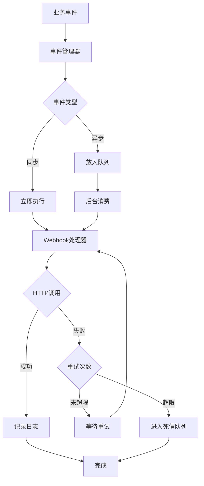
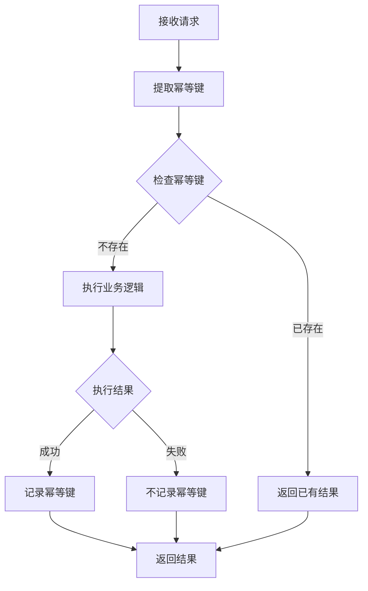
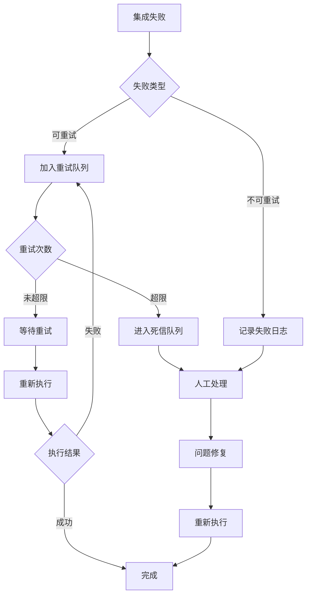

# MOY 终局版渠道与生态集成架构

---

## 文档元信息

| 属性 | 内容 |
|------|------|
| 文档名称 | MOY 终局版渠道与生态集成架构 |
| 文档编号 | MOY_FINAL_010 |
| 版本号 | v1.0 |
| 状态 | 已确认 |
| 作者 | MOY 文档架构组 |
| 日期 | 2026-04-05 |
| 目标读者 | 系统架构师、后端开发、集成工程师、运维工程师 |
| 输入来源 | [P0_21_集成架构设计](../p0_snapshot/21_集成架构设计.md)、[终局版业务域地图](./02_终局版业务域地图与能力版图.md)、[终局版系统信息架构](./05_终局版系统信息架构与模块树.md) |

---

## 一、文档目标

本文档定义 MOY 终局版渠道与生态集成架构，作为企业级 AI 原生客户管理系统的集成能力蓝图，用于：

1. 定义完整的渠道接入体系与统一消息协议
2. 规范 IM 渠道、表单渠道、语音渠道的接入方式与同步策略
3. 建立第三方系统集成的标准模式与数据映射规范
4. 设计 Webhook 事件通知机制与开放平台 API
5. 定义集成安全策略、幂等策略、失败补偿机制
6. 确保集成架构的可扩展性、可维护性与可追溯性

---

## 二、适用范围

### 2.1 适用范围

| 范围维度 | 说明 |
|----------|------|
| 业务范围 | MOY 终局版全量业务，包括销售域、服务域、营销域、运营域 |
| 功能范围 | 所有渠道接入、第三方集成、开放平台相关功能 |
| 技术范围 | 集成架构设计、开发、部署、运维全生命周期 |
| 组织范围 | 产品团队、技术团队、集成工程师、运维团队 |

### 2.2 版本演进

| 阶段 | 渠道覆盖 | 系统集成 | 说明 |
|------|----------|----------|------|
| P0 首期 | 企业微信、微信公众号、官网表单 | 基础 Webhook | 核心渠道接入 |
| P1 扩展 | 钉钉、微信小程序、电话 IVR | CRM 集成（Salesforce） | 扩展渠道与集成 |
| 终局版 | 全渠道覆盖 | 全系统集成 | 完整集成生态 |

---

## 三、术语定义

### 3.1 核心术语

| 术语 | 英文 | 定义 |
|------|------|------|
| 渠道 | Channel | 客户与系统交互的触点，如 IM、表单、语音等 |
| 渠道适配器 | Channel Adapter | 将外部渠道消息转换为统一消息协议的组件 |
| 统一消息协议 | Unified Message Protocol | MOY 系统内部使用的标准化消息格式 |
| 集成连接 | Integration Connection | 与外部系统建立的连接配置与认证信息 |
| 同步策略 | Sync Strategy | 数据同步的方向、频率、触发条件等规则 |
| 幂等策略 | Idempotency Strategy | 确保重复请求不会产生副作用的设计模式 |
| 失败补偿 | Failure Compensation | 集成失败后的重试、回滚、通知等补偿措施 |
| 字段映射 | Field Mapping | 外部系统字段与 MOY 系统字段的对应关系 |

### 3.2 渠道类型术语

| 术语 | 英文 | 定义 |
|------|------|------|
| IM 渠道 | Instant Messaging Channel | 即时通讯渠道，如企业微信、钉钉、WhatsApp 等 |
| 表单渠道 | Form Channel | 表单提交渠道，如官网表单、第三方表单 |
| 语音渠道 | Voice Channel | 语音通讯渠道，如电话 IVR、呼叫中心 |
| 社交渠道 | Social Channel | 社交媒体渠道，如微信公众号、小程序 |

### 3.3 集成类型术语

| 术语 | 英文 | 定义 |
|------|------|------|
| 入站集成 | Inbound Integration | 外部系统向 MOY 推送数据 |
| 出站集成 | Outbound Integration | MOY 向外部系统推送数据 |
| 双向集成 | Bidirectional Integration | MOY 与外部系统双向数据同步 |
| 实时集成 | Real-time Integration | 事件触发的即时数据同步 |
| 批量集成 | Batch Integration | 定时批量数据同步 |

### 3.4 安全术语

| 术语 | 英文 | 定义 |
|------|------|------|
| API Key | API Key | 用于 API 调用身份认证的密钥 |
| OAuth 2.0 | OAuth 2.0 | 标准授权协议，用于第三方应用授权 |
| Webhook 签名 | Webhook Signature | 用于验证 Webhook 请求真实性的签名机制 |
| IP 白名单 | IP Whitelist | 允许访问的 IP 地址列表 |
| 请求限流 | Rate Limiting | 限制单位时间内请求数量的机制 |

---

## 四、集成架构总览

### 4.1 集成架构层次图

```
┌─────────────────────────────────────────────────────────────────────────────────────┐
│                              MOY 集成架构总览                                         │
├─────────────────────────────────────────────────────────────────────────────────────┤
│                                                                                     │
│   ┌─────────────────────────────────────────────────────────────────────────────┐   │
│   │                           渠道接入层 (Channel Layer)                          │   │
│   │                              多渠道统一接入                                    │   │
│   │                                                                             │   │
│   │   ┌─────────────┐  ┌─────────────┐  ┌─────────────┐  ┌─────────────┐      │   │
│   │   │   IM 渠道    │  │  表单渠道   │  │  语音渠道   │  │  社交渠道   │      │   │
│   │   │ · 企业微信   │  │ · 官网表单  │  │ · 电话 IVR  │  │ · 微信公众号 │      │   │
│   │   │ · 钉钉      │  │ · 第三方表单│  │ · 呼叫中心  │  │ · 小程序    │      │   │
│   │   │ · WhatsApp  │  │             │  │             │  │             │      │   │
│   │   │ · Telegram  │  │             │  │             │  │             │      │   │
│   │   │ · Slack     │  │             │  │             │  │             │      │   │
│   │   └──────┬──────┘  └──────┬──────┘  └──────┬──────┘  └──────┬──────┘      │   │
│   │          │                │                │                │              │   │
│   └──────────┼────────────────┼────────────────┼────────────────┼──────────────┘   │
│              │                │                │                │                   │
│              ▼                ▼                ▼                ▼                   │
│   ┌─────────────────────────────────────────────────────────────────────────────┐   │
│   │                           适配层 (Adapter Layer)                              │   │
│   │                              渠道适配与协议转换                               │   │
│   │                                                                             │   │
│   │   ┌─────────────┐  ┌─────────────┐  ┌─────────────┐  ┌─────────────┐      │   │
│   │   │ 渠道适配器   │  │ 消息解析器  │  │ 协议转换器  │  │ 状态同步器  │      │   │
│   │   └─────────────┘  └─────────────┘  └─────────────┘  └─────────────┘      │   │
│   │                                                                             │   │
│   └───────────────────────────────────┬─────────────────────────────────────────┘   │
│                                       │                                             │
│                                       ▼                                             │
│   ┌─────────────────────────────────────────────────────────────────────────────┐   │
│   │                           业务集成层 (Integration Layer)                      │   │
│   │                              第三方系统对接                                   │   │
│   │                                                                             │   │
│   │   ┌─────────────┐  ┌─────────────┐  ┌─────────────┐  ┌─────────────┐      │   │
│   │   │  CRM 集成    │  │  ERP 集成   │  │ 工单系统集成 │  │ 邮件系统集成 │      │   │
│   │   │ · Salesforce│  │ · SAP       │  │ · Zendesk   │  │ · Exchange  │      │   │
│   │   │ · HubSpot   │  │ · Oracle    │  │ · Freshdesk │  │ · Gmail     │      │   │
│   │   │ · Zoho      │  │ · 用友      │  │             │  │             │      │   │
│   │   └─────────────┘  └─────────────┘  └─────────────┘  └─────────────┘      │   │
│   │                                                                             │   │
│   └───────────────────────────────────┬─────────────────────────────────────────┘   │
│                                       │                                             │
│                                       ▼                                             │
│   ┌─────────────────────────────────────────────────────────────────────────────┐   │
│   │                           事件通知层 (Event Layer)                            │   │
│   │                              Webhook 与消息队列                               │   │
│   │                                                                             │   │
│   │   ┌─────────────┐  ┌─────────────┐  ┌─────────────┐  ┌─────────────┐      │   │
│   │   │ Webhook管理  │  │ 事件发布器  │  │ 消息队列    │  │ 投递追踪器  │      │   │
│   │   └─────────────┘  └─────────────┘  └─────────────┘  └─────────────┘      │   │
│   │                                                                             │   │
│   └───────────────────────────────────┬─────────────────────────────────────────┘   │
│                                       │                                             │
│                                       ▼                                             │
│   ┌─────────────────────────────────────────────────────────────────────────────┐   │
│   │                           开放平台层 (Platform Layer)                         │   │
│   │                              开放 API 与开发者服务                            │   │
│   │                                                                             │   │
│   │   ┌─────────────┐  ┌─────────────┐  ┌─────────────┐  ┌─────────────┐      │   │
│   │   │ 开放API网关  │  │ 开发者门户  │  │ SDK/CLI    │  │ 应用市场    │      │   │
│   │   └─────────────┘  └─────────────┘  └─────────────┘  └─────────────┘      │   │
│   │                                                                             │   │
│   └─────────────────────────────────────────────────────────────────────────────┘   │
│                                                                                     │
│   ┌─────────────────────────────────────────────────────────────────────────────┐   │
│   │                           治理层 (Governance Layer)                          │   │
│   │                              安全、限流、审计、监控                           │   │
│   │                                                                             │   │
│   │   ┌─────────────┐  ┌─────────────┐  ┌─────────────┐  ┌─────────────┐      │   │
│   │   │ 安全认证    │  │ 限流熔断    │  │ 审计日志    │  │ 监控告警    │      │   │
│   │   └─────────────┘  └─────────────┘  └─────────────┘  └─────────────┘      │   │
│   │                                                                             │   │
│   └─────────────────────────────────────────────────────────────────────────────┘   │
│                                                                                     │
└─────────────────────────────────────────────────────────────────────────────────────┘
```

### 4.2 集成模式矩阵

| 模式 | 说明 | 适用场景 | 实时性 | 复杂度 |
|------|------|----------|--------|--------|
| API 推送 | MOY 调用外部系统 API | 数据同步、消息通知 | 高 | 中 |
| Webhook 回调 | 外部系统调用 MOY API | 事件触发、数据回传 | 高 | 低 |
| 消息队列 | 异步消息传递 | 大数据量同步、解耦 | 中 | 高 |
| 文件传输 | 批量数据交换 | 定期数据同步 | 低 | 低 |
| 数据库直连 | 直接访问外部数据库 | 数据迁移、报表同步 | 中 | 高 |
| SDK 集成 | 嵌入式 SDK | 前端集成、移动端集成 | 高 | 低 |

---

## 五、IM 渠道接入

### 5.1 IM 渠道总览

| 渠道 | 渠道编码 | 接入方式 | 认证方式 | P0/P1/终局 |
|------|----------|----------|----------|------------|
| 企业微信 | wecom | OAuth + Webhook | CorpID/CorpSecret | P0 |
| 钉钉 | dingtalk | OAuth + Webhook | AppKey/AppSecret | P1 |
| 微信公众号 | wechat_mp | OAuth + Webhook | AppID/AppSecret | P0 |
| 微信小程序 | wechat_mini | OAuth + Webhook | AppID/AppSecret | P1 |
| WhatsApp | whatsapp | API + Webhook | API Key | 终局 |
| Telegram | telegram | Webhook | Bot Token | 终局 |
| Slack | slack | Webhook + API | OAuth | 终局 |

### 5.2 企业微信接入

#### 5.2.1 接入方式

| 接入项 | 说明 |
|--------|------|
| 接入协议 | 企业微信 API + 回调模式 |
| 认证方式 | CorpID + CorpSecret + AgentID |
| 回调配置 | 配置回调 URL、Token、EncodingAESKey |
| 消息加密 | AES-256 加密 |

#### 5.2.2 消息类型

| 企业微信消息类型 | MOY 消息类型 | 说明 |
|------------------|--------------|------|
| text | text | 文本消息 |
| image | image | 图片消息 |
| voice | voice | 语音消息 |
| video | video | 视频消息 |
| location | location | 位置消息 |
| link | link | 链接消息 |
| miniprogram | miniprogram | 小程序消息 |
| markdown | markdown | Markdown 消息 |
| file | file | 文件消息 |

#### 5.2.3 同步策略

| 同步项 | 方向 | 触发方式 | 频率 |
|--------|------|----------|------|
| 消息同步 | 入站 | Webhook 回调 | 实时 |
| 消息发送 | 出站 | API 调用 | 实时 |
| 部门同步 | 入站 | 定时任务 | 每小时 |
| 成员同步 | 入站 | 定时任务 + 事件回调 | 每小时 + 实时 |
| 标签同步 | 入站 | 定时任务 | 每日 |
| 客户同步 | 双向 | 事件触发 + 定时任务 | 实时 + 每小时 |

#### 5.2.4 配置示例

```json
{
  "channel_code": "wecom",
  "channel_name": "企业微信",
  "config": {
    "corp_id": "wx_corp_id_xxx",
    "agent_id": 1000001,
    "callback_url": "https://api.moy.com/webhook/wecom",
    "token": "moy_wecom_token",
    "encoding_aes_key": "xxx"
  },
  "credentials": {
    "corp_secret": "encrypted:xxx"
  },
  "sync_config": {
    "sync_departments": true,
    "sync_members": true,
    "sync_customers": true,
    "sync_interval_minutes": 60
  }
}
```

### 5.3 钉钉接入

#### 5.3.1 接入方式

| 接入项 | 说明 |
|--------|------|
| 接入协议 | 钉钉开放平台 API + 回调模式 |
| 认证方式 | AppKey + AppSecret |
| 回调配置 | 配置回调 URL，注册事件订阅 |
| 消息加密 | AES-128 加密 |

#### 5.3.2 消息类型

| 钉钉消息类型 | MOY 消息类型 | 说明 |
|--------------|--------------|------|
| text | text | 文本消息 |
| picture | image | 图片消息 |
| voice | voice | 语音消息 |
| video | video | 视频消息 |
| location | location | 位置消息 |
| link | link | 链接消息 |
| markdown | markdown | Markdown 消息 |
| actionCard | actionCard | 卡片消息 |
| file | file | 文件消息 |

#### 5.3.3 同步策略

| 同步项 | 方向 | 触发方式 | 频率 |
|--------|------|----------|------|
| 消息同步 | 入站 | Webhook 回调 | 实时 |
| 消息发送 | 出站 | API 调用 | 实时 |
| 部门同步 | 入站 | 定时任务 | 每小时 |
| 成员同步 | 入站 | 定时任务 + 事件回调 | 每小时 + 实时 |
| 角色同步 | 入站 | 定时任务 | 每日 |
| 审批同步 | 入站 | 事件回调 | 实时 |

#### 5.3.4 配置示例

```json
{
  "channel_code": "dingtalk",
  "channel_name": "钉钉",
  "config": {
    "app_key": "ding_app_key_xxx",
    "agent_id": "xxx",
    "callback_url": "https://api.moy.com/webhook/dingtalk"
  },
  "credentials": {
    "app_secret": "encrypted:xxx"
  },
  "sync_config": {
    "sync_departments": true,
    "sync_members": true,
    "sync_approvals": true,
    "sync_interval_minutes": 60
  }
}
```

### 5.4 微信/小程序接入

#### 5.4.1 微信公众号接入

| 接入项 | 说明 |
|--------|------|
| 接入协议 | 微信公众平台 API + 回调模式 |
| 认证方式 | AppID + AppSecret |
| 回调配置 | 配置服务器 URL、Token |
| 消息加密 | 消息加解密（可选） |

**消息类型映射：**

| 微信公众号消息类型 | MOY 消息类型 | 说明 |
|-------------------|--------------|------|
| text | text | 文本消息 |
| image | image | 图片消息 |
| voice | voice | 语音消息 |
| video | video | 视频消息 |
| location | location | 位置消息 |
| link | link | 链接消息 |
| event | event | 事件消息 |

**同步策略：**

| 同步项 | 方向 | 触发方式 | 频率 |
|--------|------|----------|------|
| 消息同步 | 入站 | Webhook 回调 | 实时 |
| 消息发送 | 出站 | API 调用 | 实时 |
| 粉丝同步 | 入站 | 事件回调 + 定时任务 | 实时 + 每日 |
| 菜单同步 | 出站 | API 调用 | 手动 |
| 模板消息 | 出站 | API 调用 | 实时 |

#### 5.4.2 微信小程序接入

| 接入项 | 说明 |
|--------|------|
| 接入协议 | 微信小程序 API + 云函数 |
| 认证方式 | AppID + AppSecret |
| 客服消息 | 客服消息接口 |
| 订阅消息 | 订阅消息接口 |

**消息类型映射：**

| 小程序消息类型 | MOY 消息类型 | 说明 |
|----------------|--------------|------|
| text | text | 文本消息 |
| image | image | 图片消息 |
| miniprogrampage | miniprogram | 小程序卡片 |

**同步策略：**

| 同步项 | 方向 | 触发方式 | 频率 |
|--------|------|----------|------|
| 客服消息 | 双向 | API + Webhook | 实时 |
| 用户信息 | 入站 | 登录授权 | 实时 |
| 订阅消息 | 出站 | API 调用 | 实时 |
| 手机号 | 入站 | 授权回调 | 实时 |

### 5.5 WhatsApp 接入

#### 5.5.1 接入方式

| 接入项 | 说明 |
|--------|------|
| 接入协议 | WhatsApp Business API |
| 认证方式 | API Key + Phone Number ID |
| Webhook | 配置 Webhook URL 接收消息 |
| 消息模板 | 需预先审核消息模板 |

#### 5.5.2 消息类型

| WhatsApp 消息类型 | MOY 消息类型 | 说明 |
|-------------------|--------------|------|
| text | text | 文本消息 |
| image | image | 图片消息 |
| video | video | 视频消息 |
| audio | voice | 语音消息 |
| document | file | 文档消息 |
| location | location | 位置消息 |
| contacts | contact | 名片消息 |
| interactive | interactive | 交互消息 |

#### 5.5.3 同步策略

| 同步项 | 方向 | 触发方式 | 频率 |
|--------|------|----------|------|
| 消息同步 | 入站 | Webhook 回调 | 实时 |
| 消息发送 | 出站 | API 调用 | 实时 |
| 模板消息 | 出站 | API 调用 | 实时 |
| 已读回执 | 入站 | Webhook 回调 | 实时 |
| 消息状态 | 入站 | Webhook 回调 | 实时 |

#### 5.5.4 配置示例

```json
{
  "channel_code": "whatsapp",
  "channel_name": "WhatsApp",
  "config": {
    "phone_number_id": "xxx",
    "business_account_id": "xxx",
    "callback_url": "https://api.moy.com/webhook/whatsapp"
  },
  "credentials": {
    "api_key": "encrypted:xxx",
    "permanent_token": "encrypted:xxx"
  },
  "sync_config": {
    "sync_messages": true,
    "sync_status": true,
    "template_language": "zh_CN"
  }
}
```

### 5.6 Telegram 接入

#### 5.6.1 接入方式

| 接入项 | 说明 |
|--------|------|
| 接入协议 | Telegram Bot API |
| 认证方式 | Bot Token |
| Webhook | 配置 Webhook URL |
| 模式 | Webhook 模式或长轮询模式 |

#### 5.6.2 消息类型

| Telegram 消息类型 | MOY 消息类型 | 说明 |
|-------------------|--------------|------|
| text | text | 文本消息 |
| photo | image | 图片消息 |
| video | video | 视频消息 |
| audio | voice | 语音消息 |
| document | file | 文档消息 |
| location | location | 位置消息 |
| contact | contact | 名片消息 |
| sticker | sticker | 贴纸消息 |
| inline_query | inline | 内联查询 |

#### 5.6.3 同步策略

| 同步项 | 方向 | 触发方式 | 频率 |
|--------|------|----------|------|
| 消息同步 | 入站 | Webhook 回调 | 实时 |
| 消息发送 | 出站 | API 调用 | 实时 |
| 内联查询 | 入站 | Webhook 回调 | 实时 |
| 回调查询 | 入站 | Webhook 回调 | 实时 |
| 群组消息 | 入站 | Webhook 回调 | 实时 |

#### 5.6.4 配置示例

```json
{
  "channel_code": "telegram",
  "channel_name": "Telegram",
  "config": {
    "bot_username": "moy_bot",
    "callback_url": "https://api.moy.com/webhook/telegram"
  },
  "credentials": {
    "bot_token": "encrypted:xxx"
  },
  "sync_config": {
    "sync_messages": true,
    "sync_groups": true,
    "parse_mode": "MarkdownV2"
  }
}
```

### 5.7 Slack 接入

#### 5.7.1 接入方式

| 接入项 | 说明 |
|--------|------|
| 接入协议 | Slack API + Events API |
| 认证方式 | OAuth 2.0 |
| 权限范围 | bot, chat:write, channels:history 等 |
| 事件订阅 | 配置 Events API URL |

#### 5.7.2 消息类型

| Slack 消息类型 | MOY 消息类型 | 说明 |
|----------------|--------------|------|
| text | text | 文本消息 |
| blocks | blocks | Block Kit 消息 |
| attachments | attachments | 附件消息 |
| files | file | 文件消息 |
| interactive | interactive | 交互消息 |

#### 5.7.3 同步策略

| 同步项 | 方向 | 触发方式 | 频率 |
|--------|------|----------|------|
| 消息同步 | 入站 | Events API | 实时 |
| 消息发送 | 出站 | API 调用 | 实时 |
| 频道同步 | 入站 | 定时任务 | 每小时 |
| 成员同步 | 入站 | 定时任务 + 事件回调 | 每小时 + 实时 |
| 交互事件 | 入站 | Interactivity API | 实时 |

#### 5.7.4 配置示例

```json
{
  "channel_code": "slack",
  "channel_name": "Slack",
  "config": {
    "team_id": "TXXXXXX",
    "app_id": "AXXXXXX",
    "callback_url": "https://api.moy.com/webhook/slack"
  },
  "credentials": {
    "client_id": "xxx",
    "client_secret": "encrypted:xxx",
    "bot_token": "encrypted:xxx"
  },
  "sync_config": {
    "sync_channels": true,
    "sync_members": true,
    "sync_interval_minutes": 60
  }
}
```

### 5.8 统一消息协议

#### 5.8.1 消息协议结构

```json
{
  "message_id": "msg_xxx",
  "channel_code": "wecom",
  "conversation_id": "conv_xxx",
  "sender": {
    "sender_type": "customer",
    "sender_id": "external_user_id_xxx",
    "sender_name": "客户A",
    "avatar_url": "https://xxx.com/avatar.jpg"
  },
  "receiver": {
    "receiver_type": "agent",
    "receiver_id": "agent_001"
  },
  "content": {
    "content_type": "text",
    "text": "我想咨询产品",
    "media_url": null,
    "media_type": null,
    "metadata": {}
  },
  "context": {
    "ip_address": "xxx",
    "user_agent": "xxx",
    "device_type": "mobile",
    "os_type": "iOS"
  },
  "timestamp": "2026-04-05T10:00:00Z",
  "external_message_id": "external_msg_id_xxx"
}
```

#### 5.8.2 消息类型定义

| 消息类型 | 编码 | 必填字段 | 说明 |
|----------|------|----------|------|
| 文本消息 | text | text | 纯文本消息 |
| 图片消息 | image | media_url | 图片消息 |
| 语音消息 | voice | media_url, duration | 语音消息 |
| 视频消息 | video | media_url, duration | 视频消息 |
| 文件消息 | file | media_url, file_name, file_size | 文件消息 |
| 位置消息 | location | latitude, longitude, address | 位置消息 |
| 链接消息 | link | title, url, description | 链接消息 |
| 名片消息 | contact | name, phone | 名片消息 |
| 事件消息 | event | event_type, event_data | 事件消息 |
| 卡片消息 | card | title, content, actions | 卡片消息 |

---

## 六、表单渠道接入

### 6.1 表单渠道总览

| 渠道 | 渠道编码 | 接入方式 | 认证方式 | P0/P1/终局 |
|------|----------|----------|----------|------------|
| 官网表单 | web_form | API + 嵌入JS | Token | P0 |
| 第三方表单 | third_party_form | Webhook | API Key | P1 |

### 6.2 官网表单接入

#### 6.2.1 接入方式

| 接入项 | 说明 |
|--------|------|
| 接入协议 | REST API + 嵌入式 JS SDK |
| 认证方式 | API Token + 域名白名单 |
| 表单配置 | 后台配置表单字段与映射规则 |
| 数据提交 | POST 请求提交表单数据 |

#### 6.2.2 字段映射

| 官网表单字段 | MOY 字段 | 类型 | 必填 | 说明 |
|--------------|----------|------|------|------|
| name | customer.name | String | 是 | 客户姓名 |
| phone | customer.phone | String | 是 | 客户电话 |
| email | customer.email | String | 否 | 客户邮箱 |
| company | customer.company | String | 否 | 公司名称 |
| message | lead.requirement | String | 否 | 咨询内容 |
| source | lead.source | String | 否 | 来源渠道 |
| utm_source | lead.utm_source | String | 否 | UTM 来源 |
| utm_medium | lead.utm_medium | String | 否 | UTM 媒介 |
| utm_campaign | lead.utm_campaign | String | 否 | UTM 活动 |
| page_url | lead.page_url | String | 否 | 提交页面 |

#### 6.2.3 接入示例

**表单配置：**

```json
{
  "form_code": "contact_form_001",
  "form_name": "官网联系表单",
  "fields": [
    {
      "field_code": "name",
      "field_name": "姓名",
      "field_type": "text",
      "required": true,
      "moy_field": "customer.name"
    },
    {
      "field_code": "phone",
      "field_name": "电话",
      "field_type": "phone",
      "required": true,
      "moy_field": "customer.phone"
    },
    {
      "field_code": "email",
      "field_name": "邮箱",
      "field_type": "email",
      "required": false,
      "moy_field": "customer.email"
    },
    {
      "field_code": "message",
      "field_name": "留言",
      "field_type": "textarea",
      "required": false,
      "moy_field": "lead.requirement"
    }
  ],
  "mapping_config": {
    "auto_create_customer": true,
    "auto_create_lead": true,
    "auto_assign": true,
    "assign_rule": "round_robin"
  }
}
```

**提交接口：**

```http
POST /api/v1/forms/{form_code}/submit
Content-Type: application/json
X-API-Token: moy_form_xxx

{
  "name": "张三",
  "phone": "13800138000",
  "email": "zhangsan@example.com",
  "message": "我想了解产品价格",
  "source": "官网首页",
  "utm_source": "baidu",
  "utm_medium": "cpc",
  "utm_campaign": "spring_promo"
}
```

### 6.3 第三方表单接入

#### 6.3.1 接入方式

| 接入项 | 说明 |
|--------|------|
| 接入协议 | Webhook 回调 |
| 认证方式 | API Key + 签名验证 |
| 支持平台 | 金数据、问卷星、Typeform 等 |
| 数据转换 | 配置字段映射规则 |

#### 6.3.2 字段映射

| 第三方表单字段 | MOY 字段 | 类型 | 说明 |
|----------------|----------|------|------|
| Field1 | customer.name | String | 映射为姓名 |
| Field2 | customer.phone | String | 映射为电话 |
| Field3 | customer.email | String | 映射为邮箱 |
| Field4 | lead.requirement | String | 映射为需求 |
| CreatedAt | lead.created_at | DateTime | 创建时间 |
| FormId | lead.source_form | String | 来源表单 |

#### 6.3.3 配置示例

```json
{
  "channel_code": "third_party_form",
  "channel_name": "金数据",
  "config": {
    "platform": "jinshuju",
    "form_id": "form_xxx",
    "callback_url": "https://api.moy.com/webhook/form/jinshuju"
  },
  "credentials": {
    "api_key": "encrypted:xxx",
    "api_secret": "encrypted:xxx"
  },
  "field_mapping": [
    {
      "external_field": "field_1",
      "moy_field": "customer.name",
      "transform": null
    },
    {
      "external_field": "field_2",
      "moy_field": "customer.phone",
      "transform": "phone_format"
    },
    {
      "external_field": "field_3",
      "moy_field": "customer.email",
      "transform": "lowercase"
    }
  ]
}
```

---

## 七、语音渠道接入

### 7.1 语音渠道总览

| 渠道 | 渠道编码 | 接入方式 | 认证方式 | P0/P1/终局 |
|------|----------|----------|----------|------------|
| 电话 IVR | ivr | SIP + API | API Key | P1 |
| 呼叫中心 | call_center | CTI 集成 | API Key | 终局 |

### 7.2 电话 IVR 接入

#### 7.2.1 接入方式

| 接入项 | 说明 |
|--------|------|
| 接入协议 | SIP 协议 + REST API |
| 认证方式 | API Key + IP 白名单 |
| IVR 配置 | 配置 IVR 流程与节点 |
| 录音存储 | 云存储 + 本地备份 |

#### 7.2.2 通话记录同步

| 同步项 | 方向 | 触发方式 | 频率 |
|--------|------|----------|------|
| 来电记录 | 入站 | API 回调 | 实时 |
| 去电记录 | 入站 | API 回调 | 实时 |
| 录音文件 | 入站 | API 回调 | 实时 |
| 通话评分 | 双向 | API 调用 | 实时 |
| IVR 节点 | 入站 | API 回调 | 实时 |

#### 7.2.3 通话记录数据结构

```json
{
  "call_id": "call_xxx",
  "channel_code": "ivr",
  "call_type": "inbound",
  "caller_number": "13800138000",
  "callee_number": "400-xxx-xxxx",
  "start_time": "2026-04-05T10:00:00Z",
  "end_time": "2026-04-05T10:05:00Z",
  "duration_seconds": 300,
  "ring_duration_seconds": 10,
  "status": "answered",
  "agent_id": "agent_001",
  "agent_name": "客服小王",
  "recording_url": "https://xxx.com/recording/call_xxx.mp3",
  "recording_duration_seconds": 280,
  "customer_id": 100,
  "customer_name": "张三",
  "ivr_nodes": [
    {
      "node_id": "node_1",
      "node_name": "欢迎语",
      "duration_seconds": 10
    },
    {
      "node_id": "node_2",
      "node_name": "按键选择",
      "duration_seconds": 5,
      "dtmf": "1"
    }
  ],
  "tags": ["产品咨询", "新客户"],
  "notes": "客户咨询产品A价格"
}
```

#### 7.2.4 配置示例

```json
{
  "channel_code": "ivr",
  "channel_name": "电话IVR",
  "config": {
    "provider": "aliyun",
    "hotline_number": "400-xxx-xxxx",
    "callback_url": "https://api.moy.com/webhook/ivr"
  },
  "credentials": {
    "api_key": "encrypted:xxx",
    "api_secret": "encrypted:xxx"
  },
  "ivr_config": {
    "welcome_message": "欢迎致电MOY客服中心",
    "menu_options": [
      {
        "key": "1",
        "name": "产品咨询",
        "queue_id": "queue_001"
      },
      {
        "key": "2",
        "name": "售后服务",
        "queue_id": "queue_002"
      }
    ],
    "recording_enabled": true,
    "recording_format": "mp3"
  }
}
```

### 7.3 呼叫中心接入

#### 7.3.1 接入方式

| 接入项 | 说明 |
|--------|------|
| 接入协议 | CTI 集成 + REST API |
| 认证方式 | API Key + OAuth |
| 支持平台 | 阿里云呼叫中心、腾讯云呼叫中心、自建呼叫中心 |
| 功能范围 | 来电弹屏、通话控制、质检录音 |

#### 7.3.2 通话记录同步

| 同步项 | 方向 | 触发方式 | 频率 |
|--------|------|----------|------|
| 来电弹屏 | 入站 | CTI 事件 | 实时 |
| 通话控制 | 双向 | CTI 指令 | 实时 |
| 通话记录 | 入站 | API 回调 | 实时 |
| 录音文件 | 入站 | API 回调 | 实时 |
| 质检结果 | 入站 | API 回调 | 实时 |
| 座席状态 | 双向 | CTI 事件 | 实时 |

#### 7.3.3 配置示例

```json
{
  "channel_code": "call_center",
  "channel_name": "呼叫中心",
  "config": {
    "provider": "aliyun",
    "instance_id": "ccc_xxx",
    "callback_url": "https://api.moy.com/webhook/callcenter"
  },
  "credentials": {
    "api_key": "encrypted:xxx",
    "api_secret": "encrypted:xxx"
  },
  "cti_config": {
    "popup_enabled": true,
    "popup_fields": ["customer_name", "phone", "last_contact_time"],
    "call_control_enabled": true,
    "quality_check_enabled": true
  }
}
```

---

## 八、第三方系统集成

### 8.1 第三方系统总览

| 系统类型 | 系统 | 集成方向 | 数据同步 | P0/P1/终局 |
|----------|------|----------|----------|------------|
| CRM | Salesforce | 双向 | 客户/联系人/商机 | P1 |
| CRM | HubSpot | 双向 | 客户/联系人/商机 | 终局 |
| CRM | Zoho | 双向 | 客户/联系人/商机 | 终局 |
| ERP | SAP | 单向 | 客户/订单/产品 | 终局 |
| ERP | Oracle | 单向 | 客户/订单/产品 | 终局 |
| ERP | 用友 | 单向 | 客户/订单/产品 | 终局 |
| 工单系统 | Zendesk | 双向 | 工单/处理记录 | 终局 |
| 工单系统 | Freshdesk | 双向 | 工单/处理记录 | 终局 |
| 邮件系统 | Exchange | 双向 | 邮件/客户 | P1 |
| 邮件系统 | Gmail | 双向 | 邮件/客户 | 终局 |

### 8.2 CRM 系统集成

#### 8.2.1 Salesforce 集成

**接入方式：**

| 接入项 | 说明 |
|--------|------|
| 接入协议 | Salesforce REST API + Webhook |
| 认证方式 | OAuth 2.0 (Client Credentials) |
| API 版本 | v57.0+ |
| 限流 | 请求限制 + 并发限制 |

**数据映射：**

| MOY 字段 | Salesforce 字段 | 方向 | 映射规则 |
|----------|-----------------|------|----------|
| customer.name | Account.Name | 双向 | 直接映射 |
| customer.phone | Account.Phone | 双向 | 直接映射 |
| customer.email | Account.Email__c | 双向 | 直接映射 |
| customer.company | Account.Name | 双向 | 直接映射 |
| customer.level | Account.Rating | 双向 | A→Hot, B→Warm, C→Cold |
| customer.source | LeadSource | 入站 | 直接映射 |
| opportunity.name | Opportunity.Name | 双向 | 直接映射 |
| opportunity.amount | Opportunity.Amount | 双向 | 直接映射 |
| opportunity.stage | Opportunity.StageName | 双向 | 状态映射表 |
| opportunity.close_date | Opportunity.CloseDate | 双向 | 直接映射 |

**同步策略：**

| 同步项 | 方向 | 触发方式 | 频率 |
|--------|------|----------|------|
| 客户同步 | 双向 | 事件触发 + 定时任务 | 实时 + 每6小时 |
| 联系人同步 | 双向 | 事件触发 + 定时任务 | 实时 + 每6小时 |
| 商机同步 | 双向 | 事件触发 + 定时任务 | 实时 + 每6小时 |
| 活动同步 | 双向 | 事件触发 | 实时 |

**配置示例：**

```json
{
  "integration_type": "crm",
  "integration_name": "Salesforce对接",
  "config": {
    "endpoint": "https://xxx.salesforce.com",
    "api_version": "v57.0",
    "timeout": 30000
  },
  "credentials": {
    "client_id": "encrypted:xxx",
    "client_secret": "encrypted:xxx",
    "refresh_token": "encrypted:xxx"
  },
  "sync_config": {
    "direction": "bidirectional",
    "sync_entities": [
      {
        "entity": "customer",
        "external_object": "Account",
        "direction": "bidirectional",
        "field_mapping": [
          {"moy_field": "name", "external_field": "Name"},
          {"moy_field": "phone", "external_field": "Phone"},
          {"moy_field": "email", "external_field": "Email__c"}
        ]
      }
    ],
    "schedule": "0 */6 * * *"
  }
}
```

#### 8.2.2 HubSpot 集成

**接入方式：**

| 接入项 | 说明 |
|--------|------|
| 接入协议 | HubSpot REST API + Webhook |
| 认证方式 | OAuth 2.0 |
| API 版本 | v3 |
| 限流 | 每秒 10 次请求 |

**数据映射：**

| MOY 字段 | HubSpot 字段 | 方向 | 映射规则 |
|----------|--------------|------|----------|
| customer.name | firstname + lastname | 双向 | 拆分/合并 |
| customer.phone | phone | 双向 | 直接映射 |
| customer.email | email | 双向 | 直接映射 |
| customer.company | company | 双向 | 直接映射 |
| customer.level | lifecycle_stage | 双向 | A→customer, B→lead, C→subscriber |
| opportunity.name | dealname | 双向 | 直接映射 |
| opportunity.amount | amount | 双向 | 直接映射 |
| opportunity.stage | dealstage | 双向 | 状态映射表 |

**同步策略：**

| 同步项 | 方向 | 触发方式 | 频率 |
|--------|------|----------|------|
| 客户同步 | 双向 | 事件触发 + 定时任务 | 实时 + 每6小时 |
| 商机同步 | 双向 | 事件触发 + 定时任务 | 实时 + 每6小时 |
| 活动同步 | 双向 | 事件触发 | 实时 |

#### 8.2.3 Zoho 集成

**接入方式：**

| 接入项 | 说明 |
|--------|------|
| 接入协议 | Zoho CRM REST API + Webhook |
| 认证方式 | OAuth 2.0 |
| API 版本 | v8 |
| 限流 | 每分钟 100 次请求 |

**数据映射：**

| MOY 字段 | Zoho 字段 | 方向 | 映射规则 |
|----------|-----------|------|----------|
| customer.name | Account_Name | 双向 | 直接映射 |
| customer.phone | Phone | 双向 | 直接映射 |
| customer.email | Email | 双向 | 直接映射 |
| customer.company | Account_Name | 双向 | 直接映射 |
| opportunity.name | Deal_Name | 双向 | 直接映射 |
| opportunity.amount | Amount | 双向 | 直接映射 |
| opportunity.stage | Stage | 双向 | 状态映射表 |

### 8.3 ERP 系统集成

#### 8.3.1 SAP 集成

**接入方式：**

| 接入项 | 说明 |
|--------|------|
| 接入协议 | SAP OData / RFC |
| 认证方式 | Basic Auth / X.509 |
| 接口类型 | IDoc / BAPI / OData |
| 限流 | 连接池控制 |

**数据映射：**

| MOY 字段 | SAP 字段 | 方向 | 映射规则 |
|----------|----------|------|----------|
| customer.code | KUNNR | 出站 | 直接映射 |
| customer.name | NAME1 | 出站 | 直接映射 |
| customer.phone | TELF1 | 出站 | 直接映射 |
| order.order_no | VBELN | 入站 | 直接映射 |
| order.customer_code | KUNNR | 入站 | 直接映射 |
| order.total_amount | NETWR | 入站 | 直接映射 |
| order.status | GBSTK | 入站 | 状态映射表 |

**同步策略：**

| 同步项 | 方向 | 触发方式 | 频率 |
|--------|------|----------|------|
| 客户同步 | 出站 | 事件触发 | 实时 |
| 订单同步 | 入站 | 定时任务 | 每小时 |
| 产品同步 | 入站 | 定时任务 | 每日 |
| 库存同步 | 入站 | 定时任务 | 每小时 |

#### 8.3.2 Oracle ERP 集成

**接入方式：**

| 接入项 | 说明 |
|--------|------|
| 接入协议 | Oracle REST API |
| 认证方式 | OAuth 2.0 |
| API 版本 | v1 |
| 限流 | 请求限制 |

**数据映射：**

| MOY 字段 | Oracle 字段 | 方向 | 映射规则 |
|----------|-------------|------|----------|
| customer.code | PartyNumber | 出站 | 直接映射 |
| customer.name | OrganizationName | 出站 | 直接映射 |
| order.order_no | OrderNumber | 入站 | 直接映射 |
| order.total_amount | TotalAmount | 入站 | 直接映射 |

#### 8.3.3 用友 ERP 集成

**接入方式：**

| 接入项 | 说明 |
|--------|------|
| 接入协议 | 用友 API / 数据库直连 |
| 认证方式 | API Key / 数据库账号 |
| 接口类型 | OpenAPI / 数据库视图 |
| 限流 | 连接池控制 |

**数据映射：**

| MOY 字段 | 用友字段 | 方向 | 映射规则 |
|----------|----------|------|----------|
| customer.code | cCusCode | 出站 | 直接映射 |
| customer.name | cCusName | 出站 | 直接映射 |
| order.order_no | cCode | 入站 | 直接映射 |
| order.total_amount | iTaxSum | 入站 | 直接映射 |

### 8.4 工单系统集成

#### 8.4.1 Zendesk 集成

**接入方式：**

| 接入项 | 说明 |
|--------|------|
| 接入协议 | Zendesk REST API + Webhook |
| 认证方式 | API Token / OAuth 2.0 |
| API 版本 | v2 |
| 限流 | 每分钟 700 次请求 |

**数据映射：**

| MOY 字段 | Zendesk 字段 | 方向 | 映射规则 |
|----------|--------------|------|----------|
| ticket.title | subject | 双向 | 直接映射 |
| ticket.description | description | 双向 | 直接映射 |
| ticket.priority | priority | 双向 | urgent→urgent, high→high, normal→normal, low→low |
| ticket.status | status | 双向 | 状态映射表 |
| ticket.customer_id | requester_id | 双向 | 客户ID映射 |
| ticket.agent_id | assignee_id | 双向 | 客服ID映射 |
| ticket.created_at | created_at | 入站 | 直接映射 |

**同步策略：**

| 同步项 | 方向 | 触发方式 | 频率 |
|--------|------|----------|------|
| 工单同步 | 双向 | 事件触发 + 定时任务 | 实时 + 每15分钟 |
| 评论同步 | 双向 | 事件触发 | 实时 |
| 附件同步 | 双向 | 事件触发 | 实时 |
| 客户同步 | 双向 | 事件触发 | 实时 |

#### 8.4.2 Freshdesk 集成

**接入方式：**

| 接入项 | 说明 |
|--------|------|
| 接入协议 | Freshdesk REST API + Webhook |
| 认证方式 | API Key |
| API 版本 | v2 |
| 限流 | 每分钟 1000 次请求 |

**数据映射：**

| MOY 字段 | Freshdesk 字段 | 方向 | 映射规则 |
|----------|----------------|------|----------|
| ticket.title | subject | 双向 | 直接映射 |
| ticket.description | description | 双向 | 直接映射 |
| ticket.priority | priority | 双向 | 1→low, 2→medium, 3→high, 4→urgent |
| ticket.status | status | 双向 | 状态映射表 |
| ticket.customer_id | requester_id | 双向 | 客户ID映射 |

### 8.5 邮件系统集成

#### 8.5.1 Exchange 集成

**接入方式：**

| 接入项 | 说明 |
|--------|------|
| 接入协议 | Microsoft Graph API |
| 认证方式 | OAuth 2.0 |
| API 版本 | v1.0 |
| 权限范围 | Mail.Read, Mail.Send, Mail.ReadWrite |

**数据映射：**

| MOY 字段 | Exchange 字段 | 方向 | 映射规则 |
|----------|---------------|------|----------|
| email.subject | subject | 双向 | 直接映射 |
| email.body | body.content | 双向 | 直接映射 |
| email.from | from.emailAddress.address | 入站 | 直接映射 |
| email.to | toRecipients[].emailAddress.address | 出站 | 直接映射 |
| email.cc | ccRecipients[].emailAddress.address | 出站 | 直接映射 |
| email.attachments | attachments | 双向 | 直接映射 |
| email.created_at | receivedDateTime | 入站 | 直接映射 |

**同步策略：**

| 同步项 | 方向 | 触发方式 | 频率 |
|--------|------|----------|------|
| 邮件同步 | 入站 | Webhook + 定时任务 | 实时 + 每5分钟 |
| 邮件发送 | 出站 | API 调用 | 实时 |
| 附件同步 | 双向 | 事件触发 | 实时 |
| 联系人同步 | 双向 | 定时任务 | 每小时 |

#### 8.5.2 Gmail 集成

**接入方式：**

| 接入项 | 说明 |
|--------|------|
| 接入协议 | Gmail API |
| 认证方式 | OAuth 2.0 |
| API 版本 | v1 |
| 权限范围 | gmail.readonly, gmail.send, gmail.modify |

**数据映射：**

| MOY 字段 | Gmail 字段 | 方向 | 映射规则 |
|----------|------------|------|----------|
| email.subject | payload.headers[name="Subject"] | 双向 | 直接映射 |
| email.body | payload.body.data | 双向 | Base64解码 |
| email.from | payload.headers[name="From"] | 入站 | 解析邮箱 |
| email.to | payload.headers[name="To"] | 出站 | 直接映射 |
| email.thread_id | threadId | 双向 | 直接映射 |

---

## 九、Webhook 事件通知机制

### 9.1 Webhook 架构



### 9.2 Webhook 配置

| 字段名 | 类型 | 说明 |
|--------|------|------|
| id | BIGSERIAL | Webhook ID |
| org_id | BIGINT | 租户 ID |
| name | VARCHAR(64) | Webhook 名称 |
| url | VARCHAR(256) | 回调 URL |
| events | JSONB | 订阅事件列表 |
| secret | VARCHAR(256) | 签名密钥 |
| headers | JSONB | 自定义请求头 |
| retry_config | JSONB | 重试配置 |
| timeout_ms | INTEGER | 超时时间（毫秒） |
| status | VARCHAR(16) | 状态 |
| created_at | TIMESTAMP | 创建时间 |
| updated_at | TIMESTAMP | 更新时间 |

### 9.3 事件类型定义

#### 9.3.1 客户事件

| 事件编码 | 事件名称 | 触发条件 | 数据内容 |
|----------|----------|----------|----------|
| customer.created | 客户创建 | 新客户创建 | 客户完整信息 |
| customer.updated | 客户更新 | 客户信息变更 | 变更字段 |
| customer.deleted | 客户删除 | 客户被删除 | 客户 ID |
| customer.merged | 客户合并 | 客户合并 | 合并前后信息 |
| customer.tagged | 客户打标 | 客户添加标签 | 标签信息 |

#### 9.3.2 线索事件

| 事件编码 | 事件名称 | 触发条件 | 数据内容 |
|----------|----------|----------|----------|
| lead.created | 线索创建 | 新线索创建 | 线索完整信息 |
| lead.assigned | 线索分配 | 线索分配给销售 | 分配信息 |
| lead.converted | 线索转化 | 线索转化为客户 | 转化信息 |
| lead.discarded | 线索废弃 | 线索被废弃 | 废弃原因 |

#### 9.3.3 商机事件

| 事件编码 | 事件名称 | 触发条件 | 数据内容 |
|----------|----------|----------|----------|
| opportunity.created | 商机创建 | 新商机创建 | 商机完整信息 |
| opportunity.stage_changed | 阶段变更 | 商机阶段变更 | 变更前后阶段 |
| opportunity.amount_changed | 金额变更 | 商机金额变更 | 变更前后金额 |
| opportunity.won | 商机成交 | 商机成交 | 成交信息 |
| opportunity.lost | 商机失败 | 商机失败 | 失败原因 |

#### 9.3.4 工单事件

| 事件编码 | 事件名称 | 触发条件 | 数据内容 |
|----------|----------|----------|----------|
| ticket.created | 工单创建 | 新工单创建 | 工单完整信息 |
| ticket.assigned | 工单分配 | 工单分配给客服 | 分配信息 |
| ticket.status_changed | 状态变更 | 工单状态变更 | 变更前后状态 |
| ticket.resolved | 工单解决 | 工单已解决 | 解决信息 |
| ticket.closed | 工单关闭 | 工单已关闭 | 关闭信息 |

#### 9.3.5 会话事件

| 事件编码 | 事件名称 | 触发条件 | 数据内容 |
|----------|----------|----------|----------|
| conversation.created | 会话开始 | 新会话开始 | 会话信息 |
| conversation.message | 新消息 | 会话新消息 | 消息内容 |
| conversation.ended | 会话结束 | 会话结束 | 结束信息 |
| conversation.transferred | 会话转接 | 会话转接 | 转接信息 |
| conversation.rated | 会话评价 | 客户评价 | 评价信息 |

#### 9.3.6 集成事件

| 事件编码 | 事件名称 | 触发条件 | 数据内容 |
|----------|----------|----------|----------|
| integration.connected | 集成连接 | 集成连接成功 | 集成信息 |
| integration.disconnected | 集成断开 | 集成连接断开 | 断开原因 |
| integration.sync_started | 同步开始 | 数据同步开始 | 同步任务信息 |
| integration.sync_completed | 同步完成 | 数据同步完成 | 同步结果 |
| integration.sync_failed | 同步失败 | 数据同步失败 | 失败原因 |

### 9.4 事件 Payload 结构

```json
{
  "event_id": "evt_xxx",
  "event_type": "customer.created",
  "event_version": "1.0",
  "org_id": 1,
  "timestamp": "2026-04-05T10:00:00Z",
  "data": {
    "customer_id": 100,
    "customer_name": "测试客户",
    "phone": "13800138000",
    "email": "test@example.com",
    "source": "官网表单",
    "created_by": 1,
    "created_at": "2026-04-05T10:00:00Z"
  },
  "metadata": {
    "source_ip": "xxx",
    "user_agent": "xxx",
    "request_id": "req_xxx"
  },
  "signature": "sha256=xxx"
}
```

### 9.5 签名机制

#### 9.5.1 签名生成

```
signature = sha256(timestamp + "." + payload + "." + secret)
```

#### 9.5.2 签名验证

```java
public boolean verifySignature(String payload, String signature, String secret, long timestamp) {
    long currentTime = System.currentTimeMillis() / 1000;
    if (Math.abs(currentTime - timestamp) > 300) {
        return false;
    }
    String expectedSignature = "sha256=" + HmacSHA256(timestamp + "." + payload + "." + secret, secret);
    return expectedSignature.equals(signature);
}
```

### 9.6 重试策略

| 重试次数 | 等待时间 | 说明 |
|----------|----------|------|
| 第1次 | 1 分钟 | 立即重试 |
| 第2次 | 5 分钟 | 第1次失败后 |
| 第3次 | 30 分钟 | 第2次失败后 |
| 第4次 | 2 小时 | 第3次失败后 |
| 第5次 | 24 小时 | 第4次失败后 |

### 9.7 投递记录

| 字段名 | 类型 | 说明 |
|--------|------|------|
| id | BIGSERIAL | 投递 ID |
| org_id | BIGINT | 租户 ID |
| webhook_id | BIGINT | Webhook ID |
| event_id | VARCHAR(64) | 事件 ID |
| event_type | VARCHAR(64) | 事件类型 |
| request_data | JSONB | 请求数据 |
| response_status | INTEGER | 响应状态码 |
| response_data | JSONB | 响应数据 |
| retry_count | INTEGER | 重试次数 |
| delivered_at | TIMESTAMP | 投递时间 |
| status | VARCHAR(16) | 状态 |
| error_message | VARCHAR(512) | 错误信息 |
| duration_ms | INTEGER | 耗时 |
| created_at | TIMESTAMP | 创建时间 |

---

## 十、开放平台 API

### 10.1 开放平台架构

```
┌─────────────────────────────────────────────────────────────────────────────────────┐
│                              MOY 开放平台架构                                         │
├─────────────────────────────────────────────────────────────────────────────────────┤
│                                                                                     │
│   ┌─────────────────────────────────────────────────────────────────────────────┐   │
│   │                           开发者门户 (Developer Portal)                       │   │
│   │                                                                             │   │
│   │   ┌─────────────┐  ┌─────────────┐  ┌─────────────┐  ┌─────────────┐      │   │
│   │   │ 文档中心    │  │ API 控制台  │  │ 应用管理    │  │ 数据统计    │      │   │
│   │   └─────────────┘  └─────────────┘  └─────────────┘  └─────────────┘      │   │
│   │                                                                             │   │
│   └─────────────────────────────────────────────────────────────────────────────┘   │
│                                       │                                             │
│                                       ▼                                             │
│   ┌─────────────────────────────────────────────────────────────────────────────┐   │
│   │                           API 网关 (API Gateway)                              │   │
│   │                                                                             │   │
│   │   ┌─────────────┐  ┌─────────────┐  ┌─────────────┐  ┌─────────────┐      │   │
│   │   │ 认证授权    │  │ 限流熔断    │  │ 路由转发    │  │ 日志审计    │      │   │
│   │   └─────────────┘  └─────────────┘  └─────────────┘  └─────────────┘      │   │
│   │                                                                             │   │
│   └─────────────────────────────────────────────────────────────────────────────┘   │
│                                       │                                             │
│                                       ▼                                             │
│   ┌─────────────────────────────────────────────────────────────────────────────┐   │
│   │                           开放 API (Open API)                                 │   │
│   │                                                                             │   │
│   │   ┌─────────────┐  ┌─────────────┐  ┌─────────────┐  ┌─────────────┐      │   │
│   │   │ 客户 API    │  │ 商机 API    │  │ 工单 API    │  │ 会话 API    │      │   │
│   │   └─────────────┘  └─────────────┘  └─────────────┘  └─────────────┘      │   │
│   │                                                                             │   │
│   │   ┌─────────────┐  ┌─────────────┐  ┌─────────────┐  ┌─────────────┐      │   │
│   │   │ 线索 API    │  │ 产品 API    │  │ 报表 API    │  │ Webhook API │      │   │
│   │   └─────────────┘  └─────────────┘  └─────────────┘  └─────────────┘      │   │
│   │                                                                             │   │
│   └─────────────────────────────────────────────────────────────────────────────┘   │
│                                       │                                             │
│                                       ▼                                             │
│   ┌─────────────────────────────────────────────────────────────────────────────┐   │
│   │                           SDK & 工具 (SDK & Tools)                            │   │
│   │                                                                             │   │
│   │   ┌─────────────┐  ┌─────────────┐  ┌─────────────┐  ┌─────────────┐      │   │
│   │   │ Java SDK    │  │ Python SDK  │  │ Node.js SDK │  │ CLI 工具    │      │   │
│   │   └─────────────┘  └─────────────┘  └─────────────┘  └─────────────┘      │   │
│   │                                                                             │   │
│   └─────────────────────────────────────────────────────────────────────────────┘   │
│                                                                                     │
└─────────────────────────────────────────────────────────────────────────────────────┘
```

### 10.2 API 认证方式

| 认证方式 | 说明 | 适用场景 |
|----------|------|----------|
| API Key | 简单 API 调用认证 | 服务端调用 |
| OAuth 2.0 | 标准授权协议 | 第三方应用接入 |
| JWT | 自包含 Token | 服务间调用 |

### 10.3 API 版本管理

| 版本策略 | 说明 |
|----------|------|
| URL 版本 | /api/v1/customers |
| Header 版本 | Accept: application/vnd.moy.v1+json |
| 向后兼容 | 新增字段不影响旧版本 |
| 废弃策略 | 废弃前 6 个月通知 |

### 10.4 API 限流策略

| 限流类型 | 限制 | 说明 |
|----------|------|------|
| 全局限流 | 10000 次/分钟 | 全局请求限制 |
| 应用限流 | 1000 次/分钟 | 单应用请求限制 |
| 接口限流 | 100 次/分钟 | 单接口请求限制 |
| 并发限制 | 100 个 | 并发连接限制 |

### 10.5 核心 API 列表

#### 10.5.1 客户 API

| 接口 | 方法 | 说明 |
|------|------|------|
| /api/v1/customers | GET | 获取客户列表 |
| /api/v1/customers | POST | 创建客户 |
| /api/v1/customers/{id} | GET | 获取客户详情 |
| /api/v1/customers/{id} | PUT | 更新客户 |
| /api/v1/customers/{id} | DELETE | 删除客户 |
| /api/v1/customers/{id}/contacts | GET | 获取客户联系人 |
| /api/v1/customers/{id}/tags | POST | 添加客户标签 |
| /api/v1/customers/batch | POST | 批量操作客户 |

#### 10.5.2 线索 API

| 接口 | 方法 | 说明 |
|------|------|------|
| /api/v1/leads | GET | 获取线索列表 |
| /api/v1/leads | POST | 创建线索 |
| /api/v1/leads/{id} | GET | 获取线索详情 |
| /api/v1/leads/{id} | PUT | 更新线索 |
| /api/v1/leads/{id}/assign | POST | 分配线索 |
| /api/v1/leads/{id}/convert | POST | 转化线索 |

#### 10.5.3 商机 API

| 接口 | 方法 | 说明 |
|------|------|------|
| /api/v1/opportunities | GET | 获取商机列表 |
| /api/v1/opportunities | POST | 创建商机 |
| /api/v1/opportunities/{id} | GET | 获取商机详情 |
| /api/v1/opportunities/{id} | PUT | 更新商机 |
| /api/v1/opportunities/{id}/stage | PUT | 更新商机阶段 |
| /api/v1/opportunities/{id}/close | POST | 关闭商机 |

#### 10.5.4 工单 API

| 接口 | 方法 | 说明 |
|------|------|------|
| /api/v1/tickets | GET | 获取工单列表 |
| /api/v1/tickets | POST | 创建工单 |
| /api/v1/tickets/{id} | GET | 获取工单详情 |
| /api/v1/tickets/{id} | PUT | 更新工单 |
| /api/v1/tickets/{id}/assign | POST | 分配工单 |
| /api/v1/tickets/{id}/resolve | POST | 解决工单 |
| /api/v1/tickets/{id}/close | POST | 关闭工单 |
| /api/v1/tickets/{id}/comments | GET | 获取工单评论 |
| /api/v1/tickets/{id}/comments | POST | 添加工单评论 |

#### 10.5.5 会话 API

| 接口 | 方法 | 说明 |
|------|------|------|
| /api/v1/conversations | GET | 获取会话列表 |
| /api/v1/conversations/{id} | GET | 获取会话详情 |
| /api/v1/conversations/{id}/messages | GET | 获取会话消息 |
| /api/v1/conversations/{id}/messages | POST | 发送消息 |
| /api/v1/conversations/{id}/transfer | POST | 转接会话 |
| /api/v1/conversations/{id}/end | POST | 结束会话 |

#### 10.5.6 Webhook API

| 接口 | 方法 | 说明 |
|------|------|------|
| /api/v1/webhooks | GET | 获取 Webhook 列表 |
| /api/v1/webhooks | POST | 创建 Webhook |
| /api/v1/webhooks/{id} | GET | 获取 Webhook 详情 |
| /api/v1/webhooks/{id} | PUT | 更新 Webhook |
| /api/v1/webhooks/{id} | DELETE | 删除 Webhook |
| /api/v1/webhooks/{id}/test | POST | 测试 Webhook |
| /api/v1/webhooks/{id}/deliveries | GET | 获取投递记录 |

---

## 十一、集成策略规范

### 11.1 接入方式规范

| 接入类型 | 推荐方式 | 说明 |
|----------|----------|------|
| IM 渠道 | Webhook + API | 回调接收消息，API 发送消息 |
| 表单渠道 | API + Webhook | API 接收提交，Webhook 通知结果 |
| 语音渠道 | SIP + API | SIP 接入通话，API 同步数据 |
| CRM 集成 | API + Webhook | API 同步数据，Webhook 接收变更 |
| ERP 集成 | API + 文件 | API 实时同步，文件批量同步 |
| 工单集成 | API + Webhook | 双向同步工单数据 |
| 邮件集成 | API + Webhook | API 收发邮件，Webhook 通知 |

### 11.2 同步方向规范

| 数据类型 | 同步方向 | 说明 |
|----------|----------|------|
| 客户数据 | 双向 | MOY 与外部系统双向同步 |
| 线索数据 | 入站为主 | 外部系统推送到 MOY |
| 商机数据 | 双向 | MOY 与 CRM 双向同步 |
| 工单数据 | 双向 | MOY 与工单系统双向同步 |
| 订单数据 | 入站 | ERP 订单同步到 MOY |
| 产品数据 | 入站 | ERP 产品同步到 MOY |
| 消息数据 | 双向 | IM 渠道双向同步 |

### 11.3 幂等策略

#### 11.3.1 幂等键设计

| 操作类型 | 幂等键 | 说明 |
|----------|--------|------|
| 消息接收 | channel_code + external_message_id | 渠道消息唯一标识 |
| 表单提交 | form_code + submission_id | 表单提交唯一标识 |
| 数据同步 | integration_id + external_id + entity_type | 外部数据唯一标识 |
| Webhook 投递 | event_id + webhook_id | 事件投递唯一标识 |

#### 11.3.2 幂等处理流程



### 11.4 失败补偿机制

#### 11.4.1 补偿策略

| 失败类型 | 补偿策略 | 说明 |
|----------|----------|------|
| 网络超时 | 重试 | 指数退避重试 |
| 服务不可用 | 重试 + 降级 | 重试失败后降级处理 |
| 数据校验失败 | 记录日志 | 记录失败原因，人工处理 |
| 业务规则失败 | 记录日志 | 记录失败原因，人工处理 |
| 认证失败 | 刷新凭证 | 刷新 Token 后重试 |

#### 11.4.2 补偿流程



### 11.5 限流策略

#### 11.5.1 限流配置

| 限流维度 | 限制 | 说明 |
|----------|------|------|
| 渠道限流 | 100 条/秒 | 单渠道消息接收限制 |
| 集成限流 | 100 次/分钟 | 单集成请求限制 |
| API 限流 | 1000 次/分钟 | 单应用 API 限制 |
| Webhook 限流 | 100 次/分钟 | 单 Webhook 投递限制 |

#### 11.5.2 限流算法

| 算法 | 适用场景 | 说明 |
|------|----------|------|
| 令牌桶 | 平滑限流 | 允许突发流量 |
| 漏桶 | 严格限流 | 固定速率处理 |
| 滑动窗口 | 精确限流 | 精确控制请求数 |

### 11.6 重试策略

#### 11.6.1 重试配置

| 配置项 | 默认值 | 说明 |
|--------|--------|------|
| 最大重试次数 | 5 | 最大重试次数 |
| 初始等待时间 | 1 秒 | 首次重试等待时间 |
| 最大等待时间 | 24 小时 | 最大等待时间 |
| 退避系数 | 2 | 指数退避系数 |
| 抖动因子 | 0.1 | 随机抖动因子 |

#### 11.6.2 重试等待时间计算

```
wait_time = min(base_time * (backoff_factor ^ retry_count) * (1 + jitter), max_wait_time)
```

### 11.7 字段映射策略

#### 11.7.1 映射类型

| 映射类型 | 说明 | 示例 |
|----------|------|------|
| 直接映射 | 字段值直接映射 | name → Name |
| 类型转换 | 字段类型转换 | string → date |
| 值映射 | 枚举值映射 | A→Hot, B→Warm |
| 表达式映射 | 表达式计算 | firstName + lastName |
| 脚本映射 | 自定义脚本 | JavaScript 脚本 |

#### 11.7.2 映射配置示例

```json
{
  "field_mapping": [
    {
      "source_field": "name",
      "target_field": "customer_name",
      "mapping_type": "direct"
    },
    {
      "source_field": "status",
      "target_field": "customer_status",
      "mapping_type": "value",
      "value_mapping": {
        "active": "正常",
        "inactive": "停用"
      }
    },
    {
      "source_field": "created_at",
      "target_field": "create_time",
      "mapping_type": "type_convert",
      "source_format": "yyyy-MM-dd HH:mm:ss",
      "target_format": "timestamp"
    },
    {
      "source_field": "first_name,last_name",
      "target_field": "full_name",
      "mapping_type": "expression",
      "expression": "first_name + ' ' + last_name"
    }
  ]
}
```

### 11.8 安全策略

#### 11.8.1 认证安全

| 安全措施 | 说明 |
|----------|------|
| Token 加密存储 | 敏感凭证加密存储 |
| Token 定期轮换 | 定期轮换 API Key 和 Token |
| IP 白名单 | 限制访问 IP |
| 请求签名 | 验证请求签名 |

#### 11.8.2 传输安全

| 安全措施 | 说明 |
|----------|------|
| HTTPS 强制 | 所有 API 强制 HTTPS |
| TLS 版本 | 最低 TLS 1.2 |
| 证书验证 | 双向证书验证 |

#### 11.8.3 数据安全

| 安全措施 | 说明 |
|----------|------|
| 敏感数据脱敏 | 日志中脱敏敏感数据 |
| 数据加密传输 | 敏感数据加密传输 |
| 访问审计 | 记录所有访问日志 |

---

## 十二、集成监控与告警

### 12.1 监控指标

| 监控维度 | 指标 | 告警阈值 |
|----------|------|----------|
| 可用性 | 渠道可用率 | < 99% |
| 可用性 | 集成可用率 | < 99% |
| 性能 | 平均响应时间 | > 5s |
| 性能 | P99 响应时间 | > 10s |
| 错误率 | 请求错误率 | > 5% |
| 错误率 | Webhook 投递失败率 | > 5% |
| 吞吐量 | 消息处理量 | 异常下降 |
| 积压 | 队列积压数 | > 1000 |
| 重试 | 重试队列积压 | > 100 |

### 12.2 告警规则

| 告警级别 | 触发条件 | 通知方式 |
|----------|----------|----------|
| P0 紧急 | 渠道完全不可用 | 电话 + 短信 + 邮件 |
| P1 严重 | 错误率 > 10% | 短信 + 邮件 |
| P2 警告 | 错误率 > 5% | 邮件 + 站内消息 |
| P3 提示 | 性能下降 | 站内消息 |

### 12.3 监控仪表盘

| 仪表盘 | 内容 |
|--------|------|
| 渠道监控 | 各渠道消息量、成功率、延迟 |
| 集成监控 | 各集成同步状态、错误率 |
| Webhook 监控 | 投递成功率、延迟、失败原因 |
| API 监控 | 调用量、错误率、延迟 |

---

## 十三、数据表设计

### 13.1 integrations（集成配置表）

| 字段名 | 类型 | 说明 |
|--------|------|------|
| id | BIGSERIAL | 集成 ID |
| org_id | BIGINT | 租户 ID |
| integration_type | VARCHAR(32) | 集成类型 |
| integration_name | VARCHAR(64) | 集成名称 |
| config | JSONB | 连接配置 |
| credentials | JSONB | 认证信息（加密） |
| sync_config | JSONB | 同步配置 |
| field_mapping | JSONB | 字段映射 |
| status | VARCHAR(16) | 状态 |
| last_sync_at | TIMESTAMP | 最后同步时间 |
| last_sync_status | VARCHAR(16) | 最后同步状态 |
| error_count | INTEGER | 错误计数 |
| created_at | TIMESTAMP | 创建时间 |
| updated_at | TIMESTAMP | 更新时间 |

### 13.2 channels（渠道配置表）

| 字段名 | 类型 | 说明 |
|--------|------|------|
| id | BIGSERIAL | 渠道 ID |
| org_id | BIGINT | 租户 ID |
| channel_code | VARCHAR(32) | 渠道编码 |
| channel_name | VARCHAR(64) | 渠道名称 |
| channel_type | VARCHAR(16) | 渠道类型 |
| config | JSONB | 渠道配置 |
| credentials | JSONB | 认证信息（加密） |
| message_mapping | JSONB | 消息映射 |
| sync_config | JSONB | 同步配置 |
| status | VARCHAR(16) | 状态 |
| last_message_at | TIMESTAMP | 最后消息时间 |
| created_at | TIMESTAMP | 创建时间 |
| updated_at | TIMESTAMP | 更新时间 |

### 13.3 channel_messages（渠道消息表）

| 字段名 | 类型 | 说明 |
|--------|------|------|
| id | BIGSERIAL | 消息 ID |
| org_id | BIGINT | 租户 ID |
| channel_id | BIGINT | 渠道 ID |
| message_id | VARCHAR(64) | 消息 ID |
| external_message_id | VARCHAR(128) | 外部消息 ID |
| conversation_id | BIGINT | 会话 ID |
| direction | VARCHAR(16) | 方向 |
| sender_type | VARCHAR(16) | 发送者类型 |
| sender_id | VARCHAR(128) | 发送者 ID |
| sender_name | VARCHAR(128) | 发送者名称 |
| content_type | VARCHAR(32) | 内容类型 |
| content | JSONB | 消息内容 |
| status | VARCHAR(16) | 状态 |
| error_message | VARCHAR(512) | 错误信息 |
| created_at | TIMESTAMP | 创建时间 |
| delivered_at | TIMESTAMP | 投递时间 |

### 13.4 webhooks（Webhook 配置表）

| 字段名 | 类型 | 说明 |
|--------|------|------|
| id | BIGSERIAL | Webhook ID |
| org_id | BIGINT | 租户 ID |
| name | VARCHAR(64) | Webhook 名称 |
| url | VARCHAR(256) | 回调 URL |
| events | JSONB | 订阅事件 |
| secret | VARCHAR(256) | 签名密钥 |
| headers | JSONB | 自定义请求头 |
| retry_config | JSONB | 重试配置 |
| timeout_ms | INTEGER | 超时时间 |
| status | VARCHAR(16) | 状态 |
| created_at | TIMESTAMP | 创建时间 |
| updated_at | TIMESTAMP | 更新时间 |

### 13.5 webhook_deliveries（Webhook 投递表）

| 字段名 | 类型 | 说明 |
|--------|------|------|
| id | BIGSERIAL | 投递 ID |
| org_id | BIGINT | 租户 ID |
| webhook_id | BIGINT | Webhook ID |
| event_id | VARCHAR(64) | 事件 ID |
| event_type | VARCHAR(64) | 事件类型 |
| request_data | JSONB | 请求数据 |
| response_status | INTEGER | 响应状态码 |
| response_data | JSONB | 响应数据 |
| retry_count | INTEGER | 重试次数 |
| delivered_at | TIMESTAMP | 投递时间 |
| status | VARCHAR(16) | 状态 |
| error_message | VARCHAR(512) | 错误信息 |
| duration_ms | INTEGER | 耗时 |
| created_at | TIMESTAMP | 创建时间 |

### 13.6 integration_logs（集成日志表）

| 字段名 | 类型 | 说明 |
|--------|------|------|
| id | BIGSERIAL | 日志 ID |
| org_id | BIGINT | 租户 ID |
| integration_id | BIGINT | 集成 ID |
| integration_type | VARCHAR(32) | 集成类型 |
| direction | VARCHAR(16) | 方向 |
| event_type | VARCHAR(32) | 事件类型 |
| request_data | JSONB | 请求数据 |
| response_data | JSONB | 响应数据 |
| status | VARCHAR(16) | 状态 |
| error_message | VARCHAR(512) | 错误信息 |
| duration_ms | INTEGER | 耗时 |
| retry_count | INTEGER | 重试次数 |
| created_at | TIMESTAMP | 创建时间 |

### 13.7 api_keys（API Key 表）

| 字段名 | 类型 | 说明 |
|--------|------|------|
| id | BIGSERIAL | Key ID |
| org_id | BIGINT | 租户 ID |
| app_id | BIGINT | 应用 ID |
| name | VARCHAR(64) | Key 名称 |
| key_prefix | VARCHAR(8) | Key 前缀 |
| key_hash | VARCHAR(64) | Key 哈希 |
| permissions | JSONB | 权限列表 |
| rate_limit | INTEGER | 请求频率限制 |
| ip_whitelist | JSONB | IP 白名单 |
| expire_at | TIMESTAMP | 过期时间 |
| last_used_at | TIMESTAMP | 最后使用时间 |
| status | VARCHAR(16) | 状态 |
| created_at | TIMESTAMP | 创建时间 |
| updated_at | TIMESTAMP | 更新时间 |

---

## 十四、对 P0/P1 的影响

### 14.1 与 P0 的关系

| 维度 | P0 定义 | 终局版扩展 | 影响说明 |
|------|---------|------------|----------|
| 渠道数量 | 3 个（企业微信、微信公众号、官网表单） | 10+ 个 | 扩展渠道覆盖 |
| 系统集成 | 基础 Webhook | 完整集成体系 | 扩展集成能力 |
| API 开放 | 基础 API | 完整开放平台 | 扩展开放能力 |
| 安全策略 | 基础认证 | 完整安全体系 | 扩展安全能力 |

### 14.2 P0 兼容性

| 兼容项 | 兼容策略 | 说明 |
|--------|----------|------|
| 数据模型 | 向后兼容 | 终局版扩展字段，不影响 P0 数据 |
| API 接口 | 向后兼容 | 终局版扩展接口，P0 接口保持可用 |
| Webhook 格式 | 向后兼容 | 终局版扩展事件，P0 事件保持可用 |
| 渠道适配器 | 向后兼容 | 终局版扩展适配器，P0 适配器保持可用 |

### 14.3 P1 扩展影响

| P1 功能 | 终局版影响 | 说明 |
|---------|------------|------|
| 钉钉集成 | 完整定义 | P1 引入，终局版完善能力 |
| 电话 IVR | 完整定义 | P1 引入，终局版完善能力 |
| Salesforce 集成 | 完整定义 | P1 引入，终局版完善映射 |
| Exchange 集成 | 完整定义 | P1 引入，终局版完善能力 |

### 14.4 迁移路径

```
P0 首期 ──────────────────▶ P1 扩展 ──────────────────▶ 终局版
   │                           │                           │
   │  3 个渠道                 │  6 个渠道                 │  10+ 个渠道
   │  基础 Webhook             │  CRM 集成                 │  完整集成生态
   │  基础 API                 │  IVR 集成                 │  开放平台
   │                           │                           │
   └───────────────────────────┴───────────────────────────┘
                    配置迁移 + 功能扩展 + 体系完善
```

### 14.5 差异对照表

| 对比项 | P0 | P1 | 终局版 |
|--------|----|----|--------|
| IM 渠道 | 企业微信、微信公众号 | +钉钉、微信小程序 | +WhatsApp、Telegram、Slack |
| 表单渠道 | 官网表单 | +第三方表单 | 完整表单体系 |
| 语音渠道 | - | 电话 IVR | +呼叫中心 |
| CRM 集成 | - | Salesforce | +HubSpot、Zoho |
| ERP 集成 | - | - | SAP、Oracle、用友 |
| 工单集成 | - | - | Zendesk、Freshdesk |
| 邮件集成 | - | Exchange | +Gmail |
| Webhook | 基础事件 | 扩展事件 | 完整事件体系 |
| 开放 API | 基础 API | 扩展 API | 完整开放平台 |
| 安全策略 | 基础认证 | 扩展认证 | 完整安全体系 |

---

## 十五、版本与变更记录

| 版本 | 日期 | 作者 | 变更摘要 | 状态 |
|------|------|------|----------|------|
| v1.0 | 2026-04-05 | MOY 文档架构组 | 初稿：定义终局版渠道与生态集成架构 | 已确认 |

---

## 十六、依赖文档

| 文档 | 版本 | 用途 |
|------|------|------|
| [21_集成架构设计.md](../p0_snapshot/21_集成架构设计.md) | v1.0 | P0 集成架构基线 |
| [02_终局版业务域地图与能力版图.md](./02_终局版业务域地图与能力版图.md) | v1.0 | 业务域定义 |
| [05_终局版系统信息架构与模块树.md](./05_终局版系统信息架构与模块树.md) | v1.0 | 系统模块定义 |
| [09_终局版AI Agent体系与执行治理.md](./09_终局版AI Agent体系与执行治理.md) | v1.0 | AI Agent 定义 |

---

## 十七、待确认事项

1. 是否需要支持更多 IM 渠道（如 Discord、Line 等）？
2. 是否需要支持自建呼叫中心的 CTI 集成？
3. 开放平台是否需要支持应用市场与计费？
4. 是否需要支持集成市场的概念（类似 Zapier）？
5. 国际化场景下是否需要支持更多区域化渠道？
